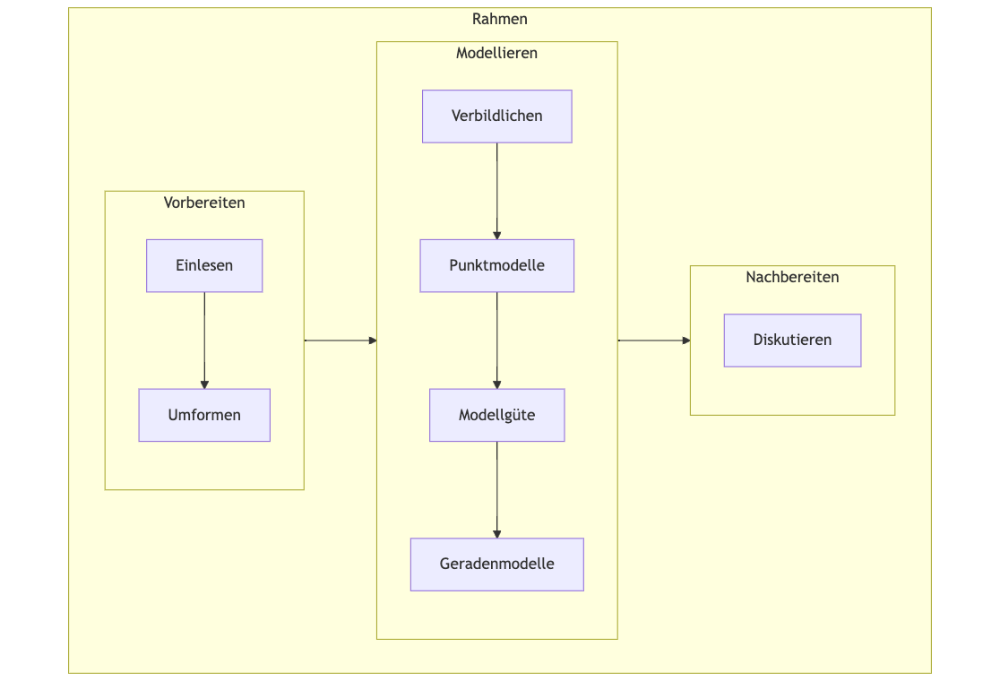

# Organisatorisches


::: {.cell layout-align="center"}
::: {.cell-output-display}
{fig-align='center' width=33%}
:::
:::


:::: {.content-visible when-format="html"}


:::{.callout-note}
## Your favorite language 

This book is written in German. 
However, your browser will easily translate the text to your favorite language. 
Please check your browser's documentation for details. 
It should be done with one or two clicks. $\square$
:::

::::


## Es geht um Ihren Lernerfolg


Meister Yoda rät: Lesen Sie die folgenden Hinweise, s. @fig-yoda.

![Lesen Sie die folgenden Hinweise im eigenen Interesse [@imgflip_yoda_2024]](img/yoda.jpg){#fig-yoda width="50%"}


[Quelle: Imgflip Memengenerator](https://imgflip.com/memegenerator)


### Lernziele

- Die Studentis sind mit wesentlichen Methoden der explorativen Datenanalyse vertraut und können diese selbständig anwenden.

- Die Studentis können gängige Forschungsfragen in lineare Modelle übersetzen, diese auf echte Datensätze anwenden und die Ergebnisse interpretieren.


### Was lerne ich hier und wozu ist das gut?


*Was lerne ich hier?*

Sie lernen das *Handwerk der Datenanalyse* mit einem Schwerpunkt auf Vorhersage. 
Anders gesagt: Sie lernen, *Daten aufzubereiten* und aus Daten *Vorhersagen* abzuleiten. 
Zum Beispiel: Kommt ein Student zu Ihnen und sagt "Ich habe 42 Stunden für die Klausur gelernt, 
welche Note kann ich in der Klausur erwarten?".
Darauf Ihre Antwort: "Auf Basis meiner Daten und meines Modells müsstest du eine 2.7 schreiben!"^[Darauf die Studentin: "Hpmf."].
Außerdem lernen Sie, wie man die Güte einer Vorhersage auf Stichhaltigkeit prüft.
Denn Vorhersagen kann man ja in jeder Eckkneipe oder beim Wahrsager bekommen. 
Wir wollen aber belastbare Vorhersagen und zumindest wissen,
wie gut die Vorhersagen (von jemanden) bisher waren.


*Warum ist das wichtig?*

Wir wollen nicht auf Leuten vertrauen, die behaupten, sie wüssten, was für uns richtig und gut ist. Wir wollen selber die Fakten prüfen können.


*Wozu brauche ich das im Job?*

Datenanalyse spielt bereits heute in vielen Berufen eine Rolle. Tendenz stark zunehmend.


*Wozu brauche ich das im weiterem Studium?*

In Forschungsarbeiten (wie in empirischen Forschungsprojekten, etwa in der Abschlussarbeit) ist es üblich, statistische Ergebnisse hinsichtlich quantitativ zu analysieren.

*Ist Statistik nicht sehr abstrakt?*

Der Schwerpunkt dieses Kurses liegt auf Anwenden und Tun; ähnlich dem Erlernen eines Handwerks. Theorien und Abstraktionen stehen nur am Rand.


*Gibt es auch gute Jobs, wenn man sich mit Daten auskennt?* 

Das @world_economic_forum_future_2020 berichtet zu den "Top 20 job roles in increasing and decreasing demand across industries" (S. 30, Abb. 22):

1. Data Analysts und Scientists
2. AI and Machine Learning Specialists
3. Big Data Specialists


### Was ist hier das Erfolgsgeheimnis?

Das Lesen einer Schwimmfibel ist nur bedingt nützlich, wenn Sie Freischwimmer werden wollen. Es hilft nichts: 
Rein in die Fluten! Wenn das Wasser nicht tief ist, 
man jederzeit Pause machen kann und die Erfolge sich schnell einstellen, 
steht Ihrem Fortschritt beim Lernen nichts im Weg. 
Ich gebe zu, der Vergleich ist nicht gerade subtil. 
Aber es ist so: Sie lernen durch Tun [@lovett_applying_2000]. 
Dieses Buch bietet dafür reichhaltige Gelegenheit. Nutzen Sie sie. Jedes Kapitel führt am Ende eine Reihe von Aufgaben auf, alle mit Lösungen. 
So können Sie Ihren Lernfortschritt testen. 
Das Schwierigkeiten auftreten, 
wenn man etwas Neues lernt, ist normal. 
Das geht fast allen so. 
Ihren Lernerfolg kann nur eine Sache gefährden: 
Wenn Sie aufgaben. 
Bleiben Sie dran, und der Erfolg wird sich einstellen!
@fig-lernen zeigt Daten von N=1646 Studentis, die zeigen, dass regelmäßiges Üben und Dranbleiben der Schlüssel zum Erfolg ist.


::: {.cell}
::: {.cell-output-display}
{#fig-lernen}
:::
:::


:::: {.content-visible when-format="html"}
:::{.callout-important}
*Dran bleiben* ist der Schlüssel zum Erfolg. 
Üben Sie regelmäßig. 
Geben Sie bei Schwierigkeiten nicht auf. 
🏋️‍♂️🔁🔑✨ $\square$
:::
::::

:::: {.content-visible when-format="pdf"}
:::{.callout-important}
*Dran bleiben* ist der Schlüssel zum Erfolg. 
Üben Sie regelmäßig. 
Geben Sie bei Schwierigkeiten nicht auf. 

\emoji{person-lifting-weights} \emoji{clockwise-vertical-arrows} 
\emoji{key}
\emoji{glowing-star}
$\square$
:::
::::


### Motivieren Sie mich!

:::: {layout="[ 80, 20 ]"}


Schauen Sie sich das Video mit einer [Ansprache zur Motivation](https://youtu.be/jtNlzpcPr5Y) an.


::: {.cell layout-align="center"}
::: {.cell-output-display}
{fig-align='center' width=75%}
:::
:::


::::

### Voraussetzungen

Um von diesem Kurs am besten zu profitieren,
sollten Sie Folgendes mitbringen:

    
- Bereitschaft, Neues zu lernen
- Bereitschaft, nicht gleich aufzugeben
- Kenntnis grundlegender Methoden wissenschaftlichen Arbeitens

Was Sie *nicht* brauchen, sind besondere Mathe- oder Statistik-Vorkenntnisse.


### Überblick über das Buch

Abb. @fig-ueberblick gibt einen Überblick über den Verlauf und die Inhalte des Buches.
Das Diagramm hilft Ihnen zu verorten, wo welches Thema im Gesamtzusammenhang steht.


{#fig-ueberblick width=70%}

Das Diagramm zeigt auch den Ablauf einer typischen Datenanalyse.
Natürlich kann man sich auch andere sinnvolle Darstellungen dieses Ablaufs vorstellen.


<!-- ### Modulzeitplan -->


::: {.cell}

:::


<!-- @tbl-zeitplan stellt den Modulverlauf tabellarisch dar. -->


::: {.cell}

:::


::: {.content-visible when-format="html"}

### PDF-Version

Sie können die Druck-Funktion Ihres Broswers nutzen, um ein PDF-Dokument eines Kapitels dieses Buchs zu erstellen.


:::


## Lernhilfen


### Aufgaben im Datenwerk


:::: {layout="[ 80, 20 ]"}
::: {#first-column}
Auf der Webseite ["Datenwerk"](https://datenwerk.netlify.app/) wird eine große Zahl an Aufgaben bereitgestellt. Am Ende jedes Kapitels finden Sie eine Auswahl an Aufgabennamen, die Sie im Datenwerk lösen können.
:::

::: {#second-column}


::: {.cell layout-align="center"}
::: {.cell-output-display}
{fig-align='center' width=75%}
:::
:::


:::
::::

Außerdem tauchen in jedem Kapitel Übungsaufgaben an verschiedenen Stellen auf, 
so dass Sie den jeweiligen Stoff sofort 
üben und Ihr Verständnis prüfen können.

### Videos

:::: {layout="[ 80, 20 ]"}
::: {#first-column}
Schauen Sie sich mal den YouTube-Kanal  `@sebastiansauerstatistics` an 
und dort die [Playlist "R"](https://www.youtube.com/playlist?list=PLRR4REmBgpIEaIyeNBgNGPgmhQJ_T1y8_).
Dort finden Sie einige Videos zum Thema R.
:::

::: {#second-column}


::: {.cell layout-align="center"}
::: {.cell-output-display}
{fig-align='center' width=75%}
:::
:::


:::
::::


### Hervorhebungen

Im Buch sind Beispiele, Fehlerquellen, Definitionen und Hinweise visuell hervorgehoben (und verlinkt), so dass Sie schnell finden können.


## Software: R


Sie benötigen R, RStudio und einige R-Pakete für diesen Kurs.
[Hier](https://hinweisbuch.netlify.app/hinweise-software) finden Sie *Installationshinweise.*^[<https://hinweisbuch.netlify.app/hinweise-software>]


Dieses Buch enthält "mittel" viel R. Auf fortgeschrittene R-Techniken wurde aber komplett verzichtet.
Dem einen Anfänger oder der anderen Anfängerin mag es dennoch "viel Code" erscheinen.
Es wäre ja auch möglich gewesen, auf R zu verzichten und stattdessen eine "Klick-Software" zu verwenden.
[JASP](https://jasp-stats.org/) oder [Jamovi](https://www.jamovi.org/) sind Beispiele für tolle Software aus dieser Kategorie.
Ich glaube aber, der Verzicht auf eine Skriptsprache (R) wäre ein schlechter Dienst an den Studentis.
Mit Blick auf eine "High-Tech-Zukunft" sollte man zumindest mit etwas Computer-Code vertraut sein. 
Auf Computercode zu verzichten erschiene mir daher fahrlässig für die "Zukunftsfestigkeit" der Ausbildung.

Sie finden den R-Code für jedes Kapitel [auf Github](https://github.com/sebastiansauer/statistik1/tree/main/R-code-for-all-chapters).^[<https://github.com/sebastiansauer/statistik1/tree/main/R-code-for-all-chapters>]


::: {.content-visible unless-format="pdf"}

![Das sind Sie nach der Lektüre dieses Buchs [@horst_statistics_2024]](img/code_hero.gif){width="50%"}

:::


:::: {.content-visible when-format="html"}

## Hinweise


- [YouTube-Playlists zu Statistik](https://www.youtube.com/channel/UCkvdtj8maE7g-SOCh4aDB9g)

- [Lernhilfen](https://hinweisbuch.netlify.app/hinweise-lernhilfen-frame)

- [Didaktik](https://hinweisbuch.netlify.app/hinweise-didaktik-frame)

- [Unterrichtsorganisation](https://hinweisbuch.netlify.app/hinweise-unterricht-frame)

- Der Unterricht zu diesem Modul wird id.R. nur ein Mal pro Jahr angeboten (also nur jedes zweite Semester). 

- Eine Prüfung in diesem Modul ist jedes Semester möglich.


## Prüfung

Die folgenden Hinweise sind dem [Hinweisbuch](https://hinweisbuch.netlify.app/) des Autors entnommen.
Lesen Sie auch die übrigen Hinweise dort.^[<https://hinweisbuch.netlify.app/>]


### Prüfungleistung

Die Prüfungsleistung besteht aus einer Hauptleistung (keine Bonusleistung).


Die Hauptleistung besteht aus einer Projektarbeit im Form eines *Prognosewettbewerbs*.


<!-- ### Bonusleistung -->

<!-- Es gibt eine Bonusleistung. -->
<!-- Eine Bonusleistung ist eine Leistung, die ... -->

<!-- - optional ist; die Teilnahme ist freiwillig -->
<!-- - nur zur Verbesserung führen kann; Sie können sich nicht verschlechtern -->
<!-- - überschaubar ist; der Aufwand ist im Vergleich zur Hauptleistung gering -->
<!-- - zu höchstens einer "Drittelnotenstufen" Verbesserung führt bei Bestehen (z.B. 2.0 anstatt 2.3) -->

<!-- Die Bonusleistung besteht aus *wöchentlichen Übungsaufgaben*. -->

<!-- Pro Thema (Kurswoche) wird ein Übungsblock bereitgestellt. -->
<!-- Es müssen alle Übungsblöcke bestanden werden, um die Bonusleistung zu bestehen. -->
<!-- Pro Übungsblock liegt die Bestehensgrenze bei (mind.) 50% gelösten Aufgaben. -->

<!-- Die Übungsblöcke werden in Moodle bereitgestellt. -->


<!-- :::{.callout-important} -->
<!-- Der Übungsblock eines bestimmten Themas is nur während der Woche des Themas freigeschaltet. -->
<!-- Nach Verstreichen der Woche, in der ein bestimmtes Thema unterrichtet wird,  -->
<!-- ist es nicht mehr möglich, den Kursblock zu bearbeiten.  -->
<!-- Ein Bestehen der Bonusleistung ist damit nicht mehr möglich. -->
<!-- ::: -->


### Zum Prognosewettbewerb

[Im Hinweisbuch](https://hinweisbuch.netlify.app/) finden Sie [Hinweise zur Prüfung](https://hinweisbuch.netlify.app/080-hinweise-pruefung-prognosewettbewerb-frame).^[<https://hinweisbuch.netlify.app/080-hinweise-pruefung-prognosewettbewerb-frame>]


### Prüfungsrelevanter Stoff

Beachten Sie die [Hinweise zum prüfungsrelevanten Stoff](https://hinweisbuch.netlify.app/010-hinweise-pruefung-allgemein-frame#pr%C3%BCfungsrelevanter-stoff).^[<https://hinweisbuch.netlify.app/010-hinweise-pruefung-allgemein-frame#pr%C3%BCfungsrelevanter-stoff>]


### Wie kann ich mich auf die Prüfung vorbereiten?


[Hier](https://hinweisbuch.netlify.app/150-hinweise-pruefungsvorbereitung-frame) finden Sie Hinweise zur Prüfungsvorbereitung.^[<https://hinweisbuch.netlify.app/150-hinweise-pruefungsvorbereitung-frame>]


### Allgemeine Prüfungshinweise

Die folgenden Hinweise gelten grundsätzlich, d.h. soweit nicht anders in der jeweiligen Prüfung bzw. der jeweiligen Aufgabe angegeben. Nichtbeachten von Prüfungshinweisen kann zu Punkteabzug oder Nichtbestehen führen. Lesen Sie sich diese Hinweise im eigenen Interesse sorgfältig durch. Kenntnis dieser Hinweise wird bei der Begutachtung vorausgesetzt.

Für eine einfachere Kommunikation kontaktieren Sie mich per E-Mail bei Fragen, die nur Sie betreffen. Bei Fragen von allgemeinem Interesse (z.B. “Bis wann müssen wir die Arbeit abgeben?”) nutzen Sie bitte (sofern verfügbar) das Kursforum, damit die Kommilitonen auch von dem Austausch profitieren.

Beachten Sie die [allgemeinen Prüfungshinweise](https://hinweisbuch.netlify.app/010-hinweise-pruefung-allgemein-frame).^[<https://hinweisbuch.netlify.app/010-hinweise-pruefung-allgemein-frame>]


### Lieblingsfehler


Vermeiden Sie diese [häufigen Fehler im Prognosewettbewerb](https://hinweisbuch.netlify.app/170-beispiele-fehler-prognosewettbewerb-frame).^[<https://hinweisbuch.netlify.app/170-beispiele-fehler-prognosewettbewerb-frame>]

### Fazit

::: {.content-visible when-format="html"}
🍀🍀🍀VIEL ERFOLG!🍀🍀🍀
:::


<!-- ::: {.content-visible when-format="pdf"} -->
<!-- \emoji{four-leaf-clover}\emoji{four-leaf-clover}\emoji{four-leaf-clover}VIEL ERFOLG!\emoji{four-leaf-clover}\emoji{four-leaf-clover}\emoji{four-leaf-clover} -->
<!-- ::: -->

    


::::


<!-- ## Tutorium -->

<!-- Für dieses Modul wird ggf. ein Tutorium angeboten. -->

<!-- Der Besuch des Tutoriums ist zu empfehlen. Arbeiten Sie auch das Materials auf der [Webseite des Tutoriums](https://qm2-tutorium.netlify.app/) durch. -->


## Zum Autor


Nähere Hinweise zum Autor dieses Buch, Sebastian Sauer, finden Sie [hier](https://sebastiansauer-academic.netlify.app/).^[<https://sebastiansauer-academic.netlify.app/>]
Dort gibt es auch einen Überblick über [weitere Bücher des Autors zum Themenkreis Datenanalyse](https://sebastiansauer-academic.netlify.app/#ebooks).^[<https://sebastiansauer-academic.netlify.app/#ebooks>]


::: {.content-visible when-format="html" unless-format="epub"}

## Farben


In *Gleichungen* werden zum Teil Farben verwendet, diese haben folgende Bedeutung:

- [Y bzw. Abhängige Variable]{.ycol}
- [X bzw. Unabhängige Variable]{.xcol}
- [e bzw. Fehlerterm]{.errorcol}
- [b0 bzw. Achsenabschnitt]{.beta0col}
- [b1 bzw. Steigung (Regressionsgewicht)]{.beta1col}
- [m bzw. y-Dach bzw. Modellwert]{.modelcol}


In *Diagrammen* werden auch Farben verwendet, die haben allerdings keine feste Bedeutung, sondern dienen der Übersichtlichkeit.

:::

## Griechische Buchstaben {#sec-greek}


In diesem Buch werden ein paar (wenige) griechische Buchstaben verwendet,
die in der Statistik üblich sind.
Häufig werden *griechische* Buchstaben verwendet, um eine Grundgesamtheit (Population) zu beschreiben (die meistens unbekannt ist).
Lateinische ("normale") Buchstaben werden demgegenüber verwendet, um eine Stichprobe (Datensatz, vorliegende Daten) zu beschreiben.
@tbl-griech stellt diese Buchstaben zusammen mit ihrer Aussprache und Bedeutung vor.


| Zeichen      | Aussprache | Buchstabe | Bedeutung in der Statistik |
|--------------|------------|-----------|---------------------------:|
| $\beta$      |  beta      |         b |      Regressionskoeffizent |
| $\mu$        |  mü        |         m |                 Mittelwert |
| $\sigma$     | sigma      |         s |             Streuung       |
| $\Sigma$     | Sigma      |         S | Summenzeichen   |
| $\rho$       | rho        |         r | Korrelation (nach Pearson) |

: Griechische Buchstaben, die in diesem Buch verwendet werden. {#tbl-griech}


Mehr griechische Buchstaben finden sich [z.B. in Wikipedia](https://de.wikipedia.org/wiki/Griechisches_Alphabet).^[<https://de.wikipedia.org/wiki/Griechisches_Alphabet>]


<!-- ## Zitation -->


:::: {.content-visible when-format="html" unlesse-format="epub"}

## Zitation


Bitte zitieren Sie dieses Buch wie folgt:


>    Sauer, S. (2024). *Statistik1*. https://statistik1.netlify.app/


Hier sind die maschinenlesbaren Zitationsinfos (Bibtex-Format), die Sie in Ihre Literatursoftware importieren können:

````
@book{sauer_statistik1,
	title = {Statistik1},
	rights = {CC-BY-NC},
	url = {https://statistik1.netlify.app/},
	author = {Sauer, Sebastian},
	date = {2024},
}
````

Hier ist die DOI:


::: {.content-visible when-format="html"}
[](https://zenodo.org/doi/10.5281/zenodo.10082517)
:::

::: {.content-visible when-format="pdf"}
[10.5281/zenodo.10082517](https://zenodo.org/doi/10.5281/zenodo.10082517)
:::

::::

## Reproduzierbarkeit

Die verwendeten R-Pakete sind mit [renv](https://rstudio.github.io/renv/index.html) dokumentiert.^[<https://rstudio.github.io/renv/index.html>]
Der Quellcode ist [in diesem Github-Repo](https://github.com/sebastiansauer/statistik1) dokumentiert.^[<https://github.com/sebastiansauer/statistik1>]

<!-- Dieses Dokument wurde erzeugt am/um: 2024-10-28 09:21:10.276123. -->


