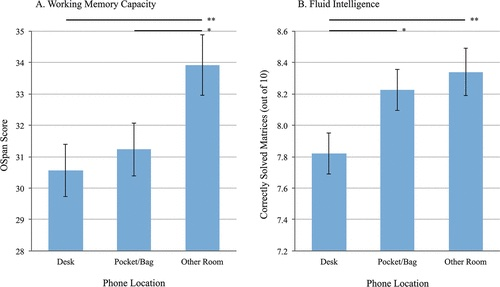
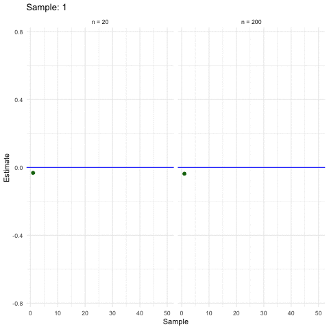

# Rahmen


```{r libs}
#| include: false
library(tibble)
library(tidyverse)
library(gt)
library(ggfittext)
library(see)
library(scales)
```


```{r}
#| include: false

library(exams2forms)
source("_common.R")
```




<!-- ```{css, echo = FALSE} -->
<!-- .justify { -->
<!--   text-align: justify !important -->
<!-- } -->

<!-- .centered { -->
<!--   text-align-last: center; -->
<!-- } -->

<!-- .xlarge { -->
<!--   font-size: 300%; -->
<!-- } -->
<!-- ``` -->


## Einstieg


@fig-ueberblick zeigt den Standort dieses Kapitels im Lernpfad und gibt damit einen Überblick über das Thema dieses Kapitels im Kontext aller Kapitel.
@fig-tidy5 zeigt, dass unser Vorgehen in diesem Buch einem Fließband gleicht:
Schritt für Schritt, in der richtigen Reihenfolge, 
vom Anfang bis Ende, erarbeiten wir unser "Datenprodukt".


![Datenanalyse als eine Abfolge am Fließband [@horst_statistics_2024]](img/tidydata_5.jpg){#fig-tidy5 width="75%"}


```{r}
#| echo: false
ggplot2::theme_set(theme_minimal())
```


### Lernziele


- Sie können eine Definition von Statistik wiedergeben.
- Sie können eine Definition von Daten wiedergeben.
- Sie können den Begriff Tidy-Daten erläutern.
- Sie können Beispiele für verschiedene Skalenniveaus nennen.


::::: {.content-visible when-format="html" unless-format="epub"}

### Einstieg


::::{#exr-einstieg}
### Hallo, Statistik
Gehen Sie in Kleingruppen zusammen (3-4 Personen). 
Stellen Sie sich anhand der Schlagworte einander vor:


1. (wissenschaftliche) Interessen
2. Erwartung an diesen Kurs 
3. Vorkenntnisse in Statistik (und in R)


Wenn Sie wollen: Fügen Sie einen *Fun Fact* hinzu. $\square$
::::


:::{#exr-fragjetzt}
### Frag jetzt
Die Lehrkraft stellt Ihnen ein Forum zur Verfügung, auf dem Sie *anonym* Fragen an die Lehrkraft richten können (z.$\,$B. auf [frag.jetzt](https://frag.jetzt/home)).

Stellen Sie dort Ihre Fragen ein; voten Sie die Fragen Ihrer Kommilitonis auf oder ab. Die Lehrkraft beantwortet dann die Fragen mit den meisten Upvotes. $\square$
:::

:::::

### Erfolgsgrezept

Drei Faktoren beeinflussen Ihren Lernerfolg:
1) Ihre Lehrkraft, 2) Ihre Mitarbeit im Unterricht und 
3) Ihr Eigenstudium zuhause (Vor- bzw. Nachbereitung des Unterrichts), s. @fig-erfolgsrezept.

```{mermaid}
%%| fig-cap: "Ihr Lernerfolg besteht aus drei Komponenten: Der Lehrkraft, Ihrer Mitarbeit im Unterricht und Ihrem Eigenstudium, also Ihrer Vor- bzw. Nachbereitung zuhause."
%%| label: fig-erfolgsrezept
%%| fig-width: 4
 

flowchart TD
  subgraph Lehrkraft
    F["🔥"]
  end
  subgraph A[Mitarbeit]
    C["🪵"]
  end
  subgraph E[Eigenstudium]
    D["🌳"] 
  end  
```

Eine gute Lehrkraft ist wie der Funke, der eine (Lern-)Flamme entzündet. 
Aber es braucht Brennmaterial, einen Holzscheit, das ist Ihre Konzentration im Unterricht. 
Ein Holzscheit allein reicht nicht aus; 
es braucht mehr Brennmaterial, um das Feuer am Leben zu erhalten:
Ihr Eigenstudium, das stetige, selbständige Beschäftigen mit der Materie.


## Was ist Statistik und wozu ist sie gut?

Die Aufgabe von Statistik ist es, Modelle zu bilden durch Zusammenfassen von Daten.
Modelle machen es uns einfacher, schwierige Sachverhalte zu verstehen. 
Zentral ist dabei die Analyse von Variabilität der Daten. 
Daten kommen in verschiedenen Varianten vor, 
typischerweise in Tabellenform, möglichst im sog. Tidy-Format.

 
In diesem Buch werden die Begriffe *Statistik*, *Datenanalyse* und *Data Science* synonym verwendet.


:::{#exr-nutzen-statistik}

### Nutzen von Statistik

 Fragen Sie einen Chatbot (wie ChatGPT), was der Nutzen von Statistik ist. Diskutieren Sie die Antwort. $\square$
:::


Das versteht ChatGPT unter Statistik:


>    [🧑‍🎓]{.content-visible when-format="html"}[\emoji{student}]{.content-visible when-format="pdf"}  Was ist Statistik? Bitte definiere verständlich.

>    [🤖]{.content-visible when-format="html"}[\emoji{robot}]{.content-visible when-format="pdf"} Statistik ist eine Wissenschaft, die sich mit der Sammlung, Analyse, Interpretation, Präsentation und Übertragung von Daten beschäftigt. Ziel ist es, Muster und Trends in den Daten zu erkennen und verlässliche Schlussfolgerungen über eine größere Gruppe (z.$\,$B. Bevölkerung) auf der Basis einer Stichprobe (Teilmenge) zu treffen. Die Statistik hilft uns bei der Beantwortung von Fragen, indem sie uns dabei hilft, die Unsicherheit in den Daten zu messen und zu verstehen^[Release 2023-Jan].


Gar nicht schlecht! Es gibt mehrere Definition von Statistik.
@def-statistik zeigt eine.


:::{#def-statistik}
### Statistik
Statistik fasst Werte zusammen, quantifiziert deren Unterschiedlichkeit  und beschreibt die Ungewissheit unserer Schlüsse [@poldrack_statistical_2023; @kaplan_statistical_2009] . $\square$
:::


Betrachten wir die drei Bestimmungsstücke einer Definition von Statistik genauer: 1. Daten zusammenfassen, 2. Unterschiedlichkeit quantifizieren und 3. Ungewissheit beschreiben.


### Daten zusammenfassen

@fig-zsmnfassen verdeutlicht das Prinzip des Zusammenfassens von Daten.
Einfach ausgedrückt:
Eine Menge von Zahlen wird zu einer einzelnen Zahl "zusammengedampft".
Eine einzelne Zahl ist wesentlich besser zu verstehen als eine große Menge von Zahlen. Bei vielen Zahlen würde man den Überblick verlieren.

```{r}
#| echo: false
#| label: fig-zsmnfassen
#| fig-cap: "Daten zusammenfassen. (a) Zusammenfassen einer Variable zu einem Punktwert, hier zum Mittelwert. (b) Zusammenfassen zweier Variablen zu einer Geraden."
#| layout: [[45,-10, 45], [100]]
#| out-width: "100%"
#| fig-subcap: 
#|   - "Zusammengefasst zu einem Punkt"
#|   - "Zusammengefasst zu einer Geraden"


d <- 
  tibble(y = rnorm(100),
         e = rnorm(100, mean = 0, sd = 0.3),
         x = y + e)

d |> 
  ggplot(aes(y = y, x = 1)) +
  geom_jitter(width = .1) +
  scale_x_continuous(limits = c(0, 2), breaks = c(0,1,2)) +
  geom_hline(yintercept = 0, linetype = "dashed") +
  annotate("point", size = 7, x = 1, y = 0,
           color = modelcol) +
  annotate("label", x = 0, y = 0, label = "MW", hjust = 0, size = 6) +
  labs(caption = "MW: Mittelwert") +
  theme_modern()  +
  theme(strip.text = element_text(size = 16)) +
  theme(plot.caption = element_text(size = 16))+
  theme_large_text() 


d |> 
  ggplot(aes(x = x, y = y)) +
  geom_smooth(method = "lm", color = modelcol, se = FALSE, size = 2) +
  geom_point2() +
  theme_modern() +
  theme_large_text()
```


### Unterschiedlichkeit quantifizieren 

Eine allgegenwärtige Tatsache ist, dass die Dinge der Welt sich unterscheiden, 
etwa, dass Tiere einer Gattung sich in ihrer Größe unterscheiden. 
So sind nicht alle Menschen gleich groß, 
nicht alle Bücher gleich lang oder nicht alle Tage gleich warm.
Daher ist eine zentrale Idee von statistischen Analysen, 
die *Unterschiedlichkeit der Dinge* zu beschreiben,
präziser gesagt: die *Variation zu quantifizieren*. 
Betrachten wir dazu das Beispiel in @fig-groesse.
Im Team der Basketballer gibt es (vergleichsweise) *geringe* Variation in der Körpergröße -- alle sind groß, ähnlich groß.
Im Team der Schachspieler gibt es (vergleichsweise) *hohe* Variation: Einige Personen sind groß, andere klein.


```{r}
#| echo: false
#| label: fig-groesse
#| fig-cap: "Wenig Variation in der Körpergröße bei den Basketballern. Alles lange Kerle. Viel Variation bei den Schachspielern: Manche sind klein, andere groß. Die vertikalen, vom Mittelwert (MW) abgehenenden Balken zeigen die Abweichungen der jeweiligen Körpergröße zum Mittelwert. Hinweis: Die Y-Achse startet nicht bei Null."
# dev: "ragg_png"
#| out-width: "75%"


groesse <- 
  tibble::tribble(
     ~id, ~groesse,        ~team,
      1L,     199L, "Basketball",
      2L,     203L, "Basketball",
      3L,     201L, "Basketball",
     4L,     199L, "Basketball",
     5L,     204L, "Basketball",
     1L,     161L,     "Schach️",
     2L,     198L,        "Schach️",
     3L,     151L,      "Schach️",
     4L,     171L,        "Schach️",
     5L,     192L,    "Schach️",
     )

groesse <- 
  groesse %>%
  mutate(label = 
           if_else(team == "Basketball", 
                   "geringe Variation", 
                   "hohe Variation")) |> 
  group_by(team) %>% 
  mutate(groesse_mw = mean(groesse)) %>% 
  mutate(abweichung = groesse - groesse_mw) %>% 
  mutate(Vorzeichen = factor(sign(abweichung)))

groesse_summ <-
  groesse %>% 
  group_by(team) %>% 
  summarise(groesse_mw = mean(groesse))

facet_labels <- c(`Basketball` = "Basketball\nGeringe Variation",
                  `Schach️` = "Schach\nHohe Variation")

groesse %>% 
  ggplot(aes(x = id, y = groesse)) +
  #geom_col(width=.5, alpha = .5) +
  facet_wrap(~team, labeller = as_labeller(facet_labels)) +
  labs(
       y = "Körpergröße",
       x = "Spielernummer") +
  # geom_label(data = distinct(groesse, team, .keep_all = TRUE), 
  #           aes(label = label, x = 3, y = 50), 
  #           size = labeltextsize-4, 
  #           vjust = 0) +
  theme(strip.text = element_text(size = 16)) +
  theme_modern()  +
  theme(plot.caption = element_text(size = 16)) +
  geom_hline(aes(yintercept = groesse_mw), data = groesse_summ, color = "grey60") + 
  geom_label(x = 5.5, label = "MW",
            aes(y = groesse_mw),
            hjust = "left",
            size = labeltextsize-4)  +
  # Abweichungsbalken:
  geom_segment(aes(x = id, xend = id, 
                   y = groesse, yend = groesse_mw, 
                   color = Vorzeichen),
               linetype = "solid",
               size = 2) +
  geom_point(aes(x = id, y = groesse), color = "black", alpha = .8, size = 2) +
  scale_x_continuous(limits = c(0, 7), breaks = 1:5) +
  scale_color_okabeito(palette = "contrast") +
  theme(legend.position = "none")
```


<!-- Die Variation (auch "Variabilität" genannt) kann man auch gut so darstellen wie in s. @fig-variab gezeigt. -->


```{r}
#| echo: false
#| eval: false
#| label: fig-variab
#| out-width: "100%"
#| fig-cap: "Die Abweichungen der einzelnen Personen von der mittleren Körpergröße ihres Teams"
#| dev: "ragg_png"

groesse_summ <-
  groesse %>% 
  group_by(team) %>% 
  summarise(groesse_mw = mean(groesse))

groesse <-
  groesse %>% 
  group_by(team) %>% 
  mutate(groesse_mw = mean(groesse)) %>% 
  mutate(abweichung = groesse - groesse_mw) %>% 
  mutate(Vorzeichen = factor(sign(abweichung)))

groesse %>% 
  ggplot(aes(x = id)) +
  geom_segment(aes(x = id, xend = id, y = groesse, yend = groesse_mw, color = Vorzeichen)) +
  geom_point(aes(x = id, y = groesse), color = "grey60", alpha = .7, size = 2) +
  facet_wrap(~ team) +
  geom_hline(aes(yintercept = groesse_mw), data = groesse_summ) +
  labs(
       subtitle = "Basketball: Wenig Variation; Schach: Viel Variation",
       x= "Nummer der Spielers") + 
  scale_color_okabeito() +
  geom_label(x = 5, label = "MW",
            aes(y = groesse_mw),
            hjust = "right",
            size = 5)  +
  theme(strip.text = element_text(size = 16),
        legend.position = "bottom")  +
  theme_modern()
```

Eine *Abweichung* (auch *Residuum*) genannt, 
zeigt  die Differenz von Mittelwert und dem Wert der Körpergröße bei der jeweiligen Person.
Nehmen wir an, wir sprechen allgemein von einer Person $i$.
Wir bezeichnen das Merkmal Körpergröße mit $X$ 
und den Mittelwert der Körpergröße mit  als $\bar{x}$ ("x quer").
Dann können wir das Residuum der $i$-ten Person mit $r_i$ bezeichnen und entsprechend definieren.


:::{#def-residuum}
### Residuum
Das Residuum des Merkmals $X$ der $i$-ten Beobachtung ist definiert als 
die Differenz vom Wert $x_i$ und einem Referenzwert, etwa dem Mittelwert ($\bar{x}$), d.$\,$h.: $r_i = x_i - \bar{x}.\square$
:::


### Ungewissheit beschreiben

:::{#exm-ungewiss1}
Anna hat eine Statistik-Klausur geschrieben. Sie hat keine Ahnung, ob sie bestehen wird. Berta hingegen ist sich sehr sicher, dass sie bestanden hat. Die beiden Studentinnen unterscheiden sich also stark in der Ungewissheit hinsichtlich ihrer Einschätzung zum Klausurerfolg, s. @fig-ungewiss-anna-berta. $\square$
:::

```{r}
#| echo: false
#| layout-ncol: 2
#| fig-cap: "Die Ungewissheit, die wir Ereignissen zuschreiben, kann variieren. Anna ist sich maximal unsicher, ob sie besteht. Berta ist sich ziemlich sicher, dass sie besteht."
#| label: fig-ungewiss-anna-berta
#| fig-subcap: 
#|   - "Was Anna denkt"
#|   - "Was Berta denkt"


d1 <- tibble(
  x = c("Bestehen", "Durchfallen"),
  p1 = c(0.5, 0.5),
  p2  = c(0.9, .1)
)

ggplot(d1) +
  aes(x = x, y = p1) +
  geom_col() +
  geom_bar_text(size = 28) +
  labs(y = "Wahrscheinlichkeit",
       title = "",
       x = "") +
  theme_large_text() 

ggplot(d1) +
  aes(x = x, y = p2) +
  geom_col() +
  geom_bar_text(size = 28) +
  labs(y = "Wahrscheinlichkeit",
       title = "",
       x = "")  +
  theme_large_text()
```


:::{#exm-ungewiss2}
Sagen wir, Sie haben sich mit einem zwielichten Statistiker auf ein Glücksspiel eingelassen: Er wirft eine Münze 10 Mal; bei Kopf gewinnt er, bei Zahl Sie. 
Nun hat der Statistiker von den 10 Würfen 8 Mal gewonnen. 
*Sie* sind sich *ziemlich* sicher, dass dieser Typ Sie über den Tisch gezogen hat. 
Allerdings sind Sie nicht ganz sicher, und beweisen können Sie es leider auch nicht.
*Der zwielichte Statistiker* ist sich *ganz sicher*: Er weiß, dass er Sie über den Tisch gezogen hat. Er weiß, dass seine Münze gezinkt ist. $\square$
:::


## Was ist das Ziel Ihrer Analyse?


### Arten von Zielen

Statistische Analysen können drei Arten von Zielen verfolgen, s. @fig-ziele.


```{mermaid}
%%| fig-cap: Zielarten einer Datenanalyse
%%| label: fig-ziele
%%| fig-width: 4

graph TD
  subgraph Ziele
    A[beschreiben]
    B[vorhersagen]
    C[erklären]
  end
```


:::{#exm-zielarten}

- *Beschreiben*: Wie groß ist der Gender-Paygap in der Branche X im Zeitraum Y?
- *Vorhersagen*: Wenn ich 100 Stunden auf die Statistikklausur lerne, welche Note kann ich dann erwarten?
- *Erklären*: Wie viel bringt mir das Lernen auf die Statistikklausur? $\square$
:::


:::{#exr-ziele-stat}
Benennen Sie Beispiele für die die drei Zielarten von Datenanalysen! $\square$
:::

###  Forschungsfrage

Eine Forschungsfrage ist die Leitfrage Ihrer Analyse.
Sie definiert, was Sie herausfinden wollen.
Häufig fragen Forschungsfragen: "Hat X einen (kausalen) Einfluss auf Y?"


Eine Forschungsfrage weist häufig folgende Struktur auf, s. @fig-fo-struktur.


```{mermaid}
%%| fig-cap: Struktur eine Forschungsfrage
%%| label: fig-fo-struktur
%%| fig-width: 4

graph LR
    I[Input bzw. X] --> O[Output bzw. Y]
```


:::{#exm-fofrage1}

### Forschungsfragen

>   Hat Lernen (X) einen Einfluss auf den Prüfungserfolg (Y)?

>   Verringert Joggen (X) die Menge des Hüftgolds (Y)?

>   Um welchen Betrag erhöht sich der Umsatz (Y), wenn wir 1000 
Euro mehr für Werbung ausgeben? (X)

>    Verringert intensive Handynutzung (X) die Konzentrationsfähigkeit (Y)? $\square$
:::


:::{#exm-fofrage2}

### Forschungsfrage: Produktmerkmale und Verkaufserlös

Nach dem Studium haben Sie bei einem großen Online-Auktionshaus angeheuert. 
Da Sie angaben, sich im Studium intensiv, naja, ein bisschen, mit Statistik beschäftigt zu haben,
hat man Sie in die Abteilung für Forschung und Entwicklung (F&E) gesteckt. 
Heute ist es Ihre Aufgabe, Auktionen zur Spielekonsole Wii zu analysieren,
genauer gesagt geht es um das Spiel Mariokart.
Ihre Forschungsfrage lautet:

>   Welche Produktmerkmale stehen mit einem hohen Verkaufserlös in Zusammenhang? $\square$
:::


::: {.content-visible when-format="html"}
### Aus der Forschung: Smartphone-Brain-Drain 📱🧠🚫
:::

::: {.content-visible when-format="pdf"}
### Aus der Forschung: Smartphone-Brain-Drain 
:::

@ward_brain_2017 untersuchten die Forschungsfrage, 
ob die bloße Gegenwart eines Handys (z.$\,$B. wenn es vor Ihnen auf dem Tisch liegt) dazu führt, 
dass man abgelenkt wird und daher schlechtere kognitive Leistungen zeigt.

 Die Autoren formulieren ihre Hypothese leider nicht explizit, 
 aber sie lässt sich implizit aus dem Text herauslesen (S. 142):

>   First, smartphones may redirect the orientation of conscious attention away from the focal task and toward thoughts or behaviors associated with one’s phone. Prior research provides ample evidence that … this digital distraction adversely affects both performance … and enjoyment.

Später präzisieren sie ihre Hypothese (S. 143):

>   In two experiments, we test the hypothesis that the mere presence of one’s own smartphone reduces available cognitive capacity.

Die Ergebnisse unterstützen ihre Hypothese, s. @fig-braindrain. 
Die kognitive Leistung (Y-Achse) ist sowohl in der Kapazität des Arbeitsgedächtnisses 
als auch in der fluiden Intelligenz geringer, 
wenn das Handy auf dem Schreibtisch liegt, als wenn es nicht im Raum ist, so die Studie.
Am besten ist die kognitive Leistung, wenn das Handy nicht im Raum ist. $\square$


{#fig-braindrain}


<!-- :::{#exr-braindrain1} -->
<!-- Benennen Sie X und Y in @exm-braindrain2! $\square$ -->
<!-- ::: -->

:::{#exr-braindrain-chatgpt}
Fragen Sie einen Bot (z.$\,$B. ChatGPT) zum Stand der Forschung hinsichtlich der Braindrain-Forschungsfrage. 
Diskutieren Sie die Antwort, auch in ihren Grenzen. $\square$
:::


### Der Prozess der Datenanalyse


Datenanalyse ist eine Art des Problemlösens.
Anders gesagt, man macht es nicht zum Spaß (jedenfalls nicht alle von uns), sondern um ein Ziel zu erreichen, 
also ein Problem zu lösen.
Daher analysiert man nicht gleich zu Anfang wild drauf los. 
Zunächst 1) klärt man das Problem und das Ziel. 
Dann 2) plant man das Vorgehen, z.$\,$B. welche Daten man erheben möchte. 
Als nächstes 3) erhebt man die Daten und bereitet sie auf. 
Schließlich kann man sie 4) endlich analysieren. 
Aber Daten sprechen nicht für sich, 
man muss sie 5) interpretieren und Schlüsse daraus ziehen. 
Dazu gehört auch, dass man die Schwächen der eigenen Analyse kritisch beleuchtet, 
vgl. @fig-ppdac. 
Diesen Ablauf nennt man auch das PPDAC-Modell [@mackay_scientific_2000]:

- P: *Problem* (Problem und Ziel und Sachgegenstand verstehen)
- P: *Plan* (Vorgehen planen)
- D: *Data* (Daten erheben und aufbereiten)
- A: *Analysis* (Daten analysieren)
- C: *Conclusions* (Schlussfolgerungen ziehen)


```{mermaid}
%%| fig-cap: "Datenanalyse als Prozess: Das PPDAC-Modell"
%%| label: fig-ppdac
%%| fig-width: 4

graph LR
    Problem --> Plan --> Data --> Analysis --> Conclusions --> Problem
```


Aus einer weniger abstrakten, eher praktischen Perspektive kann man von der 
Abfolge der "sieben Schritten der Datenanalyse" sprechen, s. @fig-sieben-schritte.


```{mermaid}
%%| fig-cap: "Datenanalyse als Prozess: Die sieben Schritte der Datenanalyse"
%%| label: fig-sieben-schritte
%%| fig-width: 4

flowchart LR
  subgraph R[Rahmen]
    direction LR
    subgraph V[Vorbereiten]
      direction TB
      E[Einlesen] --> Um[Umformen]
    end
    subgraph M[Grundlagen des Modellieren]
      direction TB
      M1[Punktmodelle] --> Vis[Verbildlichen]
      Vis --> U[Ungewissheit]

    end
    subgraph N[Modellieren]
      direction TB
      G1[Modelle] --> G2[Ungewissheit]
    end
  V --> M
  M --> N
  end
```


## Was sind Daten?

:::{#def-daten}
### Daten
Daten sind eine geordnete Folge von Zeichen. $\square$
:::


Tabellen sind oft das geeignete Format 
für die Untersuchung von Daten.
@tbl-daten zeigt ein Beispiel für Daten.
Die erste Spalte `id` ist nur eine laufende Nummer.
Sie dient dazu, die einzelnen Beobachtungen (hier Studierenden) 
identifizieren zu können und birgt ansonsten keine Information.
Beispiele für ID-Variablen sind Matrikelnummer, 
Personalausweisnummern oder Bestellnummern.


```{r}
#| echo: false
#| tbl-cap: "So sehen Daten in Form einer Tabelle aus."
#| label: tbl-daten
d <- 
  tribble(~ id, ~name, ~note,
          1, "Anna", 1.3,
          2, "Berta", 2.3,
          3, "Carla", 3)

d |> 
  knitr::kable()
```


:::{#exm-daten}
### Daten zur Forschungsfrage 2

Hier ist ein Auszug der Daten zur Tabelle `mariokart`, s. @tbl-mariokart.

```{r tbl-mariokart}
#| echo: false
#| label: tbl-mariokart
#| tbl-cap: Auszug aus der Tabelle mariokart
#library(dplyr)
#library(DT)
data("mariokart", package = "openintro")

#mariokart <- as_tibble("mariokart")

head(mariokart) |> 
  select(n_bids, start_pr, total_pr, wheels) |> 
  kable()

# if (knitr:::is_html_output()) {
#   mariokart %>% 
#     select(-title) %>% 
#     DT::datatable() 
# }
# 
# if (knitr:::is_latex_output()) {
#   mariokart %>% 
#     select(-title) %>% 
#     head() 
# }

```


Eine Erklärung (Data-Dictionary) aller Variablen des Datensatzes `mariokart` findet sich [Auf openintro.org](https://www.openintro.org/data/index.php?data=mariokart)^[<https://www.openintro.org/data/index.php?data=mariokart>] oder im Anhang, s. @#sec-data-dict. $\square$
:::

:::{#def-datadict}
### Data-Dictionary

Eine Erklärung, was die Variablen (Spalten) einer Datentabelle bedeuten,
nennt man *Codebook* or *Data-Dictionary*. $\square$

:::

In den Spalten einer Tabelle stehen Merkmale (Variablen) von den Dingen, die untersucht werden, z.$\,$B. Patienten, Kunden oder Videospiele.
Die untersuchten Dinge nennt man Beobachtungseinheiten.
Die Beobachtungseinheiten stehen in den Zeilen einer Tabelle.
Eine Variable kann man sich als einen Behälter vorstellen,
auf dem mit einem Stift geschrieben steht, welcher Inhalt darin ist,
s. @fig-var-zuweisen.


:::{#def-var}
### Variable
Eine Variable ist ein Platzhalter für ein Merkmal, das verschiedene Ausprägungen annehmen kann. $\square$
:::


{#fig-var-zuweisen width="25%"}


:::{#def-beobeinheit}

### Beobachtungseinheit

Beobachtungseinheiten sind die Dinge, die wir untersuchen (beobachten).
Beobachtungseinheiten sind die Träger von Variablen. $\square$
:::


 @tbl-daten enthält drei Variablen (`id`, `Name` und `Note`) 
und Note) und drei Beobachtungseinheiten (*Anna*, *Berta* und *Carla*).
Beobachtungseinheiten werden auch kurz als *Beobachtungen* bezeichnet.


:::{#def-wert}
### Wert
Ein *Wert* ist der Inhalt einer Variablen. $\square$
:::


In  @fig-var-zuweisen ist der Wert von `temp` 9.
 In @tbl-daten nimmt die Variable `name` die Werte Anna, Berta und Carla an.

:::{#def-auspraegung}
### Ausprägung
Als *Ausprägungen* bezeichnet man die *verschiedenen* Werte einer Variablen. $\square$
:::


:::{#exm-geschlecht}

In einer Studie wurden zehn Probanden untersucht. 
Die Variable `geschlecht` dokumentiert die Geschlechter der Personen:

```{r}
geschlecht <- c("Mann", "Frau", "Frau", "Frau", "Mann",
                "Frau", "Mann", "Mann", "divers", "Frau")
geschlecht
```

Die Variable enthält drei Ausprägungen: divers, Frau, Mann. $\square$

:::

:::{.callout-tip}
Gerade haben Sie etwas Computer-Syntax gesehen, genauer gesagt, 
Befehle aus der Programmiersprache *R*. 
Bisher haben wir diese Befehle nicht kennengelernt. 
Sie verstehen Sie vermutlich (nicht ganz).
Ignorieren Sie diese Befehle einfach erst einmal. 
:::


### Tidy Data

:::{#def-tidy}
### Tidy Data
Unter *Tidy Data* (tidy data, "Normalform") versteht man eine Tabelle,
in der jede Zeile eine Beobachtungseinheit darstellt,
jede Spalte eine Variable und jede Zelle der Tabelle einen Wert.
(Zusätzlich ist noch eine "Kopfzeile" erlaubt, 
in der die Namen der Variablen stehen.) $\square$
:::

![Tidy-Data-Sinnbild [@wickham_tidy-data-sinnbild_2023]](img/tidy-1.png){#fig-tidy1 width="75%"}


@tbl-daten ist ein Beispiel für Tidy-Data. 
@fig-tidy1 zeigt ein Sinnbild für Tidy-Data [@wickham_r_2018].
Für eine statistische Analyse ist es oft sinnvoll, 
dass die Daten im Tidy-Format vorliegen.
Der Vorteil des Tidy-Formats ist es, 
dass man weiß, wie die Daten aufgebaut sind. 
Außerdem können Statistikprogramme oft mit dieser Form am besten umgehen, s. @fig-tidy3.


![Immer schön Ordnung halten … [@horst_tidy_2023]](img/tidydata_3.jpg){#fig-tidy3 width="75%"}


:::{#exm-widelong}
Ihre Firma produziert zwei Produkte: Hämmer und Nägel. 
Im Folgenden sind zwei Tabellen dargestellt, die die gleichen Informationen darstellen:
den Umsatz Ihrer Firma für zwei Jahre.
Einmal ist dazu eine Nicht-Tidy-Tabelle (@tbl-untidy1; Breitformat) und einmal eine Tidy-Tabelle (@tbl-tidy1; Langformat) verwendet. $\square$
::: 


```{r}
#| echo: false
#| label: tbl-untidy1
#| tbl-cap: "Beispiel für eine NICHT-Tidy-Tabelle (Breitformat)"
tidy_untidy <-
  tribble(
    ~Produkt, ~Umsatz_2021, ~Umsatz_2022, ~Umsatz_2023,
    "Hämmer", 10, 11, 12,
    "Nägel", 15, 10, 5
  )
kable(tidy_untidy)
```


```{r}
#| echo: false
#| label: tbl-tidy1
#| tbl-cap: "Beispiel für eine Tidy-Tabelle (Langformat)"
#| out-width: "100%"
tidy_untidy_long <-
  tidy_untidy |> 
  pivot_longer(cols = c(Umsatz_2021, Umsatz_2022, Umsatz_2023), names_to = "Jahr2", values_to = "Umsatz") |> 
  separate(Jahr2, into = c("k", "Jahr")) |> 
  dplyr::select(-k)

kable(tidy_untidy_long)
```


:::{#exr-widelong}
Suchen Sie ein Beispiel für eine Konfiguration einer Tabelle im Lang- vs. Breitformat. $\square$
:::


>    [🧑‍🎓]{.content-visible when-format="html"}[\emoji{student}]{.content-visible when-format="pdf"} Wozu braucht man Tidy Data?

>    [👩‍🏫]{.content-visible when-format="html"}[\emoji{woman-teacher}]{.content-visible when-format="pdf"} In vielen Software-Programmen der Datenanalyse weißt man z.$\,$B. der X- oder Y-Variable eine Spalte einer Tabelle zu. Möchte man etwa die Veränderung des Umsatzes im Verlauf der Jahre visualisieren oder analysieren, so braucht es die Spalten 'Jahr' und 'Umsatz', also ein Tidy-Format, @tbl-untidy1 bzw. @tbl-tidy1.

@fig-tidy stellt auf Basis einer "Tidy-Tabelle" (@tbl-tidy1) ein Diagramm dar. Ohne Tidy-Daten wäre dieses Diagramm nicht (so einfach) zu erstellen gewesen.


```{r}
#| echo: false
#| label: fig-tidy
#| fig-asp: 0.5
#| out-width: "75%"
#| fig-cap: "Beispiel für eine Visualisierung auf Basis einer Tidy-Tabelle,  vgl. @tbl-tidy1"

last_points <- tidy_untidy_long %>%
  group_by(Produkt) %>%
  filter(Jahr == max(Jahr)) %>%
  ungroup()

tidy_untidy_long |> 
  ggplot(aes(x = Jahr, y = Umsatz, color = Produkt, 
             group = Produkt, shape = Produkt)) +
  geom_point(size = 3) +
  geom_line() +
  theme_minimal() +
  geom_text(data = last_points, aes(label = Produkt), 
            hjust = -0.2, vjust = 0.5, size = 4, show.legend = FALSE) +
  theme(legend.position = "none") +
  scale_y_continuous(limits = c(0,15)) +
  scale_color_okabeito(palette = "black_first") 
```


### Je mehr, desto besser (?)


Was Daten betrifft, könnte man behaupten: "Viel hilft viel" oder "Je mehr, desto besser".
Natürlich unter sonst gleichen Umständen.^[*Ceteris paribus* auf Latein, hört sich gleich viel schlauer an.] 
Viel Datenmüll ist natürlich nicht besser als ein paar knappe, wasserdichte Fakten!


:::{#exm-samplesize}

Um Ihre eigene Lehraktivität zu organisieren, 
wollen Sie sich ein Bild machen, 
wie viel Ihre Nebensitzerinner und Nebensitzer im Hörsaal so lernen.
Sie blicken nach links und fragen "wie viel lernst du so?".
Sie blicken nach recht und wiederholen die Frage gerichtet an den Kommilitonen, der rechts neben Ihnen sitzt.
Dann addieren Sie die zwei Zahlen (unter der Annahme, dass Sie zwei Zahlen bekommen haben),
und teilen durch zwei, um den Mittelwert zu erhalten. $\square$
:::


Ein kritischer Geist könnte anmerken, 
dass Sie besser die Untersuchung nicht gemacht hätten 
(auch wenn Sie, vielleicht ohne zu wollen, 
eine statistische Untersuchung angestellt haben).
Denn bei so wenig befragten Personen ist die Ungenauigkeit Ihrer Schätzung der typischen Lernzeit bei Studierenden einfach zu hoch.
@fig-sample-estimate veranschaulicht, dass man einen Mittelwert genauer schätzen kann,
wenn man auf eine größere Stichprobe zurückgreift. 
Das Teilbild links zeigt den Mittelwert einer Stichprobe mit $n=20$ Beobachtungen. 
Das Teilbild rechts zeigt den Mittelwert einer Stichprobe mit $n=200$ Beobachtungen (jeweils aus der gleichen Grundgesamtheit).
Wie man sieht, ist im linken Teilbild die Streuung (Variation) höher als im rechten Teilbild.

::: {.content-visible when-format="pdf"}

```{r}
#| label: fig-sample-estimate
#| fig-cap: "Schätzgenauigkeit als Funktion der Stichprobengröße. Jeder Punkt stellt eine Stichprobe dar, entweder mit $n=20$ (links) oder mit $n=200$ (rechts). Kleine Stichproben (links) haben im Schnitt eine größere Abweichung vom wahren Mittelwert als größere Stichproben (rechts). "
#| echo: false
#| fig-asp: 0.5

d <- tibble(id = 1:20)

d <- d |> 
  mutate(
    x1 = map_dbl(id, ~mean(rnorm(n = 20))), 
    x2 = map_dbl(id, ~mean(rnorm(n = 200)))
  )

d_long <- d |> 
  pivot_longer(cols = c(x1, x2), 
               names_to = "variable", values_to = "value")


custom_labels <- c(x1 = "Kleine Stichproben (n=20)", x2 = "Große Stichproben (n=200)")


ggplot(d_long, aes(x = id, y = value)) +
  geom_hline(yintercept = 0, linetype = "dashed") +
  geom_point() +
  facet_wrap(~ variable, labeller = labeller(variable = custom_labels)) +
  theme_minimal() +
  labs(
    x = "Nummer der Beobachtung",
    y = "Wert") +  
    geom_segment(aes(x = id, xend = id,
                   y = value, yend = 0),
               linetype = "dotted", 
               color = "grey40")
```

:::


::: {.content-visible when-format="html"}
{#fig-sample-estimate}

Bildquelle: Karsten Lübke

:::


:::{.callout-important}
Mehr Daten = genauere Ergebnisse (unter sonst gleichen Umständen)
:::


:::::{#exr-kleine-grosse-stipro}
### Live-Experiment zum Effekt der Stichprobengröße

In diesem Live-Experiment untersuchen wir den Effekt der *Stichprobengröße* auf die Streuung des Mittelwerts in der *Stichprobe.* Streuen die Ergebnisse mehr in kleinen Stichproben als in großen? Probieren wir es aus!

In diesem Experiment werfen Sie (in kleinen Gruppen) eine Münze (auf faire Art und Weise) und notieren das Ergebnis (Kopf oder Zahl).
Uns interessiert dabei die Frage, ob die Ergebnisse bei kleinen Stichproben 
($n=5$ Münzwürfe) anders streuen als in großen Stichproben ($n=20$ Münzwürfe).

:::: {layout="[ 80, 20 ]"}
::: {#first-column}
Sie brauchen nur experimentierfreudige Partner (Kleingruppen mit 2-4 Personen), eine faire Münze und dann kann's los gehen! 
[Scannen Sie den QR-Code, um mit dem Experiment zu starten](https://docs.google.com/forms/d/e/1FAIpQLSeAwqNyZtyQwttq5JrQdQ2AO7w5vzcVDXjiejKnyFNxiWtEag/viewform?usp=sf_link).
:::

::: {#second-column}

```{r}
#| echo: false
#| out-width: "75%"
#| fig-align: center
qr <- qrcode::qr_code("https://docs.google.com/forms/d/e/1FAIpQLSeAwqNyZtyQwttq5JrQdQ2AO7w5vzcVDXjiejKnyFNxiWtEag/viewform?usp=sf_link")

plot(qr)
```
:::
::::

Die Daten aller Versuche können Sie [hier](https://docs.google.com/spreadsheets/d/11mKFFpr-Y1CMPpq4dGA-JA_Z9jRkPbXolo54Y0G_2gE/edit?usp=sharing) einsehen.^[<https://tinyurl.com/3w8ke2n2>] $\square$
:::::


:::{#exm-schule-samplesize}
### Dorfschulen machen die schlauesten Schüler?!
In einer Pressemitteilung sei zu lesen, dass die besten Schüler in den Dorfschulen zu finden seien. (Das ist eine fiktive Geschichte.) 
Mit etwas Recherche finden Sie heraus, 
dass diese Aussage auf belastbaren Daten beruht: 
Tatsächlich sind die Notendurchschnitte auf den kleinen Dorfschulen deutlich besser als in den großen Schulen in der Stadt. 
Also stimmt die Behauptung der Pressemitteilung? Die gute Landluft lässt das Hirn wachsen?
Sie recherchieren noch etwas weiter in den Daten. 
Dann fällt Ihnen auf: Die *schlechtesten* Schüler kommen auch aus den Dorfschulen!
Eine statistische Erklärung bietet sich an: 
In den Dorfschulen gibt es nur wenig Kinder und vergleichsweise‚ kleine Klassen -- die Stichproben sind also klein.
Bei kleinen Stichproben gibt es viel Variation um den Mittelwert herum, s. @fig-sample-estimate, 
und zwar nach oben (guter Notenschnitt) und nach unten (schlechter Notenschnitt). $\square$
:::


## Arten von Variablen  {#sec-arten-variablen}


### Nach Position in der Forschungsfrage

Angenommen, Ihre Forschungsfrage lautet:

>   Hat Lernen einen Einfluss auf den Prüfungserfolg?

In dem Fall gilt:
*Lernen* ist die Input-Variable, X-Variable, Ursache, unabhängig Variable (UV). *Prüfungserfolg*  ist die Output-Variable, Y-Variable, Wirkung, abhängige Variable (AV).
@fig-ueberblick-fragen stellt diese beiden "Positionen" einer Variable dar. Die erste Position ist vor dem Pfeil (X).
Die zweite Position ist nach dem Pfeil (Y).

```{mermaid}
%%| fig-cap: X und Y als synonyme Bezeichnungen für Input- und Output-Variablen einer Forschungsfrage
%%| label: fig-ueberblick-fragen
%%| fig-height: 0.5

graph LR
    X["Lernen<br>(UV, X, Prädiktor)"] --> Y["gute Note<br>(AV, Y, Kriterium)"]
```


:::{#exr-uvav}
Überlegen Sie sich eine Forschungsfrage, die eine UV und eine AV enthält. 
Nennen Sie einer anderen Person diese Forschungsfrage und fragen Sie, was die UV und die AV ist. 
Bei richtiger Antwort belohnen Sie großzügig. $\square$
:::

### Nach dem Skalenniveau

:::{#def-skalenniveau}
### Skalenniveau
Der Begriff *Skalenniveau* wird verwendet, 
um die Art und Menge der Information, die in Variablen enthalten ist, zu benennen. 
Diese Klassifikation basiert auf den Eigenschaften der Daten und den mathematischen Operationen, 
die sinnvoll auf diese Daten angewendet werden können. $\square$
:::

@fig-skalenniveau gibt einen Überblick über typisch verwendete Skalenniveaus.


```{mermaid}
%%| fig-cap: Skalenniveaus
%%| label: fig-skalenniveau
%%| fig-width: 4


graph TD
    Variablen --> qualitativ
    Variablen --> quantitativ
    qualitativ --> nominal
    qualitativ --> ordinal
    quantitativ --> Intervallniveau
    quantitativ --> Verhältnisniveau
```


:::{#exm-skalen}
### Beispiele für Skalenniveaus

Beispiele zu den Skalenniveaus sind in @tbl-skalen-bsps aufgeführt. $\square$
:::

```{r tbl-skalen-bsps}
#| echo: false
#| tbl-cap: "Beispiele für Skalenniveaus"
#| label: tbl-skalen-bsps
skalen_bsps <- 
  tibble::tribble(
                        ~Variable,     ~Skalenniveau,
                      "Haarfarbe",    "Nominalskala",
                     "Augenfarbe",    "Nominalskala",
                     "Geschlecht",    "Nominalskala",
                      "Automarke",    "Nominalskala",
                         "Partei",    "Nominalskala",
                 "Lieblingsessen",    "Ordinalskala",
  "Medaillen beim 100-Meter-Lauf",    "Ordinalskala",
                     "Uniranking",    "Ordinalskala",
                             "IQ",  "Intervallskala",
                   "Extraversion",  "Intervallskala",
          "Temperatur in Celsius",  "Intervallskala",
       "Temperatur in Fahrenheit",  "Intervallskala",
           "Temperatur in Kelvin", "Verhältnisskala",
                    "Körpergröße", "Verhältnisskala",
                "Geschwindigkeit", "Verhältnisskala",
                          "Länge", "Verhältnisskala"
  )
skalen_bsps |> 
  kable()
```


Jenachdem, über welches Skalenniveau eine Variable verfügt,
sind verschiedenen Rechenoperationen erlaubt, s. [@tbl-skalenniveaus]{.content-visible when-format="html"}
[@tbl-skalenniveaus-pdf]{.content-visible when-format="pdf"}.
Zu diesen Rechenoperationen zählen: 
Das Testen auf Gleichheit (Symbol: $=$), 
das Ordnen der Größe nach (Symbol: $\preceq$),
das Addieren (und Subtrahieren; Symbol: $+$) und 
das Multiplizieren (und Dividieren; Symbol: $\cdot$).


::: {.content-visible when-format="html"}

```{r p-skalenniveaus}
#| dev: "ragg_png"
#| echo: false
#| tbl-cap: "Erlaubte Rechenoperationen nach Skalenniveau"
#| label: tbl-skalenniveaus
skalenniveaus <-
  tibble::tribble(
       ~Skalenniveau, ~Quantitativ, ~`=`, ~`≼`, ~`+`, ~`×`,
     "Nominalniveau",       "nein",  "✅",  "❌",  "❌",  "❌",
     "Ordinalniveau",       "nein",  "✅",  "✅",  "❌",  "❌",
   "Intervallniveau",         "ja",  "✅",  "✅",  "✅",  "❌",
  "Verhältnisniveau",         "ja",  "✅",  "✅",  "✅",  "✅"
  )

skalenniveaus |> 
  knitr::kable() 
```

:::

::: {.content-visible when-format="pdf"}


```{r p-skalen-pdf}
#| echo: false
#| tbl-cap: "Erlaubte Rechenoperationen nach Skalenniveau (ja, erlaubt: $\\checkmark$; nein, nicht erlaubt: $\\times$)"
#| label: tbl-skalenniveaus-pdf
skalenniveaus <- tibble::tribble(
       ~Skalenniveau, ~Quantitativ, ~`$=$`, ~`$\\preceq$`, ~`$+$`, ~`$\\cdot$`,
     "Nominalniveau",       "$\\times$",  "$\\checkmark$",  "$\\times$",  "$\\times$",  "$\\times$",
     "Ordinalniveau",       "$\\times$",  "$\\checkmark$",  "$\\checkmark$",  "$\\times$",  "$\\times$",
   "Intervallniveau",       "$\\checkmark$",  "$\\checkmark$",  "$\\checkmark$",  "$\\checkmark$",  "$\\times$",
  "Verhältnisniveau",       "$\\checkmark$",  "$\\checkmark$",  "$\\checkmark$",  "$\\checkmark$",  "$\\checkmark$"
  ) 

skalenniveaus |> 
  knitr::kable()
```

:::

Was soll das bedeuten, "Rechenoperationen"?
Schauen wir uns für jedes Skalenniveau ein "Rechenbeispiel" an.

*Nominalskala*: Die Variable *Geschlecht* ist nominalskaliert. 
Das bedeutet, dass ihre Ausprägungen *Frau* und *Mann* z.$\,$B. nicht (sinnvoll) addiert oder sonstwie "verrechnet" werden können. 
Man könnte, z.$\,$B. um das Eintippen zu erleichtern, Frauen mit `1` kodieren und Männer mit `2`. 
Damit darf man aber nicht rechnen! Nicht addieren, nicht multiplizieren, etc. 
Es macht keinen Sinn zu sagen: "Ich habe eine Frau und einen Mann in meiner Tabelle, das ist im Schnitt ein diverses Geschlecht, weil der Mittelwert von 1 und 2 ist 1,5!"
Die *einzige* "Rechenoperation", die man auf der Nominalskala machen darf, 
ist die Prüfung auf *Gleichheit*: 
Mann kann feststellen, ob ein Objekt gleich zu einem anderen ist oder unterschiedlich.
Also ob zwei Personen das gleiche Geschlecht haben 
oder von unterschiedlichem Geschlecht sind.
Anders ausgedrückt:


::: {.content-visible when-format="html"}
- 👩 $\ne$ 👨
- 👩 $=$ 👩
- 👨 $=$ 👨
:::

::: {.content-visible when-format="pdf"}
- FRAU $\ne$ MANN
- FRAU $=$ FRAU
- MANN $=$ MANN
:::


*Ordinalskala*: Diese Skala stellt einer Rangordnung dar. 
Eine Rangordnung ist etwa die geordnete Abfolge Ihrer Leibgerichte (1. Pizza, 2. Spagetthi, 3. Schnitzel). 
Etwas "formaler" ausgedrückt, z.$\,$B.:

::: {.content-visible when-format="html"}
🍕 $\succ$  🍝 $\succ$ 🥩
:::

::: {.content-visible when-format="pdf"}
$\text{Pizza} \succ \text{Spagetthi} \succ \text{Schnitzel}$
:::

Das komische Zeichen $\succ$ soll heißen: "Ist auf meiner Liste von Leibgerichten weiter oben, mag ich lieber".
Man kann aber *nicht* sagen, "Ich mag aber Pizza um 42$\,$% mehr als die Spaghetti und die  um 73$\,$% mehr als ein Schnitzel!" 
Zumindest kann man das nicht ohne weitere Informationen und Annahmen. 
Es gibt also Dinge auf der Welt, die man leicht in eine Rangordnung bringen kann, 
aber die man nur schwer in der Größe der Unterschiede bemessen kann. 
Das ist die Ordinalskala.
Die Ordinalskale erlaubt also, Objekte zu ordnen (hinsichtlich eines Merkmals).
Die Abstände zwischen den Objekten können dabei nicht quantifiziert werden. 

```{r p-ordinal}
#| dev: "ragg_png"
#| echo: false
#| out-width: "100%"
#| label: fig-ordinal
#| eval: false
#| fig-asp: 0.3
#| fig-cap: "Die Ordinalskala: Je weiter rechts auf der X-Achse, desto lieber esse ich das Gericht."

tibble(x = c(1,2,5), Liebling = c("🥩", "🍝", "🍕")) %>% 
  ggplot()+
  aes(x=x) +
  geom_label(aes(label = Liebling), y = 1, size = 10) +
  theme_minimal() +
  labs(x = "Wie sehr ich dieses Essen mag") +
  theme(axis.text = element_blank()) +
  scale_y_continuous(limits = c(0,2))
```


*Intervallskala*: Das ist vielleicht eine Überraschung für Sie: 
Wenn die Temperatur heute bei 10$\,$°C liegt und morgen 5$\,$°C -- 
dann ist es heute *nicht* doppelt so warm wie morgen. 
Ja, 10 ist das Doppelte von 5. 
Aber *10$\,$°C* ist *nicht* doppelt so warm wie 20$\,$°C. 
Wenn Sie das verwundert: 
Das ist normal, so geht es vielen Leuten, wenn sie das zum ersten Mal hören.
Der Grund, warum es nicht sinnvoll ("erlaubt") ist, 
Verhältnisse (wie doppelt/halb so viel etc.) auf der Celsius-Skala zu bilden,
ist, dass der Nullpunkt der Skala, 0$\,$°C, kein echter, physikalischer Nullpunkt ist. Bei 0$\,$°C liegt eben nicht Null Wärmeenergie vor. 
Stattdessen wurde mit  0$\,$°C eine Wärmenergiemenge gewählt, 
die für uns Menschen  praktisch, da augenfällig ist: der Gefrierpunkt von Wasser. 
Was bei der Intervallskala erlaubt ist, ist das Addieren (und Subtrahieren): heute 10$\,$°C, morgen 5$\,$°C, das ist ein Unterschied von 5$\,$°C. 
Oder: Im Schnitt waren es 7,5$\,$°C, das ist genau in der Mitte von 5 und 10$\,$°C. @fig-intervall versinnbildlicht die Intervallskala.


```{r}
#| dev: "ragg_png"
#| echo: false
#| out-width: "50%"
#| fig-asp: 0.5
#| label: fig-intervall
#| fig-cap: "Ein Metermaß steckt im trüben Wasser. Auf dem Metermaß können wir die aufgedruckten Zahlen ablesen. Aber wir wissen nicht, ob der Metermaß auf dem Boden steht. Wir wissen demnach nicht, ob der vom Metermaß angegebene Nullpunkt der wahre Nullpunkt (Meeresboden) ist."

data_fig_intervall <- tibble(x = 0, y = c(10, 20, 30)) 

ggplot(data_fig_intervall) +
  aes(x = x) +
  annotate("segment", x = 0, xend = 0, y = 0, yend = 30) +
  annotate("rect", fill = "blue", alpha = .8,
           xmin = -1, xmax = 1, ymin = 0, ymax = 10) + # ymin and ymax order fixed
  geom_label(aes(y = y, label = y), x = 0, size = 12) + 
  theme_void() +
  ylim(0, 35) +  # Extend y-axis range to avoid clipping
  theme(
    plot.margin = margin(10, 10, 10, 10) # Add margin space
  ) 
```


*Verhältnisskala*: Eine Verhältnisskala ist das,
was man sich gemeinhin unter einer metrische Variable vorstellt: 
Man kann "normal" rechnen, alle Rechenoperationen sind erlaubt. 
Zuzüglich zu denen, 
die auch in anderen, "niedrigeren", Skalenniveaus erlaubt sind, 
ist das das Bilden von Verhältnissen --
Multiplizieren (und damit auch Dividieren).

```{r p-verhaeltnis}
#| echo: false
#| eval: false
#| label: fig-verhaeltnis
# fig-cap: "Puh! Der rote Flitzer ist 10 Mal so teuer wie die blaue Möhre. Kohlen zusammenkratzen."
#| layout-ncol: 2
#| fig-subcap: 
#|   - "Möhre"
#|   - "Flitzer"

# Ursprüngliche Daten
df <- tibble(
  Preis = c(1e4, 1e5),
  id = c(1, 2),
  Auto = c("Möhre", "Flitzer"),
  Auto_img = c("🚙", "🏎️")
)

# Einzelne Diagramme
# Diagramm 1
df1 <- df %>% filter(id == 1)
p1 <- ggplot(df1, aes(y = Preis, x = factor(id))) +
  geom_col() +
  scale_x_discrete(breaks = "Möhre") +
  scale_y_continuous(
    labels = dollar_format(),
    limits = c(-5000, 110000),
    breaks = c(10000, 50000, 100000),
    expand = c(0.1, 0.1)
  ) +
  # geom_label(aes(x = factor(id), label = Auto), y = -1e3, size = 10, nudge_y = -10000) +
  labs(x = "",
       title = "Möhre") +
  theme_large_text() +
  annotate("label", x = 1, y = 12000, label = "10 Tsd")

# Diagramm 2
df2 <- df %>% filter(id == 2)
p2 <- ggplot(df2, aes(y = Preis, x = factor(id))) +
  geom_col() +
  scale_x_discrete() +
  scale_y_continuous(
    labels = dollar_format(),
    limits = c(-5000, 110000),
    breaks = c(10000, 50000, 100000),
    expand = c(0.1, 0.1)
  ) +
  # geom_label(aes(x = factor(id), label = Auto), y = -1e3, size = 10, nudge_y = -10000) +
    labs(x = "",
       title = "Flitzer")  +
  annotate("label", x = 1, y = 105000, label = "100 Tsd")

# Anzeigen
p1
p2


# tibble(Preis = c(1e4, 1e5),
#        id = c(1, 2),
#        Auto = c("🚙", "🏎️"  )) %>% 
#   ggplot(aes(y = Preis, x = id)) +
#   geom_col() +
#   scale_x_discrete() +
#   #geom_bar() +
#   # geom_bar_text()+
#   #geom_label(aes(x = id, y = Preis, label = Preis)) +
#   scale_y_continuous(labels = scales::dollar_format(),
#                      limits = c(-5000, 110000),
#                      breaks = c(10000, 50000, 100000),
#                      expand = c(0.1, 0.1)) +
#   geom_label(aes(x = id, label = Auto), y = -1e3,
#                           size = 10,
#              nudge_y = -10000)
```


Außerdem können quantitative Variablen wie folgt untergliedert werden:

- *stetige* Variablen, das sind Variablen, bei denen man zwischen zwei Ausprägungen immer noch eine weitere quetschen kann. So gibt es einen Wert für die Köpergröße zwischen 1.60&#8239;m und 1.61&#8239;m. Und einen Wert zwischen 1.601&#8239;m und 1.602&#8239;m, etc.
- *diskrete* Variablen, das sind metrische Variablen, die nur bestimmte Ausprägungen haben, häufig sind das die natürlichen Zahlen mit Null: $0, 1,2,...$. Ein Beispiel wäre die Anzahl der Kinder in einer Familie.


Fragen nach Skalenniveaus gehören zu den Lieblingsprüfungsfragen in diesem Themenbereich. Sie sind gut beraten, sich gerade mit dieser Frage intensiver zu beschäftigen. Auch in thematisch angrenzenden Fächern wird immer wieder die Frage nach dem Skalenniveau aufgeworfen. Das belegt die hohe Relevanz des Themas.


:::{#exr-skalenniveaus}
Überlegen Sie sich für einige Variablen die Skalenniveaus und 
befragen Sie dann interessierte Mitmenschen dazu. $\square$
:::


:::: {layout="[ 80, 20 ]"}

::: {#first-column}
In [diesem Video](https://www.youtube.com/watch?v=_mN3kFe56ng) gibt es noch ausführlichere Erklärung zum Thema Skalenniveaus.
:::


::: {#second-column}
```{r qr-youtube-skalenniveaus}
#| echo: false
#| out-width: "75%"
#| fig-align: center
qr <- qrcode::qr_code("https://www.youtube.com/watch?v=_mN3kFe56ng")
plot(qr)
```
:::
::::


::: {.content-visible when-format="html" unless-format="epub"}

:::


## Modelle

Woran denken Sie beim Wort "Modell"?
Vielleicht an Behaims Globus oder an Spielzeugautos, s. @fig-matchbox?


![Matchbox-Autos sind Modelle für Autos, [@spurzem2017]](img/matchbox.jpg){#fig-matchbox width="25%"}

:::{#def-modelle}
### Modelle
Modelle sind ein vereinfachtes Abbild der Realität, eine *Repräsentation* [@kaplan_statistical_2009]. $\square$
:::


:::{#exm-Modelle}
## Beispiele für Modelle
Puppen sind Modelle für Babys, Landkarten für Landstriche und das Atommodell von Nils Bohr ist ein Modell für Atome. $\square$
:::

Auch in der Statistik nutzen wir Modelle.
Helfen Sie Prof. Weiss-Ois: Er blickt nicht durch, s. @exm-weiss-ois.
Gerne würde er wissen, wie viele Stunden seine Studierenden auf die Prüfung lernen. 
Aber mit so vielen Zahlen kann er nicht umgehen …
Geben Sie ihm ein Modell: Sagen Sie ihm, wie lang die Studis typischerweise lernen -- Sagen Sie ihm ein einfach den *Mittelwert* der Lernzeiten, das sind 9.6 Stunden.


:::{#exm-weiss-ois}

### Prof Weiss-Ois blickt nicht durch

>    [🧑‍🏫]{.content-visible when-format="html"}[\emoji{teacher}]{.content-visible when-format="pdf"} Vorher: 12, 8, 10, 11, 10, 9, 13, 9, 14, 9, 12, 14, 7, 9, 9, 11, 9, 4, 5, 12, 9, 6, 9, 12, 13, 9, 9, 6, 10 … Oh je, so viele Zahlen! Ich check nix! Wie viel lernen denn jetzt meine Studis?!


>    [🧑‍🏫]{.content-visible when-format="html"}[\emoji{teacher}]{.content-visible when-format="pdf"} Ah, 9.6 Stunden! Yeah, jetzt weiß ich, wie viel die Studis so typischerweise lernen. Viel zu wenig natürlich!


<!-- :::{#fig-prof layout="[10,-2,10]"} -->


<!-- ![Vorher: </br> 12, 8, 10, 11, 10, 9, 13, 9, 14, 9, 12, 14, 7, 9, 9, 11, 9, 4, 5, 12, 9, 6, 9, 12, 13, 9, 9, 6, 10... Oh je, so viele Zahlen! Ich check nix! Wie viel lernen denn jetzt meine Studis?! [@flaticon_professor_2024]](img/teacher.png){width="25%"} -->

<!-- ![Nachher: </br> Ah, 9.6 Stunden! Yeah, jetzt weiß ich, wie viel die Studis so typischerweise lernen. Viel zu wenig natürlich! [@flaticon_professor_2024]](img/teacher.png){width="25%"} -->

Prof. I. Ch. Weiss-Ois hat den Mittelwert verstanden … $\square$
:::


Der Nutzen von Modellen ist,
dass sie komplexe Sachverhalte vereinfachen und damit oft überhaupt erst dem Verständnis 
oder einer Untersuchung zugänglich machen:
Modelle ermöglichen Verständnis.
In der Datenanalyse bzw. Statistik (die beiden Begriffe werden hier weitgehend synonym gebraucht)
fassen Modelle oft viele Daten prägnant zusammen, z.$\,$B. zu einer einzelnen Kennzahl.
Das Verrückte an Modellen ist, dass man Informationen wegwirft, 
um eine (andere, hoffentlich nützlichere) Information zu bekommen [@stigler_seven_2016]. 
Weniger ist mehr?!


## Praxisbezug


Wir leben im Datenzeitalter; Daten durchdringen alle Bereiche des beruflichen, gesellschaftlichen und privaten Lebens. 
Die Datenanalyse hat sich in den letzten Jahren massiv verändert,
da Datenmengen und -methoden einen regelrechten Boom erlebt haben.
Diese Entwicklung ist durchaus auch kritisch zu betrachten;
viele Menschen betrachten die Entwicklung im Datenzeitalter -- Stichwort künstliche Intelligenz -- mit Sorge.
Egal ob man Daten als Segen oder Fluch betrachtet, in beiden Fällen ist es wichtig, mit Daten umgehen zu können.
Mit der wachsenden Bedeutung von Daten wächst in gleichem Maße die Bedeutung von Datenanalyse.
Denn Daten ohne Sinn sind nutzlos.
Aus diesem Grund kann man sagen, 
dass Datenanalyse (und damit auch Statistik als eine spezielle Art von Datenanalyse) 
zu stark nachgefragten Jobs gehören.


::: {.content-visible when-format="html"}
Laut [dem Entgeltatlas der Bundesagentur für Arbeit](https://web.arbeitsagentur.de/entgeltatlas/beruf/129987) 
liegt ein typisches Gehalt von Data Scientisten bei knapp 6000 Euro pro Monat 
(in der Altersgruppe von 25 bis 54)^[Abrufdatum: 1.2.23; <https://web.arbeitsagentur.de/entgeltatlas/beruf/129987>]. 
Laut dem [Gehaltsreporter](https://gehaltsreporter.de/gehaelter-von-a-bis-z/it/data-scientist/) 
liegt das Einstiegsgehalt dieser Berufsgruppe bei knapp 50000 Euro pro Jahr.^[<https://gehaltsreporter.de/gehaelter-von-a-bis-z/it/data-scientist/>]
:::


## Wie man mit Statistik lügt

Das *File-Drawer-Problem*:
Sie haben ein tolles Experiment durchgeführt, viel Arbeit, viel Stress, endlich geschafft, puh. 
Von den 20 Variablen (als AV, s. @sec-arten-variablen), die Sie untersucht haben, 
zeigt nur 1 einen interessanten Effekt, leider. 1 von 20, das hört sich nicht so toll an. 
Wäre es da nicht "elegant", 
die 19 Variablen ohne schönen Effekt einfach in der Schublade liegen zu lassen bis zum Sankt-Nimmerleins-Tag?
Dann könnten Sie stattdessen als Ergebnis nur die eine Variable mit schönen Ergebnis präsentieren, 
ganz ohne widersprechende Befunde. 

Dieser Versuchung zu widerstehen, kann schwer sein. Es ist aber gefährlich, 
missliebige Ergebnisse zu verschweigen: Die anderen Menschen bekommen dann ein falsches Bild der Ergebnislage; man spricht von [Publikationsbias](https://de.wikipedia.org/wiki/Publikationsbias) [@marksanglin_historical_2020]. Wer Ergebnisse verschweigt, verzerrt die gesamte Befundlage [@rothstein_publication_2014] -- ein Fall von wissenschaftlichem Fehlverhalten.


## Quiz


```{r def-exs-rahmen}
#| echo: false
exrs_rahmen <- 
list(
  "exs/Definition_Statistik.Rmd",
  "exs/Nutzen_Modelle.Rmd",
  "exs/PPDAC_Modell.Rmd",
  "exs/Residuum_Definition.Rmd",
  "exs/Skalenniveau_Intervall.Rmd",
  "exs/Skalenniveau_Ordinal.Rmd",
  "exs/Stichprobengroesse_Genauigkeit.Rmd",
  "exs/Tidy_Data.Rmd",
  "exs/UV_AV_Unterscheidung.Rmd",
  "exs/Ziele_Statistik.Rmd"
  )
```

```{r quiz-kap2, echo = FALSE, message = FALSE, results = "asis"}
exams2forms(exrs_rahmen, box = TRUE, check = TRUE)
```


## Aufgaben


Die Webseite [datenwerk.netlify.app](https://datenwerk.netlify.app) stellt eine Reihe von einschlägigen Übungsaufgaben bereit. 
Sie können die Suchfunktion der Webseite nutzen, 
um die Aufgaben mit den folgenden Namen zu suchen:


1. [variation01](https://sebastiansauer.github.io/Datenwerk/posts/variation01/variation01.html)
1. [Def-Statistik01](https://sebastiansauer.github.io/Datenwerk/posts/Def-Statistik01/Def-Statistik01.html)
1. [tidy1](https://sebastiansauer.github.io/Datenwerk/posts/tidy1/tidy1.html)
1. [Skalenniveau1a
](https://sebastiansauer.github.io/Datenwerk/posts/skalenniveau1a/skalenniveau1a)
1. [Ziele-Statistik](https://sebastiansauer.github.io/Datenwerk/posts/ziele-statistik/ziele-statistik)
1. [variation02
](https://sebastiansauer.github.io/Datenwerk/posts/variation02/variation02.html)
1. [Skalenniveau1b](https://sebastiansauer.github.io/Datenwerk/posts/Skalenniveau1b/Skalenniveau1b.html)
1. [tidydata1](https://sebastiansauer.github.io/Datenwerk/posts/tidydata1/tidydata1.html)

## Vertiefung 

### Excel für Könner


In vielen Organisationen werden Exceltabellen für bestimmte Zwecke der Datenverarbeitung verwendet. 
Excel und ähnliche Programme haben bestimmte Stärken und Vorteile, 
aber auch gewisse Nachteile und Schwächen;
das liegt daran, dass Excel für bestimmte Aufgaben besser und für andere weniger gut geeignet ist.
Wenn man mit Excel arbeitet, 
wiederholen sich erfahrungsgemäß immer wieder die gleichen Fehler bzw. kommt es wiederholt zu einer suboptimalen Vorgehensweise zum Aufbau einer Exceltabelle.
[Der Artikel](https://www.tandfonline.com/doi/full/10.1080/00031305.2017.1375989) von @broman_data_2018 zeigt anhand einiger praktischer Tipps, wie man Exceltabellen so aufbaut, dass Fehler minimiert werden. 


:::: {.content-visible when-format="html"}

:::{#exr-xls-paper}
### Fassen Sie den Artikel von @broman_data_2018 zusammen
Die Lehrkraft teilt Sie dazu in Gruppen ein und weist jeder Gruppe einen Abschnitt des Artikels zu.
Fassen Sie das *Wesentliche* (und nur das Wesentliche) zum Artikel an einem
geeigneten Ort zusammen (z.$\,$B. auf einem Online-Whiteboard). $\square$
:::
::::

:::: {.content-visible when-format="pdf"}
:::{#exr-xls-paper}
### Fassen Sie den Artikel von @broman_data_2018 zusammen
Fassen Sie das *Wesentliche* (und nur das Wesentliche) zum Artikel zusammen. $\square$
:::
::::


### Sind Sie süchtig nach Ihrem Handy?


:::: {layout="[ 80, 20 ]"}
::: {#first-column}
Sind Sie süchtig nach Ihrem Handy? 
Lassen Sie uns eine kleine Studie dazu (ggf. live im Hörsaal) durchführen. 
Füllen Sie [diese Umfrage](https://forms.gle/PP8yb6Ubqq3JU78F9) zum Thema Smartphonse-Sucht aus (anonym und kein Muss).
:::

::: {#second-column}

```{r qr-google-forms-handysucht}
#| echo: false
#| out-width: "75%"
#| fig-align: center
qr <- qrcode::qr_code("https://forms.gle/PP8yb6Ubqq3JU78F")
plot(qr)
```   


:::
::::


Kernstück der Umfrage ist die Smartphone-Sucht-Skala [@kwon_smartphone_2013]. 
Eine Studie fand, dass ca. ein Siebtel der Studierenden süchtig nach ihrem Smartphone ist [@haug_smartphone_2015]; 
demnach könnte dem Thema eine hohe Bedeutsamkeit zukommen.


::: {.content-visible when-format="html" unless-format="epub"}

### Datenprofi plaudert aus dem Nähkästchen

Inspiration von einer Praktikerin der Datenanalyse: Caitlin Hudon verrät [in diesem Video](https://www.youtube.com/watch?v=O5lP6XcopdQ&list=PL9HYL-VRX0oQchs7dqFICoxMgnvFO10tC&index=15&t=1s), 
welche Fehler Sie sie in in den acht Jahren ihrer Berufserfahrung gemacht hat und was sie daraus gelernt hat.^[<https://youtu.be/O5lP6XcopdQ?si=7UsS6xbeYjnorGhx>]



:::


## Literaturhinweise

Einen Einblick in die  Fundamente statistischer Analyse bietet @stigler_seven_2016. 
@cetinkaya-rundel_introduction_2021
stellen grundlegende Konzepte der Analyse von Daten im Kapitel 1, 
"Hello data", vor.
@downey_probably_2023 illustriert statistische Überraschungsmoment auf unterhaltsame, und vor allem: sofataugliche Art.


