# Daten einlesen {#sec-dateneinlesen}


```{r libs}
#| include: false
library(tidyverse)
library(gt)
library(ggfittext)
library(see)
library(openintro)
```


```{r}
#| include: false

library(exams2forms)
source("_common.R")
```





## Einstieg


```{r}
#| echo: false
ggplot2::theme_set(theme_minimal())
```


### Lernziele


- Sie können R und RStudio starten.
- Sie können R-Pakete installieren und starten.
- Sie können Variablen in R zuweisen und auslesen.
- Sie können Daten in R importieren.
- Sie können den Begriff *Reproduzierbarkeit* definieren.


::: {.content-visible when-format="html"}

### Überblick

@fig-roller veranschaulicht den typischen Lernverlauf in der Datenanalyse (und mit R): Höhen und Tiefen sind normal.

![Life is a roller-coaster. You just have to ride it [@horst_statistics_2024]. ](img/r_rollercoaster.png){#fig-roller width="80%"}
:::


### Ab diesem Kapitel benötigen Sie R

Bitte stellen Sie sicher, dass Sie R [@Rcoreteam2024] für dieses Kapitel einsatzbereit haben. 
Weiter unten in diesem Kapitel finden Sie Installationshinweise (@sec-install-r).
Falls Sie dieses Kapitel zum ersten Mal bzw. sich noch nicht mit R auskennen, 
werden Sie vielleicht einigen Inhalten begegnen, 
die Sie noch nicht gleich verstehen.
Keine Sorge, das ist normal. 
Mit etwas Übung wird Ihnen bald alles schnell von der Hand gehen.


## Errrstkontakt


### Warum R?


Gründe, die für den Einsatz von R [@Rcoreteam2024] sprechen:

1. [🆓]{.content-visible when-format="html"} R ist *kostenlos*, andere Softwarepakete für Datenanalyse sind teuer. [💸]{.content-visible when-format="html"}

2. [📖]{.content-visible when-format="html"} R und R-Befehle sind *quelloffen*, d.$\,$h. man kann sich die zugrundeliegenden Computerbefehle anschauen. Jeder kann prüfen, ob R vernünftig arbeitet. Alle können beitragen.

3. [🆕]{.content-visible when-format="html"} R hat die *neuesten* Methoden.

4. [🫂]{.content-visible when-format="html"} R hat eine große *Community.*

5. [🪡]{.content-visible when-format="html"} R ist *maßgeschneidert für Datenanalyse*.


Allerdings gibt es auch abweichende Meinungen, s. @fig-bill-excel.

![Manche finden Excel cooler als R, nicht wahr, Bill Gates? [@imgflip_gates]](img/bill-gates-excel.jpg){#fig-bill-excel width="50%"}


### R und Reproduzierbarkeit


:::{#def-repro}
### Reproduzierbarkeit


Ein (wissenschaftlicher) Befunde ist reproduzierbar, wenn andere Personen mit der Analysemethodik zum gleichen Ergebnis (wie in der ursprünglichen Analyse) kommen [@plesser_reproducibility_2018]. $\square$
:::

::: {.content-visible when-format="html" unless-format="epub"}

:::


@def-repro ist, etwas überspitzt, in @fig-repro wiedergegeben.


:::::{#fig-repro}

::::{.xxlarge}
::: {.content-visible when-format="html"}
🔢 + 🤖 + 🔬 = 🤩   
:::
::::


:::: {.content-visible when-format="pdf"}


{width=50%}  
::::


Daten + Syntax + genaue Beschreibung der Messungen = reproduzierbar


:::::


:::{#exm-repro}


### Aus der Forschung: Reproduzierbarkeit in der Psychologie

>    [🧑‍🎓]{.content-visible when-format="html"}[\emoji{student}]{.content-visible when-format="pdf"} Wie steht es um die Reproduzierbarkeit in der Psychologie? Sind die Befunde zuverlässig?


@obels_analysis_2020 haben die Reproduzierbarkeit in psychologischen Studien untersucht. 
Sie berichten folgendes Ergebnis (S. 229):

>   We examined data and code sharing for Registered Reports published in the psychological
literature from 2014 to 2018 and attempted to independently computationally reproduce the main results in each
article. Of the 62 articles that met our inclusion criteria, 41 had data available, and 37 had analysis scripts available.
Both data and code for 36 of the articles were shared. We could run the scripts for 31 analyses, and we reproduced the
main results for 21 articles. 

Insgesamt war also etwa jede dritte Studie reproduzierbar. 
Da gibt es noch viel Luft nach oben! $\square$


:::


<!-- ## Architektur von R -->


### R & RStudio

Wenn wir sagen, "wir arbeiten mit R", 
dann heißt das in unserem Fall, wir arbeiten mit R und mit RStudio.


:::: {.content-visible when-format="html"}


:::{#fig-rlove layout="[ 50, 25, 25 ]"}


{width=70%}

{width=40%}

{width=40%}


R und eine GUI wie RStudio arbeiten gut zusammen.
:::
::::
  


@ismay_statistical_2020 zeigen in einer schönen Analogie, was den Unterschied von *R* und *RStudio* ausmacht, s. @fig-r-rstudio. (Streng genommen ist RStudio für die Datenanalyse irrelevant, aber RStudio ist praktisch, Sie werden es nicht missen wollen.)

![R vs. RStudio: R macht die Arbeit, RStudio ist für Komfort und Übersicht zuständig [@ismay_statistical_2020].](img/r_vs_rstudio_1.png){#fig-r-rstudio}

Kurz gesagt: Das eigentlich Arbeiten besorgt R. Für den Komfort die Übersicht ist RStudio zuständig. Auch eine Art von Arbeitsteilung!


:::: {.content-visible when-format="html"}

:::{.callout-note}
- R:  🏋️‍♀️
- RStudio: 💅 $\square$
:::

::::


::: {.content-visible when-format="html"}
Hier sehen Sie einen Screenshot von der Oberfläche von RStudio, s.  @fig-rstudio.

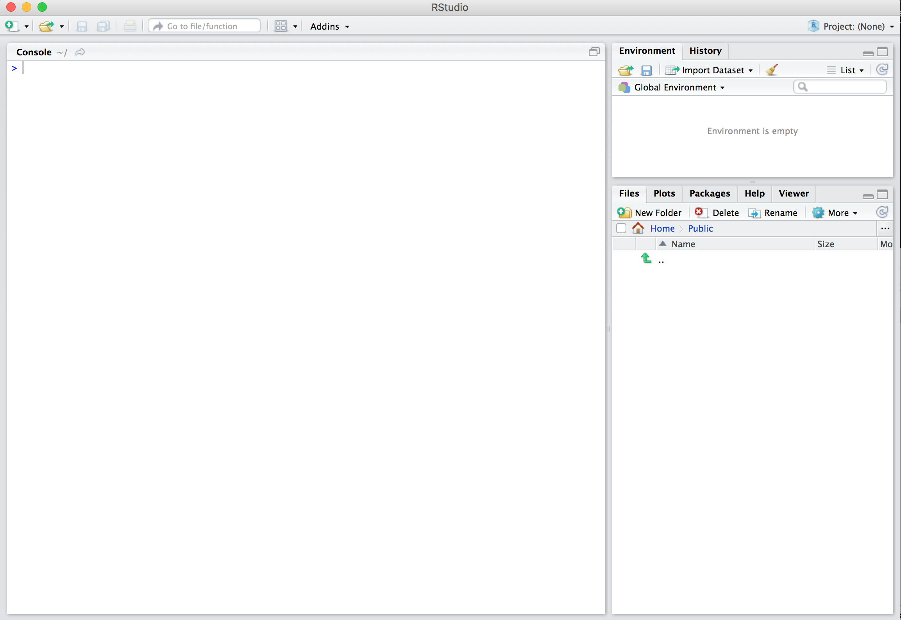{#fig-rstudio width=50%}
:::

## Installation von R und RStudio {#sec-install-r}


### Installation von R

R ist ein Softwarepaket für statistische Berechnungen.
Laden Sie es für Ihr Betriebssytem herunter unter <https://cloud.r-project.org>.
Wenn Sie beim Herunterladen gefragt werden, dass Sie einen “Mirror” auswählen sollen, 
heißt das, Sie sollen einen Computer (Server) wählen, von dem Sie R herunterladen. 
Der sollte möglichst nicht zu weit weg stehen, dann spart es vielleicht etwas Zeit und Bandbreite.
Wenn Sie die Installationsdatei heruntergeladen haben, öffnen Sie diese Datei (Doppelklick) 
und Sie werden durch die Installation geführt. (Sie benötigen Admin-Rechte auf Ihrem Computer.)


::: {.content-visible when-format="html"}

- [Windows](https://cloud.r-project.org/bin/windows/base/)
- [MacOS](https://cloud.r-project.org/bin/macosx/)
- [Linux](https://cloud.r-project.org/bin/linux/)

:::


### Installation von RStudio Desktop

RStudio ist eine *graphische Benutzeroberfläche* (graphical user interface, GUI) für R, 
plus ein paar Goodies (in Form einer *intergrierten Entwicklungsumgebung* (integrated development environment, IDE).
Laden Sie die *Desktop-Version* von RStudio herunter für Ihr Betriebssystem (Windows, MacOS, Linux) 
vom Anbieter (Posit) herunter.^[<https://posit.co/download/rstudio-desktop/>]
Wenn Sie die Installationsdatei heruntergeladen haben, 
öffnen Sie diese Datei (Doppelklick) und Sie werden durch die Installation geführt. 
(Sie benötigen u. U. Admin-Rechte auf Ihrem Computer.)


### Posit/RStudio Cloud


Posit Cloud bzw. RStudio Cloud (<https://rstudio.cloud/>) ist ein Webdienst von Posit (zum Teil kostenlos), also ein *RStudio online*:
Man kann damit online mit R arbeiten.
Sie können es als Alternative zur Installation von RStudio Desktop (was auf Ihrem Computer läuft) verwenden.
Ein Vorteil von RStudio Cloud ist, dass man als Nutzer *nichts installieren* muss und dass es *auch auf Tablets* läuft (im Gegensatz zur Desktop-Version von RStudio).
Ein Nachteil ist, dass es etwas langsamer ist und nur für ein gewisses Zeitvolumen kostenlos. Sie müssen sich erst ein Konto beim Anbieter anlegen, um den Dienst nutzen zu können.

::: {.content-visible when-format="html"}
Die Oberfläche RStudio Cloud ist praktisch identisch zur 
Desktop-Version, s. @fig-rstudio-cloud.

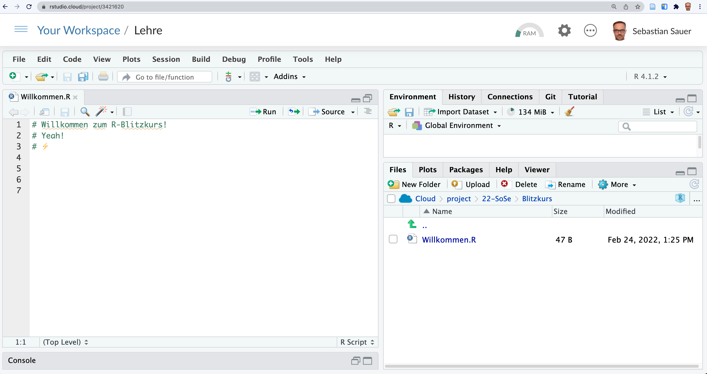{#fig-rstudio-cloud width=75%}
:::


Wenn Ihnen jemand (z.$\,$B. eine Lehrkraft)  einen RStudio-Cloud-Projektordner bzw. einen Link dazu bereitstellt,
ist das komfortabel, da die Lehrkraft dann schon Pakete installieren, Daten bereitstellen und
andere Nettigkeit vorbereiten kann für Sie.
Allerdings müssen Sie den Projektordner in Ihrem eigenen Konto abspeichern, 
wenn Sie etwas speichern möchten,
da Sie vermutlich keine Schreibrechte im Projektordner dieser nettern Person (Ihrer Lehrkraft) haben.
Klicken Sie dazu auf "Save a permanent copy", s. @fig-perm-copy.


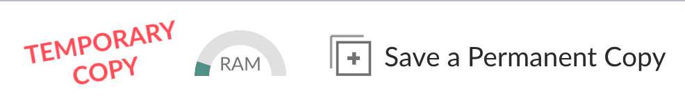{#fig-perm-copy}


Sie können auch von der Cloud exportieren, also Ihre Syntaxdatei herunterladen.
Klicken Sie dazu im Reiter "Files" auf `More > Export`.


:::{.callout-note}

RStudio starten, nicht R. $\square$
:::


 
Wir verwenden beide Programme (R und RStudio). 
Aber wir *öffnen nur* RStudio. 
RStudio findet selbständig R und öffnet dieses "heimlich".
Öffnen Sie nicht noch extra R (sonst wäre R zweifach geöffnet).
Anstelle von *RStudio Desktop* (auf Ihrem Computer/Desktop) können Sie auch die *RStudio Cloud* (die Online-Version) starten

## R-Pakete {#sec-r-pckgs}


Typisch für R ist sein modularer Aufbau: 
Man kann eine große Zahl an Erweiterungen ("Pakete", engl. *packages*) installieren, alle kostenlos.
In R Paketen "wohnen" R-Befehle, also Dinge, die R kann, "Skills" sozusagen.
Außerdem können in R-Paketen auch Daten bereitgestellt werden.
Damit man die Inhalte eines R-Pakets nutzen kann, muss man es zuerst installieren und dann verfügbar machen ("starten").
Man kann sich daher ein R-Paket vorstellen wie ein Buch:
Wenn R es gelesen hat, dann kennt es die Inhalte.
Diese Inhalte könnten irgendwelche Formeln, also Berechnungen sein.
Es könnte aber die "Bauanleitung" für ein schönes Diagramm sein.
Ist ein spezielles R-Paket auf Ihrem Computer installiert,
so können Sie diese Funktionalität nutzen.
Die Anzahl der R-Pakete ist groß; allein auf dem "offiziellen Web-Store" (nennt sich "CRAN") von R 
gibt es ca. 20,000 Pakete [@RJ-2023-4-cran]. Und es kommen immer mehr dazu.


::: {.content-visible when-format="html"}
*Erweiterungen* kennt man von vielen Programmen, sie werden auch *Add-Ons*, *Plug-Ins* oder sonstwie genannt.
Man siehe zur Verdeutlichung Erweiterungen beim Broswer Chrome, @fig-chrome.

{#fig-chrome width="50%"}
:::


Wie jede Software muss man Pakete (Erweiterungen für R) erst einmal installieren,
bevor man sie verwenden kann.
Übrigens, *einmal* installieren reicht.
Das Installieren geht komfortabel, wenn man beim Reiter *Packages* auf *Install* klickt und dann den Namen des zu installierenden Pakets eingibt.


::: {.content-visible when-format="html"}

@fig-so-installieren verdeutlicht, wo Sie in RStudio klicken müssen, um Pakete zu installieren.

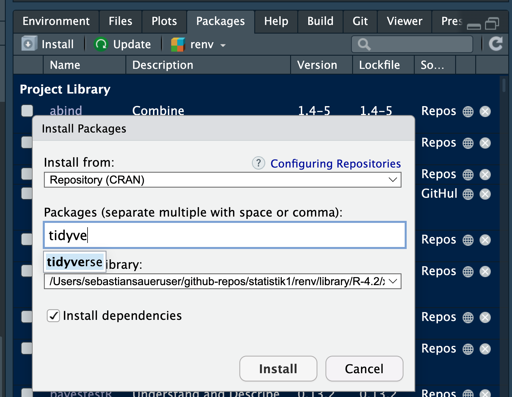{#fig-so-installieren width="75%"}


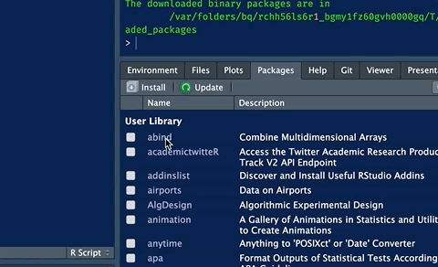{#fig-so-installieren width="75%"}
:::


>   [🧑‍🎓]{.content-visible when-format="html"}[\emoji{student}]{.content-visible when-format="pdf"} Welche R-Pakete sind denn schon installiert?


>   [🧑‍🏫]{.content-visible when-format="html"}[\emoji{teacher}]{.content-visible when-format="pdf"} Im Reiter *Packages* können Sie nachschauen, welche Pakete 
auf Ihrem Computer schon installiert sind.


::: {.content-visible when-format="html"}
Diese Pakete brauchen Sie logischerweise dann *nicht* noch mal installieren, s. @fig-paket-installiert; es sei denn, Sie wollen das Paket updaten.

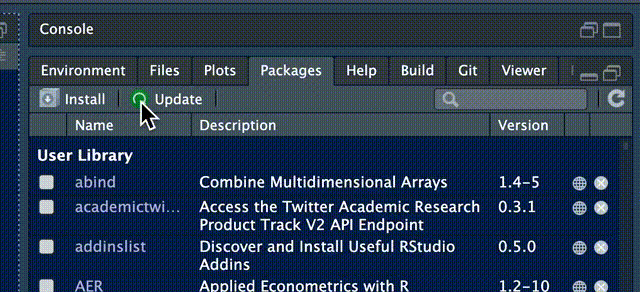{#fig-paket-installiert}
:::


Alternativ können Sie zum Installieren von Paketen auch den Befehl `install.packages()` verwenden. Also zum Beispiel `install.packages(tidyverse)`, um das Paket `tidyverse` zu installieren.


>    [🧑‍🎓]{.content-visible when-format="html"}[\emoji{student}]{.content-visible when-format="pdf"} Ja, aber welche R-Pakete "soll" ich denn installieren, welche brauche ich denn?

>   >    [🧑‍🏫]{.content-visible when-format="html"}[\emoji{teacher}]{.content-visible when-format="pdf"} Im Moment sollten Sie die folgenden Pakete installiert haben: `tidyverse` und `easystats`.


Wenn Sie die noch nicht installiert haben sollten,
dann können Sie das jetzt nachholen. 
Übrigens sind `tidyverse` [@wickham2019a] und `easystats` [@ludecke2022] Pakete, 
die nur dafür da sind, mehrere Pakete zu installieren. 
So gehören z.$\,$B. zu `tidyverse` die Pakete `ggplot` (Daten verbildlichen) und `dplyr` (Datenjudo). 
Damit wir nicht alle Pakete einzeln installieren und starten müssen,
bietet uns das Paket `tidyverse` den Komfort, 
alle die Pakete dieser "Sammlung" auf einmal zu starten. Praktisch.


Bevor Sie ein R-Paket (oder überhaupt irgendwelche Software) installieren/updaten,
sollten Sie das entsprechende R-Paket schließen/beenden.
Sonst schrauben Sie sozusagen an einem elektrischen Gerät herum, 
das noch unter Strom steht (nicht gut).
Die einfachste Art, alle Pakete zu beenden ist, `Session > Restart R` zu klicken  (in RStudio).


Wenn Sie ein Softwareprogramm installiert haben,
müssen Sie es noch *starten*, bevor Sie es nutzen können.
Sie erkennen leicht, ob ein Paket bereitgestellt (gestartet) ist, 
wenn Sie ein Häkchen vor dem
Namen des Pakets in der Paketliste (Reiter *Packages*) sehen.
Ein bestimmtes R-Paket muss man nur *einmalig installieren*.
Aber man muss es *jedes Mal neu starten*, 
wenn man R (bzw. RStudio) startet. 

::: {.content-visible when-format="html" unless-format="epub"}
[Dieses Video](https://www.youtube.com/watch?v=Yej9xzKQ3yI&list=PLRR4REmBgpIEaIyeNBgNGPgmhQJ_T1y8_&index=26)
verdeutlicht den Unterschied zwischen *Installation* und *Starten* eines R-Pakets.
:::


## Mit R arbeiten

### Projekte in R


Ein *Projekt* in RStudio ist letztlich ein Ordner, 
der als "Basis" für eine Reihe von zusammengehörigen Dateien verwendet wird.
Sagen wir, Sie nennen Ihr Projekt `cool_stuff`. 
RStudio legt uns diesen Ordner an einem von uns gewählten Platz auf unserem Computer an.
Das ist ganz praktisch, weil man dann sagen kann "Hey R, nimm die Datei 'daten.csv'", 
ohne, dass man dabei einen Pfad angeben müsste.
Vorausgesetzt, die Datei liegt auch im Projektordner (`cool_stuff`).
RStudio-Projekte kann anlegen mit Klick auf das Icon, das einen Quader mit dem Buchstaben R darin anzeigen.
Nutzen Sie RStudio-Projekte, das macht Ihr Leben leichter.
RStudio-Projekte zu nutzen ist  praktischer als das Arbeitsverzeichnis von Hand zu wählen oder mit Pfaden herumzubasteln.


::: {.content-visible when-format="html"}
Hier sehen Sie Beispiele für RStudio-Projekte, s. @fig-rstudio-projekte.

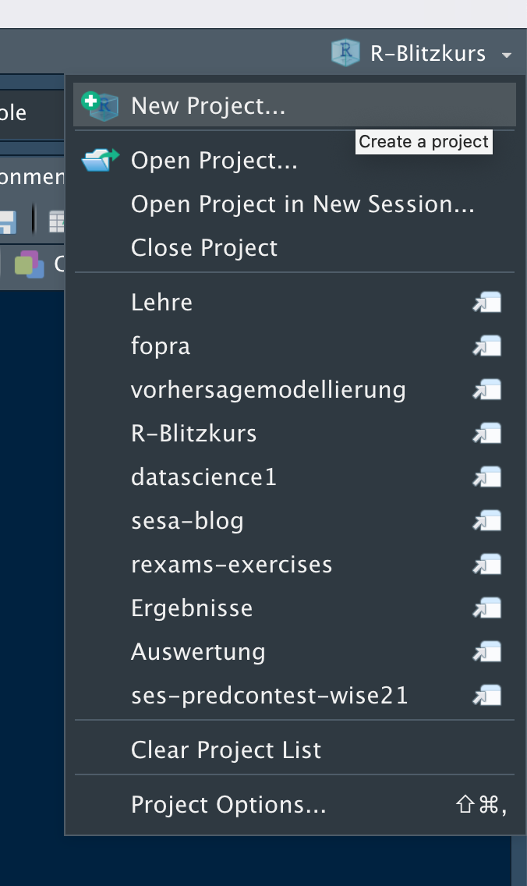{#fig-rstudio-projekte width="50%"}
:::


### Skriptdateien

Die R-Befehle ("Syntax") schreiben Sie am besten in eine speziell dafür 
vorgesehene Textdatei in RStudio.
Eine Sammlung von (R-)Computer-Befehlen nennt man auch ein *Skript*,
daher spricht man bei Dateien, die Syntax enthalten, von einer *Skriptdatei*.


Um eine neue R-Skriptdatei zu erstellen, gibt es mehrere Wege.
Einer ist: klicken Sie auf das Icon,
das ein weißes Blatt mit einem grünen Pluszeichen zeigt, s.
@fig-script-new.


:::{#fig-script-new layout="[ 50, -5, 50 ]"}

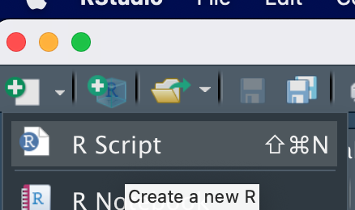{#fig-script-new1 width="50%"}

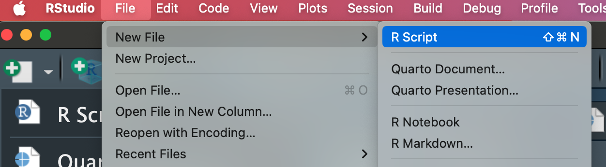{#fig-script-new2}


Es gibt verschiedene Wege, um eine neue R-Skript-Datei in RStudio zu öffnen. (a) Per Klick auf das Icon. (b) Im Menü `File`, auf `R Script` klicken.
:::


Vergessen Sie nicht zu *speichern*,
wenn Sie ein tolles Skript geschrieben haben.
Dafür gibt es mehrere Möglichkeiten:

1. Tastaturkürzel *Strg+S*
2. Menü: `File > Save`
3. Klick auf das Icon mit der Diskette, s. @fig-script-new.


Eine existierende Skriptdatei können Sie in typischer Manier *öffnen*:

1. Tastaturkürzel *Strg+O*
2. Menü: `File > Open File …`
3. Klick auf das Icon mit der Akte und dem grünen Pfeil, s.  @fig-script-new


### Quarto-Dokumente

[Quarto](https://quarto.org/)^[<https://quarto.org/>] ist ein (kostenloses) Programm zum Erstellen von PDF-, HTML- oder anderen Dokumentformaten, 
in die man R-Syntax einfügen kann. 
Die Ausgaben der R-Befehle werden dann direkt ins Ausgabedokument eingebunden. 
Quarto ist in RStudio integriert.
Quarto ist eine komfortable und leistungsfähige Methode, um Dokumente mit R-Syntax zu anzreichern. 
Sie sind aber nicht verpflichtet, Quarto zu nutzen. Stattdessen können Sie Ihre Syntax auch in Skriptdateien schreiben. 


::: {.content-visible when-format="html"}
@fig-quarto zeit ein Beispiel für ein Quarto-Dokument.

{#fig-quarto}
:::

Wenn Sie Quarto nutzen möchten, müssen Sie es zunächst installieren, d.$\,$h. herunterladen. 
Dann können Sie in RStudio Quarto-Dateien erstellen.
Ein neues Quarto-Dokument können Sie erstellen mit Klick auf *File > New File > Quarto Document*.

::: {.content-visible when-format="html" unless-format="epub"}

:::


## Errisch für Einsteiger


### Variablen {#sec-rvars}

In jeder Programmiersprache kann man Variablen definieren,
so auch in R:


```{r echo = TRUE}
richtige_antwort = 42
falsche_antwort = 43
typ = "Antwort"
ist_korrekt = TRUE  # wahr
ist_falsch = FALSE  # falsch
```


Alternativ zum Gleichheitszeichen `=` können Sie auch (synonym) den Zuweisungspfeil `<-` verwenden (Kleiner-Als-Zeichen gefolgt vom Minus-Zeichen).
Beides führt zum gleichen Ergebnis. 
Allerdings ist der Zuweisungspfeil präziser, 
und sollte daher bevorzugt werden.
Der Zuweisungspfeil `<-` bzw. das Gleichheitszeichen `=` definiert eine neue Variable (oder überschreibt den Inhalt,
wenn die Variable schon existiert).

<!-- Dieses Video <https://www.youtube.com/watch?v=TKQk-tEF9YQ&list=PLRR4REmBgpIEaIyeNBgNGPgmhQJ_T1y8_&index=28> und dieses Video <https://www.youtube.com/watch?v=Nal0m_AmMwg&list=PLRR4REmBgpIEaIyeNBgNGPgmhQJ_T1y8_&index=48> geben eine Einführung in das Definieren von Variablen in R -->


```{r echo = TRUE}
richtige_antwort <- 42
```


Sie können sich eine Variable wie einen Becher oder Behälter vorstellen,
der bestimmte Werte enthält, z.$\,$B. den Wert "9" (für 9$\,$° Celsius.
Auf dem Becher steht die Bezeichnung des Bechers geschrieben, z.$\,$B. "Temperatur".
Natürlich können Sie die Werte aus dem Becher entfernen und sie
durch neue ersetzen (vgl. @fig-def-vars).


{#fig-def-vars width="25%"}


R kann übrigens auch rechnen.
Probieren Sie es doch gleich mal hier aus!


```{r echo = TRUE}
die_summe <- falsche_antwort + richtige_antwort
```


Aber was ist jetzt der Wert, der "Inhalt" der Variable `die_summe`? 

Um den Wert, d.$\,$h. den Inhalt einer Variablen in R *auszulesen*, 
geben wir einfach den Namen des Objekts ein:

```{r echo = TRUE}
die_summe
```


Was passiert wohl, wenn wir `die_summe` jetzt wie folgt definieren?

```{r echo = TRUE}
die_summe <- falsche_antwort + richtige_antwort + 1
```


Wer hätt's geahnt:

```{r echo = TRUE}
die_summe
```


Variablen können auch "leer" sein:

```{r}
alter <- NA  # NA wie "not available", nicht vorhanden
alter
```

`NA` steht für *not available*, nicht verfügbar und macht deutlich, dass hier ein Wert fehlt.

>   [🧑‍🎓]{.content-visible when-format="html"}[\emoji{student}]{.content-visible when-format="pdf"} Wozu brauche ich bitte fehlende Werte?!

Fehlende Werte sind ein häufiges Problem in der Praxis.
Vielleicht hat sich die befragte Person geweigert, ihr Alter anzugeben (Datenschutz!). Oder als Sie die Daten in Ihren Computer eingeben wollten, ist Ihre Katze über die Tastatur gelaufen und alles war futsch...


### Funktionen ("Befehle")

Das, was R kann, ist in "Funktionen" hinterlegt. 
Genauer gesagt ist ein "Befehl" an R eine Funktion.

:::{#def-fun}
### Funktion
Eine Funktion ist eine Regel, die jedem Eingabewert (auch Argument genannt) einen Ausgabewert zuordnet. Man kann sich Funktionen als Maschinen vorstellen, die Eingabedaten in Ausgabedaten umwandeln, vgl. @fig-function-schema. $\square$
:::


Ein Beispiel für eine solche Funktion könnte sein: 
"Berechne den Mittelwert dieser Datenreihe" (schauen wir uns gleich an). 
Das geht so:

```{r echo = TRUE}
Antworten <- c(42, 43)
```


Der Befehl `c` (c wie *c*ombine) fügt mehrere Werte zusammen zu einer "Liste" (einem Vektor). 
(Streng genommen sollte man nicht von einer Liste sprechen, 
da es in R noch einen anderen Objekttyp gibt, der `list` heißt, 
und eine verallgemeinerte Form eines Vektors ist.)
Mit dem Zuweisungspfeil geben wir diesem Vektor einen Namen, hier `Antworten`. 
Dieser Vektor besteht aus zwei Werten, zuerst `42`, dann kommt `43`.
Zwei wichtige Typen von Vektoren sind numerische Vektoren (reelle Zahlen; in R auch als *numeric* oder *double* bezeichnet)
und Textvektoren, in R auch als *String* oder *character* bezeichnet.

:::{#def-vektor}
### Vektor
Als *Vektor* (Datenreihe) bezeichnen wir eine geordnete Folge von Werten.
In R kann man sie mit der Funktion `c` erstellen.
Die Werte eines Vektors bezeichnet man als *Elemente*. $\square$
:::

:::{#exm-vektoren}

#### Beispiele für Vektoren

Vektoren können (praktisch) beliebig lang sein, z.$\,$B. drei Elemente.

```{r}
x <- c(1, 2, 3)
y <- c(2, 1, 3)  # x und y sind ungleich (Reihenfolge der Werte)
z <- c(3.14, 2.71)  
namen <- c("Anni", "Bert", "Charlie") # Text-Vektor
```

:::


:::{#exm-funs}
Weitere Beispiel für Funktionen sind:

- "Erstelle eine Liste (Vektor) von Werten".
- "Lade dieses R-Paket."
- "Gib den größten Wert dieser Datenreihe aus." $\square$
:::


### Unsere erste statistische Funktion {#sec-first-fun}


Jetzt wird's ernst. 
Jetzt kommt die Statistik. [🧟]{.content-visible when-format="html"} 
Berechnen wir also unsere erste statistische Funktion:
Den Mittelwert. Puh.


```{r echo = TRUE}
mean(Antworten)
```

Sie hätten `Antworten` auch durch `c(42, 43)` ersetzen können,
so haben Sie ja die Variable `Antworten` im letzten Abschnitt definiert.

R arbeitet so einen "verschachtelten" Befehl *von innen nach außen* ab:


Start: `mean(Antworten)`

[⬇️]{.content-visible when-format="html"}
[$\downarrow$]{.content-visible when-format="pdf"}

Schritt 1: `mean(c(42, 43))`

[⬇️]{.content-visible when-format="html"}
[$\downarrow$]{.content-visible when-format="pdf"}

Schritt 2: `42.5`


```{r}
#| echo: false
#| eval: false
library(magick)
img_path <- "img/function-schema.pdf"
p <- image_read_pdf(img_path)
p_trimmed <- image_trim(p)
image_write(p_trimmed, "img/function-schema.png")
```

@fig-function-schema stellt eine Funktion schematisch dar.

::: {.content-visible when-format="html"}

{#fig-function-schema width="50%"}
:::

::: {.content-visible when-format="pdf"}

{#fig-function-schema width="75%"}
:::


Eine Funktion hat einen oder mehrere *Eingaben* (Argumente, Inputs; s. @fig-function-schema),
das sind Daten oder Verarbeitungshinweise, die man in die Funktion `fun` *eingibt*, bevor die Funktion loslegt.
Eine Funktion hat immer (genau) eine *Ausgabe* (Output),
in der das Ergebnis der Funktion ausgegeben wird.


So hat die Funktion `mean` z.$\,$B. folgende Argumente, s. @lst-mean.

:::{#lst-mean}


```{r}
#| eval: false
mean(x, trim = 0, na.rm = FALSE, ...)
```

Die Argumente der R-Funktion `mean`

:::


- `x`: das ist der Vektor, für den der Mittelwert berechnet werden soll
- `trim = 0`: Sollen die extremsten Werte von `x` lieber "abgeschnitten" werden, also nicht in die Berechnung des Mittelwerts einfließen?
- `na.rm = FALSE`: Wie soll mit fehlenden Werten `NA` umgegangen werden? Im Standard liefert `mean` (und viele andere arithmetische Funktionen in R) `NA` zurück. R schwenkt sozusagen die rote Fahne, um zu signalisieren: Achtung, Mensch, hier ist irgendwas nicht in Ordnung. Setzt man aber `na.rm = TRUE`, dann entfernt (remove, rm) R die fehlenden Werte und berechnet den Mittelwert, ohne weitere Hinweise zu den fehlenden Werten.
- `...` heißt "sonstiges Zeugs, das manchmal eine Rolle spielen könnte"; darum kümmern wir uns jetzt nicht.

Einige Argumente haben einen *Standardwert* bzw. eine *Voreinstellung* (engl. *default*).
So wird bei der Funktion `mean` im Standard nicht getrimmt (`trim = 0`) und fehlende Werte werden nicht entfernt (`na.rm = FALSE)`.


Wenn ein R-Befehl ein Argument mit Voreinstellung hat,
brauchen Sie dieses Argument *nicht* zu befüllen. 
In dem Fall wird auf den Wert der Voreinstellung zurückgegriffen.
Argumente ohne Voreinstellung 
-- wie `x` bei `mean` -- müssen Sie aber auf jeden Fall mit einem Wert befüllen. 
Man würde also `mean` zumeist so aufrufen: `mean(x)`.


Bei jedem R-Befehl haben die Argumente eine bestimmte Reihenfolge,
etwa bei `mean`: `mean(x, trim = 0, na.rm = FALSE, ...)`.
(Nur) wenn man die Argumente in ihrer vorgegebenen Reihenfolge anspricht,
muss man *nicht* den Namen des Arguments anführen:


::: {.content-visible when-format="html"}
✅  `mean(Antworten, 0, FALSE)` 
:::

::: {.content-visible when-format="pdf"}
\emoji{check-mark-button} `mean(Antworten, 0, FALSE)` 
:::

Hält man sich aber nicht an die vorgebene Reihenfolge,
so weiß R nicht, was zu tun ist und flüchtet sich in eine Fehlermeldung:


```{r}
#| error: true
#| 
mean(Antworten, FALSE, 0)  # FALSCH, DON'T DO IT 
```

Wenn man die Namen der Argumente anspricht, ist die Reihenfolge egal:

```{r}
#| eval: false
mean(na.rm = FALSE, x = Antworten)  # ok
mean(trim = 0, x = Antworten, na.rm = TRUE)  # ok
```

Übrigens: 
Leerzeichen sind R fast immer egal. 
Aus Gründen der Übersichtlichkeit sollte man aber Leerzeichen verwenden. 
In folgenden Fällen sind Leerzeichen nicht erlaubt: In *Operatoren* wie `<-` oder `<=` (und andere logische Operatoren, s. @tbl-lgl) und in *Variablennamen.*


### Vorsicht bei fehlenden Werten

Sagen wir, wir haben einen fehlenden Wert in unseren Daten:


```{r echo = TRUE}
Antworten <- c(42, 43, NA)
Antworten
```

Wenn wir jetzt den Mittelwert berechnen wollen,
quittiert R das mit einem schnöden `NA`.
`NA` steht für *not available*, ist also ein Hinweis, dass Werte fehlen.

```{r}
mean(Antworten)
```

R meint es gut mit Ihnen.^[[🤖]{.content-visible when-format="html"}[\emoji{robot}]{.content-visible when-format="pdf"} Naja, manchmal.] Stellen Sie sich vor, 
dass R Sie auf dieses Problem aufmerksam machen möchte: 

>   [🤖]{.content-visible when-format="html"}[\emoji{robot}]{.content-visible when-format="pdf"} Achtung, NAs, fehlende Werte, lieber Herr und Gebieter, du hast nicht mehr alle Latten am Zaun, will sagen, alle Daten im Vektor!

(Danke, R.)


Möchten Sie aber lieber R dieses Verhalten austreiben, so befüllen Sie das Argument `na.rm` mit dem Wert `TRUE` (`na.rm` steht für *r*e*m*ove die NA, entferne die fehlenden Werte).

```{r}
mean(Antworten, na.rm = TRUE)
```


### Vektorielles Rechnen {#sec-veccalc}

:::{#def-veccalc}
### Vektorielles Rechnen
Das Rechnen mit Vektoren in R bezeichnen wir als *vektorielles Rechnen*. $\square$
:::

Vektorielles Rechnen ist ein praktische Angelegenheit,
man kann z.$\,$B. folgende Dinge einfach in R ausrechnen.
Gegeben sei `x` als Vektor `(1, 2, 3)`. Dann können wir die Differenz (Abweichung) jedes Elements von `x` zum Mittelwert von `x` komfortabel so ausrechnen:

```{r}
#| echo: false
x <- c(1, 2, 3)
```


```{r}
x - mean(x)
```


Etwas eleganter ausgedrückt: 
Wir haben die Funktion mit Namen "Differenz" ("Minus-Rechnen") auf jedes Element von `x` angewandt. 
Im Einzelnen haben wir also folgenden drei Differenzen berechnet:

```{r}
#| eval: false
1 - 2
2 - 2
3 - 2
```


Diese drei Rechenschritte sind symbolisch in @fig-vektoriell dargestellt.

```{r}
#| echo: false
#| label: fig-vektoriell
#| fig-cap: "Schema des vektoriellen Rechnens: Eine Funktion wird auf jedes Element eines Vektors angewandt. Hier: $1-2=-1; 2-2=0; 3-2=1$"
#| fig-asp: 0.5
#| out-width: "50%"
d_x <-
  tibble(x = x,
         id = 1:3)

ggplot(d_x) +
  aes(x = id, y = x) +
  geom_point(size = 3, alpha = .7, fill = "blue") +
  geom_hline(yintercept = 2) +
  geom_pointrange(aes(xmin = id, ymin = 2, ymax = x, xmax = id), linetype = "dashed") +
  theme_modern() +
  scale_x_continuous(breaks =1L:3L) +
  scale_y_continuous(breaks = c(1.0,2.0,3.0)) +
  theme_large_text()
```


### Ich brauche R-Hilfe! {#r-faq}

- *Wo finde ich Hilfe zu einer bestimmten Funktion, z.$\,$B. `fun`?* Geben Sie dazu folgenden R-Befehl ein: `help(fun)`. Alternativ geben Sie den Namen der Funktion in RStudio im Suchfeld beim Reiter `Help` ein. Oder Googeln.
- *Wenn ich ein R-Paket installiere, fragt mich R manchmal, ob ich auch Pakete installieren, will, die "kompiliert" werden müssen. Soll ich das machen?* Nein, das ist zumeist nicht nötig; geben Sie "no" ein.
- *In welchem Paket wohnt meine R-Funktion*? Suchen Sie nach der Funktion auf der Webseite *RDocumentation*^[<https://www.rdocumentation.org/>].
- *Ich weiß nicht, wie der R-Befehl funktioniert!* Vermutlich haben andere Ihr Problem auch, und meistens hat irgendwer das Problem schon gelöst. Am besten suchen Sie mal auf www.stackoverflow.com.
- *Ich muss mal grundlegend verstehen, wozu ein bestimmten R-Paket gut ist. Was tun?* Lesen Sie die Dokumenation ("Vignette") eines R-Pakets durch. Für das Paket `dplyr` bekommen Sie so einen Überblick über die verfügbaren Vignetten diese Pakets: `vignette(package = "dplyr")`. Dann suchen Sie sich aus der angezeigten Liste eine Vignette raus; mit `vignette("rowwise")` können Sie sich dann die gewünschte Vignette (z.$\,$B. `rowwise`) anzeigen lassen.
- *Oh nein, ich seh rot, das heißt, R zeigt mir irgendwas in roter Schrift an. Ist jetzt was kaputt?* Keine Sorge, R ist in seiner Ausgabe nicht sparsam mit roter Farbe. Solange es nicht als Fehlermeldung (`ERROR`) erscheint, ist es meist kein Problem.
- *R hat sich aufgehängt oder bringt einen Fehler an einer Stelle, wo sonst alles funktioniert hat.* Probieren Sie auf jeden Fall mal das AEG-Prinzip (Aus-Ein-Gut): Sprich, R neu starten.
- *Ich suche schon seit einer Stunde einen Fehler und finde ihn nicht. Ich habe schon verschiedene Gegenstände vor Wut an die Wand geworfen. Was soll ich tun?* Machen Sie eine Pause. Doch, das ist ernst gemeint. Meine Erfahrung: Mit etwas Abstand wird der Kopf klarer und man findet das Problem viel einfacher. (Und manchmal ist einem das Problem danach schlichtweg egal.)
- *Irgendwie reagiert R komisch, vielleicht hat es sich aufgehängt?* Starten Sie R neu. Klicken Sie auf *Session > Restart R*.
- *Ich muss mal klar Schiff machen und alle (oder einige) Variablen löschen. Wie werd ich das Zeug wieder los?* Beim Neustart von R werden alle Objekte (Variablen) gelöscht. Einzelne Objekte können Sie selektiv löschen mit dem Befehl `rm`, so löscht `rm(mariokart)` das Objekt namens `mariokart`. 


:::{.callout-caution}
R ist penibel: So sind `name` und `Name` zwei verschiedene Variablen für R. 
Groß- und Kleinschreibung wird von R streng beachtet.
:::


Eine gute Nachricht: Wenn R etwas von `WARNING` (bzw. Warnung) sagt, 
können Sie das zumeist ignorieren. 
Eine *Warnung* ist kein Fehler (`ERROR`) und meistens nicht gravierend oder nicht dringend. Ihre Syntax läuft trotzdem durch.
Im Zweifel ist Googeln eine gute Idee.
Nur wenn R von `Error` spricht, ist es auch ein Fehler und Ihre Syntax läuft nicht durch.


## Mit Daten arbeiten


### Wo sind meine Daten?

Damit Sie eine Datendatei importieren können, müssen Sie wissen, 
wo die Datei ist.
Schauen wir uns zwei Möglichkeiten an,
wo Ihre Datei liegen könnte.

1. Irgendwo im Internet
2. Irgendwo auf Ihrem Computer, z.$\,$B. in Ihrem R-Projektordner

In beiden Fällen wird der "Aufenthaltsort" der Datei durch den *Pfad*  und den Namen der Datei definiert.
Der Pfad einer Datei gibt an, 
in welchem Ordner und Unterordner (und Unter-Unterordner) die gesuchte Datei liegt. 
Ein Pfad könnte z.$\,$B. so aussehen: /Users/sebastiansaueruser/github-repos/statistik1/.

:::{.callout-note}
Wir werden in diesem Kurs häufiger mit dem Daten `mariokart` arbeiten;
Sie finden ihn [online](https://vincentarelbundock.github.io/Rdatasets/csv/openintro/mariokart.csv).^[Auf dieser Webseite <https://vincentarelbundock.github.io/Rdatasets/articles/data.html> finden Sie den Datensatz `mariokart` sowie eine große Zahl an weiteren Datensätzen. Nur für den Fall, dass Ihnen langweilig ist.]
:::


### Gebräuchliche Datenformate


Daten werden in verschiedenen Formaten im Computer abgespeichert;
Tabellen häufig als Excel-Datei (.XSL oder .XLSX) oder als CSV-Datei (.CSV).

In der Datenanalyse ist das gebräuchlichste Format für Daten in Tabellenform die CSV-Datei.
Der Grund ist die technische Einfachheit dieses Formats..
Für uns Endverbraucher tut das nichts groß zur Sache, 
die CSV-Datei beherbergt 
einfach eine brave Tabelle in einer Textdatei, sonst nichts.
Daher können Sie jede CSV-Datei mit einem normalen Texteditor öffnen.
In diesem Buch werden wir mit einem Datensatz namens `mariokart` arbeiten. 


::: {.content-visible when-format="html"}

Hallo Mario, s. @fig-mario!

{#fig-mario width="25%"}

 
:::


:::::{#exr-csv}

### CSV-Datei öffnen

::: {.content-visible when-format="pdf"}


Öffnen Sie die CSV-Datei `mariokart.csv` mit einem *Texteditor* (nicht mit Word und auch nicht mit Excel). Schauen Sie sich gut an, was Sie dort sehen und erklären Sie die Datenstruktur. 

**Lösung**

Eine CSV-Datei repräsentiert eine Datentabelle. Eine Spaltengrenze wird mittels eines Kommas dargestellt (man kann auch andere Zeichen wählen, um Spalten voneinander abzugrenzen).
:::


::: {.content-visible when-format="epub"}


Öffnen Sie die CSV-Datei `mariokart.csv` mit einem *Texteditor* (nicht mit Word und auch nicht mit Excel). Schauen Sie sich gut an, was Sie dort sehen und erklären Sie die Datenstruktur. 

**Lösung**

Eine CSV-Datei repräsentiert eine Datentabelle. Eine Spaltengrenze wird mittels eines Kommas dargestellt (man kann auch andere Zeichen wählen, um Spalten voneinander abzugrenzen).
:::


:::: {.content-visible when-format="html" unless-format="epub"}

:::{.panel-tabset}

### Aufgabe

Öffnen Sie die CSV-Datei `mariokart.csv` mit einem *Texteditor* (nicht mit Word und auch nicht mit Excel). Schauen Sie sich gut an, was Sie dort sehen und erklären Sie die Datenstruktur. 

### Lösung

Eine CSV-Datei repräsentiert eine Datentabelle. Eine Spaltengrenze wird mittels eines Kommas dargestellt (man kann auch andere Zeichen wählen, um Spalten voneinander abzugrenzen).


Hier sind die ersten paar Zeilen von `mariokart.csv`:

```
V1,id,duration,n_bids,cond,start_pr,ship_pr,total_pr,ship_sp,seller_rate,stock_photo,wheels,title
1,150377422259,3,20,new,0.99,4,51.55,standard,1580,yes,1,~~ Wii MARIO KART &amp; WHEEL ~ NINTENDO Wii ~ BRAND NEW ~~
2,260483376854,7,13,used,0.99,3.99,37.04,firstClass,365,yes,1,Mariokart Wii Nintendo with wheel - Mario Kart Nintendo
3,320432342985,3,16,new,0.99,3.5,45.5,firstClass,998,no,1,Mario Kart Wii (Wii)
4,280405224677,3,18,new,0.99,0,44,standard,7,yes,1,Brand New Mario Kart Wii Comes with Wheel. Free Ship
5,170392227765,1,20,new,0.01,0,71,media,820,yes,2,BRAND NEW NINTENDO 1 WII MARIO KART WITH 2 WHEELS +GAME
```
:::
::::
:::::


### Daten importieren {#sec-import-mariokart}

Sie können Daten aus verschiedenen Quellen in R importieren: Aus einem R-Paket, von einer Webseite oder von Ihrem Computer.
Dabei ist es egal, ob Sie die Desktop- oder die Cloud-Version von RStudio nutzen.

Ist Ihr Datensatz schon in einem R-Paket gespeichert,
können Sie ihn aus diesem R-Paket starten. 
Das ist die bequemste Option.
Zum Beispiel "wohnt" der Datensatz `mariokart` im 
R-Paket `openintro`.

:::callout-tip
Häufig wird vergessen, dass ein R-Paket vor der Nutzung installiert werden muss. 
:::


Auf der anderen Seite muss man ein R-Paket (wie andere Software auch)
nur *ein* Mal installieren -- 
Allerdings muss man ein Paket *nach jedem Neustart* von R bzw. von RStudio mit `library` starten.


```{r}
data("mariokart", package = "openintro") # Paket muss installiert sein
```


```{r}
#| echo: false
d <- mariokart
```


Eine Data-Dictionary für `mariokart` findet sich in @sec-data-dict.
[Online](https://vincentarelbundock.github.io/Rdatasets/doc/openintro/mariokart.html) findet sich eine Erklärung (Data-Dictionary) des Datensatzes.^[<https://vincentarelbundock.github.io/Rdatasets/doc/openintro/mariokart.html>]


Der Befehl `read.csv` bietet eine Möglichkeit, Daten (in Form einer Tabelle) von einer Webseite (URL) in R zu importieren, s. @lst-mariokart.

```{r}
#| eval: false
#| lst-label: lst-mariokart
#| lst-cap: "Mariokart-Datensatz importieren (mit `read.csv`)"
mariokart <- read.csv(paste0(
  "https://vincentarelbundock.github.io/Rdatasets/",
  "csv/openintro/mariokart.csv"))
```


Es liegt bei Ihnen,
welchen Namen Sie der Tabelle geben.
Ich persönlich wähle oft den Namen `d`, *d* die Daten. 
`d` ist ein kurzer Namen, 
muss man nicht so viel tippen.
Auf der anderen Seite ist `d` nicht gerade ein präziser Name.
Werfen Sie einen Blick in die Tabelle (engl. *to glimpse*).


```{r}
#| eval: !expr knitr:::is_html_output()
glimpse(d)
```


::: {.content-visible unless-format="pdf"}
Sie können Datendateien von verschiedenen Webseiten herunterladen, s. @fig-download-webseite.

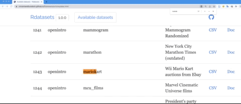{#fig-download-webseite}
:::


Sie können auch von Ihrem Computer aus Daten in RStudio importieren.
Gehen wir davon aus, dass sich die Datendatei im gleichen Ordner wie die R-Datei (`.R`- oder `.qmd`-Datei) befindet, 
in der Sie den Befehl zum Importieren schreiben.
Dann können Sie die Datei einfach so importieren:

```{r}
#| eval: false
d <- read.csv("mariokart.csv")
```


:::: {layout="[ 80, 20 ]"}
::: {#first-column}
[Dieses Video](https://youtu.be/B_nuN-M0pQM) erklärt die Schritte des Importierens einer Datendatei von Ihrem Computer.
:::

::: {#second-column}

```{r}
#| echo: false
#| out-width: "75%"
#| fig-align: center
qr <- qrcode::qr_code("https://youtu.be/B_nuN-M0pQM")
plot(qr)
```
:::
::::


<!-- #### Importieren von Ihrem Computer in RStudio Cloud -->

Das Importieren von Ihrem Computer zu RStudio Cloud ist identisch zum Importieren von Ihrem Computer in RStudio Desktop. 
Nur dass Sie die Datendatei vorab hochladen müssen, 
schließlich ist RStudio Cloud in der Cloud und nicht auf Ihrem Computer. 
Klicken Sie dazu auf das Icon `Upload` im Reiter `Files`, s. @fig-upload-to-posit-cloud.
Wählen Sie am besten den Ordner als Ziel, 
in dem sich auch die R-Datei, 
von der aus Sie den Befehl zum Daten importieren schreiben, befindet.

::: {.content-visible unless-format="html"}

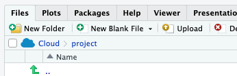{#fig-upload-to-posit-cloud width="50%"}
:::


::: {.content-visible when-format="html"}

{#fig-upload-to-posit-cloud width="50%"}
:::


Es gibt verschiedene Formate, in denen (Tabellen-)Dateien in einem Computer abgespeichert werden.
Die gebräuchlichsten sind CSV und XLSX.
Es gibt auch mehrere R-Befehle, um Daten in R zu importieren, z.$\,$B. `read.csv` oder `data_read`.
Praktischerweise kann der R-Befehl `data_read` viele verschiedene Formate automatisch einlesen, so dass wir uns nicht weiter um das Format kümmern brauchen.
Der Vorteil von `read.csv` ist, dass Sie kein Extra-Paket installiert bzw. gestartet haben müssen.


Die GUI (Benutzeroberfläche) von RStudio erlaubt es Ihnen auch, Daten per Klick, also ohne R-Befehle, zu importieren.
Sie können über diese Maske sowohl CSV-Dateien, Excel-Dateien (XLS, XLSX) oder Daten-Dateien aus anderen Statistik-Programmen (z.$\,$B. SPSS) importieren auf diese Weise.
Zur Erinnerung: CSV-Dateien sind Textdateien, klicken Sie in dem Fall also `From Text`. Ich empfehle dort die Variante `From Text (readr) …` zu wählen.
In der sich öffnenden Maske können Sie unter `Browse` die zu importierende Datendatei auswählen. Mit Klick auf `Import` wird die Datei schließlich in R importiert.

::: {.content-visible when-format="html"}
Man klicke hier, um Daten in RStudio zu importieren, @fig-daten-rstudio.

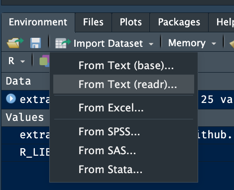{#fig-daten-rstudio width=50%}
:::


### Dataframes

Eine in R importierte Tabelle (mit bestimmten Eigenschaften) heißt *Dataframe*.
Dataframes sind in der Datenanalyse von großer Bedeutung.
@tbl-mariokart ist die Tabelle mit den Mariokart-Daten;
etwas präziser gesprochen ein Dataframe mit Namen `mariokart`.
Übrigens ist @tbl-mariokart in Normalform (Tidy-Format), vgl. @def-tidy.


:::{#def-dataframe}

### Dataframe

Ein Dataframe (engl. data frame; auch "Tibble" genannt; von "tbl" wie Table) ist ein Datenobjekt in R zur Darstellung von Tabellen.
Dataframes bestehen aus einer oder mehreren Spalten. Spalten haben einen Namen, sozusagen einen "Spaltenkopf". 
Alle Spalten müssen die gleiche Länge haben;
anschaulich gesprochen ist eine Tabelle (in R) rechteckig.
Jede Spalte einzeln betrachtet kann als Vektor aufgefasst werden. $\square$
:::


Geben Sie den Namen eines Dataframes ein,
um sich den Inhalt anzeigen zu lassen.
Beachten Sie, dass Sie die Daten auf diese Weise nur anschauen, nicht ändern können. 


```{r}
#| eval: false
#| echo: false
mariokart
```


<!-- ```{r} -->
<!-- #| tbl-cap: "Der Dataframe 'mariokart'" -->
<!-- #| label: tbl-mariokart -->
<!-- #| echo: false -->
<!-- mariokart |> gt() -->
<!-- ``` -->


### Tabellen in R betrachten {#sec-viewtab}

Wenn Sie in R z.$\,$B. die Tabelle `mariokart` in einer Excel-typischen Ansicht betrachten wollen, klicken Sie am besten auf das Tabellen-Icon im Reiter *Environment*, gleich neben dem Namen `mariokart`, s. @fig-view-mariokart.
Alternativ öffnet der Befehl `View(mariokart)` die gleiche Ansicht.


{#fig-view-mariokart width=50%}


## Logikprüfung {#sec-logic}


>   [🧑‍🎓]{.content-visible when-format="html"}[\emoji{student}]{.content-visible when-format="pdf"} Wer will schon wieder wen prüfen?!

In diesem Abschnitt schauen wir uns *Logikprüfungen* an: 
Wir lassen R prüfen, ob eine Variable einen bestimmten Wert hat oder größer/kleiner als ein Referenzwert ist.
Definieren wir zuerst eine Variable, `x`.

```{r}
x <- 42
```

Dann fragen wir R, ob diese Variable den Wert `42` hat.

```{r}
x == 42
```

>   [🤖]{.content-visible when-format="html"}[\emoji{robot}]{.content-visible when-format="pdf"} Hallo, Mensch. Ja, diese Variable hat den Wert 42.

Danke, R. Möchte man mit R prüfen, ob eine Variable `x` einen bestimmten `Wert` ("Inhalt") hat, so schreibt man: `x == Wert`.
Man beachte das *doppelte* Gleichheitszeichen. Zur Prüfung auf Gleichheit muss man das doppelte Gleichheitszeichen verwenden.


:::{.callout-caution}
Ein beliebter Fehler ist es, bei der Prüfung auf Gleichheit, nur ein Gleichheitszeichen zu verwenden, z.$\,$B. so: `x = 73`.
Mit einem Gleichheitszeichen prüft man aber *nicht* auf Gleichheit,
sondern man definiert die Variable oder bestimmt ein Funktionsargument, s. @sec-rvars. 
:::


@tbl-lgl gibt einen Überblick über wichtige Logikprüfungen in R. Um das Zeichen für das logische ODER, `|` auf einer Mac-Tastatur zu erhalten, drückt man *Option+7*. Bei Windows drückt man *Alt Gr + <*.

```{r}
#| echo: false
#| tbl-cap: "Logische Prüfungen in R"
#| label: tbl-lgl
lgl_df <- tibble::tribble(
                ~Prüfung.auf,                 ~`R-Syntax`,
                "Gleichheit",                 "x == Wert",
              "Ungleichheit",                 "x != Wert",
           "Größer als Wert",                  "x > Wert",
   "Größer oder gleich Wert",                 "x >= Wert",
          "Kleiner als Wert",                  "x < Wert",
  "Kleiner oder gleich Wert",                 "x <= Wert",
             "Logisches UND", "(x < Wert1) & (x > Wert2)",
            "Logisches ODER", "(x < Wert1) | (x > Wert2)"
  )

#lgl_df |> gt()
lgl_df
```


## Praxisbezug


>   [🧑‍🎓]{.content-visible when-format="html"}[\emoji{student}]{.content-visible when-format="pdf"} R in der Praxis wirklich genutzt? 
Oder ist R nur der Traum von (vielleicht verwirrten) Profs im Elfenbeinturm?

Schauen wir uns dazu die Suchanfragen bei [www.stackoverflow.com](www.stackoverflow.com) an,
dem größten FAQ-Forum für Software-Entwicklung.
Wir vergleichen Suchanfragen mit dem Tag `[r]` zu Suchanfragen mit dem Tag `[spss]` (SPSS ist eine an Hochschulen verbreitete Statistik-Software). 
Die Ergebnisse sind in Abbildung @fig-stackoverflow1 dargestellt.^[Die Daten wurden am 2022-02-24, 17:21 CET, abgerufen.]
Das ist grob gerechnet ein Faktor von 200 (der Unterschied von R zu SPSS). 
Dieses Ergebnis lässt darauf schließen, dass R in der Praxis viel mehr als SPSS gebraucht wird.


```{r stackoverflow}
#| label: fig-stackoverflow1
#| fig-cap: "Suchanfragen nach R bzw SPSS, Stand 2022-02-24"
#| echo: false
#| out-width: "75%"
d <- tibble(
  Anzahl = c(1923,438255),
  Tag = c("spss", "r")
)

ggplot(d) +
  aes(x = Tag, y = Anzahl) +
  geom_col() +
  theme_minimal() +
  geom_label(aes(y = Anzahl, label = Anzahl)) +
  theme_modern()
```


>   [🧑‍🎓]{.content-visible when-format="html"}[\emoji{student}]{.content-visible when-format="pdf"} Aber ist R wirklich ein Werkzeug, das mir im Job hilft? 

>    [🧑‍🏫]{.content-visible when-format="html"}[\emoji{teacher}]{.content-visible when-format="pdf"} Viele Firmen weltweit nutzen R zur Datenanalyse.^[wie diese Liste zeigt: <https://www.quora.com/Which-organizations-use-R?share=1> zeigt]

>    [👩‍🎓]{.content-visible when-format="html"}[\emoji{woman-student}]{.content-visible when-format="pdf"} R ist *der* Place-to-be für die Datenanalyse.


>   [🧑‍🎓]{.content-visible when-format="html"}[\emoji{student}]{.content-visible when-format="pdf"}  Aber ist Datenanalyse wirklich etwas, womit ich in Zukunft einen guten Job bekomme?


>    [🧑‍🏫]{.content-visible when-format="html"}[\emoji{teacher}]{.content-visible when-format="pdf"} Berufe mit Bezug zu Daten, Datenanalyse oder, allgemeiner, Künstlicher Intelligenz (artificial intelligence) gehören zu den stark wachsenden Berufen [@berger_jobs_2019.]


## Quiz


```{r exr-daten-einlesen}
#| include: false
exrs_einlesen <- 
list(
  "exs/Reproduzierbarkeit.Rmd",
  "exs/R_vs_RStudio.Rmd",
   "exs/Zuweisung_Operator.Rmd",
   "exs/NA_Bedeutung.Rmd",
   "exs/Vektor_Erstellung.Rmd",
   "exs/Mean_NA_Standard.Rmd",
    "exs/Funktionsargumente.Rmd",
   "exs/Logikprüfung_Gleichheit.Rmd",
    "exs/Definition_Dataframe.Rmd",
    "exs/Dollar_Operator.Rmd"
)
```


### Leicht

```{r quiz-kap3, echo = FALSE, message = FALSE, results = "asis"}
exams2forms(exrs_einlesen, box = TRUE, check = TRUE)
```


### Schwer

```{r exr-daten-einlesen2}
#| include: false
exrs_einlesen2 <- 
list(
    "exs/RStudio_GUI_View.Rmd",
    "exs/Verschachtelte_Funktionen.Rmd",
    "exs/Funktionsargumente_Defaults.Rmd",
     "exs/Vorteil_Skripte.Rmd",
     "exs/Logikprüfung_Anwendung.Rmd",
     "exs/Struktur_Dataframe.Rmd",
     "exs/NA_Handling_Transfer.Rmd",
     "exs/Datentypen_Coercion.Rmd",
     "exs/Vektorielles_Rechnen_Transfer.Rmd",
     "exs/Pfade_Reproduzierbarkeit.Rmd",
     "exs/NA_Philosophie.Rmd",
     "exs/Vektorisierung_Logik.Rmd"
)
```


```{r quiz-kap3a, echo = FALSE, message = FALSE, results = "asis"}
exams2forms(exrs_einlesen2, box = TRUE, check = TRUE)
```


## Aufgaben


:::{#exr-meme}
### Statistik-Meme
Suchen Sie ein schönes Meme zum Thema Statistik, Datenanalyse und Data Science. $\square$
:::

:::::{#exr-rquiz}
### R-Quiz


:::: {layout="[ 80, 20 ]"}
::: {#first-column}
Ihre R-Muskeln sind gestählt? [💪]{.content-visible when-format="html"} Oder noch nicht so ganz? [😤]{.content-visible when-format="html"} Macht nichts! Trainieren Sie sich mit dem R-Quiz auf der [Datenwerk-Webseite](https://sebastiansauer.github.io/Datenwerk/posts/r-quiz/r-quiz)! $\square$
:::

::: {#second-column}

```{r}
#| echo: false
#| out-width: "75%"
#| fig-align: center
qr <- qrcode::qr_code("https://sebastiansauer.github.io/Datenwerk/posts/r-quiz/r-quiz")

plot(qr)
```
:::
::::
:::::


Die Webseite [Statistik1 - Aufgabensammlung](https://sebastiansauer.github.io/statistik1-aufgabensammlung/) stellt eine Reihe von einschlägigen Übungsaufgaben bereit. 
Suchen Sie dort im entsprechenden Kapitel.


Noch nicht genug? Checken Sie alle Aufgaben mit dem Tag [R](https://sebastiansauer.github.io/Datenwerk/#category=R) auf dem Datenwerk aus.^[<https://sebastiansauer.github.io/Datenwerk/#category=R>] 

:::{.callout-note}
Die Webseite [Datenwerk](https://sebastiansauer.github.io/Datenwerk/) stellt eine Reihe von Aufgaben zum Thema Statistik bereit. $\square$
:::

Jeder Aufgabe sind im Datenwerk ein oder mehrere Schlagwörter (Tags) zugeordnet. 
Wenn Sie auf ein Schlagwort klicken, sehen Sie die Liste der Aufgaben mit diesem Schlagwort. 
Es kann aber sein, dass Sie einige Aufgabe nicht lösen können, 
da Wissen vorausgesetzt wird, das Sie (noch) nicht haben. 
Lassen Sie sich davon nicht ins Boxhorn jagen. 
Ignorieren Sie solche Aufgaben fürs Erste. 


## Vertiefung


### Alternativen zu `read.csv`

Eine weitere Möglichkeit, um Daten von einem Ordner 
(egal ob dieser sich im Internet oder auf Ihrem Computer befindet) einzulesen, 
stellt die Funktion `data_read` bereit:

::: {.content-visible when-format="html"}
```{r}
#| eval: false
library(easystats)  # Das Paket muss installiert sein
d <- data_read("https://vincentarelbundock.github.io/Rdatasets/csv/openintro/mariokart.csv")
```
:::


::: {.content-visible when-format="pdf"}
```{r}
#| eval: false
library(easystats)  # Das Paket muss installiert sein
d <- data_read(paste0(
  "https://vincentarelbundock.github.io/Rdatasets/",
  "csv/openintro/mariokart.csv"))
```
:::

Der Unterschied ist, dass `data_read` eine Vielzahl an Formaten von Daten (XLSX, CSV, SPSS, …) verkraftet, wohingegen `read.csv` nur Standard-CSV einlesen kann.

Schauen wir uns die letzte R-Syntax im Detail an:


```

Hey R,
hol das "Buch" easystats aus der Bücherei und lies es
definiere als "d" die Tabelle,
die du unter der angegebenen URL findest.

```

In R gibt es oft viele Möglichkeiten, ein Ziel zu erreichen.
Zum Beispiel haben wir hier den Befehl `data_read` verwendet,
um Daten zu importieren.
Andere, gebräuchliche Befehle, die CSV-Dateien importieren, heißen `read.csv` (aus dem Standard-R, kein Extra-Paket nötig) und `read_csv` (aus dem Meta-Paket `tidyverse`).


### Importieren von Excel-Tabellen


Mit der Funktion `data_read` aus `{easystats}` kann man viele verschiedene Datenformate importieren, auch Excel-Tabellen (.xls, .xlsx).


Als Beispiel betrachten wir den Datensatz `extra` aus dem R-Paket `{pradadata}`^[<https://github.com/sebastiansauer/pradadata>]. 
In diesem Datensatz werden die Ergebnisse einer Umfrage zu den Korrelaten von Extraversion beschrieben. Details zu der zugrunde liegenden Studie finden Sie hier: 
<https://osf.io/4kgzh>.^[Ein Daten-Dictionary findet sich hier: <https://github.com/sebastiansauer/statistik1/raw/main/data/extra-dictionary.md>.]
Laden Sie die Excel-Datei herunter. Angenommen, Sie speichern die Excel-Datei in einem Unterordner namens `daten` Ihres aktuellen Projektordners.
Dann können Sie die Daten so importieren:

```{r}
library(easystats)
extra <- data_read("data/extra.xls")
```

::: {.content-visible when-format="html"}
 
:::


<!-- Wenn Sie allerdings "remote", also aus dem Internet,  -->
<!-- eine Excel-Datei importieren möchten,  -->
<!-- so können Sie das mit `import` aus dem R-Paket `{rio}` tun: -->

<!-- ::: {.content-visible when-format="html"} -->
<!-- ```{r} -->
<!-- library(rio) -->
<!-- extra_path <- "https://github.com/sebastiansauer/statistik1/raw/main/data/extra.xls" -->
<!-- extra <- import(extra_path) -->
<!-- ``` -->
<!-- ::: -->

<!-- ::: {.content-visible when-format="pdf"} -->
<!-- ```{r} -->
<!-- library(rio) -->
<!-- extra_path <- paste0( -->
<!--   "https://github.com/sebastiansauer/statistik1/", -->
<!--   "raw/main/data/extra.xls") -->
<!-- extra <- import(extra_path) -->
<!-- ``` -->
<!-- ::: -->


CSV-Dateien werden auf vielen Computern als eine Datei erkannt, 
die Excel öffnen kann und das auch tut, wenn man eine CSV-Datei doppelklickt. 
Dennoch ist das CSV-Format keine Datei im Excel-Format, 
sondern eine einfache Text-Datei, die auch mit jedem Text-Editor geöffnet und bearbeitet werden kann. 
Alternativ können Sie in RStudio auch Excel-Dateien *ohne* R-Code importieren.

### Der Dollar-Operator {#sec-dollar-op}

In @def-veccalc hatten wir Vektoren definiert.
Solche Vektoren fliegen sozusagen frei in Ihrem `Environment` herum (Schauen Sie mal dort nach!)
Die Spalten einer Tabelle sind aber auch Vektoren, nur eben nicht frei im `Environment`, sondern in eine Tabelle eingebunden.
Möchte man diese Vektoren direkt ansprechen, so kann man das mit dem sog. *Dollar-Operator* `$` tun.
Angenommen, Sie möchten sich die Verkaufspreise (`total_pr`) aus der Tabelle `mariokart` herausziehen, dann können Sie das mit dem Dollar-Operator tun:

```{r}
mariokart$total_pr |> head()  # nur die ersten paar Werte zeigen
```

Der Dollar-Operator trennt den Namen der Tabelle vom Namen der Spalte.
Natürlich können Sie mit dem resultierenden Vektor beliebig weiterarbeiten, 
etwa ihn in einem anderen Vektor speichern oder eine Funktion anwenden:

```{r}
verkaufspreise <- mariokart$total_pr
mean(verkaufspreise)
mean(mariokart$total_pr)  # synonym zur obigen Zeile
```


::: {.content-visible when-format="html"}
### R-Zertifikat bei LinkedIn
Sie können bei LinkedIn^[<https://www.linkedin.com/help/linkedin/answer/a510481>] (oder anderen Anbietern) ein Zertifikat erhalten, das Ihre R-Kenntnisse dokumentiert.
:::


### R-Funktionen verschachteln


Das Kombinieren von Funktionen kann kompliziert werden:

```{r}
#| lst-label: lst-schachtel
#| lst-cap: "Verschachtelte Funktionen"
x <- c(1, 2, 3)
sum(abs(mean(x)-x)) 
```

Die Funktion `abs(x)` gibt den (Absolut-)Betrag von `x` zurück (entfernt das Vorzeichen).

Verschachtelte Ausdrücke lesen sich von innen nach außen (und werden in dieser Reihenfolge abgearbeitet). 
Für unser Beispiel (@lst-schachtel):

1. Berechne den Mittelwert von `x`
2. Ziehe vom Mittelwert jeweils die Elemente von `x` ab
3. Nimm vom Ergebnis jeweils den Absolutwert
4. Summiere diese Werte


Kurz gesagt: Hier haben wir die mittlere Absolutabweichung der Elemente von `x` zum Mittelwert ausgerechnet.


### R und Friends updaten

Irgendwann werden wir mit unsere Version von R und RStudio veraltet sein.
Installieren Sie dann einfach die neue Version von R und RStudio wie oben beschrieben, s. @sec-install-r.

So updaten Sie Ihre R-Pakete: Klicken Sie im Reiter `Packages` (in RStudio) auf `Update`. 
Wenn die Anzahl der zu aktualisierenden Pakete groß ist, 
dann besser nicht alle auswählen, sondern nur ein paar. Dann die nächsten paar Pakete usw.
Denken Sie daran, dass Sie die Software (R, RStudio, R-Paket), 
die Sie updaten/installieren, nicht gerade laufen darf.


::: {.content-visible when-format="html"}
Ihre R-Pakete sollten aktuell sein. 
Klicken Sie beim Reiter *Packages* auf "Update", 
um Ihre R-Pakete zu aktualisieren.
Arnold Schwarzenegger rät, Ihre R-Pakete aktuell zu halten, 
s. @fig-arnie.

![R-Pakete sollten stets aktuell sein, so Arnold Schwarzenegger [@imgflip2024]](img/terminator.jpg){#fig-arnie width="50%"}
:::


### Benötigte Daten

Sie benötigen in den meisten Kapiteln dieses Buches den Datensatz `mariokart`, 
der entweder online^[ über diese Internetadresse: <https://vincentarelbundock.github.io/Rdatasets/csv/openintro/mariokart.csv>] oder über R-Paket `openintro` importiert werden kann.

Import via Download:

::: {.content-visible when-format="html"}
```{r import-mariokart-html}
mariokart <- read.csv("https://vincentarelbundock.github.io/Rdatasets/csv/openintro/mariokart.csv")
```
:::

::: {.content-visible when-format="pdf"}
```{r import-mariokart-pdf}
mariokart <- read.csv(paste0(
  "https://vincentarelbundock.github.io/Rdatasets/",
  "csv/openintro/mariokart.csv"))
```
:::


Import via R-Paket:

```{r}
#| eval: false
# Das Paket 'openintro' muss installiert sein:
data(mariokart, package = "openintro") 
```


## Literaturhinweise

"Warum R? Warum, R?" heißt ein Kapitel in @sauer_moderne_2019, das einiges zum Pro und Contra von R ausführt.
Kapitel 3 in derselben Quelle enthält Hinweise zum Starten von R. 
Kapitel 4 erläutert die Grundlagen von "Errisch". 
Kapitel 5 führt in die Datenstrukturen von R ein (etwas anspruchsvoller als in diesem Kapitel).
Alternativ bietet [Kapitel 1](https://moderndive.com/1-getting-started.html) von @ismay_statistical_2020 einen guten und  anwenderfreundlichen Überblick.
Das Buch hat auch den Vorteil, 
dass es komplett frei online verfügbar ist.
Vergleichbar dazu ist @cetinkaya-rundel_introduction_2021,
vielleicht einen Tick formaler; 
auf jeden Fall genau das richtige Niveau für Bachelor-Statistik in angewandten nicht-technischen Studiengängen.

<!-- Natürlich gibt es viele Online-Kurse zu R, die aber teilweise kostenplichtig sind^[Ein Beispiel ist der Kurs *Getting Started with RStudio*, <https://www.coursera.org/projects/getting-started-rstudio> (Kursdauer: 1 Stunde)]. -->


