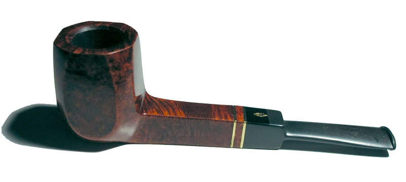

# Daten umformen

<!-- <style> -->
<!-- q { -->
<!--   quotes: '„' '“'; -->
<!-- } -->
<!-- </style> -->


```{r}
#| echo: false
#| message: false
library(ggpubr)
library(png)
library(grid)
library(patchwork)
library(gt)
library(tidyverse)
library(easystats)
library(exams2forms)
```


```{r}
#| echo: false

source("_common.R")
```





## Einstieg


### Lernziele


- Sie können folgende Verben des Datenjudo anwenden: `arrange`, `filter`,  `select`, `summarise`, `group_by`, `mutate`.
- Sie können R-Befehle mit der "Pfeife" verketten.


:::{#exr-los}
### Mariokart importieren

Importieren Sie den Datensatz `mariokart`, s. @sec-import-mariokart. 
Probieren Sie alle in diesem Kapitel vorgestellten Verben des Datenjudos aus,
zunächst, indem Sie einfach den R-Code kopieren und selber ausführen. Danach überlegen Sie sich Varianten. $\square$
:::


::: {.content-visible when-format="html"}
### R-Code zum Copy-Pasten

Sie finden den R-Code für jedes Kapitel [hier](https://github.com/sebastiansauer/statistik1/tree/main/R-code-for-all-chapters). $\square$
:::


### Frag den Bot


>   [🧑‍🎓]{.content-visible when-format="html"}[\emoji{student}]{.content-visible when-format="pdf"} Erkläre einem Fünfjährigen, warum Statistik nützlich ist.

>   [🤖]{.content-visible when-format="html"}[\emoji{robot}]{.content-visible when-format="pdf"}  Okay, hör zu. Stell dir vor, du hast viele Spielzeugautos und du willst herausfinden, welches Auto am meisten bespielt wird. Du kannst jeden Tag zählen, wie oft du jedes Auto benutzt hast. Aber das wäre sehr mühsam und könnte schnell durcheinander gebracht werden. Stattdessen kannst du mit Statistik eine einfachere Methode finden. Du kannst zum Beispiel eine Liste machen und jedes Auto mit einer bestimmten Farbe markieren. Dann kannst du jeden Tag einfach zählen, wie oft du jede Farbe verwendet hast. Am Ende kannst du herausfinden, welches Auto am meisten bespielt wurde, indem du siehst, welche Farbe am meisten verwendet wurde. Das ist ein Beispiel dafür, wie Statistik uns dabei helfen kann, Muster in großen Datensätzen zu finden und Entscheidungen zu treffen, ohne alles einzeln zu zählen.^[Quelle: ChatGTP 3.5, 2023-02-09]


::: {.content-visible when-format="html"}
### Quiz zum Einstieg

Vielleicht fordert Sie die Lehrkraft zu einem Einstiegsquiz auf, etwa mittels der Plattform [antworte.jetzt](https://antworte.jetzt/). 
Alternativ überlegen Sie sich selber 10 Quiz-Aufgaben zum Stoff des letzten Kapitels.
:::


:::{#def-datenjudo}
### Datenjudo
Mit *Datenjudo* meint man den Prozess der Aufbereitens, Umformens oder Zusammenfassen von Daten, sowohl für einzelne Beobachtungen (Zeilen einer Datentabelle) oder Variablen (Spalten einer Datentabelle) oder einer ganzen Datentabelle. $\square$
:::


:::{.exm-datenjudo1}

### Praxisbezug: Aus dem Alltag des Datenwissenschaftlers

Denkt man an Data Science, stellt man sich coole Leute vor 
(in San Francisco oder Berlin), 
die an abgefahrenen Berechnungen mit hoch komplexen statistischen Modellen 
für gigantische Datenmengen basteln.
Laut dem *Harvard Business Review*,
verbringen Data Scientisten allerdings "80$\,$%" ihrer Zeit mit dem *Aufbereiten* von Daten [@bowne-anderson_what_2018].
Ja: mit uncoolen Tätigkeiten wie Tippfehler aus Datensätzen entfernen 
oder die Daten überhaupt nutzbar und verständlich zu machen.

Das zeigt zumindest, dass das Aufbereiten von Daten a) wichtig ist und b) dass man allein damit schon weit kommen kann. 
Eine gute Nachricht ist (vielleicht),
dass das Aufbereiten von Daten keine aufwändige Mathematik verlangt,
stattdessen muss man ein paar Handgriffe und Kniffe kennen.
Daher passt der Begriff *Datenjudo* vielleicht ganz gut. 
Kümmern wir uns also um das Aufbereiten bzw. Umformen von Daten, um das Datenjudo. [🔢🤹]{.content-visible when-format="html"} $\square$

:::


:::{#exm-datenjudo}
### Beispiel für Datenjudo

Beispiele für typische Tätigkeiten des Datenjudos sind:

- Zeilen *filtern* (z.$\,$B. nur Studierenden des Studiengangs X)
- Zeilen *sortieren* (z.$\,$B. Studierenden mit guten Noten in den oberen Zeilen)
- Spalten *wählen* (z.$\,$B. 100 langweilige Spalten ausblenden) 
- Spalten in eine Zahl *zusammenfassen* (z.$\,$B. Notenschnitt der 1. Klausur)
- Tabelle *gruppieren* (z.$\,$B. Analyse getrennt nach Standorten)
- Werte aus einer Spalte *verändern* oder *neue Spalte* bilden (z.$\,$B. Punkte in Prozent-Richtige umrechnen).
- … $\square$
:::


### Mach's einfach

::: {.content-visible when-format="html"}
Klingt fast zu schön, um wahr zu sein (s. @fig-that-would-be-great).

![Mach's einfach [@imgflip_simply] ](img/thatwouldbegreat.jpg){#fig-that-would-be-great width="50%"}
:::

Es gibt einen (einfachen) Trick, wie man umfangreiche Datenaufbereitung elegant geregelt kriegt.
Der Trick besteht darin, komplexe Operationen in mehrere einfache Teilschritte zu zergliedern.
(In gewisser Weise besteht das Wesen einer Analyse eben darin: 
die Zerlegung eines Gegenstands in seine Bestandteile.)
Man könnte vom "Lego-Prinzip" sprechen, s. @fig-lego.
Im linken Teil von @fig-lego sieht man ein (recht) komplexes Gebilde.
Zerlegt man es aber in seine Einzelteile, so sind es deutlich einfachere geometrische Objekte wie Dreiecke oder Kreise (rechter Teil des Diagramms).
Damit Sie es selber einfach machen können, 
müssen Sie selber Hand anlegen.
Importieren Sie daher den Datensatz `mariokart`, s. @sec-import-mariokart.


![Das Lego-Prinzip [@sauer_moderne_2019]](img/Bausteine_dplyr_crop){#fig-lego width="75%"}


::: {.content-visible when-format="html"}

Werfen wir einen Blick hinein (to glimpse):

```{r}
#| eval: false
glimpse(mariokart)
```
:::


```{r}
#| echo: false
mariokart <- tibble::as_tibble(mariokart)
```


:::{#exm-datenjudo}
### Der Datenguru in Aktion
Sie arbeiten immer noch bei dem großen Online-Auktionshaus.
Mittlerweile haben Sie sich den Ruf des "Datenguru" erworben.
Vielleicht, weil Sie behauptet haben, Data Science sei zu 80% Datenjudo,
das hat irgendwie Eindruck geschindet …
Naja, jedenfalls müssen Sie jetzt mal zeigen, dass Sie nicht nur schlaue Sprüche draufhaben, 
sondern auch die Daten ordentlich abbürsten können.
Sie analysieren dafür im Folgenden den Datensatz `mariokart`. Na, dann los. $\square$
:::


## Die Verben des Datenjudos

Im R-Paket `dplyr`, das wiederum Teil des R-Pakets `tidyverse` ist,
gibt es eine Reihe von R-Befehlen,
die das Datenjudo in eine Handvoll einfacher Verben herunterbrechen. 
(Falls Sie das R-Paket `tidyverse` noch nicht installiert haben sollten, wäre jetzt ein guter Zeitpunkt dafür.)
Die wichtigsten Verben des Datenjudos schauen wir uns im Folgenden an.
Wir betrachten dazu im Folgenden einen einfachen (Spielzeug-)Datensatz,
an dem wir zunächst die Verben des Datenjudos vorstellen, s. @tbl-datenjudo.

```{r d-base}
#| echo: false
d <- 
tibble(id = c(1, 2, 3),
       name = c("Anni", "Berti", "Charli"),
       gruppe = c("A", "A", "B"),
       note = c(2.7, 2.7, 1.7))

ra <- png::readPNG("img/rightarrow.png", native = TRUE)

p_d1 <- ggtexttable(d, rows=NULL)
p_ra <- ggplot() + inset_element(ra, 0, 0, 1, 1)
```

```{r}
#| echo: false
#| tbl-cap: "Ein einfacher Datensatz von schlichtem Gemüt"
#| label: tbl-datenjudo
d |> knitr::kable()
```


Die Verben des Datenjudos wohnen im Paket `dplyr`,
welches gestartet wird, wenn Sie `library(tidyverse)` eingeben.
Falls Sie vergessen, das Paket `tidyverse` zu starten, 
dann funktionieren diese Befehle nicht.


<!-- :::{.callout-note} -->
<!-- Zur Erinnerung: In RStudio können Sie per Klick auf das kleine Tabellen-Icon im Bereich *Environment* die Tabellenansicht einer Tabelle öffnen, s. @sec-viewtab. $\square$ -->
<!-- ::: -->


### Tabelle sortieren: `arrange`

*Sortieren* der Zeilen ist eine einfache, aber häufige Tätigkeit des Datenjudos, s. @fig-arrange.

```{r plot-arrange}
#| echo: false
#| label: fig-arrange
#| fig-asp: .5
#| fig-cap: "Sinnbild für das Sortieren einer Tabelle mit `arrange`: Hier wurden die Noten aufsteigend sortiert."
d_arranged <-
  d %>% 
  arrange(note)

p_d_arranged <- ggtexttable(d_arranged, rows=NULL) 

p_d_arranged <-
  p_d_arranged %>% 
  table_cell_bg(column = 4, fill = okabeito_colors()[1], 
                row = 2:tab_nrow(p_d_arranged))

p_text <- grid::textGrob("arrange")

design <- 
  "
A#D
ABD
ACD
A#D
"

p_arrange <- wrap_plots(A = p_d1, 
                        B = p_text , 
                        C = p_ra, 
                        D = p_d_arranged, 
           widths = c(4,1,4),
           design = design) 
p_arrange +
  theme(plot.margin = margin(t = 5, r = 5, b = 5, l = 5, unit = "pt")) # Adjust top, right, bottom, and left margins


```


:::{#exm-arrange1}

### Was sind die höchsten Preise?

Sie wollen mal locker anfangen. Daher stellen Sie sich folgende Frage: 
Was sind denn eigentlich die höchsten Preise, 
für die das Spiel *Mariokart* über den Online-Ladentisch geht?
Die Spalte für den Verkaufsprei heißt offenbar `total_pr` (s. Datensatz `mariokart`).
In Excel kann die Spalte, nach der man die Tabelle sortieren möchte,
einfach anklicken. Ob das in R auch so einfach geht?


```{r}
#| echo: false
mariokart <-
  mariokart |> 
  select(-title)  # braucht zu viel Platz
```


::: {.content-visible when-format="html"}

Die Funktion `arrange` macht es uns ziemlich einfach, s. @tbl-arrange.

```{r}
#| tbl-cap: Die Datentabelle, (aufsteigend) sortiert nach `total_pr`
#| label: tbl-arrange
arrange(mariokart, total_pr)
```

:::

::: {.content-visible when-format="pdf"}

Die Funktion `arrange` macht es uns ziemlich einfach, s. @tbl-arrange-pdf.

```{r}
#| eval: false
arrange(mariokart, total_pr) 
```


```{r}
#| echo: false
#| tbl-cap: Die Datentabelle, sortiert nach `total_pr`
#| label: tbl-arrange-pdf
mariokart |> 
  select(total_pr, start_pr) |> 
  arrange(total_pr) |> 
  head()
```

:::

Übersetzen wir die R-Syntax ins Deutsche:

```
Hey R,
arrangiere (sortiere) `mariokart` 
nach der Spalte `total_pr` (aufsteigend).
```

Gar nicht so schwer. $\square$
:::


Übrigens wird in `arrange` per Voreinstellung aufsteigend sortiert.
Setzt man ein Minus vor der zu sortierenden Spalte,
wird umgekehrt, also *absteigend* sortiert:

```{r}
#| eval: false
mario_sortiert <- arrange(mariokart, -total_pr)
```


:::{#exr-arrange2}
Sortieren Sie die Mariokart-Daten absteigend nach der Anzahl der beigelegten Lenkräder. $\square$
:::

### Zeilen filtern: `filter`


Zeilen *filtern* bedeutet, dass man nur *bestimmte* *Zeilen* (Beobachtungen) *behalten* möchte, 
die restlichen Zeilen brauchen wir nicht, weg mit ihnen.
Wir haben also ein Filterkriterium im Kopf,
anhand dessen wir die Tabelle filern, s. @fig-filter.


```{r plot-filter}
#| echo: false
#| label: fig-filter
#| fig-cap: "Sinnbild für das Filtern einer Tabelle mit `filter`: Gruppe *B* wurde entfernt, also wurde nach Gruppe *A* gefiltert."
d_filter <-
  d %>% 
  filter(note > 2)


p_d1 <- ggtexttable(d, rows=NULL)
p_ra <- ggplot() + inset_element(ra, 0, 0, 1, 1)
p_d_filter <- ggtexttable(d_filter, rows=NULL) 

p_d_filter <- 
  p_d_filter %>% 
  table_cell_bg(column = 1:4, fill = okabeito_colors()[1], row = 2:tab_nrow(p_d_filter))

p_text_filter <- grid::textGrob("filter")

design <- 
  "
A#D
ABD
ACD
A#D
"

p_filter <- wrap_plots(A= p_d1, 
                       B = p_text_filter , 
                       C = p_ra, 
                       D = p_d_filter, 
                       widths = c(4,1,4),
                       design = design) 
p_filter
```


:::{#exm-filter}

### Ob ein Foto für den Verkaufspreis nützlich ist?

Als nächstes kommt Ihnen die Idee, 
mal zu schauen, ob Auktionen mit "Stock-Photo" Ware einen höheren Verkaufspreis erzielen
als Auktionen ohne solche Totos.

```{r}
mariokart_neu <- filter(mariokart, stock_photo == "yes")
```

::: {.content-visible when-format="html"}

```{r}
mariokart_neu 
```


:::


Sie filtern also die Tabelle so,
dass *nur* diese Auktionen im Datensatz verbleiben,
welche mind. ein Foto haben,
mit anderen Worten, Auktionen (Beobachtungen) bei denen gilt: `stock_photo == TRUE`. $\square$
:::


Angestachelt von Ihren Erfolgen möchten Sie jetzt komplexere Hypothesen prüfen:
Erzielen Auktionen von *neuen* Spielen und zwar *mit* Foto einen höheren Preis als die übrigen Auktionen?
Anders gesagt haben Sie zwei Filterkriterien im Blick: Neuheit `cond` und Foto `stock_photo`. Nur diejenigen Auktionen, die *sowohl* Neuheit *als auch* Foto erfüllen, möchten Sie näher untersuchen (Filtern mit dem logischen UND):

```{r}
mario_filter1 <- 
  filter(mariokart,  # "&" heißt UND:
         stock_photo == "yes" & cond == "new")
```


::: {.content-visible when-format="html"}
```{r}
mario_filter1
```
:::

Hm. Was ist mit den Auktionen, die *entweder* über (mind.) ein Foto verfügen *oder auch* neu sind, oder beides (Filtern mit dem logischen ODER)?

```{r}
mario_filter2 <- 
  filter(mariokart,  # "|" heißt ODER:
         stock_photo == "yes" | cond == "new")
```

::: {.content-visible when-format="html"}
```{r}
mario_filter2
```
:::

Zur Erinnerung: Logische Operatoren sind in @sec-logic erläutert.


:::{#exr-hyps-filter}
Hier könnte man noch viele interessante Hypothesen prüfen, denken Sie sich und tun das auch. $\square$
:::


:::{#exr-filter2}
Filtern Sie die Spiele mit nur einem Lenkrad und ohne Versandkosten. $\square$
:::


:::{#exr-filter3}
Filtern Sie die Spiele mit nur einem Lenkrad, die einen überdurchschnittlichen Verkaufspreis erzielen. 
Tipp: Nutzen Sie die Funktion `describe_distribution`, um den Mittelwert einer Variable des Datensatzes zu erfahren (diese Funktion wohnt im R-Paket `easystats`). $\square$
:::


### Spalten auswählen mit `select`

Eine Tabelle mit vielen Spalten kann schnell unübersichtlich werden.
Da lohnt es sich, eine goldene Regel zu beachten: 
Mache die Dinge so einfach wie möglich, aber nicht einfacher.
Wählen wir also *nur* die Spalten aus, die uns interessieren und entfernen wir die restlichen, s. @fig-select als Beispiel.

```{r select}
#| echo: false
#| label: fig-select
#| fig-asp: 0.5
#| fig-cap: "Sinnbild für das Auswählen von Spalten mit `select`"
d_select <-
  d %>% 
  select(id, note)

p_d1 <- ggtexttable(d, rows=NULL)
p_ra <- ggplot() + inset_element(ra, 0, 0, 1, 1)
p_d_select <- ggtexttable(d_select, rows=NULL) 

p_d_select2 <- 
  p_d1 %>% 
  table_cell_bg(column = 2, fill = okabeito_colors()[1], row = 2:tab_nrow(p_d_select))

p_text_select <- grid::textGrob("select")

design <- 
  "
A#D
ABD
ACD
A#D
"

p_select <- wrap_plots(A= p_d_select2, 
                       B = p_text_select, 
                       C = p_ra, 
                       D = p_d_select, 
                       widths = c(4,1,4),
                       design = design) 
p_select
```

:::{#exm-select}

### Fokus auf nur zwei Spalten

Ob wohl gebrauchte Spiele deutlich geringere Preise erzielen im Vergleich zu neuwertigen Spielen?
Sie entschließen sich, mal ein Stündchen auf die relevanten Daten zu starren. Dafür wählen Sie mit `select` die relevanten Spalten aus. $\square$
:::

```{r}
#| eval: false
mario_select1 <- select(mariokart, cond, total_pr)
```


Der Befehl `select` erwartet als Input eine Tabelle und gibt (als Output) eine Tabelle zurück 
-- genau wie die meisten anderen Befehle des Datenjudos.
Auch wenn Sie nur eine Spalte auswählen, bleibt es eine Tabelle,
eben eine Tabelle mit nur einer Spalte.

`select` erlaubt Komfort; Sie können Spalten auf mehrere Arten auswählen:

```{r}
#| eval: false
select(mariokart, 1, 2)  # Spalten 1 und 2
select(mariokart, 2:5)  #  Spalten 2 *bis* 5 
select(mariokart, -1)  # Alle Spalte *außer* Spalte 1
```


:::{#exr-select}
Wählen Sie die Spalten `total_pr`, `cond` sowie die zweite Spalte der Tabelle `mariokart` aus!^[`select(mariokart, total_pr, cond, 2)`] $\square$
:::


Vertiefte Informationen zum Auswählen von Spalten mit `select` finden sich [auf der Hilfeseite der Funktion](https://tidyr.tidyverse.org/reference/tidyr_tidy_select.html).^[<https://tidyr.tidyverse.org/reference/tidyr_tidy_select.html>]


### Spalten zu einer Zahl zusammenfassen mit `summarise`

:::{#exm-summarise}

### Was ist der mittlere Verkaufspreis?

Mit `summarise`, s. @lst-summarise, können wir den mittleren Verkaufspreis der Mariokart-Spiele berechnen (`r round(mean(mariokart$total_pr), 0)`).  $\square$
:::


So eine lange Spalte mit Zahlen -- mal ehrlich: 
Wer blickt da schon durch?
Machen wir uns das Leben leichter,
indem wir eine lange Spalte mit Zahlen zu einer einzigen Zahl zusammenfassen.
Sagen wir, drei Studierende -- Anni, Berti, Charli -- haben eine Statistikklausur geschrieben. 
Die Noten waren 2.7, 2.7 und 1.7. 
Damit lag der Notenschnitt (der Mittelwert) bei 2.4; s. @fig-summarise. 


```{r plot-summarise}
#| echo: false
#| label: fig-summarise
#| fig-asp: 0.5
#| fig-cap: "Spalten zu einer einzelnen Zahl zusammenfassen mit `summarise`: Hier wurden die Noten anhand des Mittelwerts zusammengefasst."
d_summ <-
  d %>% 
  summarise(note_mw = round(mean(note), 1))


p_d1 <- ggtexttable(d, rows=NULL)
p_ra <- ggplot() + inset_element(ra, 0, 0, 1, 1)
p_d_summ <- ggtexttable(d_summ, rows=NULL) 

p_text_summ <- grid::textGrob("summarise",
                              gp=grid::gpar(fontsize=8))

design <- 
  "
A#D
ABD
ACD
A#D
"

p_summ <- wrap_plots(A= p_d1, 
                       B = p_text_summ, 
                       C = p_ra, 
                       D = p_d_summ, 
                       widths = c(4,1,4),
                       design = design) 
p_summ
```


Fassen wir als Nächstes die Spalte `total_pr` zu einer Zahl zusammen,
und zwar zum Mittelwert.
Dann wissen wir, für welchen Preis ein Spiel im Durchschnitt verkauft wird,
s. @lst-summarise.


```{r}
#| lst-label: lst-summarise
#| echo: true
#| lst-cap: "Die R-Funktion summarise fasst einen Vektor zu einer einzelnen Zahl zusammen."
mariokart_mittelwert <- summarise(mariokart,
                                  preis_mw = mean(total_pr))
mariokart_mittelwert
```

Aha! Etwa 50 Dollar erzielte so eine Auktion im Durchschnitt.
Ein bisschen abstrakter gesprochen fasst `summarise` 
 eine *Spalte* zu einer (einzelnen) *Zahl* zusammen, s. @lst-summarise.


::: {.content-visible when-format="html"}

Eine Alternative, um eine Spalte zu einer Zahl zusammenzufassen, bietet der "Dollar-Operator" (`$`):  `mean(mariokart$total_pr)`.
Der Dollar-Operator trennt hier die Tabelle von der Spalte: `tibble$spalte`.
Im Gegensatz zu den Verben des Tidyverse (die immer einer Tabelle zurückliefern),
liefert der Dollar-Operator einen Vektor (Spalte) zurück. 
(Diese wird von `mean` dann zu einer einzelnen Zahl zusammengefasst.)
:::

*Auf welche Art* zusammengefasst werden soll, z.$\,$B. anhand des Mittelwerts oder Maximalwerts, muss noch zusätzlich innerhalb von `summarise` angegeben werden.


<!-- $$\begin{array}{|c|} \hline \\ \hline \\  \\  \\ \\ \hline \end{array} \qquad \rightarrow  \qquad \begin{array}{|c|} \hline \\  \hline \end{array}$$ {#eq-desk-summ} -->


:::{#exr-summarise}
Identifizieren Sie den höchsten Kaufpreis eines Mariokart-Spiels!^[`summarise(mariokart, hoechster_preis = max(total_pr))`] $\square$
:::


:::{#exr-summarise2}
Identifizieren Sie den Mittelwert der Versandkostenpauschale!^[`summarise(mariokart, mw_versand = mean(total_pr))`] $\square$
:::


### Tabelle gruppieren

Es ist ja gut und schön, zu wissen, was so ein Spiel im Schnitt kostet.
Aber viel interessanter wäre es doch, denken Sie sich,
zu wissen, ob die neuen Spiele im Schnitt mehr kosten als die alten?
Ob R Ihnen so etwas ausrechnen kann?

>    [🧑‍🎓]{.content-visible when-format="html"}[\emoji{student}]{.content-visible when-format="pdf"} Hallo R, kannst du mir die mittleren Verkaufspreise von alten und neuen Spielen ausrechnen?


>   [🤖]{.content-visible when-format="html"}[\emoji{robot}]{.content-visible when-format="pdf"}  Ich tue fast alles für dich. [🧡]{.content-visible when-format="html"}[\emoji{heart}]{.content-visible when-format="pdf"} 

Also gut, R, dann gruppiere die Tabelle, s. @fig-group.


```{r plot-group}
#| echo: false
#| label: fig-group
#| fig-cap: "Gruppieren von Datensätzen mit `group_by`: Hier wurde anhand der Variable `gruppe` gruppiert."
d_groupby <-
  d %>% 
  group_by(gruppe)

d_g1 <-
  d %>% 
  filter(gruppe == "A")

d_g2 <-
  d %>% 
  filter(gruppe == "B")


p_d_g1 <- ggtexttable(d_g1, rows=NULL) 
p_d_g2 <- ggtexttable(d_g2, rows=NULL)


p_d_g1 <- 
  p_d_g1 %>% 
  table_cell_bg(column = 3, fill = okabeito_colors()[1], row = 2:tab_nrow(p_d_g1))

p_d_g2 <- 
  p_d_g2 %>% 
  table_cell_bg(column = 3, fill = okabeito_colors()[2], row = 2:tab_nrow(p_d_g2))

p_text_summ <- grid::textGrob("group_by(gruppe)",
                              gp=grid::gpar(fontsize=8))

design <- 
  "
A#D
ABD
ACE
A#E
"

p_group <- wrap_plots(A= p_d1, 
                       B = p_text_summ, 
                       C = p_ra, 
                       D = p_d_g1, 
                       E = p_d_g2,
                       widths = c(3,1,3),
                       design = design) 
p_group
```

Durch das Gruppieren wird die Tabelle in "Teiltabellen" -- entsprechend der Gruppen -- aufgeteilt.
Das sieht man der R-Tabelle aber nicht wirklich an.
Aber alle nachfolgenden Berechnungen werden *für jede Teiltabelle* einzeln ausgeführt.


:::{#exm-groupby}

### Mittlerer Preis pro Gruppe

Gruppieren alleine liefert Ihnen zwei (oder mehrere) Teiltabellen,
etwa neue Spiele (Gruppe 1, `new`) vs. gebrauchte Spiele (Gruppe 2, `used`).
Mit anderen Worten: Wir gruppieren anhand der Variable `cond`.

```{r}
mariokart_gruppiert <- group_by(mariokart, cond)
```

Wenn Sie die neue Tabelle betrachte, sehen Sie wenig Aufregendes, nur einen Hinweis, dass die Tabelle gruppiert ist.
Jetzt können Sie an jeder Teiltabelle Ihre weiteren Berechnungen vornehmen, etwa die Berechnung des mittleren Verkaufspreises.


```{r}
summarise(mariokart_gruppiert, preis_mw = mean(total_pr))
```

Ah, die neuen Spiele sind teuerer, wer hätt's gedacht!
Langsam fühlen Sie sich wie ein Datenchecker … [🥷 🦹‍♀]{.content-visible when-format="html"}$\square$
:::


:::::{#exr-groupby}
:::: {.content-visible when-format="html" unless-format="epub"}
:::{.panel-tabset}
### Aufgabe
Berechnen Sie den mittleren und maximalen Verkaufspreis getrennt für Spiele mit und ohne Foto!

### Lösung
```{r}
mariokart_gruppiert_foto <- group_by(mariokart, stock_photo)

mariokart_verkaufspreis_foto <- 
  summarise(mariokart_gruppiert_foto,
            total_pr_avg = mean(total_pr),
            total_pr_max = max(total_pr))

mariokart_verkaufspreis_foto
```

:::
::::

:::: {.content-visible when-format="pdf"}
**Aufgabe**
Berechnen Sie den mittleren und maximalen Verkaufspreis getrennt für Spiele mit und ohne Foto!

**Lösung**
```{r}
mariokart_gruppiert_foto <- group_by(mariokart, stock_photo)

mariokart_verkaufspreis_foto <- 
  summarise(mariokart_gruppiert_foto,
            total_pr_avg = mean(total_pr),
            total_pr_max = max(total_pr))

mariokart_verkaufspreis_foto
```
::::

:::: {.content-visible when-format="epub"}
**Aufgabe**
Berechnen Sie den mittleren und maximalen Verkaufspreis getrennt für Spiele mit und ohne Foto!

**Lösung**
```{r}
mariokart_gruppiert_foto <- group_by(mariokart, stock_photo)

mariokart_verkaufspreis_foto <- 
  summarise(mariokart_gruppiert_foto,
            total_pr_avg = mean(total_pr),
            total_pr_max = max(total_pr))

mariokart_verkaufspreis_foto
```
::::

Bei Auktionen mit Foto wird im Schnitt ein höherer Preis erzielt als ohne Foto. $\square$

:::::


### Spalten verändern mit `mutate`

Immer mal wieder möchte man *Spalten verändern*, bzw. deren Werte umrechnen, s. @fig-mutate.

```{r plot-mutate}
#| echo: false
#| label: fig-mutate
#| fig-asp: 0.5
#| fig-cap: "Spalten verändern/neu berechnen mit `mutate`"
d_mutate <-
  d %>% 
  mutate(punkte = c(73, 72, 89))

p_d_mutate <- ggtexttable(d_mutate, rows=NULL) 

p_d_mutate <- 
  p_d_mutate %>% 
  table_cell_bg(column = 5, fill = okabeito_colors()[1], row = 2:tab_nrow(p_d_select))

p_text_mutate <- grid::textGrob("mutate",
                              gp=grid::gpar(fontsize=7))

design <- 
  "
A#D
ABD
ACD
A#D
"

p_mutate <- wrap_plots(A= p_d1, 
                       B = p_text_mutate, 
                       C = p_ra, 
                       D = p_d_mutate, 
                       widths = c(3,1,4),
                       design = design) 
p_mutate
```

:::{#exm-mutate}

Der Hersteller des Computerspiels *Mariokart* kommt aus Japan; 
daher erscheint es Ihnen opportun für ein anstehendes Meeting mit dem Hersteller die Verkaufspreise von Dollar in japanische Yen umzurechnen.
Nach etwas Googeln finden Sie einen Umrechnungskurs von 1:133.

```{r}
mariokart_yen <- 
  mutate(mariokart, total_pr_yen = total_pr * 133)
mariokart_yen <- select(mariokart_yen, total_pr_yen, total_pr)
mariokart_yen |> head()  # nur die ersten paar Zeilen
```

Sicherlich werden Sie Ihre Gesprächspartner beeindrucken. $\square$
:::


Mit  `mutate` berechnen Sie eine Spalte `x` (in einer Tabelle) neu.
Die Funktion, die Sie in `mutate` benennen wird für jede Zeile der Spalte `x` angewendet.

:::{#exm-mutate2}
### Beispiele für Funktionen für `mutate`
`mutate` eignet sich, z.$\,$B. um Spalten zu addieren, 
zu multiplizieren oder sonst wie zu transformieren 
(z.$\,$B. den Logarithmus anwenden oder den Mittelwert der Spalte von jeder Zeile abziehen). $\square$
:::

::::: {.content-visible when-format="html" unless-format="epub"}

::::{#exr-mutate}
:::{.panel-tabset}
### Aufgabe
Rechnen Sie die Dauer der Auktionen von Tagen in Wochen um.

### Lösung
```{r}
mariokart_duration_wochen <- 
  mutate(mariokart, duration_week = duration / 7)

mariokart_duration_wochen <-
   select(mariokart_duration_wochen, duration, duration_week)
mariokart_duration_wochen |> head()  # nur die ersten paar Zeilen
```
:::
::::
:::::


::::: {.content-visible when-format="html" unless-format="epub"}

::::{#exr-mutate2}
:::{.panel-tabset}
### Aufgabe
Rechnen Sie wieder die Dauer der Auktionen von Tagen in Wochen um, aber runden Sie die Wochen auf ganze Wochen.

### Lösung

```{r}
mariokart_duration_wochen <- 
  mutate(mariokart, duration_week = duration / 7)

mariokart_duration_wochen_gerundet <-
  mutate(mariokart_duration_wochen, duration_week_gerundet =
           round(duration_week, digits = 0))

mariokart_duration_wochen_schmal <-
  select(mariokart_duration_wochen_gerundet, duration, 
         duration_week, duration_week_gerundet)
mariokart_duration_wochen_schmal |> head()
```
:::
::::
:::::

::: {.content-visible when-format="html"}

>   [🧟‍♀️]{.content-visible when-format="html"}[\emoji{woman-zombie}]{.content-visible when-format="pdf"}️ Statist -- wann braucht man schon sowas!?

>   [🤖]{.content-visible when-format="html"}[\emoji{robot}]{.content-visible when-format="pdf"} Eigentlich nur dann, wenn man die Fakten gut verstehen will, sonst nicht.
:::


### Zeilen zählen mit `count`


Arbeitet man mit nominalskalierten Daten, ist (fast) alles, was man mit den Daten tun kann,
die entsprechenden Zeilen der Tabelle zu zählen:
Man könnte z.$\,$B. fragen, wie viele neue und wie viele alte Spiele in der Tabelle (Dataframe) `mariokart` vorhanden sind.

:::{#exm-count}
Nach der letzten Präsentation Ihrer Analyse hat Ihre Chefin gestöhnt: 
"Oh nein, alles so kompliziert. Statistik! Himmel hilf! 
Kann man das nicht einfacher machen?"
Anstelle von irgendwelchen komplizierten Berechnungen (Mittelwert?) möchten Sie ihr beim nächsten Treffen nur zeigen, 
wie viele Computerspiele neu und wie viele gebraucht sind (in Ihrem Datensatz).
Schlichte Häufigkeiten also. Hoffentlich ist Ihre Chefin nicht wieder überfordert …

```{r}
mariocart_counted <- count(mariokart, cond)
mariocart_counted
```


Aha! Es gibt mehr gebrauchte als neue Spiele. $\square$
:::

Jetzt könnte man noch den *Anteil* (engl. *proportion*) ergänzen:
Welcher *Anteil* (der 143 Spiele in `mariokart`) ist neu, welcher gebraucht?

```{r}
mutate(mariocart_counted, Anteil = n / sum(n))
```


:::{#exr-count}
Zählen Sie, wie viele der Auktionen ein Stock-Foto enthalten.^[`count(mariokart, stock_photo)`] $\square$
:::

:::{#exr-count2}
Zählen Sie Sie, wie viele Auktionen ein Foto enthalten -- innerhalb der gebrauchten Spiele und innerhalb der neuen Spiele. Anders gesagt: Teilen Sie den Datensatz sowohl nach Zustand als auch nach Foto auf und zählen Sie jeweils, wie viele Spiele/Auktionen in die jeweilige Gruppe gehören.^[`count(mariokart, stock_photo, cond)`] $\square$
:::


### Verben am Fließband

Die Befehle ("Verben") des Tidyverse sind jeweils für einzelne, 
typische Aufgaben des Datenaufbereitens ("Datenjudo") zuständig.
Typischerweise erwarten diese Befehle eine Tabelle () 
als Input und liefern eine Tabelle aus Output zurück, s. @fig-tbl-in-out.
Die Verben des Datenjudos werden beim ["Tidydatatutor"](https://tidydatatutor.com/) anschaulich illustriert.^[<https://tidydatatutor.com>]

```{mermaid}
%%| label: fig-tbl-in-out
%%| fig-cap: Tidyverse-Befehle erwarten normalerweise eine Tabelle ("Tibble") als Input und geben auch eine Tabelle zurück als Output
%%| fig-width: 4


flowchart LR
  A["▥"] --> B[tidyverse-Befehl] --> C["▥"] 
```


## Die Pfeife {#sec-pipe}

[🚬 👈 ]{.content-visible when-format="html"}[Das ist keine Pfeife](https://en.wikipedia.org/wiki/The_Treachery_of_Images), 
wie René Magritte 1929 in seinem [berühmten Bild](https://en.wikipedia.org/wiki/File:MagrittePipe.jpg) schrieb, 
s. @fig-pfeifen.


:::::{#fig-pfeifen}

:::: {layout-ncol=4}

::: {.column width="30%"}
{width="50%"}

:::


::: {.column width="10%"}
<!-- Empty col -->

:::


::: {.column width="30%"}
:::{.xlarge}
%>%   
:::
:::

::: {.column width="30%"}
:::{.xlarge}
|>
:::
:::


::::


So sieht die Pfeife in R aus (Jaja, das ist keine Pfeife, sondern ein Symbol einer Pfeife …). Links: Ein *Bild* einer Pfeife [@m72004]. Mitte und Rechts: Die zwei R-Symbole für eine "Pfeife" (pipe).

:::::


### Russische Puppen

Computerbefehle, und im Speziellen R-Befehle, kann man "aufeinander" 
-- oder vielmehr: ineinander -- stapeln, 
so ähnlich wie eine russische Puppe (vgl. @sec-first-fun).
Schauen wir uns das in einem Beispiel an.
Dazu definieren wir zuerst einen Vektor `x` aus drei Zahlen:

```{r}
x <- c(1, 2, 3)
```

Und dann kommt unser verschachtelter Befehl:

```{r}
sum(x - mean(x))
```

Wie schon erwähnt, arbeitet R so einen "verschachtelten"
Befehl *von innen nach außen* ab:


Start: `sum(x - mean(x))`

[⬇️]{.content-visible when-format="html"}
[$\downarrow$]{.content-visible when-format="pdf"}

Schritt 1: `sum(x - 2)`

[⬇️]{.content-visible when-format="html"}
[$\downarrow$]{.content-visible when-format="pdf"}

Schritt 2: `sum(-1, 0, 1)`

[⬇️]{.content-visible when-format="html"}
[$\downarrow$]{.content-visible when-format="pdf"}

Schritt 3: `0`. Fertig. Ganz schön kompliziert!


Soweit kann man noch einigermaßen folgen. 
Aber das Verschachteln kann man noch extremer machen,
dann wird's wild.
Schauen Sie sich mal folgende (Pseudo-)Syntax an:


```{#lst-schachtel .r lst-cap="Eine wild verschachtelte Sequenz von Pseudo-Befehlen"}
fasse_zusammen(
  gruppiere(
    wähle_spalten(
      filter_zeilen(meine_daten))))
```


Ein beliebter Fehler ist es übrigens, nicht die richtige Zahl an schließenden Klammern hinzuschreiben, z.$\,$B. `d(c(b(a(meine_daten))`. 
Falsche Zahl an Klammern!


### Die Pfeife zur Rettung

@lst-schachtel ist schon harter Tobak, was für echte Fans.
Wäre es nicht einfacher, 
man könnte @lst-schachtel wie folgt schreiben:


```
Nimm "meine_daten" *und dann*
  filter die gewünschte Zeilen *und dann*
  wähle die gewünschte Spalten *und dann*
  teile in Subgruppen *und dann*
  fasse diese zusammen.
```

:::{#def-pipe}
### Pfeife
"Und dann" heißt auf Errisch ` %>% ` oder (synonym) ` |> `.
Man nennt diesen Befehl "Pfeife" (engl. *pipe*). $\square$
:::

:::{.callout-note}
Der Befehl ` %>% ` *verknüpft* Befehle.
Der Shortcut für diesen Befehl ist Strg-Shift-M.
Die Pfeife `%>%` "wohnt" im Paket `tidyverse`.^[Genauer gesagt im Paket `magrittr`,
welches aber von `tidyverse` geladen wird. 
Also nichts, um das Sie sich kümmern müssten.]
:::

Mittlerweile (Seit R 4.1) ist auch im Standard-R eine Pfeife eingebaut.
Die sieht so aus: `|>`.
Die eingebaute Pfeife funktioniert praktisch gleich zur anderen Pfeife, `%>% `,
hat aber den Vorteil, dass Sie nicht `tidyverse` starten müssen.
Da wir `tidyverse` aber sowieso praktisch immer starten werden, 
bringt es uns keinen Vorteil, die neuere Pfeife des Standard-R `|>` zu verwenden. Aber auch keinen Nachteil. Unter *Tools > Global Options …* können Sie einstellen, 
welche der beiden Pfeifen-Varianten der Shortcut *Strg-Shift-M* verwenden soll.


```{mermaid}
%%| fig-cap: Illustration für eine Pfeifensequenz, es geht vorwärts wie am Fließband.
%%| label: fig-pfeife
%%| fig-height: 0.4

flowchart LR
  A["▥"] --filter<br>zeilen-->B["▥"] 
  B --wähle<br>spalten--> C["▥"]
  C --gruppiere--> D["▥"]
  D --fasse<br>zusammen--> E["▥"]
```


```{#lst-pfeife .r lst-cap="Eine Pfeifen-Befehlssequenz (Pseudo-Syntax)"}
meine_daten %>%
  filter_gewünschte_zeilen() %>%
  wähle_gewünschte_spalten() %>%
  gruppiere() %>%
  fasse_zusammen() 
```

Und jetzt kommt's: So eine Art von Befehls-Verkettung gibt es in R.
Schauen Sie sich mal @lst-pfeife an im Vergleich zu @lst-schachtel.
So eine Pfeifen-Befehlsequenz ist ein wie ein Fließband,
an dem es mehrere Arbeitsstationen gibt, s. @fig-pfeife. 
Unser Datensatz wird am Fließband von Station zu Station weitergereicht und
an jeder Stelle weiterverarbeitet.
So könnte Ihre "Pfeifen-Sequenz" für den Mariokart-Datensatz aussehen, s. @lst-ihre-pfeife.

```{r}
#| lst-label: lst-ihre-pfeife
#| lst-cap: "Mariokart am Fließband: Die 'Pfeifen-Syntax'"
#| tbl-cap: "Endprodukt einer Pfeifen-Syntax"
# Hey R, nimm die Tabelle "mariokart":
mariokart %>%  
   # filter nur die günstigen Spiele:
  filter(total_pr < 100) %>% 
  # wähle die zwei Spalten:
  select(cond, total_pr) %>%  
  # gruppiere die Tabelle nach Zustand des Spiels:
  group_by(cond) %>%  
  # fasse beide Gruppen nach dem mittleren Preis zusammen:
  summarise(total_pr_mean = mean(total_pr))  
```


Die Syntax `filter(mariokart, total_pr < 100)` und die Syntax `mariokart |> filter(total_pr < 100)` sind identisch.
Allgemeiner: `d |> f(x)` = `f(d, x)`.


<!-- TODO  -->
<!-- ## Praxisprobleme des Datenaufbereitens -->

<!-- ### Fehlende Werte  -->

<!-- ### Spalten umbenennen -->

<!-- ### Werte umkodieren -->


## Beispiele für Forschungsfragen


Bevor Sie die Lösungen der folgenden Fallbeispiele lesen, versuchen Sie die Aufgaben selbst zu lösen.
Ja, ich weiß, es ist hart, nicht gleich auf die Lösungen zu schauen! 


:::{#exr-fofrage1}

#### Das teuerste Spiel?

Sie arbeiten als strategischer Assistent der Geschäftsführerin 
und sind für Faktenchecks und andere Daten-Aufgaben zuständig.
Heute sollen Sie zeigen, was Sie können (Schluck).


>   [👩]{.content-visible when-format="html"}[\emoji{woman}]{.content-visible when-format="pdf"} Ich würde von Ihnen  gerne wissen, 
was das teuerste Spiel ist, aber jeweils für neue und gebrauchte Spiele. 
Aber nur für Spiele, die mit Foto verkauft wurden!

**Lösung**

```{r}
mariokart %>% 
  filter(stock_photo == "yes") %>% 
  group_by(cond) %>% 
  summarise(total_pr_max = max(total_pr))
```

Die Funktion `max` liefert den größten Wert eines Vektors zurück:

```{r}
x <- c(1, 2, 10)
max(x)
```

Das teuerste Spiel mit Foto kostet `75` Dollar, wenn es neu ist und `62`, wenn es gebraucht ist. $\square$
:::


:::{#exr-Forschungsfrage2}


### Die mittlere Versandpauschale?

>   [👩]{.content-visible when-format="html"}[\emoji{woman}]{.content-visible when-format="pdf"} Ich würde gerne die mittlere Versandpauschale wissen, 
aber getrennt nach Anzahl der Lenkräder, die dem Spiel beigelegt sind. 
Und ich will nur Gruppen berücksichtigen, die aus mindestens 10 Spielen bestehen!

**Lösung**

Wenn wir die Anzahl der Spiele zählen in Abhängigkeit der beigelegten Lenkräder (`wheels`), 
bekommen wir eine Tabelle mit zwei Spalten: `wheels` und `n`.
`n` zählt, wie viele Spiele (Zeilen) 
in der jeweiligen Gruppe ("Teiltabelle") von `wheels` sind.

```{r}
mariokart %>%
  count(wheels)
```

Aus dieser Tabelle sehen wir, dass 3 oder 4 Lenkräder nur selten (2 bzw. 1 Mal) 
beigelegt wurden und wir solche Spiele herausfiltern sollten, 
bevor wir den Mittelwert der Versandkosten ausrechnen:

```{r}
mariokart %>%
  filter(wheels < 3) %>% 
  group_by(wheels) %>% 
  summarise(mittlere_versandkosten = mean(ship_pr),
            anzahl_spiele = n())
```

Die Funktion `n` gibt die Anzahl der Zeilen pro Teiltabelle zurück.

Die mittleren Versandkosten bewegen sich also zwischen 2.7 Dollar und 3.6 Dollar, 
je nach Anzahl der beigelegten Lenkräder. $\square$
:::


:::{#exr-Forschungsfrage3}


### Verkaufspreis in Yen?

>   [👩]{.content-visible when-format="html"}[\emoji{woman}]{.content-visible when-format="pdf"} Ich würde gerne den Verkaufspreis in Yen wissen, nicht in Euro. 
Dann rechne mal den mittleren Verkaufspreis aus und ziehe 10 % ab, 
die wir als Provision unseren Verkäufern zahlen müssen.


**Lösung**

```{r}
mariokart %>% 
  select(total_pr) %>% 
  mutate(total_pr_yen = total_pr * 133) %>% 
  summarise(
    preis_yen_mw = mean(total_pr_yen),
    preis_yen_mw_minus_10proz = preis_yen_mw - 0.1*preis_yen_mw)
```

Wie man sieht kann man in `summarise` auch mehr als eine Berechnung einstellen.
In diesem Fall haben wir zwei Berechnungen angestellt: 
Einmal den Mittelwert und einmal den Mittelwert minus 10% (des Mittelwerts).

:::


:::{#exr-diy}
### Do It Yourself
Denken Sie sich selber ähnliche Forschungsfragen aus.
Stellen Sie diese einer vertrauenswürdigen Kommilitonen bzw. einem vertrauenswürdigen Kommilitonen. 
DIY!
Schauen Sie, ob Ihre Aufgabe richtig gelöst wird.
Prüfen Sie streng … $\square$
:::

## Praxisbezug


Die Covid19-Epidemie hatte weltweit massive Auswirkungen; auch psychologischer Art wie Vereinsamung, 
Angst oder Depression.
 @mulukom_psychological_2020 berichten eine Studie, die die psychologischen Auswirkungen untersucht;
die Studie ist [unter der Projekt-ID *tsjnb* bei der Open Science Foundation (OSF), <https://osf.io/tsjnb/>, angemeldet](https://osf.io/tsjnb/).
Die Daten wurden mit R ausgewertet. 
Beispielhaft ist unter <https://osf.io/4b9p2> die R-Syntax zu sehen, 
die die Autoren zur Datenaufbereitung verwendet haben.
Einen guten Teil dieser Syntax kennen Sie aus diesem Kapitel.
Diese Studie ist, neben einigen vergleichbaren, ein schönes Beispiel, wie Forschung und Praxis ineinander 
greifen können: Angewandte Forschung als Beitrag zur Lösung eines akuten Problems, 
der Corona-Pandemie.


## Wie man mit Statistik lügt

Ein (leider) immer mal wieder zu beobachtender "Trick", um Daten zu frisieren ist,
nur die Daten zu berichten, die einem in den Kram passen.

:::{#exm-luege-filter}

```{r}
#| echo: false
pr_mean <- round(mean(mariokart$total_pr), 0)
```


Eine Analystin [👩]{.content-visible when-format="html"}[\emoji{woman}]{.content-visible when-format="pdf"} möchte zeigen, dass der Verkaufspreis von Mariokart-Spielen "viel zu niedrig" ist. 
Es muss ein höherer Wert rauskommen, findet die Analystin. Der mittlere Verkaufspreis (im Datensatz `mariokart`) 
liegt bei 50 Euro. 


>   [👩]{.content-visible when-format="html"}[\emoji{woman}]{.content-visible when-format="pdf"}  Kann man den Wert nicht … "kreativ verbessern"? 
Ein paar Statistik-Tricks anwenden?

Um dieses Ziel zu erreichen, teilt die Analystin den Datensatz in Gruppen 
nach Anzahl der dem Spiel beigelegten Lenkräder (`wheels`).
Dann wird der Mittelwert pro Gruppe berechnet.

```{r}
mariokart_wheels <- 
mariokart %>% 
  group_by(wheels) %>% 
  summarise(pr_mean = mean(total_pr),
            count_n = n())  # `n` gibt die Anzahl der Zeilen pro Gruppe an

mariokart_wheels
```

Schließlich berechnet unsere Analystin den *ungewichteten* Mittelwert über diese 5 Gruppen:

```{r}
mariokart_wheels %>% 
  summarise(mean(pr_mean))
```

Und das Ergebnis lautet: 56 Euro! Das ist doch schon etwas "besser" als 50 Euro.

Natürlich ist es *falsch* und irreführend, hier einen ungewichteten Mittelwert zu berechnen.
Der gewichtete Mittelwert würde wiederum zum korrekten Ergebnis, 50 Euro, führen. $\square$
:::

## Fallstudien

### Die Pinguine

![Possierlich: Die Pinguine [@horst_statistics_2024]](img/penguins.png){#fig-penguins width="50%"}

:::{#exr-peng-start}
Machen Sie sich zunächst mit dem Pinguin-Datensatz vertraut. 
Sie finden den Datensatz `penguins` im R-Paket `palmerpenguins`, 
das Sie auf gewohnte Art installieren können (vgl. @sec-r-pckgs); 
im Internet findet man den Datensatz auch als CSV-Datei. 
Fokussieren Sie Ihre Analyse auf die Zielvariable *Gewicht*.
$\square$
:::

::::: {.content-visible when-format="html" unless-format="epub"}

Die folgende Datenapp ermöglicht Ihnen, die Verteilung des Körpergewichts zu betrachten, wobei sie die Pinguin-Spezies filtern können sowie eine Mindestlänge des Schnabels verlangen können.

```{ojs}
//| panel: input
//| echo: false
viewof bill_length_min = Inputs.range(
  [32, 50], 
  {value: 35, step: 1, label: "Bill length (min):"}
)
viewof islands = Inputs.checkbox(
  ["Torgersen", "Biscoe", "Dream"], 
  { value: ["Torgersen", "Biscoe"], 
    label: "Islands:"
  }
)
```

::: {.panel-tabset}

### Plot

```{ojs}
//| echo: false
Plot.rectY(filtered, 
  Plot.binX(
    {y: "count"}, 
    {x: "body_mass_g", fill: "species", thresholds: 20}
  ))
  .plot({
    facet: {
      data: filtered,
      x: "sex",
      y: "species",
      marginRight: 80
    },
    marks: [
      Plot.frame(),
    ]
  }
)
```

### Data

```{ojs}
//| echo: false
Inputs.table(filtered)
```

:::

```{ojs}
//| echo: false
data = FileAttachment("data/penguins.csv").csv({ typed: true })
```

```{ojs}
//| echo: false
filtered = data.filter(function(penguin) {
  return bill_length_min < penguin.bill_length_mm &&
         islands.includes(penguin.island);
})
```


Bearbeiten Sie die [Fallstudie zu Pinguinen](https://allisonhorst.shinyapps.io/dplyr-learnr/#section-welcome) von Allison Horst.
Sie können die Teile auslassen, die Themen beinhalten,
die *nicht* in diesem Kapitel vorgestellt wurden.
:::::

Forschungsfragen:

1. Was ist das mediane Gewicht von Pinguinen, gruppiert nach Spezies und nach Gewicht?
2. Wie viele Pinguine gibt es pro Spezies?
3. Wie viel wiegt der schwerste und der leichteste Pinguin pro Spezies?


### Fallstudie COVIDiSTRESS


<!-- [Diese Fallstudie](https://sebastiansauer.github.io/Fallstudie_Flights/) hat die Analyse von Flugverspätungen zum Thema. -->


![Studie COVIDiSTTRESS [@lieberoth2022]](img/Covidistress1.jpg){width=50%}

Lesen Sie die Beschreibung der Studie COVIDiSTRESS [@lieberoth2022]. Hier ist ein Abstract:

>   The COVIDiSTRESS global survey is an international collaborative undertaking for data gathering on human experiences, behavior and attitudes during the COVID-19 pandemic. In particular, the survey focuses on psychological stress, compliance with behavioral guidelines to slow the spread of Coronavirus, and trust in governmental institutions and their preventive measures, but multiple further items and scales are included for descriptive statistics, further analysis and comparative mapping between participating countries. Round one data collection was concluded May 30. 2020. To gather comparable data swiftly from across the globe, when the Coronavirus started making a critical impact on societies and individuals, the collaboration and survey was constructed as an urgent collaborative process. Individual contributors and groups in the COVIDiSTRESS network (see below) conducted translations to each language and shared online links by their own best means in each country.


[Die Daten](https://osf.io/z39us/files/osfstorage) stehen unter <https://osf.io/z39us> zur freien Verfügung. Sie können diese echten Daten eigenständig analysieren.

::: {.content-visible when-format="html"}
[Diese Datei](https://osf.io/z39us/files/osfstorage/5f20b69732080501f5156b02) beinhaltet die finalen, aufbereiteten Daten. Achtung: Die Datei ist recht groß, ca. 90 MB.
:::


## Quiz

```{r}
#| include: false
exs_aufb <- 
  list(
  "exs/Praxis_Datenjudo.Rmd",
  "exs/Filter_Syntax.Rmd",
  "exs/Lego_Prinzip_Logik.Rmd",
  "exs/Count_Nominal.Rmd",
  "exs/Arrange_Minus.Rmd",
  "exs/Mutate_Neu.Rmd",
  "exs/Group_Summarise.Rmd",
  "exs/Pipe_Vorteil.Rmd",
   "exs/Select_Anwendung.Rmd",
   "exs/Filter_Logik.Rmd"
)
```


```{r quiz-kap-aufbereiten3, message=FALSE, results="asis"}
exams2forms(exs_aufb, box = TRUE, check = TRUE)
```


## Aufgaben

:::{.callout-tip}
### ChatGPT
Nutzen Sie einen Chat-Bot wie ChatGPT, um sich Hilfe für die R-Syntax geben zu lassen.
:::


Die Webseite [Statistik1 - Aufgabensammlung](https://sebastiansauer.github.io/statistik1-aufgabensammlung/) stellt eine Reihe von einschlägigen Übungsaufgaben bereit. 
Suchen Sie dort im entsprechenden Kapitel.


## Vertiefung


### Fortgeschrittenes R

:::{.callout-note}
In weiterführendem Material werden Sie immer wieder auf Inhalte treffen,
die Sie noch nicht kennen, die etwa noch nicht im Unterricht behandelt wurden.
Seien Sie unbesorgt: In der Regel können Sie diese Inhalte einfach auslassen,
ohne den Anschluss zu verlieren. 
Einfach ignorieren.
::: 


Häufig ist es nützlich, die Werte einer Variablen umzukodieren, z.$\,$B. "weiblich" in "w" oder in `0`. 
Eine gute Möglichkeit, dies in R umzusetzen, bietet der Befehl `case_when`;
der Befehl wohnt im Tidyverse.^[<https://www.statology.org/dplyr-case_when/>]
Im Datenwerk finden Sie dazu Übungen, etwa [mutate03](https://sebastiansauer.github.io/Datenwerk/posts/mutate03/mutate03.html).


### Hilfe?! Erbie! {#sec-erbie}


R will nicht, so wie Sie wollen? Sie haben das Gefühl, 
R verweigert störrisch den Dienst, vermutlich rein aus Boshaftigkeit, 
rein um Sie zu ärgern? 
Ausführliches Googeln und ChatGPT befragen hat keine Lösung gebracht?
Kurz, Sie brauchen die Hilfe eines kundigen Menschens?
[Sie sollten Ihren Hilfeschrei so artikulieren](https://data-se.netlify.app/2022/01/31/erbie-einfache-reproduzierbare-beispiele-ihres-problems-mit-r-syntax/), 
dass er nicht nur gehört, sondern auch verstanden wird 
und einen anderen Menschen veranlasst und ermöglicht, Ihnen zu helfen.

Also: Sie müssen Ihr Problem nachvollziehbar, aber prägnant formulieren. 
Das nennt man auch ein *ERBie*: ein *einfaches, reproduzierbares Beispiel* Ihres Problems mit (R-)Syntax:

- *einfach*: die einfachste Syntax, die Ihr Problem bzw. die Fehlermeldung produziert. Es bietet sich an, einen einfachen, allgemein bekannten Datensatz zu verwenden, etwa `mtcars`
- *reproduzierbar*: Code (z.$\,$B. als Textdatei oder in einem Post), der die Fehlermeldung entstehen lässt


:::{#exm-erbie}
### Beispiel für ein Erbie

*Problem:* Ich verstehe nicht, warum folgende Fehlermeldung kommt.

*Ziel:* Ich möchte die Automatikautos filtern (am = 0).

*Was ich schon versucht habe:* Ich habe folgende Posts gelesen …, aber ohne Erfolg.

*Erbie*:

```{r}
#| error: true
#| eval: false
data(mtcars)
library(dplyr)  # nicht "tidyverse", denn "dplyr" reicht

mtcars %>% 
  filter(am = 0)  # den kürzesten Code, der Ihren Fehler entstehen lässt!

sessionInfo()  # gibt Infos zur R-Version etc. aus
```


```
Error in `filter()`
```


Mit dem Paket `reprex` kann man sich R-Syntax schön formuliert ausgeben lassen.
Das ist perfekt, um den Code dann in einem Forum (oder Mail) einzustellen.
Dafür müssen Sie nur den Code auswählen, `Strg-c` drücken und dann `reprex::reprex` ausführen.
Mit `Strg-v` können Sie die schön formatierte Syntax (sowie die Ausgabe, auch schön formatiert) dann irgendwohin pasten.
:::

::: {.content-visible unless-format="pdf"}
<center>
![Help me help you [@imgflip_helpme]](img/help-me-help-you.gif){width=50%}
</center>
:::

:::::{.callout-tip}
:::: {layout="[ 80, 20 ]"}
::: {#first-column}
Posten Sie Ihr Erbie bei <https://gist.github.com/> als "public gist". [Hier](https://gist.github.com/sebastiansauer/0649a0453b5cc7c6a1d16ac760667215) ist ein Beispiel.

:::

::: {#second-column}

```{r}
#| echo: false
#| out-width: "75%"
#| fig-align: center
qr <- qrcode::qr_code("https://gist.github.com/sebastiansauer/0649a0453b5cc7c6a1d16ac760667215")
plot(qr)
```
:::
::::
:::::


::: {.content-visible when-format="html"}

### Zertifikate und Online-Kurse

Sie können zu den Inhalten dieses Kapitels Zertifikate erwerben (teilweise kostenlos), indem Sie einen Online-Kurs absolvieren, bei z.$\,$B. folgenden Anbietern -- Das ist keine Werbung für spezifische Anbieter und kein umfassender Überblick und keine Kaufempfehlung.

- [LinkedIn: R Courses](https://www.linkedin.com/learning/search?keywords=R)
- [Google/Coursera: Data Analysis with R Programming](https://www.coursera.org/learn/data-analysis-r#modules)
- [Duke University/Coursera: Data Analysis with R Specialization](https://www.coursera.org/specializations/statistics)

:::


::: {.content-visible when-format="html"}

## Exkurs


[Dall-E 2](https://openai.com/dall-e-2/) ist eine KI, die "realistische Bilder und Kunst aus einer Beschreibung in natürlicher Sprache" erstellt.


>   [👨‍🏫]{.content-visible when-format="html"}[\emoji{teacher}]{.content-visible when-format="pdf"} I'd like a mixture between robot und professor, in oil painting


>   [🤖]{.content-visible when-format="html"}[\emoji{robot}]{.content-visible when-format="pdf"} … s. @fig-mix-rob-prof


{#fig-mix-rob-prof width="50%"}


Der Nutzen künstlicher Intelligenz für die Datenanalyse ist natürlich breiter:
Wenn Sie sich z.$\,$B. über die Syntax eines bestimmten Befehls (oder allgemeiner: Vorhabens) nicht sicher sind, fragen Sie sich doch mal einen Bot wie ChatGPT.
:::

## Literaturhinweise


@sauer_moderne_2019, Kap. 7, gibt eine Einführung in die Datenaufbereitung (mit Hilfe von R), ähnlich zu den Inhalten dieses Kapitels.
Mehr in die Tiefe des "Datenjudo" führen;
der Autor Hadley Wickham ist in der R-Community sehr bekannt. 
Er ist einer der Hauptautoren von  beliebten R-Paketen wie `dplyr` und `ggplot2`. @wickham_r_2018 Kap. 5 behandeln (etwas ausführlicher) die Themen dieses Kapitels.


::: {.content-visible when-format="html"}

Wer sich tiefer in das Datenjudo mit dem Tidyverse einarbeiten möchte,
dem sei z.$\,$B. dieser [Kurs](https://www.datacamp.com/courses/introduction-to-the-tidyverse) empfohlen.
:::


