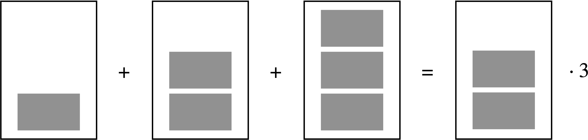
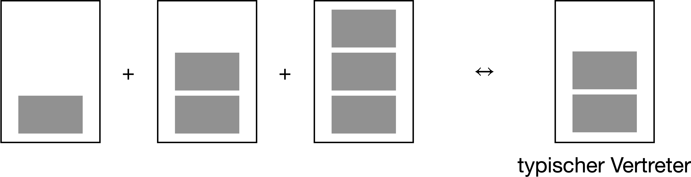
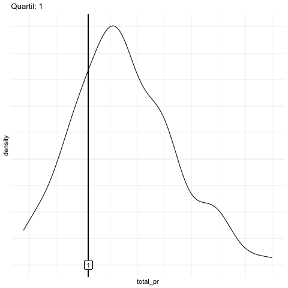
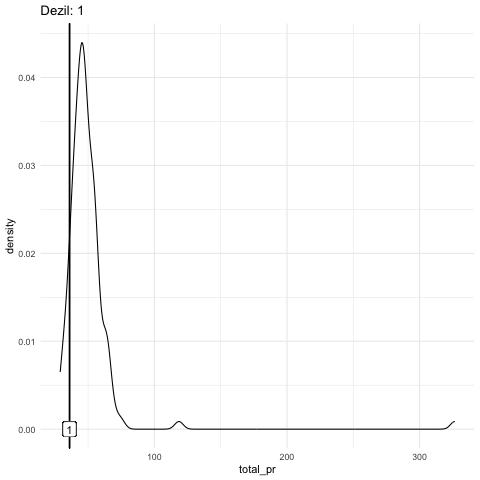
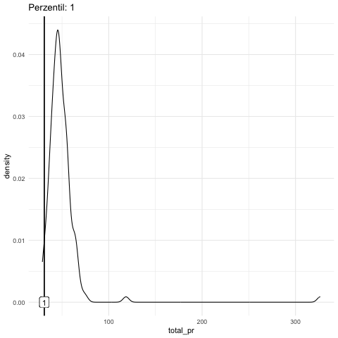

# Punktmodelle 1 {#sec-punktmodelle1}


```{r source-common}
#| echo: false

source("_common.R")
```


```{r libs-hidden}
#| include: false
library(gt)
library(mosaic)
#library(gganimate)
library(patchwork)
library(tidyverse)
#ggplot2::theme_update(axis.title = ggplot2::element_text(size = 66))
library(exams2forms)
```





## Einstieg


In diesem Kapitel benötigen Sie die üblichen R-Pakete (`tidyverse`, `easystats`) und Daten (`mariokart`),  s. @sec-import-mariokart und @sec-r-pckgs.


::: {.content-visible when-format="html"}

```{r}
#| message: false
library(tidyverse)
library(easystats)
```


```{r import-mariokart-csv}
mariokart <- read.csv("https://vincentarelbundock.github.io/Rdatasets/csv/openintro/mariokart.csv")
```
:::


### Lernziele


- Sie können gängige Arten von Lagemaße definieren.
- Sie können erläutern, inwiefern man ein Lagemaß als ein Modell verstehen kann.
- Sie können Lagemaße mit R berechnen.


## Mittelwert als Modell {#sec-mw}

Der "klassische" Mittelwert (das arithmetische Mittel) ist ein
prototypisches Beispiel für ein Modell in der Statistik.


:::{#exr-mw-md-mod}
Welche Vorstellung haben Sie, wenn Sie hören, dass der "typische deutsche Mann" 1.80 m groß ist [vgl. @owidhumanheight]? 

a) Die Hälfte der Männer ist größer als 1.80$\,$m, die andere Hälfte kleiner.
b) Das arithmetische Mittel der Männer beträgt 1.80$\,$m.
c) Die meisten Männer sind 1.80$\,$m groß.
d) Etwas anderes.
e) Keine Ahnung! $\square$

:::

:::::{#exr-mw2}

Laut dem Statistischen Bundesamt [-@statistisches_bundesamt_korpermase_2023] 
beträgt der Wert der mittleren Größe deutscher Frauen etwa 1.66$\,$m, 
also 14$\,$cm weniger als bei Männern.^[<https://en.wikipedia.org/wiki/Average_human_height_by_country>] $\square$


:::: {.content-visible when-format="html" unless-format="epub"}

:::{.panel-tabset}

### Frage

Ist das viel?

a) ja
b) nein
c) kommt drauf an
d) weiß nicht $\square$

### Antwort

Auf diese Frage gibt es keine Antwort, 
zumindest nicht ohne weitere Annahmen. 
So könnte man z.$\,$B. sagen, "mehr als 5 cm sind viel". 
So eine Entscheidung ist aber keine statistische Angelegenheit, 
sondern eine inhaltliche.

:::
::::


::: {.content-visible when-format="pdf"}


Ist das viel?

a) ja
b) nein
c) kommt drauf an
d) weiß nicht $\square$

**Antwort**

Auf dieser Frage gibt es keine Antwort, 
zumindest nicht ohne weitere Annahmen. 
So könnte man z.$\,$B. sagen, "mehr als 5 cm sind viel". 
So eine Entscheidung ist aber keine statistische Angelegenheit, 
sondern eine inhaltliche.

:::
:::::


:::{#exm-mw}
### Beispiel zum Mittelwert

Ein Statistikkurs besteht aus drei Studentinnen: Anna, Berta und Carla.
Sie haben gerade ihre Noten in der Klausur erfahren. 
Anna hat eine 1, Berta eine 2 und Carla eine 3.
Der Durchschnitt (das arithmetische Mittel, $\varnothing$) beträgt: 2. $\square$
:::


>    [🧑‍🎓]{.content-visible when-format="html"}[\emoji{student}]{.content-visible when-format="pdf"}
 Zu easy!

>    [🧑‍🏫]{.content-visible when-format="html"}[\emoji{teacher}]{.content-visible when-format="pdf"} Schon gut! Chill mal. Wird gleich spannender.


Die Rechenregel zum Mittelwert lautet:

1. Addiere alle Werte
2. Teile durch die Anzahl der Werte
3. Fertig! 


Etwas abstrakter kann man @exm-mw in folgendem Schaubild darstellen,
s. @fig-eq-mw.


{#fig-eq-mw width="50%"}


Das Beispiel zeigt uns: Der Mittelwert eines Vektors $X$ ist die Zahl, die $n$ mal multipliziert, gleich ist mit der Summe der $n$ Elemente von $X$.
Der Nutzen des Mittelwerts liegt darin, dass er uns ein Bild gibt (ein Modell ist!) für die "typische Note" im Statistikkurs, s. @fig-mw2.

<!-- $$ -->
<!-- \begin{array}{|c|} \hline \\ \\ \square \\ \hline \end{array} + \begin{array}{|c|} \hline \\ \square \\ \square \\ \hline \end{array} + \begin{array}{|c|} \hline \square \\ \square \\ \square \\ \hline \end{array} = 3 \cdot \begin{array}{|c|} \hline \\ \square \\ \square \\ \hline \end{array} -->
<!-- $$ {#eq-mw} -->

{#fig-mw2 width="75%"}


<!-- $$\begin{array}{|c|} \hline \\ \\ \square \\ \hline \end{array} + \begin{array}{|c|} \hline \\ \square \\ \square \\ \hline \end{array} + \begin{array}{|c|} \hline \square \\ \square \\ \square \\ \hline \end{array} \qquad \leftrightarrow  \qquad \underbrace{\begin{array}{|c|} \hline \\ \square \\ \square \\ \hline \end{array}}_{\text{"typischer Vertreter"}}$$ {#eq-mw2} -->


Der Nutzen des Mittelwerts liegt darin, dass er einen Vektor (eine "Datenreihe") zu einen "typischen Vertreter" zusammenfasst.
Er ist typisch in dem Sinne, als dass die Werte aller Merkmalsträger in gleichem Maße einfließen.
Er gibt uns eine (mögliche) Vorstellung (ein Modell!), 
wie wir uns die Werte der Datenreihe vorstellen sollen.
Eine nützliche Anschauung zum Mittelwert ist die Vorstellung des Mittelwerts als eine ausbalancierte Wippe, s. @fig-wippe.
In "Mathe-Sprech" bezeichnet man den Mittelwert häufig mit $\bar{x}$ und schreibt die Rechenregel so, s. @eq-mw-formel.

![Mittelwert als ausbalancierte Wippe mit Mittelwert 3 [@maphry_seesaw_2009]](img/1280px-Seesaw_with_mean.svg.png){#fig-wippe width="70%"}


$$\bar {x} :=\frac{1}{n} \sum_{i=1}^{n}{x_{i}}=\frac {x_{1}+x_{2}+\dotsb +x_{n}} {n}$$ {#eq-mw-formel}


:::{#def-mw}
### Mittelwert
Der Mittelwert (MW, mean) von $X$ (präziser: das arithmetische Mittel des Merkmals $X$) ist definiert als die Summe der Elemente von $X$ geteilt durch deren Anzahl, $n$. 
Den Mittelwert von $X$ bezeichnet man auch mit $\bar {x}$. $\square$
:::


:::{#exm-mw1}
Angenommen, wir haben eine Reihe von Noten: 1, 2, 3. 
Der Mittelwert der Noten beträgt dann 2: $\bar{X} = \frac{1}{3}\sum (1+2+3) = 6/3 = 2$. $\square$
:::

Da der Mittelwert eine zentrale Rolle spielt in der Statistik,
sollten wir ihn uns noch etwas genauer anschauen.
In s. @fig-mw1 sehen wir die Noten von (dieses Mal) vier Studentinnen.
Die gestrichelte horizontale Linie zeigt den Mittelwert der vier Noten.
Die schwarzen Punkte sind die Daten, 
in dem Fall die einzelnen Noten.
Die vertikalen Linien zeigen die Abweichungen der Noten zum Mittelwert.

::: {.content-visible unless-format="epub"}
Bezeichnen wir die Abweichung -- auch als "Fehler", 
"Rest" oder "Residuum" bezeichnet 
-- der $i$-ten Person mit 
$\color{errorcol}{\text{e}_i}$
(*e* wie engl. *error*, Fehler) und die $i$-te Note mit $\color{ycol}{y_i}$, 
so können wir mit @eq-modell1 festhalten:

$$\color{ycol}{\text{y}_i} \color{black}{ = } \color{modelcol}{\;\bar{x}\;} + \color{errorcol}{\;\text{e}_i}$${#eq-modell1}

Anders ausgedrückt (s. @eq-modell2):


$$\color{ycol}{\text{Daten}} \color{black}{ = } \color{modelcol}{\text{Modell}} + 
\color{errorcol}{\text{Rest}}$${#eq-modell2}

:::


::: {.content-visible when-format="epub"}
Bezeichnen wir die Abweichung -- auch als "Fehler", 
"Rest" oder "Residuum" bezeichnet 
-- der $i$-ten Person mit 
${\text{e}_i}$
(*e* wie engl. *error*, Fehler) und die $i$-te Note mit ${y_i}$, 
so können wir mit @eq-modell1 festhalten:

$${\text{y}_i} {\, = \,} {\;\bar{x}\;} + {\;\text{e}_i}$${#eq-modell1}

Anders ausgedrückt (s. @eq-modell2):


$${\text{Daten }} { = }     {\text{ Modell}} + 
{\text{Rest}}$${#eq-modell2}

:::


Der Mittelwert ist hier unser Modell der Daten.
Wie gesagt: Ein Modell ist eine vereinfachte (zusammengefasste) Beschreibung einer Datenreihe.
Um Modelle darzustellen, wird in der Datenanalyse häufig folgende Art von Modellgleichung verwendet, s. @eq-sim-mean.


::: {.content-visible unless-format="epub"}
$$\color{modelcol}{\hat{y}} \sim \color{xcol}{\text{ x}}$$ {#eq-sim-mean}

Lies: "Der Modellwert $\color{modelcol}{\hat{y}}$ ist eine Funktion der Variable $\color{xcol}{\text{x}}$". 
Der Kringel "~" soll also hier heißen "ist eine Funktion von".
Das "Kringel" oder die "Welle" ~ nennt man auch "Tilde".

Mit $\color{modelcol}{\hat{y}}$ ist die vorhergesagte bzw. 
die *zu erklärende Variable* (synonym: AV, Output-Variable, Zielvariable) gemeint.
Das "Dach"  über dem $\color{ycol}{\text{y}}$ bedeutet "vorhergesagter Y-Wert" oder "Y-Wert laut dem Modell".
Der tatsächliche, beobachtete Wert $\color{ycol}{\text{y}}$ 
setzt sich zusammen aus dem Modellwert $\color{modelcol}{\text{m}}$ 
plus einem Fehler $\color{errorcol}{\text{e}}$, s. @eq-modell3.

$$\color{ycol}{y} \color{black}{\, = \,} \color{modelcol}{\text{m}} + \color{errorcol}{\text{e}}$${#eq-modell3}

Anstelle von  $\color{modelcol}{\text{m}}$ schreibt man auch $\color{modelcol}{\hat{y}}$ ("y-Dach"). 
In diesem Fall ist das Modell einfach gleich dem Mittelwert (und nicht irgendeiner Funktion des Mittelwerts), so dass wir mit @eq-modell4 schreiben können:


$$\color{ycol}{y}  \color{black}{\, =\, } \color{modelcol}{\bar{x}} + \color{errorcol}{e}$${#eq-modell4}


Die Zielvariable $\color{ycol}{\text{y}}$ wird also durch ihren eigenen Mittelwert erklärt, 
außer gehen wir von einem Fehler $\color{errorcol}e$ in unseren Modellvorhersagen aus. 
Nobody is perfect.
In späteren Kapiteln werden wir andere Variablen heranziehen, 
um die Zielvariable zu erklären.
Würden wir z.$\,$B. sagen wollen, dass wir $\color{ycol}{\text{y}}$ als Funktion einer Variable $\color{xcol}{X}$ erklären,
so würden wir schreiben (s. @eq-modell5a):

$$\color{modelcol}{\bar{y}} \color{black}  {\, \sim \,} \color{xcol}{\text{ x}}$${#eq-modell5a}

Da wir im Moment aber keine andere Variablen bemühen, 
um $\color{ycol}{\text{y}}$ zu erklären, 
schreibt man mit @eq-modell5 auch:

$$\color{modelcol}{\bar{y}}\;\;  \color{black}{\sim \; 1}$${#eq-modell5}

Diese Schreibweise sieht anfangs verwirrend aus. 
Die $1$ soll aber nur zeigen, 
dass wir keine andere Variable zur Erklärung von $\color{ycol}{\text{y}}$ verwenden, 
daher steht hier kein Buchstabe, sondern eine einfache $1$.
Der mathematische Hintergrund liegt in der Art, wie man Matrizen multipliziert.
:::


::: {.content-visible when-format="epub"}
$${\hat{y}} \,\sim\, {\text{ x}}$$ {#eq-sim-mean}

Lies: "Der Modellwert ${\hat{y}}$ ist eine Funktion der Variable ${\text{x}}$". 
Der Kringel "~" soll also hier heißen "... ist eine Funktion von ...".
Das "Kringel" oder die "Welle" "~" nennt man  "Tilde".

Mit ${\hat{y}}$ ist die vorhergesagte bzw. 
die *zu erklärende Variable* (synonym: AV, Output-Variable, Zielvariable) gemeint.
Das "Dach"  über dem ${\text{y}}$ bedeutet "vorhergesagter Y-Wert" oder "Y-Wert laut dem Modell".
Der tatsächliche, beobachtete Wert ${\text{y}}$ 
setzt sich zusammen aus dem Modellwert ${\text{m}}$ 
plus einem Fehler ${\text{e}}$, s. @eq-modell3.

$${y} { = } {\text{m}} + {\text{e}}$${#eq-modell3}

Anstelle von  ${\text{m}}$ schreibt man auch ${\hat{y}}$ ("y-Dach"). 
In diesem Fall ist das Modell einfach gleich dem Mittelwert (und nicht irgendeiner Funktion des Mittelwerts), so dass wir mit @eq-modell4 schreiben können:


$$y { = } {\bar{x}} + {e}$${#eq-modell4}


Die Zielvariable ${\text{y}}$ wird also durch ihren eigenen Mittelwert erklärt, 
außer gehen wir von einem Fehler $e$ in unseren Modellvorhersagen aus. 
Nobody is perfect.
In späteren Kapiteln werden wir andere Variablen heranziehen, 
um die Zielvariable zu erklären.
Würden wir z.$\,$B. sagen wollen, dass wir ${\text{y}}$ als Funktion einer Variable ${X}$ erklären,
so würden wir schreiben (s. @eq-modell5a):

$${\bar{y}}\;\;  { \sim \;  } {\text{ x}}$${#eq-modell5a}

Da wir im Moment aber keine andere Variablen bemühen, 
um ${\text{y}}$ zu erklären, 
schreibt man mit @eq-modell5 auch:

$${\bar{y}}\;\;  {\sim \; 1}$${#eq-modell5}

Diese Schreibweise sieht verwirrend aus. 
Die $1$ soll aber nur zeigen, 
dass wir keine andere Variable zur Erklärung von ${\text{y}}$ verwenden, 
daher steht hier kein Buchstabe, sondern eine einfache $1$.
Der mathematische Hintergrund liegt in der Art, wie man Matrizen multipliziert.
:::


:::{#exm-noten}
### Noten, Mittelwert und Abweichung

Vier Studentinnen -- Anna, Berta, Carl, Dani -- haben ihre Statistik-Klausur zurückbekommen (Schluck).
Die Noten sehen Sie in @fig-mw1; gar nicht so schlecht ausgefallen.
Außerdem ist der Mittelwert (gestrichelte horizontale Linie) 
sowie die Abweichungen Residuen, Fehler; 
häufig mit $e$ wie *error* bezeichnet) der einzelnen Noten vom Mittelwert eingezeichnet. $\square$
:::


Schauen Sie sich die Abweichungsbalken in @fig-mw1 einmal genauer an.
Jetzt stellen Sie sich vor, Sie würden die vom Mittelwert nach *oben* ragenden Balkenlängen aneinanderlegen (das sind die gestrichelten.
Können Sie sich das vorstellen?
Jetzt legen Sie auch noch die Abweichungsbalken, 
die nach *unten* ragen, aneinander (die mit den durchgezogenen Linien).
Wer viel Phantasie hat, erkennt (sieht),
dass die Gesamtlänge der "nach oben ragenden Balken" identisch ist zur Gesamtlänge 
der nach "unten ragenden Balken".
@eq-summenull drückt das präziser und ohne Ihre Phantasie zu strapazieren aus.


$$\sum_{i=1}^n (x_i-\bar{x})=\sum_{i=1}^n x_i - \sum_{i=1}^n \bar{x} = n\cdot \bar{x} - n\cdot \bar{x}=0$$ {#eq-summenull}

Wie man in @eq-summenull sieht, ist die Summe der Abweichungen vom Mittelwert Null.


```{r fig-abw-balken-mw, echo = FALSE}
#| fig-cap: "Der Mittelwert als horizontale (gestrichelte) Linie. Die vertikalen Linien zeigen die Abweichungen der einzelnen Werte zum Mittelwert. Die Abweichungen summieren sich zu Null auf."
#| label: fig-mw1
#| out-width: 75%

d <- tibble::tribble(
  ~id, ~note, ~note_avg, ~delta, ~note2, ~note_avg2,
   1L,     2,     2.325, -0.325,  2.325,          2,
   2L,   2.7,     2.325,  0.375,    2.7,      2.325,
   3L,   3.1,     2.325,  0.775,    3.1,      2.325,
   4L,   1.5,     2.325, -0.825,  2.325,        1.5
  )

d$names <- c("Anna", "Berta", "Carla", "Dani")


d <- d %>% 
  mutate(delta_abs = abs(delta),
         pos = ifelse(delta > 0, "positiv", "negativ"),
         delta_sq = delta^2)


p_mean_deltas <- 
  d %>%
  ggplot(aes(x = id, 
             y = note)) +
  geom_hline(yintercept = mean(d$note), 
             linetype = "dashed") +
  geom_segment(aes(y = mean(d$note),
                   yend = note,
                   x = id,
                   xend = id,
                   linetype = pos,
                   color = pos),
               size = 2
               ) +
  geom_point(size = 5) + 
  labs(linetype = "Richtung der Abweichung",
       color = "Richtung der Abweichung") +
  theme(legend.position =  c(0.5, 1),
        legend.justification = c(1, 1)) +
  annotate(geom = "label",
           x = 0,
           hjust = 0,
           y = mean(d$note), 
           label = paste0("MW = ", round(mean(d$note), 2))) +
  scale_y_continuous(limits = c(1, 4)) +
  labs(x = "",
       y = "Note") +
  scale_x_continuous(breaks = 1:4, labels = d$names) +
  scale_color_okabeito() 

p_mean_deltas
```


:::{#exr-mw-wealth1}
Was schätzen Sie, wie hoch das mittlere Vermögen (arithmetisches Mittel) der 
Haushalte in Deutschland in etwa ist (im Jahr 2021 auf Basis einer Umfrage)  [@deutsche_bundesbank_household_2023]?^[316 Tsd Euro] $\square$


a) 50.000 Euro
b) 100.000 Euro
c) 150.000 Euro
d) 200.000 Euro
e) 300.000 Euro


:::


:::{#exm-md}
### Der wertvollste Fußballer der Welt in Ihrem Hörsaal

Kommt der wertvollste Fußballspieler der Welt in Ihren Hörsaal, 
sagen wir, es ist Kylian Mbappé [@transfermarkt2024].
Sein Jahreseinkommen (2023) liegt bei ca. 120 Millionen Euro [@arad2024].
Der Fußballer ist gut gelaunt:

>    [🦹]{.content-visible when-format="html"}[\emoji{supervillain}]{.content-visible when-format="pdf"}  Hey Leute, wie geht's denn so! Wie viel Kohle habt ihr eigentlich so?

>    [🧑‍🎓]{.content-visible when-format="html"}[\emoji{student}]{.content-visible when-format="pdf"} Äh, wir studieren und verdienen fast nix!

Die 100 Studis im Hörsaal schauen verdattert aus der Wäsche: Was ist das für eine komische Frage!?
Aber zumindest verteilt der Fußballspieler Autogramme.
:::


:::{#exr-elon}
### Mittleres Einkommen im Hörsaal, mit Kylian Mbappé

Schätzen Sie -- im Kopf -- das mittlere Vermögen im Hörsaal, gehen Sie davon aus,
dass alle der 100 Studierenden jeweils 1000 Euro im Jahr verdienen. $\square$
:::


In R kann man das mittlere Einkommen (präziser: das arithmetische Mittel des Einkommens) wie folgt berechnen, 
s. @lst-einkommen. 
(Die Details der Syntax, z.$\,$B. der Befehl `rep`, sind von geringer Bedeutung.)

:::{#lst-einkommen}

```{r}
set.seed(42)  # Zufallszahlen festlegen, hier nicht so wichtig
einkommen_studis <- rep(x = 1000, times = 100)  # "rep" wie "repeat": wiederhole 1000 USD 100-mal
einkommen <- c(einkommen_studis, 120*1e6)  # 100 Studis mit 1000, 1 Mbappé mit 120 Mio
einkommen_mw <- mean(einkommen)
einkommen_mw
```


Wir simulieren Einkommen von 100 Studis plus Mbappé.

:::

:::{.callout-note}
1 Million hat 6 Nullen hinter der führenden Eins: 1000000.
In Taschenrechner- oder Computerschreibweise: 1 Mio = `1e6`,
das `1e6` ist zu lesen als "1 Mal 10 hoch 6, also mit 6 im *E*xponenten".
:::

Der Mittelwert im Hörsaal beträgt also `r scales::label_comma()(einkommen_mw)` Euro, etwas mehr als eine Million.
Ist das ein gutes Modell für das typische Vermögen im Hörsaal?^[Nein. Es beschreibt weder das Vermögen der Studierenden noch das des Fußballers gut.]


### Der Mittelwert als lineares Modell

Man kann den Mittelwert als Gerade einzeichnen, s. @fig-mw2, bzw. als Gerade begreifen.
Insofern kann man vom Mittelwert auch als *lineares Modell* sprechen.

:::{#def-lm}
### Lineares Modell
Ein lineares Modell beschreibt die Daten durch eine Gerade.
Es erklärt die Daten anhand einer Geraden. $\square$
:::


```{r}
#| label: fig-mw2
#| fig-cap: "Der mittlere Preis von Mariokart-Spielen als horizontale Gerade eingezeichnet; einmal mit Extremwerte (a), einmal ohne (b)."
#| fig-subcap: 
#|   - "Mit Extremwerten"
#|   - "Ohne Extremwerte (<100 Euro)"
#| echo: false
#| layout-ncol: 2
#| out-width: 100%


mariokart$X <- 1:nrow(mariokart)

mariokart <-
  mariokart %>% 
  mutate(is_extreme = total_pr > 100)

mariokart_extreme <-
  mariokart %>% 
  filter(is_extreme)

ggplot(mariokart) +
  aes(x = X, y = total_pr) +
    geom_hline(yintercept = mean(mariokart$total_pr),
             linewidth = 2) +
  geom_point(alpha = .7) +
  geom_point(data = mariokart_extreme, 
             color =  okabeito_colors()[1],
             alpha = .7,
             size = 8) +
  labs(caption = paste0("Mittelwert (MW): ", round(mean(mariokart$total_pr), 2)),
       x = "Nr. des Spiel") +
  scale_y_continuous(limits = c(0, 400)) +
  theme_minimal() +
  annotate("label", x = 0, y = 50, label = paste0("MW: ", 50), hjust = "left", size = 8) +
  theme(axis.title = element_text(size = 18)) +
  theme(caption.title = element_text(size = 14)) +
  theme_large_text()

mariokart2 <- 
mariokart %>% 
  filter(total_pr < 100)
  
ggplot(mariokart2) +
  aes(x = X, y = total_pr) +
  geom_hline(yintercept = mean(mariokart2$total_pr),
             color = okabeito_colors()[2], 
             size = 2) +
  geom_point(alpha = .7) +
  labs(caption = paste0("Mittelwert (MW): ", round(mean(mariokart2$total_pr), 2)),
       x = "Nr. des Spiel") + 
  scale_y_continuous(limits = c(0, 400)) +
  theme_minimal()  +
  annotate("label", x = 0, y = 47, label = paste0("MW: ", 47), hjust = "left", size = 8) +
  theme(axis.title = element_text(size = 18)) +
  theme(caption.title = element_text(size = 14))  +
  theme_large_text()

```


@fig-mw2 zeigt den Mittelwert des Verkaufspreises der Mariokart-Spiele (`total_pr`),
einmal mit (farbig markierten) Extremwerten (a) bzw. einmal ohne Extremwerte (b).

:::{#def-extremwert}
### Extremwert
Ein Extremwert (Ausreißer; *outlier*) ist eine Beobachtung, 
deren Wert  deutlich vom Großteil der anderen Beobachtungen im Datensatz abweicht, 
z.$\,$B. viel größer ist. $\square$
:::


Berechnen wir mal den Mittelwert von `einkommen` mit R mit dem Befehl `lm`.


```{r}
lm(einkommen ~ 1)  # lm wie "lineares Modell" oder engl. "linear model"
```

Der Befehl `lm` gibt hier mit der Ausgabe `Coeffients` (Koeffizient) einen einzelnen Wert zurück 
und zwar den Mittelwert von `einkommen`, vgl. auch @lst-einkommen.
Dieser Wert wird als Achsenabschnitt (engl. *intercept*) bezeichnet.
Das wird verständlich, wenn man z.$\,$B. in @fig-mw2 sieht, 
dass die Gerade (des Mittelwerts) genau an diesem Punkt die Y-Achse schneidet.
Die Syntax des Befehls `lm()` sieht etwas merkwürdig aus.
Ignorieren Sie das fürs Erste, 
wir besprechen das später (@sec-gerade1) ausführlich.
`lm` steht übrigens für "lineares Modell".


## Der Median als Modell {#sec-median}


>    [🧑‍🎓]{.content-visible when-format="html"}[\emoji{student}]{.content-visible when-format="pdf"} Hey, der Mittelwert ist doch Quatsch! Das ist gar kein typischer Wert für die Menschen im Hörsaal. Weder für  Mbappé, noch für uns Studis!

>    [🧑‍🏫]{.content-visible when-format="html"}[\emoji{teacher}]{.content-visible when-format="pdf"} Ja, da habt ihr Recht.


>    [⚽]{.content-visible when-format="html"}[\emoji{soccer-ball}]{.content-visible when-format="pdf"} Die Welt ist schon ungerecht! 


@fig-mbappe stellt die Verteilung des Einkommens im Hörsaal dar.
Zur Erinnerung: 4.0+e07 bedeutet $4 \cdot 10^{07} = 40000000$, eine 4 gefolgt von 7 Nullen.
<!-- Die logarithmische X-Achse stellt den Unterschied von Mittelwert (MW) -->
<!-- und Median deutlicher heraus als die normale (additive) Achse.  -->

```{r}
#| echo: false
#| fig-cap: "Die Einkommensverteilung im Hörsaal"
#| label: fig-mbappe
#| layout-ncol: 1
#| out-width: 75%
#| fig-asp: 0.5


d <-
  tibble(einkommen = einkommen,
         id = 1:length(einkommen))

p1 <- ggplot(d) +
  aes(x = einkommen) +
  geom_histogram() +
  theme_modern() +
  geom_vline(xintercept = c(mean(einkommen)), color = okabeito_colors()[1]) +
  geom_vline(xintercept = c(median(einkommen)), color = okabeito_colors()[2]) +
  annotate("label", x = median(einkommen), y = 100, label = "Median", color = okabeito_colors()[2]) +
  annotate("label", x = mean(einkommen), y = 0, label = "MW", color = okabeito_colors()[1]) +
  geom_label(
           x = Inf, 
           y = 10, 
           hjust = 1.1,
           label = "Extremwert") +
  labs(caption = "MW: Mittelwert",
  y = "Anzahl",
       x = "Einkommen") +
  theme(plot.margin = margin(10, 10, 10, 10))

p1
```


Der Mittelwert ist Hörsaal ist nicht typisch für die Menschen im Hörsaal:
Weder für Mbappé, noch für die Studis.
Genau genommen ist der Mittelwert in diesem Fall ziemlich nutzlos.
Der Mittelwert ist anfällig für Extremwerte:
Gibt es einen Extremwert in einer Datenreihe,
so spiegelt der Mittelwert stark diesen Wert wider
und weniger die Mehrheit der gemäßigten Werte.
Man sagt, der Mittelwert ist nicht *robust* (gegenüber Extremwerten).


:::{.callout-important}
Bei (sehr) schiefen Verteilungen (s. @fig-mbappe) ist der Mittelwert (sehr) wenig aussagekräftig,
da er nicht mehr "typische" Werte für die Merkmalsträger beschreibt.
:::

:::{#exm-med}
### Das Median-Einkommen einiger Studentinnen
Fünf Studentinnen tauschen sich über ihr Einkommen aus, s. @fig-md1, links.
Es handelt sich um eine schiefe Verteilung.
Wir könnten jetzt behaupten, dass Carla das typische Einkommen (für diese Datenreihe) aufweist,
da es genauso viele Studentinnen gibt, die mehr verdienen, wie solche, die weniger verdienen. $\square$
:::

```{r}
#| label: fig-md1
#| fig-cap: Das Einkommen einiger Studentinnen sowie der Mittelwert (MW) ihres Einkommens
#| echo: false
#| out-width: 75%
#| layout-ncol: 1
#| fig-asp: 0.618


d <-
  tibble(id = 1:5,
         name = c("Anna", "Berta", "Carla", "Dora", "Emma"),
         einkommen = c(1, 2, 3, 4, 100))

# d %>% 
#   ggplot(aes(x = id, y = einkommen)) +
#   geom_vline(xintercept = 3, color = okabeito_colors()[2]) +
#   geom_col() +
#   #geom_label(aes(label = name)) +
#   annotate("label", x = 3, y = 50, label = "Median") +
#   theme_minimal() +
#   scale_x_continuous(breaks = 1:5, labels = d$name) +
#   labs(y = "Einkommen")


d %>% 
  ggplot(aes(x = einkommen)) +
  geom_point(y = 0, size = 3, alpha = .7) +
  # geom_histogram(binwidth = 1, color = "white") +
  geom_vline(xintercept = median(d$einkommen), 
             color = okabeito_colors()[2]) +
  annotate("label", x = 3, y = -1, label = "Median", 
           color = okabeito_colors()[2]) +
  geom_vline(xintercept = mean(d$einkommen), color = okabeito_colors()[1]) +  
  annotate("label", x = 22, y = -1, label = "MW", color = okabeito_colors()[1])   +
  theme_minimal() +
  scale_y_continuous(breaks = NULL, limits = c(-1,2)) +
  annotate("label", x = 100, y = +2, label = "Dora") +
  annotate("label", x = 0, y = 2, label = "Anna\nBerta\nCarla", hjust = 0, vjust = "top") +
  labs(caption = "MW: Mittelwert",
       y = "",
       x = "Einkommen")
```


:::{#def-median}
### Median
Die Merkmalsausprägung, die bei (aufsteigend) sortierten Beobachtungen in der Mitte liegt, nennt man Median. $\square$
:::

:::: {.content-visible when-format="html"}

:::{#exr-aufstellen}
### Alle mal aufstehen
Auf Geheiß der Lehrkraft stehen jetzt alle Studis bitte auf und sortieren sich der Größe nach im Raum, schön in einer Reihe aufgestellt. 
Die Körpergröße der Person in der Mitte der Reihe, zu der also gleich viele Personen zu links wie zu rechts stehen, das ist der Medien dieser Datenreihe, vgl. @fig-median-human. $\square$
:::
::::


Der Median ist *robust* gegenüber Extremwerten: Fügt man Extremwerte zu einer Verteilung hinzu, 
ändert sich der Median zumeist (deutlich) weniger als der Mittelwert.
@fig-median-human stellt den Median schematisch dar.


::: {#fig-median-human layout-ncol=5 width="1%" fig-align="bottom"}
{width=10%}

{width=13%}

{width=15%}

{width=16%}

{width=20%}

Der Median als der Wert des "mittleren" Objekts, wenn die Objekte aufsteigend sortiert sind. 
Es gibt genauso viele Objekte mit kleinerem Wert wie mit größerem Wert als der Median. 
In dieser Abbildung ist der Median (1.79 m) farbig markiert.

:::


Bei geradem $n$ werden die beiden mittleren Werte betrachtet und
das arithmetische Mittel aus diesen beiden Werten gebildet.


:::{#exm-med2}
Bei der Messreihe 1,2,3 beträgt der Median 2. Bei der Messreihe 1, 2  beträgt der Median 1.5. $\square$
:::


:::{#exr-md2}
### Emma wird reich
Durch ein geniales Patent wird Emma steinreich. Ihr Einkommen erhöht sich um das Hundertfache.
Wie verändert sich der Median?^[Er bleibt gleich, verändert sich also nicht: Der Median ist *robust*, er verändert sich nicht oder kaum, wenn Extremwerte vorliegen.] $\square$
:::


:::{#exr-mw-md}

### Wer ist mehr "mittel"? Median oder Mittelwert?


>    [🧑‍🎓]{.content-visible when-format="html"}[\emoji{student}]{.content-visible when-format="pdf"} Das arithmetische Mittel sollte Mittelwert heißen, 
weil es die Mitte des Abstands zweier Zahlen widerspiegelt, 
also z.$\,$B. von 1 und 10 ist die Mitte 5.5 
-- also genau beim Mittelwert!

>    [👩]{.content-visible when-format="html"}[\emoji{woman}]{.content-visible when-format="pdf"} Moment! 
Der Median und nur der Median zeigt den mittleren Messwert! Links und rechts sind gleich 
viele Messwerte, wenn man die Werte der Größe nach sortiert. 
Also liegt der Median genau in der Mitte!

Nehmen Sie Stellung zu dieser Diskussion! $\square$
:::


:::{#exm-md3}
### Ein "mittlerer" Preis für Mariokart
Der Mittelwert (das arithmetische Mittel) und der Median für das Start-Gebot (`start_pr)` von Mariokart-Spielen sind nicht gleich, der Mittelwert ist höher als der Median.

```{r}
mariokart %>% 
  summarise(price_mw = mean(start_pr),
            price_md = median(start_pr))
```


```{r fig-mario-md}
#| echo: false
#| fig-cap: "Das Startgebot bei Mariokart-Spielen ist schief verteilt: Median und Mittelwert sind unterschiedlich"
#| label: fig-mario-md
#| out-width: 75%
mariokart %>% 
  select(start_pr) %>% 
  ggplot(aes(x = start_pr)) +
  geom_histogram() +
  geom_vline(xintercept = 1, color = okabeito_colors()[1]) +
  annotate("label", x = 1, y = 0.1, label = "Md: 1", color = okabeito_colors()[1]) +
  geom_vline(xintercept = 8.7, color = okabeito_colors()[2]) +
  annotate("label", x = 8.7, y = 30, label = "MW: 8.7", color = okabeito_colors()[2]) +
  theme_modern() +
  labs(
    caption = "Md: Median; MW: Mittelwert",
    y = "Anzahl"
  )

```
Wie man sieht, ist der Mittelwert größer als der Median, s. @fig-mario-md. $\square$
:::


Klaffen Mittelwert und Median auseinander, so liegt eine schiefe Verteilung vor.
Ist der Mittelwert größer als der Median, so nennt man die Verteilung rechtsschief.
Bei schiefen Verteilungen ist der Median dem Mittelwert als Modell für den "typischen Wert" vorzuziehen.


:::{#exr-mw-no-extrem}
### Mariokart ohne Extremwerte


Im Datensatz `mariokart` gibt es einige wenige Spiele, die für einen vergleichsweise hohen Preis verkauft wurden. 
Diese Extremwerte verzerren den mittleren Verkaufspreis 
möglicherweise über die Gebühr.

Entfernen Sie diese Werte und berechnen Sie dann Mittelwert und Median erneut. Vergleichen Sie die Ergebnisse.

**Lösung**
```{r}
#| eval: true
mariokart_no_extreme <- 
mariokart %>% 
  filter(total_pr < 100)

# mit Extremwerten:
mariokart |> 
  summarise(total_pr_mittelwert = mean(total_pr),
            total_pr_median = median(total_pr))

# ohne Extremwerte:
mariokart_no_extreme |> 
  summarise(total_pr_mittelwert_no_extreme = mean(total_pr),
            total_pr_median_no_extreme = median(total_pr))
```

Wie man sieht, verändert sich der Mittelwert, wenn man die Extremwerte entfernt. Für den Median trifft das nicht zu, er bleibt, wo er ist. $\square$
:::


:::{#exr-mw-wealthmd}
### Das mediane Vermögen in Deutschland

Was schätzen Sie, wie hoch das *mediane* Vermögen der Haushalte 
in Deutschland im Jahr 2021 in etwa war [@deutsche_bundesbank_household_2023]?^[ca. 84 Tsd Euro]

a) 50 Tsd Euro
b) 100 Tsd Euro
c) 150 Tsd Euro
d) 200 Tsd Euro
e) 300 Tsd Euro$\square$
:::


<!-- :::{#exr-mw-wealthmd} -->
<!-- Was schätzen Sie, wie groß der *Unterschied* zwischen medianem und mittlerem (arithm. Mittel) des Jahreseinkommen deutscher Haushalte ungefähr ist?^[Quelle:  [Wikipedia](https://de.wikipedia.org/wiki/Einkommensverteilung_in_Deutschland), Abruf 2023-04-19, der Unterschied beträgt knapp 3000 Euro laut der Quelle.]) -->

<!-- a) 1.000 Euro -->
<!-- b) 2.000 Euro -->
<!-- c) 3.000 Euro -->
<!-- d) 4.000 Euro -->
<!-- e) 5.000 Euro$\square$ -->
<!-- ::: -->


## Quantile

### Quantile als Verallgemeinerung des Medians

Der Median teilt eine Verteilung in eine untere und ein obere Hälfte.
Er markiert sozusagen eine "50-Prozent-Marke" (der aufsteigend sortierten Werte).
Betrachten wir einmal nur alle Spiele, die für weniger als 100 Euro verkauft wurden (`total_pr`, finales Verkaufsgebot), 
s. @fig-mario-qs1.
50$\,$% dieser Spiele wurden für weniger als ca. 46 Euro verkauft und 50% für mehr als 46 Euro.
Der Median beträgt als 46 Euro.

Jetzt könnten wir nur die günstigere Hälfte betrachten und wieder 
nach dem Median fragen (d.$\,$h. `total_pr < 46`).
Dieser "Median der billigeren Hälfte" grenzt damit das insgesamt 
billigste Viertel vom Rest der Verkaufsgebote ab.
In unserem Datensatz liegt dieser Wert bei ca. 41 Euro.
Entsprechend kann man nach dem Wert fragen, der das oberste Viertel 
vom Rest der Verkaufsgebote abtrennt.
Dieser Wert liegt bei ca. 54 Euro.
Jetzt könnte man sagen, hey, warum nur in 25$\,$%-Stücke die Verteilung aufteilen?
Warum nicht in 10$\,$%-Schritten? 
Oder vielleicht in 1$\,$%-Schritten oder in sonstigen Schritten?
Wo die Quartile in 25$\,$%-Schritten aufteilen, teilt ein *Quantil* in $p$-Prozent-Schritten auf.
[S. @fig-quantile-anim dazu.]{.content-visible when-format="html" unless-format="epub"}


### Quartile, Dezile und Perzentile

:::{#def-quartile}

### Quartile
Sortiert man die Daten aufsteigend, so nennt man den Wert,
der das Viertel mit den kleisten Wert vom Rest der Daten trennt das *erste Quartil* (Q1, 25$\,$%).
Den Median nennt man das *zweite Quartil* (Q2, 50$\,$%).
Entsprechend heißt der Wert, der die drei Viertel kleinsten Werte vom oberen Viertel abtrennt, das *dritte Quartil* (Q3, 75$\,$%). $\square$
:::

:::{#exm-mario-qs}
### Quartile des Verkaufsgebot

@fig-mario-qs1 zeigt die Quartile für das Verkaufsgebot. $\square$
:::


:::{#def-dezile}
### Dezile

Die neun Quantile $p= 0.1, 0.2, \ldots, 1$, die die Verteilung in 10 gleich große Teile unterteilen, nennt man Dezile. "Gleich groß" heißt, dass in jedem Dezil gleich viele Werte (nämlich 10 %) liegen. $\square$
:::


@fig-mario-qs1 zeigt das 1. (Q1), das 2. (Median) und das 3. Quartil für den Datensatz `mariokart2`.


```{r}
#| echo: false
#| label: fig-mario-qs1
#| out-width: "75%"
#| fig-asp: 0.5
#| fig-cap: "Q1, Q2 und Q3 für das Schlussgebot (nur Spiele für weniger als 100 Euro) in einem Dichtediagramm"


mario_quantile <- 
mariokart %>% 
  filter(total_pr < 100) %>% 
  summarise(q25 = quantile(total_pr, .25) |> round(),
            q50 = quantile(total_pr, .50)|> round(),
            q75 = quantile(total_pr, .75)|> round())

mario_quantile <- 
  mariokart %>% 
  filter(total_pr < 100) %>% 
  reframe(qs = quantile(total_pr, c(.25, .5, .75)))

# mariokart %>% 
#   filter(total_pr < 100) %>%  
#   ggplot(aes(x = total_pr)) +
#   geom_histogram() +
#   geom_vline(xintercept = mario_quantile$qs) +
#   annotate("label", x =  mario_quantile$qs, 
#            y = 0, label =  mario_quantile$qs, size = labeltextsize) +
#   annotate("label", x =  mario_quantile$qs, y = Inf, 
#            label =  c("Q1", "Median", "Q3"), vjust = 2, size = labeltextsize) +
#   labs(y = "Anzahl") +
#   theme_large_text()

mario_quantile <- 
mariokart %>% 
  filter(total_pr < 100) %>% 
  summarise(q25 = quantile(total_pr, .25),
            q50 = quantile(total_pr, .50),
            q75 = quantile(total_pr, .75))

mario_quantile <- 
  mariokart %>% 
  filter(total_pr < 100) %>% 
  reframe(qs = round(quantile(total_pr, c(.25, .5, .75))))

mariokart %>% 
  filter(total_pr < 100) %>%  
  ggplot(aes(x = total_pr)) +
  geom_density() +
  geom_vline(xintercept = mario_quantile$qs) +
  annotate("label", x =  mario_quantile$qs, y = 0, 
           label =  mario_quantile$qs, 
           size = labeltextsize-4) +
  annotate("label", x =  mario_quantile$qs, y = Inf, 
           label =  c("Q1", "Q2", "Q3"), vjust = 2, 
           size = labeltextsize-4) +
  labs(y = "Anteil") +
  scale_y_continuous(labels = NULL)
```


:::{#def-quantile}
### Quantile
Ein $p$-Quantil ist der Wert, der von $p$ Prozent der Werte nicht überschritten wird.
Ein Quantil ist ein Oberbegriff für Quartile, Dezile etc. $\square$
:::


Quantile kann man in R mit dem Befehl `quantile` berechnen:

```{r}
#| eval: false
mariokart %>% 
  filter(total_pr < 100) %>% 
  summarise(
    q25 = quantile(total_pr, .25),  # 1. Quartil
    q50 = quantile(total_pr, .50),  # 2. Quartil
    q75 = quantile(total_pr, .75))  # 3. Quartil
```

::::: {.content-visible when-format="html" unless-format="epub"}


@fig-quantile-anim stellt einige Quantile animiert dar.


::::{#fig-quantile-anim}

:::{.panel-tabset}

### 25%-Schritte: Quartile





### 10%-Schritte: Dezile




### Percentile: 1%-Schritte


    
:::

Verschiedene Quantile animiert
::::

:::::

@fig-quantile-mosaic visualisiert verschiedene Quantile.
Man beachte, dass alle Regionen gleichgroße Flächen aufweisen.


```{r}
#| echo: false
#| label: fig-quantile-mosaic
#| fig-cap: "Verschiedene Quantile visualisiert"
#| layout-ncol: 2
#| fig-subcap: 
#|   - "10%-Schritte: Dezile"
#|   - "1%-Schritte: Perzentile"
# xqnorm( p = c(.25, .5, .75), return = "plot") +
#   guides(fill = "none") + 
#   theme_minimal()

mosaic::xqnorm( p = seq(0,1, by = .1), return = "plot") +
  theme_minimal() +
  guides(fill = "none") +
  scale_y_continuous(breaks = NULL, name = "")

mosaic::xqnorm( p = seq(0,1, by = .01), return = "plot") +
  theme_minimal() +
  guides(fill = "none") +
  scale_y_continuous(breaks = NULL, name = "")
```


### Quantile als sortierte Ordnung


Den R-Befehl `quantile()` kann man sich einfach nachbauen und damit das Konzept der Quantile besser verstehen.
Angenommen, wir wollen wissen, welcher Verkaufspreis mit 90% Wahrscheinlichkeit nicht überschritten wird.
Das können wir im Datensatz `mariokart` wie folgt erreichen:

1. Sortiere die Werte aufsteigend.
2. Schneide die oberen 10% ab (entfernesie).
3. Schaue, was der größte verbleibende Wert ist.

```{r}
mariokart %>% 
  arrange(total_pr) %>%   # sortiere aufsteigend
  slice_head(n = 130) %>%  # nur die ersten ca. 90%
  summarise(p90 = max(total_pr))  # was ist der größte verbleibende Wert?
```


Das (annähernd) gleiche Ergebnis liefert `quantile()`:

```{r}
mariokart %>% 
  summarise(q90 = quantile(total_pr, .9))
```


### Beispiel: Quantile der IQ-Verteilung

Zur Erinnerung: Die Verteilung des IQ wird gewöhnlich als normalverteilt mit Mittelwert gleich 100 und Streuung gleich 15 angenommen.


Betrachten wir einige häufig verwendete Quantile für die IQ-Verteilung, s. @fig-nv-quants2.

```{r}
#| echo: false
q_p50 <-
  ggplot(NULL, aes(c(60,145))) +
  geom_area(stat = "function", fun = dnorm, fill = "grey", args = list(mean=100,sd = 15), xlim= c(60, 100)) +
  geom_line(stat = "function", fun = dnorm, args = list(mean=100,sd = 15)) +
  labs(x = "IQ", y = "Dichte",
       title = "50%-Quantil: 100") +
  scale_y_continuous(breaks = NULL)

q_inv <- .25
q_p <- qnorm(q_inv, mean = 100, sd= 15)
p_q <- pnorm(q_p, mean = 100, sd= 15)

q_p25 <-
  ggplot(NULL, aes(c(60,145))) +
  geom_area(stat = "function", fun = dnorm, fill = "grey", args = list(mean=100,sd = 15), xlim= c(60, q_p)) +
  geom_line(stat = "function", fun = dnorm, args = list(mean=100,sd = 15)) +
  labs(x = "IQ", y = "Dichte",
       title = paste0(q_inv,"-Quantil: ",round(q_p)),
       caption = "MW-0.68sd") +
  scale_y_continuous(breaks = NULL)

q_inv <- .95
q_p <- qnorm(q_inv, mean = 100, sd = 15)

q_p95 <-
  ggplot(NULL, aes(c(60,145))) +
  geom_area(stat = "function", fun = dnorm, fill = "grey", args = list(mean=100,sd = 15), xlim= c(60, q_p)) +
  geom_line(stat = "function", fun = dnorm, args = list(mean=100,sd = 15)) +
  labs(x = "IQ", y = "Dichte",
       title = paste0(q_inv,"-Quantil: ",round(q_p)),
       caption = "MW+1.64sd") +
  scale_y_continuous(breaks = NULL)

q_inv <- .975
q_p <- qnorm(q_inv, mean = 100, sd= 15)
#pnorm(115, mean= 100, sd = 15)

q_p975 <-
  ggplot(NULL, aes(c(60,145))) +
  geom_area(stat = "function", fun = dnorm, fill = "grey", args = list(mean=100,sd = 15), xlim= c(60, q_p)) +
  geom_line(stat = "function", fun = dnorm, args = list(mean=100,sd = 15)) +
  labs(x = "IQ", y = "Dichte",
       title = paste0(q_inv,"-Quantil: ",round(q_p)),
       caption = "MW+2SD") +
  scale_y_continuous(breaks = NULL)

q_inv <- .84
q_p <- qnorm(q_inv, mean = 100, sd= 15)
#pnorm(115, mean= 100, sd = 15)

q_p84 <-
  ggplot(NULL, aes(c(60,145))) +
  geom_area(stat = "function", fun = dnorm, fill = "grey", args = list(mean=100,sd = 15), xlim= c(60, q_p)) +
  geom_line(stat = "function", fun = dnorm, args = list(mean=100,sd = 15)) +
  labs(x = "IQ", y = "Dichte",
       title = paste0(q_inv,"-Quantil: ",round(q_p)),
       caption = "MW+1sd") +
  scale_y_continuous(breaks = NULL)

q_inv <- .69
q_p <- qnorm(q_inv, mean = 100, sd= 15)  # halbe SD
#pnorm(107.5, mean= 100, sd = 15)

q_p69 <-
  ggplot(NULL, aes(c(60,145))) +
  geom_area(stat = "function", fun = dnorm, fill = "grey", args = list(mean=100,sd = 15), xlim= c(60, q_p)) +
  geom_line(stat = "function", fun = dnorm, args = list(mean=100,sd = 15)) +
  labs(x = "IQ", y = "Dichte",
       title = paste0(q_inv,"-Quantil: ",round(q_p)),
       caption = "MW+0.5sd") +
  scale_y_continuous(breaks = NULL)
```


```{r fig-nv-quants2}
#| echo: false
#| label: fig-nv-quants2
#| fig-width: 10
#| fig-cap: Verschiedene Quantile der Normalverteilung

(q_p50 + q_p25 + q_p69) / (q_p95 + q_p975 + q_p84)
```


### Beispiel: Wie groß sind Studierende?

Untersuchen wir die Verteilung der Körpergröße von Studierenden auf Basis eines Datensatzes von @openintro.

Das Quantil von z.B. 25% zeigt die Körpergröße der 25% kleinsten Studentis an, analog für 50%, 75%, in Inches bzw. in Zentimetern^[1 Inch entspricht 2.54cm].

```{r QM2-Thema3-Teil1-5}
#| message: false
#| echo: true

data("speed_gender_height", package = "openintro")  # <1>

height_summary <- 
  speed_gender_height %>% 
  mutate(height_cm = height*2.54) %>%  # <2>
  select(height_inch = height, height_cm) %>% 
  drop_na() %>%   # <3>
  pivot_longer(everything(), names_to = "Einheit", values_to = "Messwert") %>%   # <4>
  group_by(Einheit) %>%   # <5>
  summarise(q25 = quantile(Messwert, prob = .25),  # <6>
            q50 = quantile(Messwert, prob = .5),
            q75 = quantile(Messwert, prob = .75))

height_summary
```
1. Daten importieren
2. Inch in Zentimeter umrechnen
3. Zeilen mit fehlenden Werten löschen
4. In die Langform pivotieren
5. Gruppieren nach Einheit (Inch, Zentimeter)
6. Quantile berechnen  (Q1, Q2, Q3)


Das 25%-Quantil nennt man auch 1. Quartil; das 50%-Quantil (Median) auch 2. Quartil und das 75%-Quantil auch 3. Quartil.


@fig-stud-height visualisiert die Quantile und die Häufigkeitsverteilung.

```{r QM2-Thema3-Teil1-6}
#| echo: false
#| warning: false
#| message: false
#| fig-cap: Größenverteilung von 1325 amerikanischen Studentis
#| label: fig-stud-height
#| fig-width: 10

speed_gender_height <-
  speed_gender_height |> 
   mutate(height_cm = height*2.54)

p1 <- speed_gender_height %>% 
  ggplot() +
  aes(x = 1, y = height_cm) +
  geom_boxplot() +
  labs(x = "",
       y = "Größe in cm",
       title = "Die Box zeigt das 25%-, 50%- und 75%-Quantil") +
  theme_minimal()

height_summary_long <- 
  speed_gender_height %>% 
  select(height_cm) %>% 
  drop_na() %>% 
  summarise(q25 = quantile(height_cm, prob = .25),
            q50 = quantile(height_cm, prob = .5),
            q75 = quantile(height_cm, prob = .75)) %>% 
  pivot_longer(everything(),
               names_to = "q",
               values_to = "height_cm") 

p2 <- 
  speed_gender_height %>% 
  ggplot() +
  aes(x = height_cm) +
  geom_histogram() +
  geom_vline(data = height_summary_long,
             aes(xintercept = height_cm)) +
  geom_text(data = height_summary_long,
             aes(x = height_cm+1,
                 y = 0,
                 label = paste0(q, ": ", height_cm)),
             angle = 90,
            hjust = 0,
            color = "white"
             ) +
  labs(title = "Die vertikalen Striche zeigen die Quantile",
       y = "Häufigkeit")  +
  theme_minimal()

plots(p1, p2)
```


## Lagemaße {#sec-lage}

>    [🧑‍🎓]{.content-visible when-format="html"}[\emoji{student}]{.content-visible when-format="pdf"} Was ist der Oberbegriff für Median, Mittelwert und so weiter?

>    [🧑‍🏫]{.content-visible when-format="html"}[\emoji{teacher}]{.content-visible when-format="pdf"} Gute Frage! Wie würden Sie ihn nennen?


:::{#def-lage}

### Lagemaß
Ein *Lagemaß* (synonym: Maß der zentralen Tendenz) für eine Verteilung gibt einen Vorschlag, 
welchen Wert der Verteilung wir als typisch, normal, erwartbar, repräsentativ oder "mittel" ansehen sollten. $\square$
:::


Gebräuchliche Lagemaße sind:

- Mittelwert (arithmetisches Mittel)
- Median
- Quantile wie z.$\,$B. Quartile
- Minimum (kleinster Wert)
- Maximum (größter Wert)
- Modus (häufigster Wert) 


Berechnen wir Lagemaße für den Mariokart-Datensatz, 
z.$\,$B. mit `describe_distribution(mariokart)`,
s. @lst-mario-lage.
Es ist übrigens egal, wie Sie die Variablen benennen, 
die Sie berechnen: `mw` oder `mittelwert` oder `mean` oder `mein_krasser_variablenname` -- alles okay!


```{r mariokart_lagemaße_total_pr_no_eval}
#| lst-label: lst-mario-lage
#| lst-cap: Syntax zur Berechnung von Lagemaßen
#| eval: false

describe_distribution(mariokart) |>  
  # Einige Spalten interessieren uns hier nicht:
  select(-Skewness, -Kurtosis, -n, n_Missing)
```


Häufig möchte man Statistiken wie Lagemaße für mehrere Teilgruppen 
-- z.$\,$B. Mittlere Körpergröße von Frauen vs. mittlere Körpergröße von Männern --
berechnen und dann vergleichen.
Die zugrundeliegende stehende *Forschungsfrage* könnte lauten: 
"Unterscheidet sich der Mittelwert der Körpergröße von Frauen und Männern?"
Oder vielleicht: "Hängt das Geschlecht mit der Körpergröße zusammen?"
Anders ausgedrückt: Körpergröße $y$ ist eine Funktion des Geschlechts $G$.
Die *Modellformel* könnte also lauten: ${y} \;{ \sim } \; {G}$.
Gruppierte Lagemaße lassen sich in R z.$\,$B. so berechnen, s. @lst-mario-lage-gruppiert.


```{r}
#| lst-label: lst-mario-lage-gruppiert
#| lst-cap: Gruppierte Lagemaße
mariokart_lagemaße_gruppiert <-
  mariokart %>% 
  group_by(wheels) %>%  # neue Zeile, der Rest ist gleich!
  summarise(mw = mean(total_pr))
```

```{r}
#| echo: false
#| tbl-cap: Gruppierte Mittelwerte
#| label: tbl-group-mean
#| eval: !expr knitr:::is_html_output()
mariokart_lagemaße_gruppiert
```


@fig-mw3 zeigt ein Beispiel für ungruppierte (links) bzw. gruppierte (rechts) Mittelwerte; vgl. @fig-mw2.
Wie man in dem Diagramm sieht, kann das *Residuum kleiner* werden bei einer Gruppierung 
(im Vergleich zu einem ungruppierten, "globalen" Mittelwert):
Innerhalb der Gruppe ohne Lenkräder und innerhalb der Gruppe mit 2 Lenkrädern sind die Abweichungen zu ihrem Gruppen-Mittelwert relativ gering -- 
im Vergleich zu den Abweichungen der Preise zum ungruppierten Mittelwert.


:::{#def-punktmodell}
### Punktmodell
Ein Modell, welches für alle Beobachtungen ein und denselben Wert annimmt (vorhersagt),
heißt  *Punktmodell*. 
Anders gesagt, fasst ein Punktmodell eine Wertereihe (häufig ist das eine Tabellenspalte) zu einer einzelnen Zahl zusammen, einem "Punkt" in diesem Sinne, s. @fig-desk. $\square$
:::


{#fig-desk width=20%}


Mittelwert, Median und Quartile sind Beispiele für Punktmodelle:
Sie fassen eine Verteilung zu einem einzelnen Wert zusammen 
und geben uns ein "Bild" der Daten, machen sie uns verständlich -- 
sie sind uns also ein Modell.


```{r}
#| label: fig-mw3
#| fig-cap: "Der mittlere Preis von Mariokart-Spielen als horizontale Gerade eingezeichnet. (a) ungruppiert; (b) gruppiert nach Anzahl der Lenkräder."
#| fig-subcap: 
#|   - "ungruppiert"
#|   - "gruppiert"
#| echo: false
#| layout: [[45,-10, 45], [100]]
#| out-width: 100%
#| fig-asp: .618
#| fig-width: 7

mariokart$X <- 1:nrow(mariokart)

mariokart <-
  mariokart %>% 
  mutate(is_extreme = total_pr > 100)

mariokart_extreme <-
  mariokart %>% 
  filter(is_extreme)

mariokart2 <- 
mariokart %>% 
  filter(total_pr < 100)


mariokart3 <-
  mariokart2 |> 
  filter(wheels == 0 | wheels == 2) 

mariokart3_summ <-
  mariokart3 |> 
  group_by(wheels) |> 
  summarise(total_pr = mean(total_pr, na.rm = TRUE)) |> 
  mutate(wheels = factor(wheels))

p1 <- ggplot(mariokart2) +
  aes(x = X, y = total_pr) +
  geom_hline(yintercept = mean(mariokart2$total_pr),
             color = okabeito_colors()[1], 
             size = 2) +
  geom_point(alpha = .7) +
  labs(caption = paste0("MW: ", round(mean(mariokart2$total_pr), 2)),
       x = "Nr. des Spiel") +
  theme_minimal() +
  scale_y_continuous(limits = c(0, 100)) +
  annotate("label", x = 0, y = 47, 
           label = paste0("MW: 47"), size = labeltextsize, hjust = 0) +
  theme_large_text()

  
p2 <- mariokart3 |> 
  mutate(wheels = factor(wheels)) |> 
  ggplot(aes(x = X, y = total_pr, group = wheels, color = wheels)) +
  geom_point2() + # Scatter plot
  geom_hline(data = mariokart3_summ, aes(yintercept = total_pr,
                                         color = wheels),
             size = 2) +
  scale_color_okabeito(palette = "black_first") +
  annotate("label", x = -Inf, y = round(mariokart3_summ$total_pr[1], 2),
           label = paste0("MW: ", round(mariokart3_summ$total_pr[1], 0)),
           hjust = 0, size = labeltextsize) +
    annotate("label", x = -Inf, y = round(mariokart3_summ$total_pr[2], 2),
           label = paste0("MW: ", round(mariokart3_summ$total_pr[2], 0)),
           hjust = 0, size = labeltextsize) +
  labs(caption = paste0("MWs: 39 bzw. 56"),
       x = "Nr. des Spiel")  +
  theme_minimal()  +
  scale_y_continuous(limits = c(0, 100)) +
  theme(legend.position = c(.8, .1),
        legend.background = element_rect(
          fill = NA, # Background color
          color = "grey40", # Border color
          linewidth = 1, # Border size
          linetype = "solid"))  +
  theme_large_text()

p1
p2
```


## Wie man mit Statistik lügt

Es heißt, mit Statistik könne man vortrefflich lügen.
Woran liegt das? Der Grund ist, dass die Statistik Freiheitsgrade lässt:
Es gibt nicht nur einen richtigen Weg, um eine statistische Analyse durchzuführen. 
Viele Wege führen nach Rom (aber nicht alle).
Um Manipulationsversuche abzuwehren oder einfache Fehler und Unschärfen ohne böse Absicht aufzudecken, 
gibt es ein probates Gegenmittel: *Transparenz*.
Analysen sollten transparent sein:
Das Vorgehen und die zugrundeliegenden Entscheidungen sollte man offenlegen.
Hier ist eine (nicht abschließende!) Checkliste, 
was Sie nachprüfen sollten, um die Belastbarkeit einer Analyse sicherzustellen [@simmons_false-positive_2011, @wicherts_degrees_2016]:


1. Wurde die Art und die Zeitdauer der Datenerhebung vorab festgelegt und berichtet?
2. Wurden ausreichend Daten gesammelt (z.$\,$B. mind. 20 Beobachtungen pro Gruppe)?
3. Wurden alle untersuchten Variablen berichtet?
4. Wurden alle durchgeführten Interventionen berichtet?
5. Wurden Daten aus der Analyse entfernt? Wenn ja, gibt es eine (stichhaltige) Begründung?

:::{#callout-important}
Stellen Sie hohe Anforderungen an die Transparenz einer statistischen Analyse. Nur durch Nachprüfbarkeit können Sie sich von der Stichhaltigkeit der Ergebnisse und deren Interpretation überzeugen.
:::


## Vertiefung 

:::{#exm-survival1}
### Survival-Tipp

Eine Studentin aus dem Bachelorstudiengang *Angewandte Medien- und Wirtschaftspsychologie* mit Schwerpunkt *Data Science* berichtet ihre "Survival-Tipps" für Statistik.

1. Wenn man mal nicht weiterkommt, hilft es auch mal ein paar Tage Abstand von R und Statistik zu nehmen. 
2. Es hilft, sich während des Semesters neue Begriffe und ihre Erklärung zusammenschreiben.
3. Gut ist auch, sich mit KommilitonInnen auszutauschen oder in höheren Semestern nach Tipps zu fragen. $\square$
:::


>    [🧑‍🎓]{.content-visible when-format="html"}[\emoji{student}]{.content-visible when-format="pdf"} Irgendwie kann ich mir R-Code so schlecht merken.

>    [🧑‍🏫]{.content-visible when-format="html"}[\emoji{teacher}]{.content-visible when-format="pdf"} Frag doch mal ChatGPT oder einen anderen Chatbot -- dort bekommt man auch R-Code ausgegegeben.


:::{#exr-chatgpt}
### Übungsfragen vom Chat-Bot

Fragen Sie einen Chat-Bot wie ChatGPT nach Übungsaufgaben.
Sie können sich an folgenden Prompt orientieren. 
Empfehlenswert ist mit verschiedenen Prompts zu experimentieren.

>    [🧑‍🎓]{.content-visible when-format="html"}[\emoji{student}]{.content-visible when-format="pdf"} Ich bin Student in einem Bachelor-Studiengang. Gerade bereite ich mich auf die Klausur im Fach "Grundlagen der Statistik" vor. Bitte schreibe mir Aufgaben, die mir helfen, mich auf die Prüfung vorzubereiten. Die Fragen sollten folgende Themen beinhalten: Maße der zentralen Tendenz, Grundlagen von R, Skalenniveau (z.$\,$B. Nominalskala vs. Intervallskala), Verteilungsformen, Normalverteilungen, *z*-Werte. Bitte schreibe die Aufgabe im Stil von Richtig-Falsch-Aufgaben. Schreibe ca. 10 Aufgaben.  $\square$
:::


## Quiz


```{r}
#| include: false
exrs_zusammenfassen <-
list(
  "exs/File_Drawer_Problem.Rmd",
  "exs/Definition_Punktmodell.Rmd",
  "exs/Median_Gerade_N.Rmd",
  "exs/Gruppen_Modell_Vorteil.Rmd",
  "exs/Quantil_Transfer.Rmd",
  "exs/Modell_Gleichung.Rmd",
  "exs/Schiefe_Interpolation.Rmd",
  "exs/Nullmodell_R.Rmd",
  "exs/MW_Eigenschaft.Rmd",
  "exs/Normal_Rechnen.Rmd"
)
```


```{r quiz-kap-zusammenfassen, message=FALSE, results="asis"}
#| echo: false
exams2forms(exrs_zusammenfassen, box = TRUE, check = TRUE)
```

## Aufgaben

Ein Teil der folgenden Aufgaben kann Stoff beinhalten,
den Sie noch nicht kennen, aber später kennenlernen.
Ignorieren Sie daher Aufgaben(teile) mit (noch) unbekanntem Stoff.


Die Webseite [datenwerk.netlify.app](https://datenwerk.netlify.app) stellt eine Reihe von einschlägigen Übungsaufgaben bereit. Sie können die Suchfunktion der Webseite nutzen, um die Aufgaben mit den folgenden Namen zu suchen:


1. [kennwert-robust](https://sebastiansauer.github.io/datenwerk/posts/kennwert-robust/kennwert-robust.html)
1. [mw-berechnen](https://sebastiansauer.github.io/datenwerk/posts/mw-berechnen/mw-berechnen.html)
1. [mariokart-max2](https://sebastiansauer.github.io/datenwerk/posts/mariokart-max2/mariokart-max2.html)
1. [nasa01](https://sebastiansauer.github.io/datenwerk/posts/nasa01/nasa01.html)
1. [mariokart-mean1](https://sebastiansauer.github.io/datenwerk/posts/mariokart-mean1/mariokart-mean1.html)
1. [wrangle10](https://sebastiansauer.github.io/datenwerk/posts/wrangle10/wrangle10.html)
1. [summarise01](https://sebastiansauer.github.io/datenwerk/posts/summarise01/summarise01.html)
1. [mariokart-max1](https://sebastiansauer.github.io/datenwerk/posts/mariokart-max1/mariokart-max1.html)
1. [schiefe1](https://sebastiansauer.github.io/datenwerk/posts/schiefe1/schiefe1)
1. [mariokart-mean2](https://sebastiansauer.github.io/datenwerk/posts/mariokart-mean2/mariokart-mean2.html)
1. [summarise03](https://sebastiansauer.github.io/datenwerk/posts/summarise03/summarise03.html)
1. [mariokart-mean4](https://sebastiansauer.github.io/datenwerk/posts/mariokart-mean4/mariokart-mean4.html)
1. [mariokart-mean3](https://sebastiansauer.github.io/datenwerk/posts/mariokart-mean3/mariokart-mean3.html)
1. [summarise02](https://sebastiansauer.github.io/datenwerk/posts/summarise02/summarise02.html)


Schauen Sie sich auch mal auf [datenwerk.netlify.app](https://datenwerk.netlify.app) die Aufgaben zu z.$\,$B. dem Tag [EDA](https://sebastiansauer.github.io/Datenwerk/#category=eda) an. 


:::: {.content-visible when-format="html" unless-format="epub"}


:::{#exr-datensaetze}
Mittlerweile verfügen Sie einige wesentliche Werkzeuge des Datenjudo. [Hier](https://data-se.netlify.app/2022/02/23/data-sets-for-for-teaching/) finden Sie einen Überblick an Datensätze, die Sie nach Herzenslust analysieren können.^[<https://data-se.netlify.app/2022/02/23/data-sets-for-for-teaching/>] $\square$
:::

:::


## Literaturhinweise

Es gibt viele Lehrbücher zu den Grundlagen der Statistik; 
die Inhalte dieses Kapitels gehören zu den Grundlagen der Statistik. 
Vielleicht ist es am einfachsten, 
wenn Sie einfach in Ihrer Bibliothek des Vertrauens nach einem typischen Lehrbuch schauen.
Beispiel für Lehrbücher sind @mittag_statistik_2020 
oder @oestreich_keine_2014; ein Klassiker ist @bortz_statistik_2010. 
Einen Fokus auf R legt @sauer_moderne_2019.
Wer vor Englisch nicht zurückschreckt, ist mit @cetinkaya-rundel_introduction_2021 
oder @poldrack_statistical_2023 gut beraten. 
Beide Bücher sind online verfügbar. 
Tipp: Mit dem Browser lässt sich englischer Text auf einer Webseite auf  auf Deutsch übersetzen.


