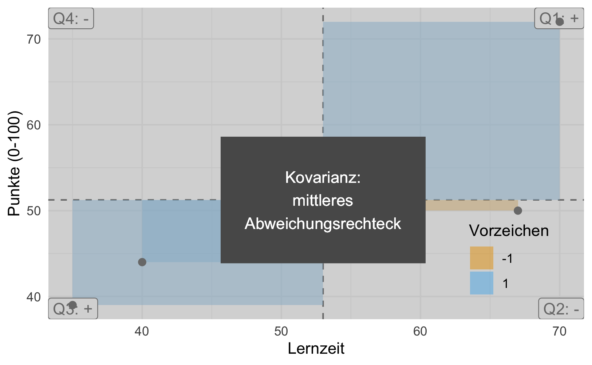

# Punktmodelle 2 {#sec-zusammenhaenge}


```{r}
#| echo: false

source("_common.R")
```


```{r}
#| include: false
library(ggpubr)
library(TeachingDemos)
library(gt)
#library('MASS')
library(exams2forms)
```


## Einstieg


In diesem Kapitel benötigen Sie die üblichen R-Pakete (`tidyverse`, `easystats`) und Daten (`mariokart`),
s. @sec-import-mariokart und @sec-r-pckgs.


### Lernziele


- Sie können die Begriffe Kovarianz und Korrelation definieren und ihren Zusammenhang erläutern.
- Sie können die Stärke einer Korrelation einschätzen.


::: {.content-visible when-format="html"}

```{r}
#| message: false
library(tidyverse)
library(easystats)
```


```{r import-mariokart-csv}
mariokart <- read.csv("https://vincentarelbundock.github.io/Rdatasets/csv/openintro/mariokart.csv")
```
:::


### Zum Einstieg

:::{#exr-zsgh-studis}

1. Suchen Sie sich eine vertrauenswürdige Partnerin oder einen vertrauenswürdigen Partner.
Im Zweifel reicht die erste Person, die Sie sehen. [😁]{.content-visible when-format="html"}
2. Fragne Sie diese Person nach je zwei Variablen, die wie folgt zusammenhängen:

- gleichsinnig (Viel von dem einen, viel von dem anderen)
- gegensinnig (viel von dem einen, wenig von dem anderen)
- Scheinzusammenhang (hängt zusammen, ist aber nicht "echt" bzw. kausal) $\square$
:::


## Zusammenfassen zum Zusammenhang


In @sec-punktmodelle1 haben wir gelernt,
dass das Wesen eines Punktmodells als Zusammenfassung *einer* Spalte (eines Vektors) zu einer einzelnen Zahl, 
zu einem "Punkt" sozusagen, zusammengefasst werden kann.
In diesem Kapitel fassen wir *zwei* Spalten zusammen, wieder zu *einer* Zahl, s. @fig-desk2.
Während wir in @sec-punktmodelle1 eine Variable mit Hilfe eines Lagemaßes beschrieben (bzw. dargestellt, zusammengefasst, modelliert) haben, 
tun wir hier das Gleiche für zwei Variablen.
Beschreibt man aber zwei Variablen, so geht es um die Frage, 
was die beiden Variablen miteinander zu tun haben:
Wie die beiden Variablen voneinander (statistisch) *abhängen* bzw. miteinander (in welcher Form auch immer) *zusammenhängen.*
Wir begrenzen uns auf *metrische* Variablen.

{#fig-desk2 width=25%}

<!-- :::{#exm-zsmn} -->
<!-- ### Beispiele für Zusammenhänge -->

<!-- - Lernzeit und Klausurerfolg -->
<!-- - Körpergröße und Schuhgröße -->
<!-- - Verbrauchtes Benzin und zurückgelegte Strecke -->
<!-- - Produktionsmenge und Produktionskosten -->
<!-- - Bildschirmzeit und Schlafqualität -->
<!-- - Umweltschutz und Biodiversivität $\square$ -->
<!-- ::: -->

Die Verbildlichung (Visualisierung) zweier metrischer Variablen haben wir bereits in @sec-zshg-metr kennengelernt.
Zur Verdeutlichung wie ein Zusammenhang zweier metrischer Variablen aussehen kann, 
hilft noch einmal @fig-zshg.


```{r}
#| echo: false
#| label: fig-zshg
#| fig-cap: "Visualisierung des Zusammenhangs von wheels und total_pr. (a) Streudiagramm mit Trendlinie (und Ellipse zur Verdeutlichung). (b) 'Verwackeltes' Streudiagramm, um die einzelnen Punkte besser zu erkennen"
#| fig-subcap: 
#|   - Streudiagramm mit Trendlinie
#|   - Verwackeltes Streudiagramm
#| layout: [[45,-10, 45], [100]]
data(mariokart, package = "openintro")

mariokart %>% 
  filter(total_pr < 100) %>% 
  ggscatter(x = "wheels", 
            y = "total_pr",
            add = "reg.line",
            add.params = list(color = modelcol),
            ellipse = FALSE) +
  theme_large_text()

mariokart %>% 
  filter(total_pr < 100) %>% 
  ggplot() +
  aes(x = wheels, y = total_pr) +
  geom_jitter()  +
  theme_large_text()
```


## Abweichungsrechtecke {#sec-cov}

Die Stärke des linearen Zusammenhangs zweier metrischer Variablen kann man gut mithilfe von Abweichungsrechtecken veranschaulichen.
Los geht's!


### Noten und Abweichungsrechtecke


```{r}
#| echo: false
d <- tibble::tribble(
  ~id, ~y, ~x,
   1L,   72,     70,
   2L,   44,     40,
   3L,   39,     35,
   4L,   50,     67
  ) %>% 
  mutate(x_avg = mean(x),
         y_avg = mean(y),
         x_delta = x - mean(x),
         y_delta = y - mean(y),
         x_pos = x > mean(x),
         y_pos = y > mean(y),
         cov_sign = sign(x_delta * y_delta),
         xy_area = x_delta * y_delta)

#write.csv(d, file = "noten.csv")

# cor(d$punkte, d$lernzeit)
#plot(d$lernzeit, d$punkte)
cov_xy <- cov(d$y, d$x)
```


:::{#exm-noten2}
### Wieder Statistiknoten

Anton, Bert, Carl und Daniel haben ihre Statistikklausur zurückbekommen.
Die Lernzeit $X$ scheint mit der erreichten Punktzahl $Y$ (0-100, je mehr desto besser) zusammenzuhängen.^[[🧑‍🎓]{.content-visible when-format="html"}  Typisches Lehrerbeispiel!]
Gar nicht so schlecht ausgefallen wie gedacht …, s. @tbl-noten2. $\square$
:::

```{r}
#| echo: false
#| label: tbl-noten2
#| tbl-cap: Punkte in der Statistikklausur (x, 0-100) und Lernzeit (y, 0-100)

d %>% 
  select(id, y, x) %>% 
  kable() 
```

Zeichnen wir uns die Daten als Streudiagramm, s. @fig-delta-rect.
Dabei zeichnen wir noch *Abweichungsrechtecke* ein.


:::{#def-abweichungsrechteck}
### Abweichungsrechteck
Im zweidimensionalen Fall spannt sich ein Abweichungsrechteck vom Mittelwert $\bar{x}$ 
bis zum Messwert $x_i$ und genauso für $Y$.
Wir bezeichnen mit $dx_i$ die Distanz (Abweichung) vom Mittelwert $\bar{x}$ 
bis zum Messwert $x_i$ (und analog $dy_i$), also $dx_i = x_i - \bar{x}$.
Die Fläche des Abweichungsrechtecks ist dann das Produkt der Abweichungen: $dx_i \cdot dy_i$. $\square$
:::

```{r}
#| echo: false
#| label: fig-delta-rect
#| fig-cap: "Die Kovarianz als mittleres Abweichungsrechteck. In jedem der vier Quadranten (Q1, Q2, Q3, Q4) ist das Vorzeichen der Abweichungsrechtecke dargestellt. Die Farben der Abweichungsrechtecke spiegeln das Vorzeichen wider."
p_cov <- 
ggplot(d) +
  aes(x = x, y = y) +
  geom_vline(xintercept = mean(d$x), linetype = "dashed") +
  geom_hline(yintercept = mean(d$y), linetype = "dashed") +
  geom_rect(aes(xmin = x, xmax = x_avg, ymin = y, ymax = y_avg,
                fill = factor(cov_sign)),
            alpha = .7, color = "grey40") +
  #geom_rect(xmin = mean (d$x), xmax = 67, ymax = mean(d$y), ymin = 50) +
  labs(x = "Lernzeit",
       y = "Punkte (0-100)",
       fill = "Vorzeichen") + 
  theme_minimal() +
  annotate("label", x = Inf, y = Inf, 
           label = "Q1: +", hjust = "right", vjust = "top") +
  annotate("label", x = Inf, y = -Inf, 
           label = "Q2: -", hjust = "right", vjust = "bottom") +
  annotate("label", x = -Inf, y = -Inf, 
           label = "Q3: +", hjust = "left", vjust = "bottom") +
  annotate("label", x = -Inf, y = Inf, 
           label = "Q4: -", hjust = "left", vjust = "top") +
    geom_point(size = 2, color = "black") +
  scale_fill_manual(values = c("black", orange)) +
  theme(
    legend.position = c(0.95, 0.05),  # Adjust these values to position the legend
    legend.justification = c(1, 0)    # 1 = right, 0 = bottom
  )  +
  theme(plot.margin = margin(1, 1, 1, 1, "cm"))

p_cov
```


Stellen Sie sich vor, wir legen alle Rechtecke zusammen aus @fig-delta-rect.
Nennen wir das resultierende Rechteck das "Summenrechteck".
Ja, ich weiß, ich strapaziere mal wieder Ihre Phantasie.
Jetzt kommt's: Je größer die Fläche des Summenrechtecks ist, 
desto stärker der (lineare) Zusammenhang.
Beachten Sie, dass die Flächen Vorzeichen haben, positiv oder negativ (Plus oder Minus), 
je nachdem, in welchem der vier Quadranten sie stehen. Die Füllfarben der Rechtecke verdeutlichen dies, s. @fig-delta-rect.
Das *Vorzeichen* der Summe zeigt an, 
ob der Zusammenhang positiv (gleichsinnig, ansteigende Trendlinie) 
oder negativ (gegensinnig, absinkende Trendlinie) ist.
So zeigt @fig-kov links eine positive Summe der Abweichungsrechtecke und rechts eine negative Summe. 
Man sieht im linken Teildiagramme, dass die Summe der Rechtecke mit positivem Vorzeigen (oben-rechts und unten-links) überwiegt; 
im rechten Teildiagramm ist es umgekehrt: Die Rechtecke in Quadranten mit negativem Vorzeichen überwiegen (oben-links und unten-rechts).


```{r}
#| label: fig-kov
#| fig-cap: "Positive und negative Kovarianz: Einmal resultiert eine positive Summe, einmal eine negative Summe, wenn man die Flächen der Abweichungsrechtecke addiert."
#| layout: [[45,-10, 45], [100]]
#| out-width: 80%
#| fig-subcap: 
#|   - Positive Vorzeichen (Quadranten rechts-oben und links-unten) überwiegen, was in einer positiven Kovarianz resultiert
#|   - Negative Vorzeichen (Quadranten links-oben und rechts-unten) überwiegen, was in einer negativen Kovarianz resultiert
#| echo: false

## Positive correlation
x <- rnorm(25)
y <- x + rnorm(25,3, .5)
#cor(x,y)
cor.rect.plot(x,y, col = c(orange, "grey20"))
## negative correlation
x <- rnorm(25)
y <- rnorm(25,10,1.5) - x
#cor(x,y)
cor.rect.plot(x,y, col = c(orange, "grey20"))
```


Wir können das Summenrechteck noch durch die Anzahl der Datenpunkte teilen,
das ändert nichts an der Aussage,
aber der Mittelwert hat gegenüber der Summe den Vorteil, dass er in seiner Aussage unabhängig ist von der Anzahl der eingegangenen Datenpunkte.
Das resultierende Rechteck nennen wir das *mittlere Abweichungsrechteck*.
Ein Maß für den Zusammenhang von Lernzeit und Klausurpunkte ist also die *Fläche des mittleren Abweichungsrechtecks*, s. @fig-cov2.


{#fig-cov2 width=75%}

```{r}
#| echo: false
#| label: fig-cov2a
#| eval: false
#| fig-cap: "Die Kovarianz als mittleres Abweichungsrechteck. Die Fläche der Rechtecks entspricht dem Wert der Kovarianz."
p_cov2 <- 
p_cov +
  geom_rect(aes(xmin = -Inf, 
                xmax = Inf, 
                ymin = -Inf, 
                ymax = Inf), 
            fill = "gray", 
            alpha = 0.2, 
            inherit.aes = FALSE) +
  geom_rect(aes(xmin = mean(d$x) - sqrt(cov_xy)/2, 
                xmax = mean(d$x) + sqrt(cov_xy)/2,
                ymin = mean(d$y) - sqrt(cov_xy)/2, 
                ymax = mean(d$y) + sqrt(cov_xy)/2)) +
  geom_text(aes(x = mean(d$x), y = mean(d$y), 
                label = "Kovarianz:\nmittleres\nAbweichungsrechteck"),
            color = "white") +
  theme(
    legend.position = c(0.95, 0.05),  # Adjust these values to position the legend
    legend.justification = c(1, 0)) +
  theme(plot.margin = margin(1, 1, 1, 1, "cm"))

p_cov2
```


### Kovarianz {#sec-kov}

:::{#def-kov}
### Kovarianz
Die Kovarianz ist definiert als die Fläche des mittleren Abweichungsrechtecks.
Sie ist ein Maß für die Stärke und Richtung des linearen Zusammenhangs zweier metrischer Variablen, s. @fig-cov2. $\square$
:::


>    [🧑‍🎓]{.content-visible when-format="html"}[\emoji{student}]{.content-visible when-format="pdf"}
 Zu viele Bilder! Ich brauch Zahlen.

>    [🧑‍🏫]{.content-visible when-format="html"}[\emoji{teacher}]{.content-visible when-format="pdf"} Kommen gleich!


@tbl-kov2 zeigt beispielhaft, 
wie sich die Kovarianz berechnet.
Berechnen wir als Nächstes das mittlere Abweichungsrechteck, die Kovarianz, 
für die Noten und Lernzeit der vier Studierenden aus @tbl-noten2.
Sie beträgt 162.

::: {.content-visible when-format="html" unless-format="epub"}
Wenn Sie die Werte selber nachrechnen wollen, finden Sie den Noten-Datensatz in der Datei [noten.csv](https://raw.githubusercontent.com/sebastiansauer/statistik1/main/data/noten.csv).
:::


```{r}
#| echo: false
#| label: tbl-kov2
#| tbl-cap: "Werte der Abweichungsrechtecke. avg: average (Mittelwert), cov_sign: Vorzeichen der Kovarianz,_pos: positiver Wert auf der entsprechenden Achse (x/y), xy_area: Produkt von x_delta und y_delta"

d %>% 
  select(-x_pos, -y_pos) |> 
  kable()
```


```{r}
d %>%
  summarise(kovarianz = mean(xy_area))
```

Die Formel der Kovarianz lautet, s. @eq-cov4: 

$$\text{cov(xy)} = s_{xy}:=\frac{1}{n}\sum_{i=1}^n (x_i-\bar{x})(y_i-\bar{y}) = \frac{1}{n}\sum_{i=1}^n dx_i\cdot dy_i$${#eq-cov4}

@eq-cov4 in Worten ausgedrückt:

1. Rechne für jedes $x_i$ die Abweichung vom Mittelwert, $\bar{x}$, aus, $dx_i$.
1. Rechne für jedes $y_i$ die Abweichung vom Mittelwert, $\bar{y}$, aus, $dy_i$.
3. Multipliziere für alle $i$ $dx_i$ mit $xy_i$, um die Abweichungsrechtecke $dx_i dy_i$ zu erhalten.
4. Addiere die Flächen der Abweichungsrechtecke.
5. Teile durch die Anzahl der Beobachtungen $n$.


:::{#exm-pos-kov}
### Variablen mit positiver Kovarianz

- Größe und Gewicht
- Lernzeit und Klausurerfolg
- Distanz zum Ziel und Reisezeit
- Temperatur und Eisverkauf $\square$
:::


:::{#exm-neg-kov}
### Variablen mit negativer Kovarianz

- Lernzeit und Freizeit
- Alter und Restlebenszeit
- Temperatur und Schneemenge
- Lebenszufriedenheit und Depressivität$\square$
:::


Zwei Extrembeispiele für Kovarianz-Werte sind in @fig-demos-cov dargestellt.


```{r}
#| echo: false
#| label: fig-demos-cov
#| fig-cap: Verschiedene Werte der Kovarianz
#| fig-subcap: 
#|   - kein Zusammenhang
#|   - perfekter (positiver) Zusammenhang
#|   - negativer Zusammenhang
#| layout: [[45,-10, 45], [100]]

# zero correlation
points1 <- data.frame(
  x = c(1,1,2,2,4,4,5,5),
  y = c(1,5,2,4,2,4,5,1)
)

cor.rect.plot(y = points1$y, x = points1$x,
              xlab = "X", ylab = "Y",
              col = c(orange, "grey40"))

# perfect correlation
points2 <- data.frame(
  x = c(1,2,3,4,5,6,7),
  y = c(1,2,3,4,5,6,7)
)

cor.rect.plot(y = points2$y, x = points2$x,
              xlab = "X", ylab = "Y",
              col = c(orange, "grey40"))

# perfect negative correlation
points3 <- data.frame(
  x = c(1,2,3,4,5,6,7),
  y = c(2.1,6,5,4,3,2,1)
)

# 
# cor.rect.plot(y = points3$y, x = points3$x,
#               xlab = "X", ylab = "Y")
```


Bei einer Kovarianz von (ungefähr) Null ist die Gesamt-Fläche der Abweichungsrechtecke, wenn man sie pro *Quadrant* aufsummiert, 
(ungefähr) gleich groß, s. @fig-covnull.
Zur Erinnerung: Bei der Varianz waren es Quadrate; bei der Kovarianz sind es jetzt Rechtecke.

Addiert man die Abweichungsrechtecke (unter Beachtung der Vorzeichen), 
so beträgt die Summe in etwa (bzw. genau) Null.
Damit ist die Kovarianz in diesem Fall etwa (bzw. genau) Null, s. @eq-cov-is-zero: 
Wenn die Summe der Aweichungsrechtecke Null ist, 
dann ist auch ihr Mittelwert (MW) Null. 
Damit ist die Kovarianz Null.


$$\begin{aligned}
\sum \left(dX \cdot dY \right) &= 0\\
\Leftrightarrow \text{MW} \left(dX \cdot dY \right) &= 0\\
\Leftrightarrow \text{cov}(X, Y) &= 0
\end{aligned}$${#eq-cov-is-zero}


```{r}
#| echo: false
#| label: fig-covnull
#| fig-cap: "Wenn die Kovarianz 0 ist, gleichen sich die Abweichungsrechtecke auf 0 aus; ihre Fläche addiert zu 0."
#| layout: [[45,-10, 45], [100]]
#| fig-asp: 0.8
#| fig-subcap: 
#|   - 4 Abweichungsrechtecke
#|   - 200 Abweichungsrechtecke


# zero correlation
points1 <- data.frame(
  x = c(1,1,2,2,4,4,5,5),
  y = c(1,5,2,4,2,4,5,1)
)

#cor(points1$x, points1$y)

cor.rect.plot(y = points1$y, x = points1$x,
              xlab = "X", ylab = "Y",
              col = c(orange, "grey40"))


# simulated data, uncorrelated
samples = 200
r = 0


data = MASS::mvrnorm(n=samples, mu=c(0, 0), Sigma=matrix(c(1, r, r, 1), nrow=2), empirical=TRUE)

data.df <- data.frame(data)

# p1 <- ggplot(data.df, aes(x=X1, y=X2)) + geom_point() + 
#   theme(text = element_text(size = 18))
# p1

cor.rect.plot(y = data.df$X1, x = data.df$X2,
              xlab = "X", ylab = "Y",
              col = c(orange, "grey40"))
```


### Die Kovarianz ist schwer zu interpretieren

Die Kovarianz hat den Nachteil, dass sie abhängig ist von der Skalierung.
So steigt die Kovarianz z.$\,$B. um den Faktor 100, wenn man eine Variable (z.$\,$B. Einkommen) anstelle von Euro in Cent bemisst.
Das ist nicht wünschenswert, denn der Zusammenhang zwischen z.$\,$B. Einkommen und Lebenszufriedenheit ist unabhängig davon, 
ob man Einkommen in Euro, Cent oder Dollar misst.
Außerdem hat die Kovarianz keinen Maximalwert, der einen perfekten Zusammenhang anzeigt.
Insgesamt ist die Kovarianz schwer zu interpretieren und wird in der praktischen Anwendung nur wenig verwendet.


## Korrelation

### Korrelation als mittleres z-Produkt

Der Korrelationskoeffizient $r$ nach Karl Pearson [-@pearson1896] löst das Problem, dass die Kovarianz schwer interpretierbar ist.
Der Wertebereich von $r$ reicht von -1 (perfekte negative lineare Korrelation) bis +1 (perfekte positive lineare Korrelation).
Eine Korrelation von $r = 0$ bedeutet *kein linearer* Zusammenhang.


Die Korrelation berechnet sich wie folgt:

1. Teile alle $x_i$ durch ihre Standardabweichung, $s_x$
2. Teile alle $y_i$ durch ihre Standardabweichung, $s_y$
3. Berechne mit diesen Werten die Kovarianz


Teilt man nämlich alle $x_i$ bzw. $y_i$ durch ihre Standardabweichung,
so führt man mit $X$ bzw. $Y$ eine *z*-Transformation durch.
Daher kann man den Korrelationskoeffizienten $r$ definieren wie in @def-r.


:::{#def-r}
### Korrelationskoeffizient $r$

Der Korrelationskoeffizient $r$ (nach Pearson) ist definiert als das mittlere Produkt der *z*-Wert-Paare, s. @eq-r-def, vgl. @cohen_applied_2003. 
Er ist ein Maß des linearen Zusammenhangs zweier metrischer Variablen. 
Der Wertebereich ist $[-1;1]$, wobei 0 keinen linearen Zusammenhang anzeigt und $|r|=1$ perfekten linearen Zusammenhang. $\square$
:::

$$r_{xy}=\frac{1}{n}\sum_{i=1}^n z_{x_i} z_{y_i}$${#eq-r-def}

Man beachte, dass eine Korrelation (genauso wie eine Kovarianz) nur für metrische Variablen definiert ist.
Aus dem Korrelationskoeffizienten können Sie zwei Informationen ableiten:

1. *Vorzeichen*: Ein positives Vorzeichen bedeutet positiver (gleichsinniger) linearer Zusammenhang (und umgekehrt: negatives Vorzeichen, negativer, also gegensinniger linearer Zusammenhang).
2. *Absolutwert* der Korrelation: Der Absolutwert (Betrag) des Korrelationskoeffizienten gibt die Stärke des linearen Zusammenhangs an. Je näher der Wert bei 1 liegt, desto stärker ist der (lineare) Zusammenhang.  


Eine Zuordnung des Korrelationskoeffizienten zum Profil des Streudiagramms zeigt @fig-corr-wiki.

![Verschiedene Streudiagramme, die sich in ihrem Korrelationskoeffizienten unterscheiden [@denisboigelot2011]](img/Correlation_examples2.svg){#fig-corr-wiki}

Die untere Zeile von @fig-corr-wiki zeigt Beispiele für nicht-lineare Zusammenhänge.
Wie man sieht, liegt in diesen Beispielen kein linearer Zusammenhang vor ($r=0$), obwohl ein starker *nicht*-linearer Zusammenhang besteht.


:::: {.content-visible when-format="html" unless-format="epub"}


:::{#exr-corrgame}
### Korrelationsspiel
Spielen Sie das [Korrelationsspiel](https://gallery.shinyapps.io/correlation_game/)^[<https://gallery.shinyapps.io/correlation_game/>]: Sie Sehen ein Streudiagramm und müssen den richtigen Korrelationskoeffizienten eingeben. $\square$
:::


:::{#exr-corrvis}
### Interaktive Visualisierung der Korrelation

Auf der Seite von [RPsychologist](https://rpsychologist.com/correlation/)^[<https://rpsychologist.com/correlation/>] findet sich eine ansprechende dynamische Visualisierung der Korrelation.
Nutzen Sie sie, um Ihr Gefühl für die Stärke des Korrelationskoeffizienten zu entwickeln. $\square$
:::

::::


  
Eine Korrelation von $r = 0$ bedeutet, dass es keinen linearen Zusammenhang gibt;
eine Korrelation von $|r| = 1$ meint einen perfekten linearen Zusammenhang.
Aber was ist ein "schwacher", "mittlerer" oder "starker" Zusammenhang? 
@cohen_statistical_1988 hat dazu grobe (!) Richtlinien vorgeschlagen, s. @tbl-cohen-cor.


| $|r|$  | Grobe Interpretation |
| ------------------------------------ | ---------------------- |
| 0.01 – 0.09                        | sehr schwach     |
| 0.10 – 0.29                        | schwach         |
| 0.30 – 0.49                        | mittel         |
| ≥0.50                                | stark           |

: Interpretation von (absoluten) Korrelationskoeffizienten {#tbl-cohen-cor}


### Korrelation mit R berechnen

Ob der Verkaufspreis (`total_pr`) wohl mit der Dauer der Auktion (`duration`) oder mit der Anzahl der Gebote (`n_bids)` (linear) zusammenhängt? 
Schauen wir nach! Die Funktion `correlation` (aus dem Paket `easystats`) erledigt das Rechnen für uns, s. @tbl-mario-corr1.


```{r}
#| eval: false
mariokart |> 
  select(total_pr, duration, n_bids) |> 
  correlation()  |>  # aus `easystats`
  summary()
```


```{r mario-corr1}
#| echo: false
#| label: tbl-mario-corr1
#| tbl-cap: "Korrelation berechnen mittels der Funktion `correlation` aus `easystats`"
mariokart |> 
  select(total_pr, duration, n_bids) |> 
  correlation() |> 
  summary() |> 
  display(format="markdown", footer="", caption="")
```


Sie können auch auf die letzte Zeile, 
also dem Befehl `summary` verzichten. Dann ist die Ausgabe ausführlicher.


### Korrelation ist nicht Kausation

Eine Studie fand eine starke Korrelation 
 zwischen der (Höhe des) Schokoladenkonsums eines Landes und (Anzahl der) Nobelpreise eines Landes [@messerli_chocolate_2012], s. @fig-schoki.
 
 ![Schoki futtern macht schlau? [@messerli_chocolate_2012]](img/correlation_550.png){#fig-schoki width=75%}


Korrelation (bzw. Zusammenhang) ist ungleich Kausation! Korrelation kann bedeuten, dass eine Kausation vorliegt, aber es muss auch nicht sein, dass Kausation vorliegt. 
Liegt Korrelation ohne Kausation vor, so spricht man von einer Scheinkorrelation. 


### Korrelation misst nur linearen Zusammenhang


:::{#exm-scheinkorr}
### Scheinkorrelation: Störche und Babys

Ein Mythos besagt: Die Anzahl der Störche pro Landkreis korreliert mit der Anzahl der Babys in diesem Landkreis [vgl. @matthews_storks_2000]. 
Eine mögliche Erklärung für dieses (nur scheinbare) Paradoxon ist, 
dass die "Naturbelassenheit" des Landkreises die gemeinsame Ursache von Störchen ist (Störche lieben Natur) 
und  Babys ist (die  Gegebenheiten bei hoher Naturbelassenheit begünstigteine höhere Zahl von Kindern pro Frau).
Wir müssen die Erklärung keinesfalls glauben; sie soll das Beispiel nur konkreter machen.
Uns geht es hier nur um die Erkennung von Scheinkorrelation. $\square$
:::


:::{#exm-corona-glatze}

### Glatze macht Corona?

Kahle Männer aufgepasst!
Macht eine Glatze krank? 
Männer mit Glatze bekommen häufiger Corona [@goren_preliminary_2020]: "Bald men at higher risk of severe case of Covid-19, research finds".
Eine alternative Erklärung lautet, 
dass Alter einen Effekt hat auf Glatze (je älter ein Mann, desto wahrscheinlicher ist es, 
dass er eine Glatze hat) 
und auf die Schwere des Corona-Verlaufs 
(ältere Menschen haben deutlich schwerere Corona-Verläufe). $\square$

:::


## Wie man mit Statistik lügt

### Einschränkung der Spannweite

Durch (nicht-randomisierte) Einschränkung (Restriktion) der Spannweite einer (oder beider) Variablen sinkt die Stärke (der Absolutwert) einer Korrelation, vgl. @cohen_applied_2003; s. @fig-corr-range.


Erstellen wir uns dazu *zwei* Datensätze mit je zwei Variablen, $X$ und $Y$ und mit Umfang $n=100$.
Einer der beiden Datensätze sei mit  Einschränkung der Spannweite und einer ohne.
$X$ und $Y$ seien normalverteilt mit $\mu=0$ (Mittelwert) und  $\sigma=1$ (Streuung); 
s. Datensatz `d` in @lst-corr-range.
Man kann sich mit dem Befehl `rnorm(n, m, sd)` $n$ normalverteilte Variablen 
mit Mittelwert $m$ und Streuung $sd$ von R erzeugen lassen.
Wir schränken dann den Wertebereich von $X$ ein auf, sagen wir, auf $[-0.5, .5]$ 
(Datensatz `d_filtered`), s. @lst-corr-range.


```{r}
#| echo: true
#| lst-label: lst-corr-range
#| lst-cap: Korrelation mit eingeschränkter Spannweite
n <- 1e2
d <- tibble(x = rnorm(n = n, mean = 0, sd = 1),
            e = rnorm(n = n, mean = 0, sd = .5),
            y = x + e)

x_min <- -0.5
x_max <- 0.5

d_filtered <-  # Range-Einschränkung:
d |> filter(between(x, x_min, x_max))
```


```{r}
#| echo: false
#| label: fig-corr-range
#| out-width: 100%
#| fig-cap: Schränkt man den Range einer (oder beider) Variablen ein, so sinkt die Stärke der Korrelation
#| layout: [[45,-10, 45], [100]]
#| fig-asp: 0.8
#| fig-subcap: 
#|   - "Ohne Einschränkung des Range: Starke Korrelation"
#|   - "Mit Einschränkung des Range: Schwächere Korrelation"

d |> 
ggplot(aes(x = x, y = y)) +
  geom_point() +
  labs(title = paste0("r: ", round(cor(d$x, d$y), 2))) +
  theme_modern() +
  theme(plot.title = element_text(size = 16)) +
  theme_large_text()

d_filtered |>   
ggplot(aes(x = x, y = y)) +
  annotate("rect", xmin = x_min, xmax = x_max, ymin = -Inf, ymax = Inf, fill = okabeito_colors()[1], alpha = .5) +
  geom_point(data = d, color = "grey80") +
  geom_point() +
  labs(title = paste0("r: ", round(cor(d_filtered$x, d_filtered$y), 2))) +
  theme_modern() +
  theme_large_text()
  
```


:::{#exr-corr-range}
### Berechnen Sie die Korrelation
Glauben Sie nicht, prüfen Sie nach! Berechnen Sie die Korrelation von $X$ und $Y$ im Datensatz `d` und `d_filtered`! $\square$
:::


## Fallbeispiel


In Ihrer Arbeit beim Online-Auktionshaus analysieren Sie, welche Variablen mit dem Verkaufspreis von Computerspielen zusammenhängen.
Falls der Datensatz auf Ihrem Computer (am besten in Ihrem Projektverzeichnis in RStudio) abgelegt ist, können Sie die Daten so (in mittlerweile gewohnter Manier) importieren: `mariokart <- read.csv("mariokart.csv")`
Falls der Datensatz im Unterordner mit Namen "Mein_Unterordner" liegt, so würden Sie folgenden Pfad eingeben: `mariokart <- read.csv("Mein_Unterordner/mariokart.csv")`.
Man beachte, dass solche sog. *relativen* Pfade, wie `Mein_Unterordner/`, die relativ zu Ihrem Arbeitsverzeichnis, d.$\,$h. Ihr Projektverzeichnis in R-Studio, liegen, *nicht* mit einem Schrägstrich (Slash) beginnen.
Falls Sie die Daten nicht auf Ihrem Computer haben,
können Sie sie bequem von z.$\,$B. der Webseite von [Vincent Arel-Bundock](https://vincentarelbundock.github.io/Rdatasets) herunterladen.
Den Pfad hatten wir in @lst-import-mario definiert.

::: {.content-visible when-format="html"}

```{r}
mariokart <- read.csv("https://vincentarelbundock.github.io/Rdatasets/csv/openintro/mariokart.csv")
```
:::


Sie wählen die Variablen von `mariokart`, die Sie in diesem Fall interessieren 
-- natürlich nur die metrischen -- 
und lassen sich mit `cor` die Korrelation aller Variablen untereinander ausgeben: 

::: {.content-visible when-format="html"}

```{r}
mariokart %>%  
  dplyr::select(duration, n_bids, start_pr, ship_pr, total_pr, seller_rate, wheels) %>% 
  cor() %>% 
  round(2) # Runden auf zwei Dezimalen
```

:::

::: {.content-visible when-format="pdf"}
```{r}
mariokart %>%  
  dplyr::select(start_pr, ship_pr, total_pr) %>% 
  cor()
```
:::


Achtung, Namensverwechslung!
Es kann vorkommen, dass Sie zwei R-Pakete geladen haben, 
in denen es jeweils z.$\,$B. eine Funktion mit Namen `select` gibt.
R wird in dem Fall diejenige Funktion verwenden, 
deren Paket Sie als letztes gestartet haben.
Das kann dann das falsche `select` sein.
In dem Fall resultiert eine verwirrende Fehlermeldung, 
die sinngemäß sagt: "Hey Mensch, du hast Argumente in der Funktion verwendet, die du gar nicht verwenden darfst, 
da es sie nicht gibt." 
Auf Errisch: `Error in select(., duration, n_bids, start_pr, ship_pr, total_pr, seller_rate,  : unused arguments (duration, n_bids, start_pr, ship_pr, total_pr, seller_rate, wheels)`.
Eine einfache Abhilfe ist es, R zu sagen: 
"Hey R, nimm gefälligst `select` aus dem Paket `dplyr`, 
dort "wohnt" nämlich `select`. 
Auf Errisch spricht sich das so: `dplyr::select(...)`.


::: {.content-visible when-format="html"}

Etwas schöner sieht die Ausgabe mit dem Befehl `correlation` aus `easystats` aus, s. @tbl-mario-corr.

```{r}
#| eval: false
mariokart %>% 
  dplyr::select(duration, n_bids, start_pr, ship_pr, total_pr, seller_rate, wheels) |> 
  correlation() |> 
  summary()
```


```{r}
#| label: tbl-mario-corr
#| echo: false
#| message: false
#| tbl-cap: Korrelationstabelle (tidy) im Datensatz mariokart
mariokart %>% 
  dplyr::select(duration, n_bids, start_pr, ship_pr, total_pr, seller_rate, wheels) |> 
  correlation() |> 
  summary() |> 
  display(format="markdown", footer="", caption="")
```


Die Sternchen in @tbl-mario-corr geben die sog. statistische Signifikanz der Korrelation an; ein Thema, das wir einfach gekonnt ignorieren.


:::

::: {.content-visible when-format="pdf"}
Etwas schöner sieht die Ausgabe mit dem Befehl `correlation` aus `easystats` aus, s. @tbl-mario-corr-pdf.

```{r}
#| eval: false
mariokart %>% 
  dplyr::select(start_pr, ship_pr, total_pr) %>% 
  correlation() |> 
  summary() 
```

```{r}
#| label: tbl-mario-corr-pdf
#| echo: false
#| tbl-cap: Korrelationstabelle (tidy) im Datensatz mariokart
mariokart %>% 
  dplyr::select(start_pr, ship_pr, total_pr) %>% 
  correlation() |> 
  summary() |> 
  display(format="markdown", footer="", caption="")
```

Die Sternchen in @tbl-mario-corr-pdf geben die sog. statistische Signifikanz der Korrelation an; ein Thema, das wir einfach gekonnt ignorieren.

:::


Möchte man nur einzelne Korrelationskoeffizienten ausrechnen, 
können wir die Idee des Zusammenfassens, s. @fig-desk2, nutzen:
`mariokart %>% summarise(korrelation = cor(total_pr, wheels))`.


Im Falle von fehlenden Werte müssen Sie den Befehl `cor` aus seiner schüchternen Vorsicht befreien und ermutigen, 
trotz fehlender Werte einen Korrelationskoeffizienten auszugeben.
Das geht mit dem Argument `use = "complete.obs"` in `cor`.


```{r}
#| eval: false
mariokart %>% 
  summarise(cor_super_wichtig = cor(total_pr, wheels, use = "complete.obs"))
```


>    [🧑‍🎓]{.content-visible when-format="html"}[\emoji{student}]{.content-visible when-format="pdf"} Immer so viele Zahlen! Ich brauch Bilder.

::: {.content-visible when-format="html"}

Mit dem Befehl `plot_correlation` aus dem R-Paket `dataExplorer` bekommt man eine ansehnliche Heatmap zur Verdeutlichung der Korrelationswerte, s. @fig-mario-corr.

```{r}
#| label: fig-mario-corr
#| fig-cap: Heatmap zu den Korrelationen im Datensatz mariokart.
#| out-width: 75%
library(DataExplorer)

mariokart %>% 
  dplyr::select(duration, n_bids, start_pr, ship_pr, total_pr, seller_rate, wheels) %>% 
  plot_correlation()
```

:::


::: {.content-visible when-format="pdf"}

Mit dem Befehl `plot_correlation` aus dem R-Paket `dataExplorer` bekommt man eine ansehnliche Heatmap zur Verdeutlichung der Korrelationswerte, s. @fig-mario-corr-pdf.

```{r}
#| label: fig-mario-corr-pdf
#| fig-cap: Heatmap zu den Korrelationen im Datensatz mariokart.
library(DataExplorer)

mariokart %>% 
  dplyr::select(start_pr, ship_pr, total_pr) %>% 
  plot_correlation()
```

:::


## Quiz


```{r}
#| include: false

exs_korr <- 
list(
  "exs/Korrelation_NA_Handling.Rmd",
  "exs/R_Syntax_Correlation.Rmd",
  "exs/Nichtlineare_Korrelation.Rmd",
  "exs/Scheinkorrelation_Glatze.Rmd",
  "exs/Cohen_Kategorisierung.Rmd",
  "exs/Range_Restriction.Rmd",
  "exs/Korrelation_Z_Logik.Rmd",
  "exs/Korrelation_Richtung.Rmd",
  "exs/Kovarianz_Skalierung.Rmd",
  "exs/Kovarianz_Null.Rmd"
)
```


```{r quiz-kap-cor, message=FALSE, results="asis"}
#| echo: false
exams2forms(exs_korr, box = TRUE, check = TRUE)
```


## Aufgaben

Schauen Sie sich auch mal auf der Webseite *Datenwerk*^[<https://sebastiansauer.github.io/Datenwerk/>] die Aufgaben zu  dem Tag [association](https://sebastiansauer.github.io/Datenwerk/#category=association) an.

1. [nasa02](https://sebastiansauer.github.io/datenwerk/posts/nasa02/nasa02.html)
2. [mariokart-korr1](https://sebastiansauer.github.io/datenwerk/posts/mariokart-korr1/mariokart-korr1.html)
2. [mariokart-korr2](https://sebastiansauer.github.io/datenwerk/posts/mariokart-korr2/mariokart-korr2.html)
3. [mariokart-korr3](https://sebastiansauer.github.io/datenwerk/posts/mariokart-korr3/mariokart-korr3.html)
2. [mariokart-korr4](https://sebastiansauer.github.io/datenwerk/posts/mariokart-korr4/mariokart-korr4.html)
5. [korr01](https://sebastiansauer.github.io/datenwerk/posts/korr01/korr01.html)
5. [korr02](https://sebastiansauer.github.io/datenwerk/posts/korr02/korr02.html)


:::: {layout="[ 80, 20 ]"}
::: {#first-column}
Testen Sie Ihr Wissen mit [einem Quiz](https://forms.gle/w7eTW3ftKy8Hv3nw8) zur deskriptiven Statistik (Maße der zentralen Tendenz, Variabilität, Verteilungsformen, Normalverteilung, Korrelation).
:::

::: {#second-column}
```{r}
#| echo: false
#| out-width: "75%"
#| fig-align: center
qr <- qrcode::qr_code("https://forms.gle/w7eTW3ftKy8Hv3nw8")
plot(qr)
```
:::
::::


:::: {.content-visible when-format="html" unless-format="epub"}


## Fallstudien

Bitte verstehen Sie die folgenden Fallstudien als eine Auswahl.
Es ist nicht nötig, dass Sie alle Fallstudien bearbeiten.
Sehen Sie die Fallstudien eher als Angebot zur selektiven
Vertiefung und Übung, dort, wo Sie es nötig haben. 


1. [YACSDA: EDA zu Flugverspätungen](https://sebastiansauer.github.io/Datenwerk/posts/flights-yacsda-eda/)^[<https://sebastiansauer.github.io/Datenwerk/posts/flights-yacsda-eda>] im Datenwerk unter dem Tag `flights-yacsda-eda` zu finden.

:::{.callout-note}
Einige der Fallstudien oder Übungsaufgaben können theoretische Inhalte (Konzepte der Statistik) oder praktische Inhalte (R-Befehle) enthalten, die Sie (noch) nicht kennen.
In dem Fall: Einfach ignorieren. 
Oder Sie suchen nach einer Lösung anhand von Konzepten bzw. R-Befehlen, die Sie kennen. $\square$
:::


2. [YACSDA: Topgear](https://data-se.netlify.app/2021/02/11/yacda-topgear/)^[<https://data-se.netlify.app/2021/02/11/yacda-topgear/>]
4. [Datensatz flights: Finde den Tag mit den meisten Abflügen](https://data-se.netlify.app/2021/05/27/datensatz-flights-finde-den-tag-mit-den-meisten-abfl%C3%BCgen/)^[<https://data-se.netlify.app/2021/05/27/datensatz-flights-finde-den-tag-mit-den-meisten-abfl%C3%BCgen/>]
5. [Tidyverse Case Study: Exploring the Billboard Charts](https://www.njtierney.com/post/2017/11/07/tidyverse-billboard/)^[<https://www.njtierney.com/post/2017/11/07/tidyverse-billboard/>]


::::


## Literaturhinweise

Auch die Korrelation ist ein Allzeit-Favorit in der Statistik;
entsprechend wird Ihnen jedes typische Statistik-Buch die Grundlagen erläutern. 
Schauen Sie doch mal, was Ihre Bibliothek Ihnen zu bieten hat.
Wer eine unorthodoxe (geometrische!) Herangehensweise an die Korrelation (und Regression) sucht, 
darf sich auf eine Menge Aha-Momente bei @kaplan_statistical_2009 freuen.
Ein schönes, modernes Statistikbuch bietet Poldrack [-@poldrack_statistical_2023];
auch dieses Buch ist frei online verfügbar.
Tipp: Nutzen Sie die Übersetzungfunktion Ihres Browsers, wenn Sie das Buch nicht in Englisch lesen wollen.
Ein Klassiker, wenn auch nicht mehr ganz frisch, ist  @cohen_applied_2003; immer noch sehr empfehlenswert, aber etwas höheren Anspruchs.
Was ist Scheinkorrelation und was ist "echte" Korrelation?
Dieser Unterschied -- der für die Wissenschaft zentral ist -- 
wird von @pearl_book_2018 auf entspannte Art erläutert;
nebenbei lernt man einiges zur Geschichte der Wissenshaft.


::: {.content-visible when-format="html"}
[Hier](https://scheinkorrelation.jimdofree.com/) finden Sie weitere Beispiele für Scheinkorrelationen.
Dieser [TED-Vortrag](https://www.youtube.com/watch?v=8B271L3NtAw) informiert zum Thema Scheinkorrelation.
:::


