# Geradenmodelle 2


## Einstieg


### Lernziele


- Sie können Regressionsmodelle für Forschungsfragen mit binärer, nominaler und metrischer UV erläutern und in R anwenden.
- Sie können Interaktionseffekte in Regressionsmodellen erläutern und in R anwenden.
- Sie können den Anwendungszweck von Zentrieren und *z*-Transformationen zur besseren Interpretation von Regressionsmodellen erläutern und in R anwenden.


### Benötigte R-Pakete

Neben den üblichen Paketen `tidyverse` [@wickham2019a] und `easystats` [@ludecke2022] benötigen Sie in diesem Kapitel noch `yardstick` [@kuhn2024] und optional `ggpubr` [@kassambara2023].


```{r}
#| message: false
library(tidyverse)
library(yardstick)  # für Modellgüte im Test-Sample
library(easystats)
library(ggpubr)  # Daten visualisieren, optional
```


```{r libs-hidden}
#| include: false
library(ggpubr)
library(plotly)
library(ggrepel)
library(scatterplot3d)
library(exams2forms)
source("children/colors.R")
```


```{r}
#| include: false

source("_common.R")
```





### Benötigte Daten

Dieses Mal arbeiten wir nicht nur mit den Mariokartdaten,
sondern auch mit Wetterdaten.

::: {.content-visible when-format="html"}

```{r import-mariokart-csv}
mariokart_path <- "https://vincentarelbundock.github.io/Rdatasets/csv/openintro/mariokart.csv"
mariokart <- read.csv(mariokart_path)

wetter_path <- paste0(
  "https://raw.githubusercontent.com/sebastiansauer/",
  "statistik1/main/data/wetter-dwd/precip_temp_DWD.csv")
wetter <- read.csv(wetter_path)
```




:::

 

::: {.content-visible when-format="pdf"}

```{r import-mariokart-csv2}
wetter_path <- paste0(
  "https://raw.githubusercontent.com/sebastiansauer/",
  "statistik1/main/data/wetter-dwd/precip_temp_DWD.csv")
wetter <- read.csv(wetter_path)
```

:::

Die Wetterdaten stammen vom [DWD](https://opendata.dwd.de/) [-@dwd2023; -@dwd2023a]
Ein *Data-Dictionary* für den Datensatz können Sie [hier](https://raw.githubusercontent.com/sebastiansauer/Lehre/main/data/wetter-dwd/wetter-dwd-data-dict.md) herunterladen.


## Forschungsbezug: Gläserne Kunden


Lineare Modelle (synonym: Regressionsanalysen) sind ein altes, aber mächtiges Werkzeug.
Sie gehören immer noch zum Standard-Repertoire moderner Analystinnen und Analysten.
Die Wirkmächtigkeit von linearen Modellen zeigt sich (leider?!) in folgendem Beispiel.

:::{#exm-kosinski}
### Wie gut kann man Ihre Persönlichkeit auf Basis Ihrer Social-Media-Posts  vorhersagen?

In einer Studie mit viel Medienresonanz untersuchten @kosinski2013, 
wie gut Persönlichkeitszüge durch Facebook-Daten (Likes etc.) vorhergesagt werden können.
Die Autoren resümieren im Abstract:

>   We show that easily accessible digital records of behavior, Facebook Likes, can be used to automatically and accurately predict a range of highly sensitive personal attributes including: sexual orientation, ethnicity, religious and political views, personality traits, intelligence, happiness, use of addictive substances, parental separation, age, and gender.

Die Autoren berichten über eine hohe Modellgüte (gemessen mit dem Korrelationskoeffizienten $r$) 
zwischen den tatsächlichen persönlichen Attributen 
und den vorhergesagten Werten Ihres Modells, s. @fig-pnas1.
Das eingesetzte statistische Modell beruht auf einem linearen Modell, 
also ähnlich den in diesem Kapitel vorgestellten Methoden.
Neben der analytischen Stärke der Regressionsanalyse zeigt das Beispiel auch, 
wie gläsern man im Internet ist! $\square$
:::


![Prediction accuracy of regression for numeric attributes and traits expressed by the Pearson correlation coefficient between predicted and actual attribute values [@kosinski2013]](img/pnas.kosinski.1218772110fig03.jpeg){#fig-pnas1 width="50%"}


## Wetter in Deutschland


:::{#exm-wetterdaten}
### Wetterdaten
Nachdem Sie einige Zeit als Datenanalyst bei dem Online-Auktionshaus gearbeitet haben, stand Ihnen der Sinn nach etwas Abwechslung. 
Viel Geld verdienen ist ja schon ganz nett,
aber dann fiel Ihnen ein, dass Sie ja zu Generation Z gehören, 
und daher den schnöden Mammon nicht so hoch schätzen sollten.
Sie entschließen sich, Ihre hochgeschätzten Analyse-Skills für etwas einzusetzen,
das Ihnen sinnvoll erscheint: Die Analyse des Klimawandels. $\square$
:::

Beim [Deutschen Wetterdienst, DWD](https://www.dwd.de/DE/Home/home_node.html), haben Sie sich Wetterdaten von Deutschland heruntergeladen.
Nach etwas [Datenjudo, auf das wir hier nicht eingehen wollen,](https://data-se.netlify.app/2022/07/24/preparing-german-weather-data/) 
resultiert ein schöner Datensatz, den Sie jetzt analysieren möchten.
(Im Datensatz ist die Temperatur ist in Grad Celsius angegeben; der Niederschlag  (`precip`) in mm Niederschlag pro Quadratmeter.)
Hervorragend! An die Arbeit!  


<!-- In @tbl-wetter  kann man sich die Daten en Detail anschauen (Temperatur und Niederschlag im Zeitverlauf). -->

::::: {.content-visible when-format="html" unless-format="epub"}

@fig-wetter-anim zeigen die Wetterdaten animiert.


::::{#fig-wetter-anim}

:::{.panel-tabset}

### Temperaturverlauf

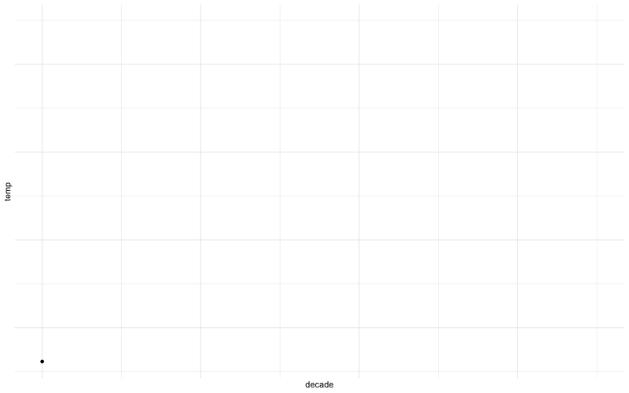


### Niederschlagsverlauf

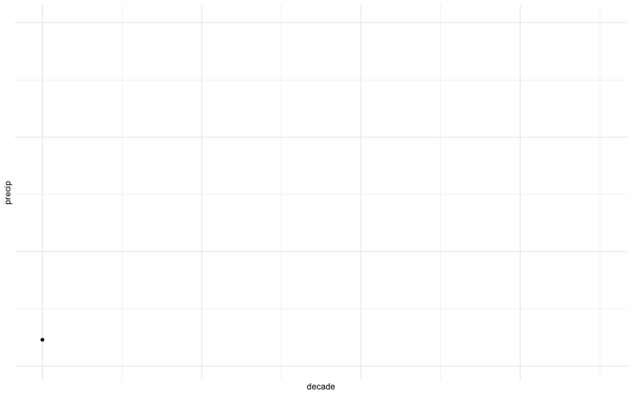

### Monatstemperaturverlauf

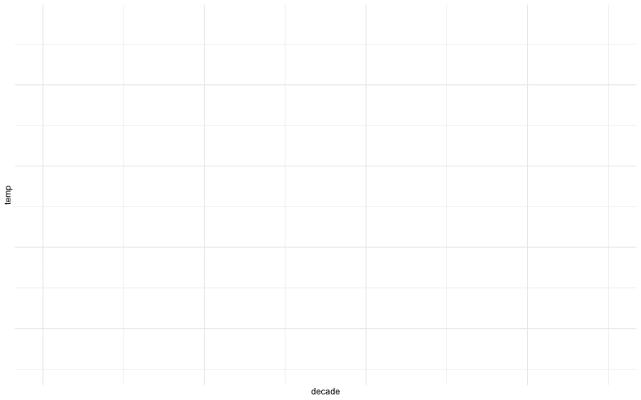

:::

Veränderung der Temperatur und Niederschlag (10-Jahres-Mittel) in Deutschland im Verlauf des 20. Jahrhunderts

::::
:::::


### Metrische UV

In diesem Abschnitt untersuchen wir lineare Modelle mit einer oder mehreren metrischen UV (und einer metrischen AV).

Sie stellen sich nun folgende Forschungsfrage:

>    [🧑‍🏫]{.content-visible when-format="html"}[\emoji{teacher}]{.content-visible when-format="pdf"} Um wieviel ist die Temperatur in Deutschland pro Jahr gestiegen, wenn man die letzten ca. 100 Jahre betrachtet?

Die Modellparameter von `lm_wetter1` sind in @tbl-lm-wetter1 zu sehen.

```{r}
#| results: hide
lm_wetter1 <- lm(temp ~ year, data = wetter)
parameters(lm_wetter1)
```

```{r}
#| echo: false
#| label: tbl-lm-wetter1
#| tbl-cap: "Modellparameter von lm_wetter1"
parameters(lm_wetter1) |> 
  select(Parameter, Coefficient, CI_low, CI_high) |> 
  print_md()
```


Laut dem Modell wurde es pro Jahr im Schnitt um 0.01$\,$°C wärmer, pro Jahrzehnt also 0.1$\,$°C und pro Jahrhundert 1$\,$°C.


>    [🧑‍🎓]{.content-visible when-format="html"}[\emoji{student}]{.content-visible when-format="pdf"} Das ist sicherlich nicht linear! Vermutlich ist die Temperatur bis 1950 konstant geblieben und jetzt knallt sie durch die Decke!

>    [🧑‍🏫]{.content-visible when-format="html"}[\emoji{teacher}]{.content-visible when-format="pdf"} Mit der Ruhe, das schauen wir uns später an.


In @tbl-lm-wetter1 finden sich zwei Arten von Information für den Wert des Achsenabschnitts ($\beta_0$) und des Regressionsgewichts von `year` ($\beta _1$):

1. *Punktschätzungen* In der Spalte `Coefficient` sehen Sie den "Best-Guess" (Punktschätzer) für den entsprechenden Koeffizienten in der Population. 
Das ist sozusagen der Wert, für den sich das Modell festlegen würde, wenn es sonst nichts sagen dürfte.

2. *Bereichschätzungen* Cleverer als Punktschätzungen sind Bereichsschätzungen (Intervallschätzungen): Hier wird ein Bereich plausibler Werte für den entsprechenden Koeffizienten angegeben. In der Spalte `CI` sehen Sie die untere bzw. die obere Grenze eines "Bereichs plausibler Werte". Dieser Schätzbereich wird auch als *Konfidenzintervall* (engl. confidence interval, CI) bezeichnet.
Ein Konfidenzintervall ist mit einer Sicherheit zwischen 0 und 1 angegeben, z.B. 95$\,$% (0.95).
Grob gesagt bedeutet ein 95$\,$%-Kondidenzintervall, dass wir uns (laut Modell) zu 95$\,$% sicher sein können, dass der wahre Werte sich in diesem Bereich befindet.
In @tbl-lm-wetter1 können wir ablesen, dass das Regressionsgewicht von `year` irgendwo zwischen praktisch Null (0.009) 
und ca. 0.01 Grad geschätzt wird.
Je schmaler das Konfidenzintervall, desto genauer wird der Effekt geschätzt 
(unter sonst gleichen Umständen). 


:::{#def-konfidenzintervall}
### Konfidenzintervall

Ein Konfidenzintervall (confidence interval, CI) 
gibt einen Schätzbereich plausibler Werte für einen Populationswert an, 
  auf Basis der Schätzung, die uns die Stichprobe liefert. $\square$
:::


Das Modell `lm_wetter1`, bzw. die Schätzungen zu den erwarteten Werten, 
kann mich sich so ausgeben lassen, s. @fig-wetter1, links.
Allerdings sind das zu viele Datenpunkte. 
Wir sollten es vielleicht anders visualisieren, s. @fig-wetter1, rechts.
Dazu aggregieren wir die Messwerte eines Jahres zu jeweils einem Mittelwert.
Auf dieser Basis erstellen wir ein neues lineares Modell, `lm_wetter1_pro_jahr`,  s. @tbl-lm-wetter1a.

```{r}
wetter_summ <-
  wetter %>% 
  group_by(year) %>% 
  summarise(temp = mean(temp),
            precip = mean(precip))  # precipitation: engl. für Niederschlag
```


```{r}
#| results: hide
# Summierte Daten (nach Jahr), aber gleiche Modellformel:
lm_wetter1_pro_jahr <- lm(temp ~ year, data = wetter_summ) 
parameters(lm_wetter1_pro_jahr) |> 
  select(Parameter, Coefficient)
```

```{r}
#| echo: false
#| label: tbl-lm-wetter1a
#| tbl-cap: "Modellparameter von lm_wetter1a"
parameters(lm_wetter1_pro_jahr) %>%
  select(Parameter, Coefficient) |> print_md()
```

Komfortabel ist es, das Modell `lm_wetter1_pro_jahr` mit `plot(estimate_relation(lm_wetter1_pro_jahr))` zu plotten.


```{r}
#| label: fig-wetter1
#| warning: false
#| echo: false
#| fig-cap: "Die Veränderung der mittleren Temperatur in Deutschland im Zeitverlauf [DWD2025]. Links: Jeder Punkt ist ein Tag (viel Overplotting, wenig nützlich). Rechts: Jeder Punkt ist ein Jahr (wetter_summ). Außerdem ist die Regressionsgerade dargestellt."
#| layout: [[45,-10, 45], [100]]
#| out-width: 100%
#| fig-subcap:
#|   - Ein Punkt pro *Tag*
#|   - Ein Punkt pro *Jahr*
ggplot(wetter) + 
  geom_point(data = wetter, aes(x = year, y = temp)) +
  geom_abline(color = ycol, 
              size = 2,
              intercept = coef(lm_wetter1)[1], 
              slope = coef(lm_wetter1)[2])

ggplot(wetter) + 
  geom_point(data = wetter_summ, aes(x = year, y = temp)) +
  geom_abline(color = ycol, 
              size = 2,
              intercept = coef(lm_wetter1_pro_jahr)[1], 
              slope = coef(lm_wetter1_pro_jahr)[2])
```


>    [🧑‍🎓]{.content-visible when-format="html"}[\emoji{student}]{.content-visible when-format="pdf"} Moment mal, der Achsenabschnitt liegt bei etwa -14 Grad! Was soll das bitte bedeuten?


### UV zentrieren

Zur Erinnerung: Der Achsenabschnitt ($\beta_0$; engl. *intercept*) ist definiert als der $Y$-Wert an der Stelle $x=0$, s. @sec-interpret-reg-mod.


In den Wetterdaten wäre Jahr=0 Christi Geburt. 
Da unsere Wetteraufzeichnung gerade mal ca. 150 Jahre in die Vergangenheit reicht,
ist es vollkommen vermessen, dass Modell 2000 Jahre in die Vergangenheit zu extrapolieren,
ganz ohne, dass wir dafür Daten haben, s. <https://xkcd.com/605/>.
Sinnvoller ist es da, z.$\,$B. einen *Referenzwert* festzulegen, etwa 1950.
Wenn wir dann von allen Jahren 1950 abziehen, wird das Jahr 1950 zum neuen Jahr Null.
Damit bezöge sich der Achsenabschnitt auf das Jahr 1950,
was Sinn macht, denn für dieses Jahr haben wir Daten.
Hat man nicht einen bestimmten Wert, der sich als Referenzwert anbietet,
so ist es nützlich den Mittelwert (der UV) als Referenzwert zu nehmen.
Diese Transformation bezeichnet man als *Zentrierung* (engl. centering) der Daten, s. @def-zentrieren und @lst-zentrieren.


:::: {.content-visible when-format="html" unless-format="epub"}

{#fig-extrapolation width=75%}
::::


```{r}
wetter <-
  wetter %>% 
  mutate(year_c = year - mean(year))  # "c" wie centered
```

Das mittlere Jahr in unserer Messwertereihe ist übrigens 1951, wie etas Datenjudo zeigt: `wetter %>% summarise(mean(year))`


Die Steigung (d.$\,$h. der Regressionskoeffizient für `year_c`) bleibt durch das Zentrieren unverändert,
nur der Achsenabschnitt ändert sich, s. @tbl-lm_wetter1_zentriert.

```{r}
#| results: hide
lm_wetter1_zentriert <- lm(temp ~ year_c, data = wetter)
parameters(lm_wetter1_zentriert) |> 
  select(Coefficient, Parameter, CI_low, CI_high)
```


```{r}
#| echo: false
#| label: tbl-lm_wetter1_zentriert
#| tbl-cap: "Modellparameter von lm_wetter1_zentriert"
parameters(lm_wetter1_zentriert) |> 
  select(Coefficient, Parameter, CI_low, CI_high) %>% 
  print_md()
```

Jetzt ist die Interpretation des Achsenabschnitts komfortabel:
Im Jahr 1951 (x=0) lag die mittlere Temperatur in Deutschland (laut DWD) bei ca. 8.5$\,$°C.
Die Regressionsgleichung lautet: `temp_pred = 8.49 + 0.01*year_c`.
In Worten: Wir sagen eine Temperatur vorher, die sich als Summe von 8.49$\,$°C plus 0.01 mal das Jahr (in zentrierter Form) berechnet.


Wie gut erklärt unser Modell die Daten?

```{r}
r2(lm_wetter1_zentriert)  # aus `{easystats}`
```

Viel Varianz des Wetters erklärt das Modell mit `year_c` aber nicht. (`year` und `year_c` sind gleich stark mit `temp` korreliert, daher wird sich die Modellgüte nicht unterscheiden.).
Macht auch Sinn: Abgesehen von der Jahreszahl spielt z.$\,$B. die Jahreszeit eine große Rolle für die Temperatur. 
Das haben wir nicht berücksichtigt.


>    [🧑‍🎓]{.content-visible when-format="html"}[\emoji{student}]{.content-visible when-format="pdf"}  Wie warm ist es laut unserem Modell dann im Jahr 2051?

```{r}
predict(lm_wetter1_zentriert, newdata = tibble(year_c = 100))
```


>    [🧑‍🎓]{.content-visible when-format="html"}[\emoji{student}]{.content-visible when-format="pdf"} Moment! Die Vorhersage ist doch Quatsch! Schon im Jahr 2022 lag die Durchschnittstemperatur bei 10,5° Celsius [@wilke2013].


>    [🧑‍🏫]{.content-visible when-format="html"}[\emoji{teacher}]{.content-visible when-format="pdf"} Wir brauchen ein besseres Modell! Zum Glück haben wir ambitionierten Wissenschaftsnachwuchs.


:::: {.content-visible when-format="html"}
Die Veränderung der auf fünf Jahre gemittelten Abweichung der Lufttemperatur zum Mittel von von 1951 bis 1980 ist in @fig-temp-de dargestellt.
Links ist eine grobe Temperaturrasterung zu sehen (Daten ab 1753)^[Quelle: <https://de.wikipedia.org/wiki/Zeitreihe_der_Lufttemperatur_in_Deutschland#cite_ref-3>]; rechts eine feinere (Daten ab 1881)^[Quelle: <https://opendata.dwd.de/climate_environment/CDC/grids_germany/monthly/air_temperature_mean/>].


:::{#fig-temp-de}
![Temperaturverlauf in Deutschland von 1753 bis 2020 [@earth_deutsch_2021]](img/temp-de.gif){width="50%"}

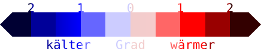
:::
::::

### Binäre UV


:::{#def-binvar}
### Binäre Variable
Eine *binäre* UV, auch *Indikatorvariable* oder *Dummyvariable* genannt, 
hat nur zwei Ausprägungen: 0 und 1. $\square$
:::


:::{#exm-bin}
### Binäre Variablen 
Das sind zum Beispiel *weiblich* mit den Ausprägungen `0` (nein) und `1` (ja) 
oder *before_1950* mit `1` für Jahre früher als 1950 und `0` ansonsten. $\square$
:::

:::{#exm-binuv}
Hier interessiert Sie folgende Forschungsfrage: 

>    [🧑‍🎓]{.content-visible when-format="html"}[\emoji{student}]{.content-visible when-format="pdf"} Ob es in der zweiten Hälfte des 20. Jahrhunderts wohl wärmer war, im Durchschnitt, als vorher? $\square$

:::

Aber wie erstellen Sie eine Variable `after_1950`, um die zweite Hälfte des 20. Jahrhunderts (und danach) zu fassen?
Nach einigem Überlegen kommen Sie auf die Idee, 
das vektorisierte Rechnen von R (s. @sec-veccalc) auszunutzen:

```{r}
year <- c(1940, 1950, 1960)
after_1950 <- year > 1950  # prüfe, ob as Jahr größer als 1950 ist
after_1950
```

Die ersten zwei Jahre  von `year` sind nicht größer als 1950, das dritte schon.
Ja, so könnte das klappen! Diese Syntax übertragen Sie auf Ihre `wetter`-Daten:

```{r}
wetter <-
  wetter %>% 
  mutate(after_1950 = year > 1950) %>% 
  filter(region != "Deutschland")  # ohne Daten für Gesamt-Deutschland
```


Scheint zu klappen!
Jetzt ein lineares Modell dazu berechnen, s. @tbl-lm-wetter-bin-uv.

```{r}
lm_wetter_bin_uv <- lm(temp ~ after_1950, data = wetter)
```

```{r}
#| echo: false
#| label: tbl-lm-wetter-bin-uv
#| tbl-cap: "Parameter von `lm_wetter_bin_uv`"
parameters(lm_wetter_bin_uv) |>
  select(Parameter, Coefficient, CI_high, CI_low) |> 
  print_md()
```


Die Parameterwerte des Modells lassen darauf schließen, 
dass es tatsächlich wärmer geworden ist nach 1950, 
und zwar offenbar ein gutes halbes Grad, s. @fig-wetter2.


```{r}
#| echo: false
#| label: fig-wetter2
#| layout: [[45,-10, 45], [100]]
#| fig-cap: "Modell: `temp ~ after_1950`, (a) Der Schätzbereich für den Parameter reicht von ca. 0.5 bis 0.8 Grad Unterschied. (b) Der Unterschied sieht in dieser Darstellung nicht groß aus."
#| fig-subcap: 
#|   - "Mittelwertsunterschied als Regressionsparameter"
#|   - "Mittelwertsunterschied als Verteilungsvergleich"


lm_wetter_bin_uv |> 
  parameters() |> 
  plot() +
  theme_large_text() +
    theme(legend.position = "none") 

wetter |> 
  ggplot(aes(x = after_1950, y = temp)) +
  geom_boxplot(alpha = .5) +
  #geom_violin(alpha = .5) +
  stat_summary(fun = mean, 
               geom = "point", color = okabeito_colors()[1], 
               alpha = .7,
               size = 5) +  # Add mean points
  stat_summary(fun = mean, 
               geom = "line", 
               aes(group = 1), color = okabeito_colors()[2], 
               linewidth = 1)  + # Connect means | 
  theme_large_text()
```


Leider zeigt ein Blick zum Ergebnis der Funktion `r2`, dass die Vorhersagegüte des Modells zu wünschen übrig lässt (`r2(lm_wetter_bin_uv)`).
Wir brauchen ein besseres Modell.

Um die Koeffizienten eines linearen Modells auszurechnen,
benötigt man eine metrische UV und eine metrische AV.
Hier haben wir aber keine richtige metrische UV,
sondern eine *logische* Variable mit den Werten `TRUE` und `FALSE`.
Um die UV in eine metrische Variable umzuwandeln, 
gibt es einen einfachen Trick,
den R für uns ohne viel Ankündigung durchführt: 
Umwandling in eine oder mehrere *binäre* Variablen, s. @def-binvar.


Hat eine nominale UV *zwei* Stufen, so überführt (synonym: transformiert) `lm` diese Variable in *eine* binäre Variable.
Da eine binäre Variable wie eine metrische angesehen werden kann, 
kann die Regression in gewohnter Weise durchgeführt werden.
Wenn Sie die Ausgabe der Parameter betrachten, 
so sehen Sie die neu erstellte binäre Variable (s. @tbl-lm-wetter-bin-uv).
Man beachte, dass der ursprüngliche Datensatz nicht geändert wird, 
nur während der Analyse von `lm` wird die Umwandlung der Variable  durchgeführt.

In unserem Fall liegt mit `after_1950` eine *logische* Variable mit den Werten `TRUE` und `FALSE` vor.
`TRUE` und `FALSE` werden von R automatisch als `1` bzw. als `0` verstanden. 
Also: Eine logische Variable ist schon eine binäre Variable.


>    [🤖]{.content-visible when-format="html"}[\emoji{robot}]{.content-visible when-format="pdf"} Eine `1` kannst du als "Ja! Richtig!" verstehen und eine `0` als "Nein! Falsch!"


::::: {.content-visible when-format="html"}

:::{#exm-bin-trans}
### Beispiel: 'Geschlecht' in eine binäre Variable umwandeln.

Angenommen wir haben eine Variable `geschlecht` 
mit den zwei Stufen `Frau` und `Mann`
und wollen diese in eine Indikatorvariable umwandeln.
Da "Frau" alphabetisch vor "Mann" kommt, 
nimmt R "Frau" als *erste* Stufe bzw. als *Referenzgruppe*. 
"Mann" ist dann die zweite Stufe, 
die in der Regression dann in Bezug zur Referenzgruppe gesetzt wird.
`lm` wandelt uns diese Variable in `geschlechtMann` 
um mit den zwei Stufen `0` (kein Mann, also Frau) und `1` (Mann). $\square$
:::


:::: {layout="[ 40, 20, 40 ]"}
::: {#first-column}


```{r}
#| echo: false

d2 <- tribble(
  ~id, ~geschlecht, ~geschlechtMann,
  1,   "Mann",       1,
  2,  "Frau",       0
)

d2[1:2] %>% knitr::kable()
```

:::

::: {#sec-col}
$\qquad \rightarrow$
:::

::: {#third-col}
```{r}
#| echo: false

d2 <- tribble(
  ~id, ~geschlecht, ~geschlechtMann,
  1,   "Mann",       1,
  2,  "Frau",        0
)

d2[c(1,3)] %>% knitr::kable()

```
:::
::::
:::::

:::{.callout-important}
Ein lineares Modell mit binärer UV zeigt nichts anderes als die Differenz der Gruppenmittelwerte. $\square$
:::

```{r}
wetter %>% 
  group_by(after_1950) %>% 
  summarise(temp_mean = mean(temp))
```

Die Interpretation eines linearen Modells mit binärer UV veranschaulicht @fig-binvar: 
Der Achsenabschnitt ($\beta_0$) entspricht dem Mittelwert der 1. Gruppe.
Der Mittelwert der 2. Gruppe entspricht der *Summe* aus Achsenabschnitt und dem Koeffizienten der zweiten Gruppe. 
(@fig-binvar zeigt nur die Daten für den Monat Juli im Bundesland Bayern, der Einfachheit und Übersichtlichkeit halber.)

```{r}
#| echo: false
#| label: fig-binvar
#| out-width: "75%"
#| fig-cap: Sinnbild zur Interpretation eines linearen Modells mit binärer UV (reingezoomt, um den Mittelwertsunterschied hervorzuheben)

wetter4 <-
  wetter |> 
  filter(month == 7, region == "Bayern") |> 
  mutate(after1950_TRUE = ifelse(after_1950, 1, 0)) 

lm4 <- lm(temp ~ after1950_TRUE, data = wetter4)

wetter4 %>% 
  ggplot(aes(x = after1950_TRUE, y = temp)) +
  geom_jitter(alpha = .5, width = .2) +
  #geom_violin(alpha = .7) +
  theme_minimal() +
  geom_hline(yintercept = coef(lm4)[1], linetype = "dashed") +
  geom_hline(yintercept = coef(lm4)[1] + coef(lm4)[2], linetype = "dashed") +
  geom_abline(slope =  coef(lm4)[2], intercept =  coef(lm4)[1], color = "grey20") +
  stat_summary(fun = "mean", color = "grey20") +
  annotate("point", x = 0, y = coef(lm4)[1], 
           color = beta0col, size = 5) +
  annotate("label", x = 0, y = coef(lm4)[1], 
           color = beta0col, label = "hat(beta)[0]",
           parse = TRUE, hjust = "left") +
  geom_segment(x = 1, y = coef(lm4)[1], yend = coef(lm4)[1] + coef(lm4)[2], 
               color = beta1col,
               linewidth = 1.2,
             arrow = arrow(length = unit(0.03, "npc"))) +
  annotate("label", x = 1, y = coef(lm4)[1] +  coef(lm4)[2]*0.5, 
           color = beta1col, label = "hat(beta)[1]",
           parse = TRUE, hjust = 2) +
  scale_x_continuous(breaks = c(0, 1)) +
  coord_cartesian(ylim = c(16, 18)) +
  annotate("label", x = c(0, 1), y = 16, label = c("bis 1950", "nach 1950"))
  
```

Fassen wir die Interpretation der Koeffizienten für das Modell mit binärer UV zusammen:

1. Mittelwert der 1. Gruppe (bis 1950): [Achsenabschnitt ($\beta_0$)]{.beta0col}
2. Mittelwert der 2. Gruppe (nach 1950): [Achsenabschnitt ($\beta_0$)]{.beta0col} + [Steigung der Regressionsgeraden ($\beta_1$)]{.beta1col}


::: {.content-visible unless-format="epub"}
Für die Modellwerte $\color{modelcol}{\hat{y}}$ gilt also:

- Temperatur laut Modell bis 1950: $\color{modelcol}{\hat{y}} = \color{beta0col}{\beta_0} = 17.7$ 

- Temperatur laut Modell bis 1950: $\color{modelcol}{\hat{y}} = \color{beta0col}{\beta_0} +  \color{beta1col}{\beta_1}= \color{beta0col}{17.7} + \color{beta1col}{0.6} = 18.3$ 
:::


:::: {.content-visible when-format="epub"}
Für die Modellwerte ${\hat{y}}$ gilt also:

- Temperatur laut Modell bis 1950: ${\hat{y}} = {\beta_0} = 17.7$ 

- Temperatur laut Modell bis 1950: ${\hat{y}} = {\beta_0} + {\beta_1}= {17.7} + {0.6} = 18.3$ 
::::


Bei *nominalen* (und auch bei *binären*) Variablen kann man ${\beta_1}$ als einen *Schalter* verstehen; bei *metrischen* Variablen als einen *Dimmer*.^[Ich danke Karsten Lübke für diese Idee.] $\square$


### Nominale UV

In diesem Abschnitt betrachten wir ein lineares Modell (für uns synonym: Regressionsmodell) mit einer mehrstufigen (nominalskalierten) UV. 
So ein Modell ist von den Ergebnissen her praktisch identisch zu einer   *Varianzanalyse* mit einer einzigen UV.


:::{#exm-wetter2}
Ob es wohl substanzielle Temperaturunterschiede zwischen den Bundesländern gibt?
:::

Befragen wir dazu ein lineares Modell; 
in @tbl-lm_wetter_region sind für jeden Parameter der Punktschätzer (Koeffizient)
und der zugehörige Schätzbereich (Konfidenzintervall) 
mit Ober- und Untergrenze angegeben.


```{r}
#| results: false
lm_wetter_region <- lm(temp ~ region, data = wetter)
```


```{r}
#| echo: false
#| label: tbl-lm_wetter_region
#| tbl-cap: "Modellparameter für `lm_wetter_region`"
#| message: false
lm_wetter_region_params <- 
  parameters(lm_wetter_region) 

lm_wetter_region_params |> 
  select(Parameter, Coefficient, CI_high, CI_low) |>
  print_md()
```

Hat die nominalskalierte UV mehr als zwei Stufen, 
so transformiert `lm` sie in mehr als eine Indikatorvariable um.
Genauer gesagt ist es immer eine Indikatorvariable 
weniger als es Stufen in der nominalskalierten Variablen gibt.
Allgemein gilt: Hat eine nominale Variable $k$ Stufen, so wird diese Variable von `lm` in $k-1$ binäre Variablen umgewandelt.


Betrachten wir ein einfaches Beispiel, eine Tabelle mit der Spalte `Bundesland` -- aus Gründen der Einfachheit hier nur mit *drei* Bundesländern. 
Damit `lm` arbeiten kann, wird `Bundesland` in *zwei* Indikatorvariablen umgewandelt.


:::: {layout="[ 30, 10, 60 ]"}
::: {#first-column-bu}

```{r}
#| echo: false

d <- tribble(
  ~id, ~Bundesland, ~BL_Bayern, ~BL_Bra,
  1,   "BaWü",       0,   0,
  2,  "Bayern",       1,  0,
  3, "Brandenburg",   0,  1
)

d[1:2] %>% knitr::kable()
```

:::

::: {#second-column-bu}
<br />
<br />
$\quad \rightarrow$
:::


::: {#third-column-bu}
```{r}
#| echo: false

d[c(1,3, 4)] %>% knitr::kable()
```
:::
::::


Auch im Fall mehrerer Ausprägungen einer nominalen Variablen gilt die gleiche Logik der Interpretation wie bei binären Variablen:


1. Mittelwert der 1. Gruppe: Achsenabschnitt ($\beta_0$)
2. Mittelwert der 2. Gruppe: Achsenabschnitt ($\beta_0$) + Steigung der 1. Regressionsgeraden ($\beta_1$)
3. Mittelwert der 3. Gruppe: Achsenabschnitt ($\beta_0$) + Steigung der  2. Regressionsgeraden ($\beta_2$)
4. usw.

Es kann nervig sein, dass das Bundesland, 
welches als *Referenzgruppe* (sprich als Gruppe des Achsenabschnitts) ausgewählt wurde nicht explizit in der Ausgabe angegeben ist.
Der Wert der Referenzgruppe findet seinen Niederschlag im Achsenabschnitt.
Bei einer Variable vom Typ `character` wählt R den alphabetisch ersten Wert als Referenzgruppe für ein lineares Modell aus. Bei einer Variable vom Typ `factor` ist die Reihenfolge bereits festgelegt, vgl. @sec-faktorvar.
Der Mittelwert dieser Gruppe entspricht dem Achsenabschnitt. 


:::{#exm-bawü}
### Achsenabschnitt in wetter_lm2
Da Baden-Württemberg das alphabetisch erste Bundesland ist, wird es von R als Referenzgruppe ausgewählt, dessen Mittelwert als Achsenabschnitt im linearen Modell hergenommen wird. $\square$
:::


Am einfachsten verdeutlicht sich `lm_wetter_region` vielleicht mit einem Diagramm, s. @fig-bin-nom.


```{r}
#| echo: false
#| label: fig-bin-nom
#| out-width: 100%
#| fig-cap: Sinnbild zur Interpretation eines linearen Modells mit nominaler UV (reingezoomt, um den Mittelwertsunterschied hervorzuheben). 

wetter_summ <- 
  wetter %>% 
  group_by(region) %>% 
  summarise(temp = mean(temp)) %>% 
  mutate(id = 0:15) %>% 
  ungroup() %>%
  mutate(grandmean = mean(temp),
         delta = temp - grandmean)

wetter_summ %>%  
# filter(region != "Deutschland") %>% 
  ggplot(aes(y = region, x = temp)) +
  theme_minimal() +
  geom_label(aes(label = paste0("b", id),
                 x = grandmean + delta), 
             vjust = 1,
             size = 2) +
  #stat_summary(fun = "mean", color = "grey20") + 
  geom_vline(xintercept = coef(lm_wetter_region)[1], linetype = "dashed", color = okabeito_colors()[2]) +
  coord_cartesian(xlim = c(7, 10), ylim = c(0, 16))  +
  
  #coord_flip() +
  annotate("label",
           y = 1,
           x = coef(lm_wetter_region)[1],
           vjust = 1,
           label = paste0("b0"),
           #size = 6,
           color = beta0col) +
  annotate("point", 
           y = 1, 
           x = coef(lm_wetter_region)[1], 
           color = beta0col,
           #vjust = 1,
           size = 4) +
  geom_segment(aes(yend = region, xend = temp), 
               x = coef(lm_wetter_region)[1])  +
    geom_point() +
  labs(y = "",
       x = "Temperatur")
```


:::{#exm-months}
### Niederschlagsmenge im Vergleich der Monate

Eine weitere Forschungsfrage, die Sie nicht außer acht lassen wollen, ist die Frage nach den jahreszeitlichen Unterschieden im Niederschlag (engl. precipitation).
Los R, rechne! $\square$
:::

>    [🤖]{.content-visible when-format="html"}[\emoji{robot}]{.content-visible when-format="pdf"} Endlich geht's weiter! [Ergebnisse findest du in @tbl-lm_wetter-month!]{.content-visible when-format="html"}


```{r}
#| results: hide
lm_wetter_month <- lm(precip ~ month, data = wetter)
parameters(lm_wetter_month)
```

```{r}
#| echo: false
#| eval: !expr knitr:::is_html_output()
#| label: tbl-lm_wetter-month
#| tbl-cap: Modellparameter für lm_wetter_month
parameters(lm_wetter_month) %>% print_md()
```


Ja, da scheint es deutliche Unterschiede im Niederschlag zu geben. 
Wir brauchen ein Diagramm zur Verdeutlichung, s. @fig-wetter-month, links (`plot(estimate_expectation(lm_wetter_month)`).
Oh nein:  R betrachtet `month` als numerische Variable! 
Aber "Monat" bzw. "Jahreszeit" sollte nominal sein.

>    [🤖]{.content-visible when-format="html"}[\emoji{robot}]{.content-visible when-format="pdf"} Aber `month` ist als Zahl in der Tabelle hinterlegt. Jede ehrliche Maschine verarbeitet eine Zahl als Zahl, ist doch klar!

>    [👩]{.content-visible when-format="html"}[\emoji{woman}]{.content-visible when-format="pdf"} Okay, R, wir müssen  `month` in eine nominale Variable transformieren. Wie geht das?


>    [🤖]{.content-visible when-format="html"}[\emoji{robot}]{.content-visible when-format="pdf"} Dazu kannst du den Befehl `factor` nehmen. Damit wandelst du eine numerische Variable in eine nominalskalierte Variable (Faktorvariable) um. Faktisch heißt das, dass dann eine Zahl als Text gesehen wird.


:::{#exm-factor}
Transformiert man `42` mit `factor`, so wird aus `42` `"42"`. Aus der Zahl wird ein Text.
Alle metrischen Eigenschaften gehen verloren; die Variable ist jetzt auf nominalen Niveau. $\square$
:::

```{r}
wetter <-
  wetter %>% 
  mutate(month_factor = factor(month))
```

Jetzt berechnen wir mit der faktorisierten Variablen ein lineares Modell, s. @tbl-lm_wetter_month_factor.

```{r}
#| results: hide
lm_wetter_month_factor <- lm(precip ~ month_factor, data = wetter)
parameters(lm_wetter_month_factor) |> 
  select(Parameter, Coefficient)
```

```{r}
#| echo: false
#| label: tbl-lm_wetter_month_factor
#| tbl-cap: "Modellparameter von lm_wetter_month_factor (nur die ersten paar Parameter)"
parameters(lm_wetter_month_factor) |> 
  select(Parameter, Coefficient) 
```


Sehr schön! Jetzt haben wir eine Referenzgruppe (Monat 1, d.$\,$h. Januar) und 11 Unterschiede zum Januar, s. @fig-wetter-month. 

:::{#exr-fig-wetter-month}
In ähnlicher Form zu @fig-wetter-month könnten Sie auch die Regressionsgewichte wie folgt plotten: `parameters(lm_wetter_month_factor) |> plot()`. Was sind die Unterschiede zu @fig-wetter-month?^[In @fig-wetter-month? wird nicht der Schätzbereich für die Regressionsgewichte dargestellt, sondern stattdessen die SD der AV.]  $\square$
:::


```{r}
#| echo: false
wetter_summ2 <- wetter %>%
  group_by(month_factor) %>%
  summarise(
    mean_precip = mean(precip, na.rm = TRUE),
    sd_precip = sd(precip, na.rm = TRUE)
  )
```


```{r}
#| label: fig-wetter-month
#| fig-cap: "Niederschlagsmengen nach Monaten (Mittelwerte plus SD)"
#| fig-asp: 0.5

ggerrorplot(data = wetter,
            x = "month_factor",
            y = "precip",
            desc_stat = "mean_sd")
```


Möchte man die Referenzgruppe eines Faktors ändern, 
kann man dies mit `relevel` tun:

```{r}
wetter <-
  wetter %>% 
  mutate(month_factor = relevel(month_factor, ref = "7"))
```

So sieht dann die geänderte Reihenfolge aus:^[Zum Dollar-Operator s. @sec-dollar-op]

```{r}
levels(wetter$month_factor)
```


### Binäre plus metrische UV {#sec-faktorvar}

In diesem Abschnitt untersuchen wir ein lineares Modell mit zwei UV: einer *zweistufigen* (binären) UV plus einer *metrischen* UV. 
Ein solches Modell kann auch als *Kovarianzanalyse* (engl. analysis of covariance, ANCOVA) bezeichnet werden.

:::{#exm-rain1}
Ob sich die Niederschlagsmenge wohl unterschiedlich zwischen den Monaten entwickelt hat in den letzten gut 100 Jahren?
Der Einfachheit halber greifen Sie sich nur zwei Monate heraus (Januar und Juli).

```{r def-wetter-month}
wetter_month_1_7 <-
  wetter %>% 
  filter(month == 1  | month == 7) 
```


>    [🧑‍🏫]{.content-visible when-format="html"}[\emoji{teacher}]{.content-visible when-format="pdf"} Ich muss mal kurz auf eine Sache hinweisen …

Eine Faktorvariable ist einer der beiden Datentypen in R, die sich für nominalskalierte Variablen anbieten: 
Textvariablen (`character`) und Faktor-Variablen (`factor`).
Ein wichtiger Unterschied ist, dass die erlaubten Ausprägungen ("Faktorstufen") bei einer Faktor-Variable mitgespeichert werden, 
bei der Text-Variable nicht.
Das kann praktisch sein, denn bei einer Faktorvariable ist immer klar, welche Ausprägungen in Ihrer Variable möglich sind. $\square$
:::


:::{#exm-factor1}
### Beispiele für Faktorvariablen

```{r def-geschlecht-factor}
geschlecht <- c("f", "f", "m")
geschlecht_factor <- factor(geschlecht)
geschlecht_factor
```
:::


Filtern verändert die Faktorstufen nicht.
Wenn Sie von der Faktorvariablen^[synonym: nominalskalierte Variable] `geschlecht` das 3. Element (`"m"`) herausfiltern, 
so dass z.$\,$B. nur die ersten beiden Elemente übrig bleiben mit allein der Ausprägung `"f"`, merkt sich R trotzdem, dass die Variable laut Definition
*zwei* Faktorstufen besithzt (`"f"` und `"m"`).

Genau so ist es, wenn Sie aus `wetter` nur die Monate  `"1"` und `"7"` herausfiltern:
R merkt sich, dass es 12 Faktorstufen gibt. 
Möchten Sie die herausgefilterten Faktorstufen "löschen", 
so können Sie einfach die Faktorvariable neu definieren (mit `factor`).


```{r wetter-month-1-7}
wetter_month_1_7 <-
  wetter %>% 
  filter(month == 1  | month == 7) %>% 
  # Faktor (und damit die Faktorstufen) neu definieren:
  mutate(month_factor = factor(month))
```


Hat man mehrere ("multiple") X-Variablen (Prädiktoren, unabhängige Variablen), 
so trennt man sich mit einem Plus-Zeichen in der Regressionsformel, z.$\,$B. `temp ~ year_c + month`.


:::{#def-mult-regr}
### Multiple Regression
Eine multiple Regression beinhaltet mehr als eine X-Variable. Die Modellformel spezifiziert man so:

$y \sim x_1 + x_2 + \ldots + x_n \qquad \square$
:::


::: {.content-visible when-format="html"}

Die Veränderung der monatlichen Temperatur (10-Jahres-Mittel) ist in @fig-wetter-anim, c) dargestellt (aber mit allen 12 Monaten, sieht schöner aus).
:::


Das Pluszeichen hat in der Modellgleichung (synonym: Regressionsformel) *keine* arithmetische Funktion. 
Es wird nichts addiert.
In der Modellgleichung sagt das Pluszeichen nur "und noch folgende UV …". 


Die Modellgleichung von `lm_year_month` liest sich also so:

>    Temperatur ist eine Funktion von der (zentrierten) Jahreszahl und des Monats


```{r lm-year-month-def}
lm_year_month <- lm(precip ~ year_c + month_factor, 
                    data = wetter_month_1_7)
```

Die Modellparameter sind in @tbl-lm-year-month zu sehen.

```{r lm-year-month-params}
#| echo: false
#| label: tbl-lm-year-month
#| tbl-cap: "Modellparameter von lm_year_month"
parameters(lm_year_month) %>% 
  select(Coefficient, Parameter, CI_low, CI_high) |> 
  print_md()
```


Die Modellkoeffizienten sind so zu interpretieren:

1. Achsenabschnitt ($\beta_0$, `Intercept`): Im Referenzjahr (1951) im *Referenzmonat Januar* lag die Niederschlagsmenge bei 57$\,$mm pro Quadratmeter.
2. Regressionskoeffizient für Jahr ($\beta_1$, `year_c`): Pro Jahr ist die Niederschlagsmenge im Schnitt um 0.03$\,$mm an (im Referenzmonat).
3. Regressionskoeffizient für Monat ($\beta_2$, `month_factor7`) Im Monat `7` (Juli) lag die mittlere Niederschlagsmenge (im Referenzjahr) knapp 25$\,$mm über dem mittleren Wert des Referenzmonats (Januar).


Die Regressiongleichung von `lm_year_month` lautet: 
`precip_pred = 56.94 + 0.03*year_c + 24.37*month_factor_7`.
Im Monat Juli ist `month_factor_7 = 1`, 
ansonsten (Januar) ist `month_factor = 0`. 
Demnach erwarten wir laut Modell `lm_year_month` im Juli des Referenzjahres `r 56.94 + 24.37`$\,$mm Niederschlag.
Die Werte der Regressionskoeffizienten sind @tbl-lm-year-month entnommen.

>    [🧑‍🎓]{.content-visible when-format="html"}[\emoji{student}]{.content-visible when-format="pdf"} Puh, kompliziert!

>    [🧑‍🏫]{.content-visible when-format="html"}[\emoji{teacher}]{.content-visible when-format="pdf"} Es gibt einen Trick, man kann sich von R einfach einen beliebigen Y-Wert berechnen lassen, s. @exm-niederschlag1.


:::{#exm-niederschlag1}
### Niederschlag laut Modell Im Juli 2020?
Hey R, berechne uns anhand neuer Daten den laut Modell zu erwartenden Niederschlag für Juli im Jahr 2020!

```{r predict-lm-year-month}
neue_daten <- tibble(year_c = 2020-1951,
                     month_factor = factor("7"))
predict(lm_year_month, newdata = neue_daten)
```

Das Modell erwartet Niederschlag in Höhe von `r predict(lm_year_month, newdata = neue_daten)`$\,$mm. 
Mit `predict` kann man sich Vorhersagen eines Modells ausgeben lassen. $\square$
:::


Alle Regressionskoeffizienten beziehen sich auf die AV *unter der Annahme, dass alle übrigen UV den Wert Null (bzw. Referenzwert) aufweisen*.


Visualisieren wir uns die geschätzten Erwartungswert pro Wert der UV, 
s. @fig-lm3: `plot(estimate_expectation(lm_year_month))`

```{r plot-lm3}
#| label: fig-lm3
#| fig-cap: "Niederschlag für Januar (month 1) und Juli (month 7) im Verlauf der Jahre. Man beachte, dass die Regressionsgeraden _parallel_ sind."
#| echo: false
#| fig-asp: 0.5

ggplot(wetter_month_1_7) +
  aes(x = year_c, 
      y = precip, 
      color = month_factor,
      group = month_factor) +
  geom_point(alpha = .1, aes(shape = month_factor)) +
  scale_color_okabeito() +
  geom_abline(slope = coef(lm_year_month)[2],
              intercept = coef(lm_year_month)[1], 
              color = okabeito_colors()[1], size = 2,
              linetype = "1111") +
  geom_abline(slope = coef(lm_year_month)[2],
              intercept = coef(lm_year_month)[1] + coef(lm_year_month)[3], color = okabeito_colors()[2], size = 2) +
  annotate("label", x = Inf,
           y = predict(lm_year_month, newdata = tibble(year_c = 50, month_factor = factor("1"))),
           label = "month 1", hjust = 1.1) +
  scale_x_continuous(limits = c(-100, 100)) +
  theme(legend.position = "none") +
  annotate("label", x = Inf,
           y = predict(lm_year_month, newdata = tibble(year_c = 50, month_factor = factor("7"))),
           label = "month 7", hjust = 1.1)

```

Mit `scale_color_okabeito` haben wir die Standard-Farbpalette durch die von  @okabeito ersetzt [s. @barrett2021].
Das ist nicht unbedingt nötig, 
aber robuster bei Sehschwächen, vgl. @sec-farbwahl.
Die erklärte Varianz von `lm_year_month` liegt bei:
```{r}
r2(lm_year_month)
```


### Interaktion

Eine Modellgleichung der Form `temp ~ year + month` zwingt die Regressionsgeraden dazu, parallel zu verlaufen.
Aber vielleicht würden sie besser in die Punktewolken passen, 
wenn wir ihnen erlauben, auch *nicht* parallel verlaufen zu dürfen?
Nicht-parallele Regressionsgeraden erlauben wir, 
indem wir das Regressionsmodell wie folgt spezifizieren und visualisieren, s. @lst-lm-interact.


```{r lm_year_month_interaktion}
#| lst-label: lst-lm-interact
#| lst-cap: "Ein Interaktionsmodell spezifiziert man in dieser Art: y ~ x1 + x2 + x1:x2"
lm_year_month_interaktion <- lm(
  precip ~ year_c + month_factor + year_c:month_factor, 
  data = wetter_month_1_7)
```

Visualisiert ist das Modell in @fig-wetter-interakt.

```{r plot-lm_year_month_interaktion}
#| results: hide
#| eval: false
plot(estimate_relation(lm_year_month_interaktion)) 
```


```{r plot-precip-interaction}
#| echo: false
#| label: fig-wetter-interakt
#| fig-asp: 0.5
#| fig-cap: "Niederschlag im Jahresverlauf und Monatsvergleich mit Interaktionseffekt: Die Veränderung im Verlauf der Jahre ist unterschiedlich für die Monate (Januar vs. Juli). Die beiden Regressionsgeraden sind _nicht_ parallel."

d <- tibble(
    year_c = 100,  # Adjust x-position slightly for better spacing
    precip = c(
      predict(lm_year_month_interaktion, newdata = tibble(year_c = 50, month_factor = factor("7"))),
      predict(lm_year_month_interaktion, newdata = tibble(year_c = 50, month_factor = factor("1")))
    ),
    label = c("month 7", "month 1"),
    month_factor = c("7", "1")
  )

ggplot(wetter_month_1_7) +
  aes(x = year_c, 
      y = precip, 
      color = month_factor,
      linetype = month_factor,
      group = month_factor) +
  geom_point(alpha = .2, aes(shape = month_factor)) +  # Removed geom_point2 (assuming it was a typo)
  geom_smooth(method = "lm", size = 2, fullrange = TRUE) +
  scale_color_okabeito() +
  scale_x_continuous(limits = c(-100, 125)) +
  theme(legend.position = "none") +
  geom_label_repel(
    data = d,
    aes(x = year_c, y = precip, label = label),
    hjust = 1.1,
    nudge_x = 5,  # Nudges labels slightly to the right
    nudge_y = 0.1,  # Adjusts vertical spacing to reduce overlap
    direction = "y",  # Moves labels along the y-axis
    segment.color = "gray50",  # Draws connecting line
    size = 5
  ) 
```


Der *Doppelpunkt-Operator* (`:`) fügt der Regressionsgleichung einen *Interaktionseffekt* hinzu, 
in diesem Fall die Interaktion von Jahr (`year_c`) und Monat (`month_factor`):


`precip ~ year_c + month_factor + year_c:month_factor`


:::{#def-interakt}
### Interaktionseffekt
Einen Interaktionseffekt von x1 und x2 kennzeichnet man in R mit dem Doppelpunkt-Operator, `x1:x2`:

`y ~ x1 + x2 + x1:x2` $\square$
:::

In Worten: 

>   y wird modelliert als eine Funktion von x1 und x2 und dem Interaktionseffekt von x1 mit x2.


Wie man in @fig-wetter-interakt sieht, sind die beiden Regressionsgeraden *nicht parallel*.
Sind die Regressionsgeraden von zwei (oder mehr) Gruppen nicht parallel,
so liegt ein *Interaktionseffekt* vor.
In diesem Fall ist der Interaktionsffekt ungleich Null. $\square$


:::{#exm-interakt-precip}
### Interaktionseffekt von Niederschlag und Monat

Wie ist die Veränderung der Niederschlagsmenge (Y-Achse) im Verlauf der Jahre (X-Achse)?
*Das kommt darauf an, welchen Monat man betrachtet*.
Der Effekt der Zeit ist *unterschiedlich* für die Monate:
Im Juli nahm der Niederschlag ab, im Januar zu. $\square$
:::

Liegt ein Interaktionseffekt vor, 
kann man nicht mehr von "dem" (statistischen) Effekt einer UV (auf die AV) sprechen.
Vielmehr muss man unterscheiden: 
Je nach Gruppe (z.$\,$B. Monat) unterscheidet der Effekt des Jahres auf die Niederschlagsmenge.
("Effekt" ist hier immer statistisch, nie kausal gemeint.)
Betrachten wir die Parameterwerte des Interaktionsmodells, 
s. @tbl-lm_year_month_interaktion.


```{r} 
#| echo: false
#| label: tbl-lm_year_month_interaktion
#| tbl-cap: "Modellparameter von lm_year_month_interaktion"
parameters(lm_year_month_interaktion) %>% select(Parameter, Coefficient, CI_low, CI_high)
```

Neu bei der Ausgabe zu diesem Modell ist die unterste Zeile für den Parameter `year c × month factor [7]`.
Sie gibt die Stärke des Interaktionseffekts an.
<!-- Da die Null nicht im Schätzbereich (`95 CI`) liegt, ist der Interaktionseffekt offenbar nicht Null, also vorhanden (zumindest laut unserem Modell^[unser Modell könnte ja auch falsch sein.]. -->
Die Zeile zeigt, 
wie unterschiedlich sich die die Niederschlagsmenge 
zwischen den beiden Monaten im Verlauf der Jahre ändert: 
Pro Jahr ist die Zunahme an Niederschlag um 0.20$\,$mm geringer
als im Referenzmonat (Januar).
Damit resultiert für Juli insgesamt ein positiver Effekt: 
`0.13 - -0.20 = 0.07`.
Insgesamt lautet die Regressionsgleichung:
`precip_pred = 56.91 + 0.13 * year_c + 24.37 * month_factor_7 - 0.20 * year_c:month_factor_7`.


:::{.callout-important}
Der Achsenabschnitt gibt den Wert der AV an unter der Annahme, dass alle UV den Wert Null aufweisen. $\square$
:::

Wenn eine Beobachtung in allen UV den Wert 0 hat, 
so gibt der Achsenabschnitt  den Niederschlag für den Januar des Jahres 1951 an.
Die Regressionskoeffizienten geben die Zunahme in der AV an, 
wenn der jeweilige Wert der UV um 1 steigt, 
die übrigen UV aber den Wert 0 aufweisen. 


Das $R^2$ von `lm_year_month_interaktion` beträgt übrigens 
nur geringfügig mehr als im Modell ohne Interaktion:

```{r}
r2(lm_year_month_interaktion)  # aus `{easystats}`
```

Da man Modelle so einfach wie möglich halten sollte,
könnten wir auf den Interaktionseffekt im Modell verzichten.
Der Interaktionseffekt verbessert die Modellgüte nur geringfügig.
Falls wir aber von einer starken Theorie ausgehen,
die den Interaktionseffekt verlangt,
hätten wir einen triftigen Grund, 
den Interaktionseffekt im Modell zu belassen.


\clearpage

## Modelle mit vielen UV


### Zwei metrische UV

Ein Modell mit zwei metrischen UV kann man sich im 3D-Raum visualisieren, s. @fig-3d-regr-statisch, oder im 2D-Raum, s. @fig-3d-regr-2d.
Im 3D-Raum wird die Regressionsgerade zu einer *Regressionsebene*.


```{r}
#| include: false

df_3d <-
  tibble(x1 = rnorm(mean = 0, sd = 1, n=  100),
         x2 =  rnorm(mean = 0, sd = 1, n=  100),
         y = 3 + 2*x1 + x2 + rnorm(mean = 0, sd = 0.1, n = 100)
         )

lm3d <- lm(y ~ x1 + x2, data = df_3d)
```


::: {#fig-3d-regr-statisch layout-ncol=3}


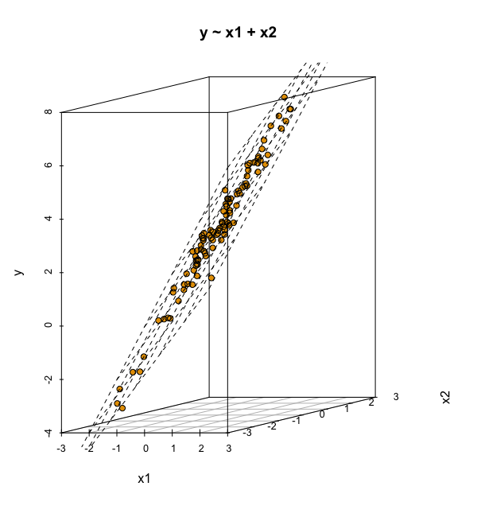

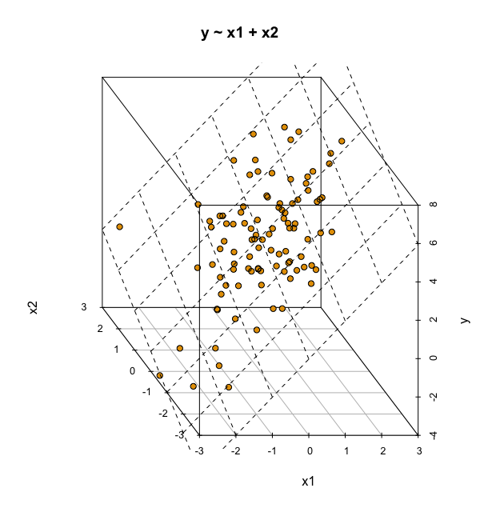

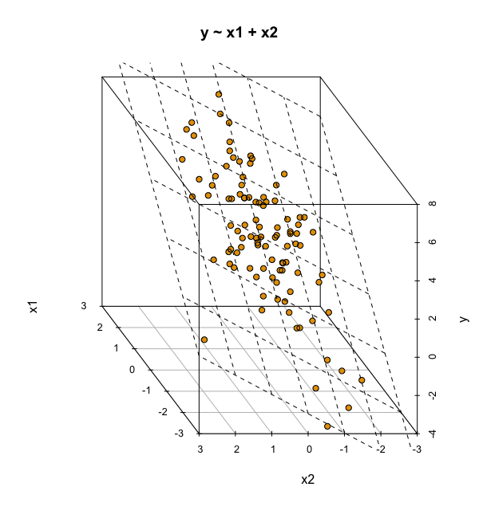


Ein lineares Modell, `y ~ x1 + x2` mit zwei UV im 3D-Raum.

:::


```{r}
#| fig-cap: 2D-Diagramm für 3D-Modell
#| echo: false
#| out-width: 75%
#| label: fig-3d-regr-2d
lm3d_expect <- estimate_relation(lm3d)
plot(lm3d_expect)
```


:::::{.content-visible when-format="html" unless-format="epub"}


::::{#fig-3d-regr}

:::{.panel-tabset}

#### 3D-Animation

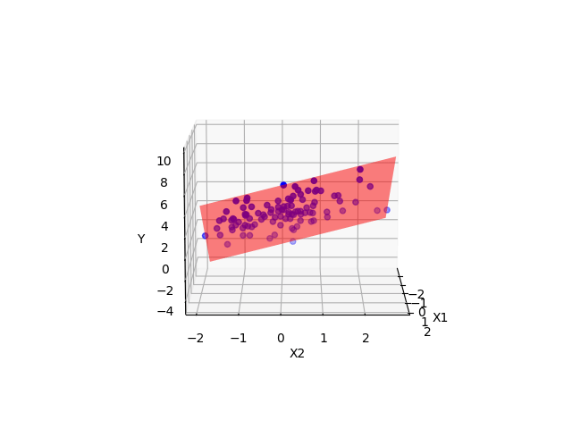{#fig-regression-plane-rotation}


#### 2D-Diagramm für 3D-Modell

```{r}
#| label: 2D-Diagramm für 3D-Modell
#| echo: false
lm3d_expect <- estimate_relation(lm3d)
plot(lm3d_expect)
```


:::

::::

:::::


Grundsätzlich kann man viele UV in ein (lineares) Modell aufnehmen.
Betrachten wir z.$\,$B. folgendes lineares Modell mit zwei metrischen UV, `lm_mario_2uv`. 


```{r}
lm_mario_2uv <- lm(total_pr ~ start_pr + ship_pr, 
                   data = mariokart %>% filter(total_pr < 100))
```


::: {.content-visible when-format="html" unless-fromat="epub"}


```{r}
#| include: false
lm_coefs <- coef(lm_mario_2uv)

mariokart_no_extreme <- 
  mariokart |> 
  filter(total_pr < 100)

start_seq <- seq(0, 70, by = 1)
ship_seq <- seq(0, 10, by = 1)

Verkaufspreis <- t(outer(start_seq, ship_seq,
            function(x,y) {lm_coefs[1] + lm_coefs[2]*x + lm_coefs[3]*y}))
```


:::


:::: {.content-visible when-format="pdf"}

@fig-3d-regr-mario-statisch visualisiert das Modell `lm_mario_2uv` in einem 3D-Diagramm (betrachtet aus verschiedenen Winkeln).


::: {#fig-3d-regr-mario-statisch layout-ncol=3}


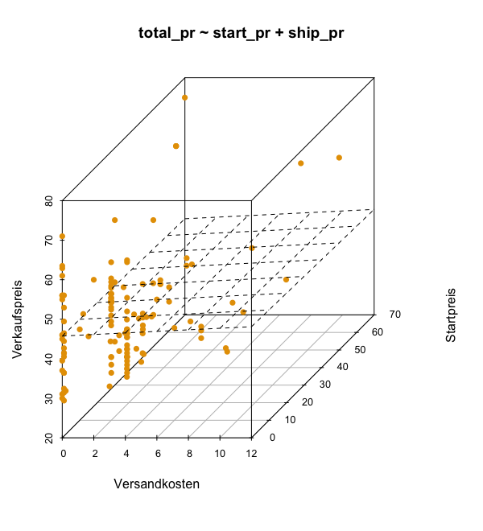

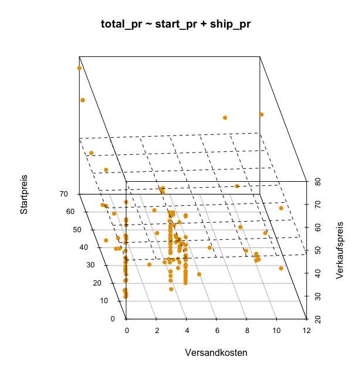


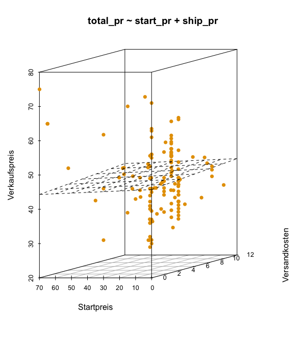

Das Modell `lm_mario_2uv` mit 2 metrischen UV (und 1 metrische AV) als 3D-Diagramm

:::
::::


### Viele UV ins Modell?

Wir könnten im Prinzip alle Variablen unserer Datentabelle 
als UV in das Regressionsmodell aufnehmen.
Die Frage ist nur: Macht das Sinn?
Hier sind einige Richtlinien, die helfen, welche Variablen (und wie viele) 
man als UV in ein Modell aufnehmen sollte [@gelman_regression_2021;. S. 199],
wenn das Ziel eine möglichst hohe Modellgüte ist:

1. Man sollte alle Variablen aufnehmen, von denen anzunehmen ist, dass Sie Ursachen für die Zielvariablen sind.
2. Bei UV mit starken (absoluten) Effekten kann es Sinn machen, ihre Interaktionseffekte auch mit in das Modell aufzunehmen.
3. UV, die vergleichsweise exakt geschätzt werden (der Bereich `95 CI` ist klein), sollten tendenziell im Modell belassen werden, da sie die Modellgüte verbessern.

Ist das Ziel hingegen, eine Theorie bzw. ein wissenschaftliches Modell zu überprüfen,
so sollte man genau die UV in das Modell aufnehmen,
die die Theorie verlangt.


## Fallbeispiel zur Prognose


:::{#exm-prognose}
### Prognose des Verkaufspreis
Ganz können Sie von Business-Welt und ihren Gratifikationen nicht lassen, 
trotz Ihrer wissenschaftlichen Ambitionen.
Sie haben den Auftrag bekommen, den Verkaufspreis von Mariokart-Spielen möglichst exakt vorherzusagen. 
Also gut, das Honorar ist phantastisch, Sie sind jung und brauchen das Geld. $\square$
:::

### Modell "all-in"

Um die Güte Ihrer Vorhersagen zu prüfen, teilt Ihre Chefin den Datensatz in zwei zufällige Teile.


>    [👩‍💼]{.content-visible when-format="html"}[\emoji{old-man}]{.content-visible when-format="pdf"} Ich teile den Datensatz `mariokart` zufällig in zwei Teile.
Den ersten Teil kannst du nutzehn, um Modelle zu berechnen ("trainieren") und ihre Güte zu prüfen. Den Teil nenne ich "Train-Sample", hört sich cool an, oder? 
Im Train-Sample ist ein Anteil (`frac`tion) von 70% der Daten, okay? 
Die restlichen Daten behalte ich. Wenn du ein gutes Modell hast, 
kommst du und wir berechnen die Güte deiner Vorhersagen in dem verbleibenden Teil, die übrigen 30% der Daten. 
Diesen Teil nennen wir Test-Sample, alles klar?


```{r mariokart-train-test}
#| echo: false
#| eval: false
# library(readr)
#write_csv(mariokart_train, "data/mariokart_train.csv")
#write_csv(mariokart_test, "data/mariokart_test.csv")
```

Wenn die Daten in Ihrem Computer zu finden sind, z.$\,$B. im Unterordner `data`,
dann können Sie sie von dort importieren:

```{r}
#| eval: false
mariokart_train <- read.csv("data/mariokart_train.csv")
```

Alternativ können Sie sie auch von diesem Pfad von einem Rechner in der Cloud herunterladen:

::: {.content-visible when-format="html"}

```{r}
mariokart_train <- read.csv("https://raw.githubusercontent.com/sebastiansauer/statistik1/main/data/mariokart_train.csv")
```

Dann importieren wir auf gleiche Weise Test-Sample in R:

```{r}
mariokart_test <- read.csv("https://raw.githubusercontent.com/sebastiansauer/statistik1/main/data/mariokart_test.csv")
```

:::


::: {.content-visible when-format="pdf"}

```{r import-mariokart-train-pdf}
mariokart_train_path <- paste0( "https://raw.githubusercontent.com/sebastiansauer/",
"statistik1/main/data/mariokart_train.csv")

mariokart_train <- read.csv(mariokart_train_path)
```

Dann importieren wir auf gleiche Weise Test-Sample in R:

```{r import-mariokart-test-pdf}
mariokart_test_path <- paste0(
 "https://raw.githubusercontent.com/sebastiansauer/",
 "statistik1/main/data/mariokart_test.csv")

mariokart_test <- read.csv(mariokart_test_path)
```

:::


Also los. Sie probieren mal die "All-in-Strategie": 
Alle Variablen rein in das Modell.
Viel hilft viel, oder nicht?


```{r lm-all-in}
lm_allin <- lm(total_pr ~ ., data = mariokart_train)
r2(lm_allin)  # aus easystats
```


Der Punkt in `total_pr ~ . ` heißt "alle Variablen in der Tabelle (außer `total_pr`)".


>    [👩‍💼]{.content-visible when-format="html"}[\emoji{old-man}]{.content-visible when-format="pdf"} Hey! Das ist ja fast perfekte Modellgüte!

>    [🦹‍♀️]{.content-visible when-format="html"}[\emoji{woman-supervillain}]{.content-visible when-format="pdf"}️ Vorsicht: Wenn ein Angebot aussieht wie "too good to be true", dann ist es meist auch too good to be true.


Der Grund für den fast perfekten Modellfit ist die Spalte `Title`.
Unser Modell hat einfach den Titel jeder Auktion auswendig gelernt.
Weiß man, welcher Titel zu welcher Auktion gehört, 
kann man perfekt die Auktion aufsagen bzw. das Verkaufsgebot perfekt vorhersagen.
Leider nützen die Titel der Auktionen im Train-Sample *nichts* für andere Auktionen.
Im Test-Sample werden unsere Vorhersagen also grottenschlecht sein,
wenn wir uns auf die Titel der Auktionen im Test-Sample stützen.
Merke: Höchst idiografische Informationen wie Namen, 
Titel etc. sind nicht nützlich,
um allgemeine Muster zu erkennen und damit exakte Prognosen zu erstellen. 


Probieren wir also die Vorhersage im Test-Sample:

```{r lm-allin-predict-error}
#| error: true
predict(lm_allin, newdata = mariokart_test)
```


Oh nein! Was ist los!? Eine Fehlermeldung!


Nominalskalierte UV mit vielen Ausprägungen, wie `title` sind problematisch.
Kommt eine Ausprägung von `title` im Test-Sample vor,
die es *nicht* im Train-Sample gab, so resultiert ein Fehler beim `predict`en.
Häufig ist es ohnehin sinnvoll, auf diese Variable zu verzichten,
da diese Variablen oft zu Overfitting führen. 


### Modell "all-in", ohne Titelspalte

Okay, also auf die Titelspalte sollten wir vielleicht besser verzichten.
Nächster Versuch.

```{r mariokart-train2}
mariokart_train2 <-
  mariokart_train %>% 
  select(-c(title, id))

lm_allin_no_title_no_id <- lm(total_pr ~ ., data = mariokart_train2)
r2(lm_allin_no_title_no_id) 
```


Das R-Quadrat ist durchaus ordentlich.


>    [🤖]{.content-visible when-format="html"}[\emoji{robot}]{.content-visible when-format="pdf"} Das haben wir gut gemacht!


```{r performance-lm-allin-no-title}
performance::rmse(lm_allin_no_title_no_id)
```


<!-- :::{.callout-caution} -->
<!-- ### Name Clash -->
<!-- Im Paket `yardstick` gibt es eine Funktion namens `rmse` und im Paket `performance`, Teil des Meta-Pakets `easystats` ebenfalls. -->
<!-- Da sind Probleme vorprogrammiert. -->
<!-- Das ist so als würde die Lehrerin rufen: "Schorsch, komm her!".  -->
<!-- Dabei gibt es zwei Schorsche in der Klasse: Den Müllers Schorsch und den Meiers Schorsch. -->
<!-- Sonst kommen beide, was die Lehrerin nicht will. -->
<!-- Die Lehrerin müsste also rufen: "Müller Schorsch, komm her!". -->
<!-- Genau dasselbe machen wir, wenn wir das R-Paket eines Befehls mitschreiben, sozusagen den "Nachnamen" des Befehls: -->
<!-- `paketname::funktion` ist wie `Müller::Schorsch`.  -->
<!-- In unserem Fall also: `performance::rmse` -->
<!-- Endlich weiß R wieder, was zu tun ist!$\square$ -->
<!-- ::: -->


Sie rennen zu Ihrer Chefin, die jetzt die Güte Ihrer Vorhersagen in den *restlichen* Daten bestimmen soll.

>    [👩‍💼]{.content-visible when-format="html"}[\emoji{old-man}]{.content-visible when-format="pdf"} Da wir dein Modell in diesem Teil des Komplett-Datensatzes *testen*, nennen wir diesen Teil das "Test-Sample".


Ihre Chefin schaut sich die Verkaufspreise im Test-Sample an:

```{r}
mariokart_test %>% 
  select(id, total_pr) %>% 
  head()
```

>    [👩‍💼]{.content-visible when-format="html"}[\emoji{old-man}]{.content-visible when-format="pdf"}️ Okay, hier sind die ersten paar echten Verkaufspreise. Jetzt mach mal deine Vorhersagen auf Basis deines besten Modells!

Berechnen wir die Vorhersagen (engl. predictions; to predict: vorhersagen):

```{r}
lm_allin_predictions <- predict(lm_allin_no_title_no_id, newdata = mariokart_test)
```


Hier sind die ersten paar Vorhersagen:

```{r}
head(lm_allin_predictions)
```

Diese Vorhersagen fügen wir noch der Ordnung halber in die Tabelle 
mit den Test-Daten ein:

```{r}
mariokart_test <-
  mariokart_test %>% 
  mutate(lm_allin_predictions = predict(lm_allin_no_title_no_id, 
newdata = mariokart_test))
```


[👩‍💼]{.content-visible when-format="html"}[\emoji{old-man}]{.content-visible when-format="pdf"}️ Okay, was ist jetzt der mittlere Vorhersagefehler?


Um die Vorhersagegüte im Test-Sample auszurechnen (wir verwenden dazu die Funktionen `mae` und `rsq`, 
nutzen wir die Funktionen des R-Paketes `yardstick` (welches Sie vielleicht noch installieren müssen):
 
```{r}
#| eval: false
library(yardstick)

yardstick::mae(data = mariokart_test,
               truth = total_pr,  # echter Verkaufspreis
               estimate = lm_allin_predictions)  # Ihre Vorhersage
yardstick::rmse(data = mariokart_test,
               truth = total_pr,  # echter Verkaufspreis
               estimate = lm_allin_predictions)  # Ihre Vorhersage
```

```{r mae-rmse-lm-all-n}
#| echo: false
library(yardstick)

yardstick::mae(data = mariokart_test,
               truth = total_pr,  # echter Verkaufspreis
               estimate = lm_allin_predictions) |>  # Ihre Vorhersage
  knitr::kable()
yardstick::rmse(data = mariokart_test,
               truth = total_pr,  # echter Verkaufspreis
               estimate = lm_allin_predictions)  |>  # Ihre Vorhersage
  knitr::kable()
```


Ihr mittlerer Vorhersagefehler (RMSE) liegt bei ca. 13 Euro. Übrigens haben wir hier `yardstick::rmse` geschrieben und nicht nur `rmse`, 
da es sowohl im Paket `performance` ( Teil des Metapakets `easystats`) als auch im Paket `yardstick` (Teil des Metapakets `tidymodels`) 
einen Befehl des Namens `rmse` gibt. Name-Clash-Alarm! 
R könnte daher den anderen `rmse` meinen als Sie, 
was garantiert zu Verwirrung führt. (Entweder bei R oder bei Ihnen.)

>    [👩‍💼]{.content-visible when-format="html"}[\emoji{old-man}]{.content-visible when-format="pdf"} Ganz okay.

Wie ist es um das R-Quadrat Ihrer Vorhersagen bestellt?


```{r}
#| eval: false
# `rsq ` ist auch aus dem Paket yardstick:
rsq(data = mariokart_test,
    truth = total_pr,  # echter Verkaufspreis
    estimate = lm_allin_predictions)  # Ihre Vorhersage
```


```{r rsq-lm-all-in-preds}
#| echo: false
# `rsq ` ist auch aus dem Paket yardstick:
rsq(data = mariokart_test,
    truth = total_pr,  # echter Verkaufspreis
    estimate = lm_allin_predictions)  |>   # Ihre Vorhersage 
knitr::kable()
```


>    [👴]{.content-visible when-format="html"}[\emoji{old-man}]{.content-visible when-format="pdf"}️ 17%, nicht berauschend, aber immerhin!


Wie das Beispiel zeigt, ist die Modellgüte im Test-Sample (leider) oft *geringer* als im Train-Sample. 
Die Modellgüte im Train-Sample ist mitunter übermäßig optimistisch.
Dieses Phänomen bezeichnet man als *Overfitting* [@gelman_regression_2021].
Bevor man Vorhersagen eines Modells bei der Chefin einreicht, 
bietet es sich, die Modellgüte in einem neuen Datensatz, 
also einem Test-Sample, zu überprüfen. 

Wir haben hier die Funktion `rsq` aus dem Paket `yardstick` verwendet,
da `r2` nur die Modellgüte im Train-Sample ausrechnen kann.
`rsq` kann die Modellgüte für beliebige Vorhersagewerte berechen, 
also sowohl aus dem Train- oder dem Test-Sample.


## Vertiefung: Das Aufteilen Ihrer Daten

### Analyse- und Assessment-Sample

Wenn Sie eine robuste Schätzung der Güte Ihres Modells erhalten möchten,
bietet sich folgendes Vorgehen an (vgl. @fig-sample-types):


1. Teilen Sie Ihren Datensatz (das Train-Sample) in zwei Teile: Das sog. Validation-Sample und das sog. Assessment-Sample.
2. Berechnen Sie Ihr Modell im ersten Teil Ihres Datensatzes (dem *Validation-Sample*).
3. Prüfen Sie die Modellgüte im zweiten Teil Ihres Datensatzes (dem  *Assessment-Sample*)

<!-- Das ist ein Hauf von "Samples".  -->
<!-- Zur Verdeutlichung zeigt @fig-samples Ihnen noch mal die Unterteilung dieser Stichproben-Arten. -->


Diese Aufteilung Ihres Datensatzatzes in diese zwei Teile nennt man auch *Validierungsaufteilung* (validation split); Sie können sie z.$\,$B. so bewerkstelligen:


```{r}
library(rsample)  # ggf. noch installieren
mariokart <- read_csv("data/mariokart.csv")  # Wenn die CSV-Datei in einem Unterordner mit Namen "data" liegt

meine_aufteilung <- initial_split(mariokart, strata = total_pr)
```


```{r}
#| echo: false
set.seed(42)
meine_aufteilung <- initial_split(mariokart, strata = total_pr)
```


`initial_split` wählt für jede Zeile (Beobachtung) zufällig aus, 
ob diese Zeile in das Analyse- oder in das Assessment-Sample kommen soll.
Im Standard werden 75% der Daten in das Analyse- und 25% in das Assessment-Sample eingeteilt;^[vgl. `help(initial_split)`]
das ist eine sinnvolle Aufteilung.
Das Argument `strata` sorgt dafür, dass die Verteilung der AV in beiden Stichproben gleich ist.
Es wäre nämlich blöd für Ihr Modell, wenn im Train-Sample z.$\,$B. nur die teuren, und im Test-Sample nur die günstigen Spiele landen würde. Anderes Beispiel: In den ersten Zeilen stehen nur Kunden aus Land A und in den unteren Zeilen nur aus Land B.
In so einem Fall würde sich Ihr Modell unnötig schwer tun.
Im nächsten Schritt können Sie anhand anhand der von `initial_split` bestimmten Aufteilung die Daten tatsächlich aufteilen. `initial_split` sagt nur, welche Zeile in welche der beiden Stichproben kommen *soll*. Die eigentliche Aufteilung wird aber noch nicht durchgeführt.


```{r}
mariokart_train <- 
  training(meine_aufteilung)  # Analyse-Sample
mariokart_test <- 
  testing(meine_aufteilung)  # Assessment-Sample
```

`training` wählt die Zeilen aus, die in das Train-Sample ihres Train-Samples, d.h. Ihr Analyse-Sample, kommen sollen.
`testing`  wählt die Zeilen aus, die in das Test-Sample ihres Train-Samples, d.h. Ihr Assessment-Sample, kommen sollen.

Ich persönliche nenne die Tabelle mit den Daten gerne `d_analysis` bzw. `d_assess`,
das ist kürzer zu tippen und einheitlich.
Sie können aber auch ein eigenes Namens-Schema nutzen;
was aber hilfreich ist, ist Konsistenz in der Benamung,
außerdem Kürze und aussagekräftige Namen.

### Train- vs. Test-Sample


Das Train-Sample stellt die bekannten Daten dar; aus denen können wir lernen, 
d.$\,$h. unser Modell berechnen.
Das Test-Sample  stellt das Problem der wirklichen Welt dar: 
Neue Beobachtungen, von denen man (noch) nicht weiß, was der Wert der AV ist.
Der Zusammenhang dieser verschiedenen, 
aber zusammengehörigen Arten von Stichproben ist in @fig-sample-types dargestellt.


:::{#def-trainsample}
### Train-Sample
Den Datensatz, für die Sie sowohl UV *als auch AV* vorliegen haben, nennt man Train-Sample. $\square$
:::

:::{#def-testsample}
### Test-Sample
Den Datensatz, für den Sie *nur* Daten der UV, aber nicht zu der AV vorliegen haben, nennt man *Test-Sample*. $\square$
:::


```{mermaid}
%%| label: fig-sample-types
%%| fig-cap: Verschiedene Arten von zusammengehörigen Stichprobenarten im Rahmen einer Prognosemodellierung
%%| fig-height: 2


flowchart TD
  S[Samples] 
  TS[Train-Sample]
  TT[Test-Sample]
  AS[Analyse-Sample]
  AssS[Assessment-Sample]

  S-->TT
  S-->TS
  TS-->AS
  TS-->AssS
  
```


## Praxisbezug

Ein Anwendungsbezug von moderner Datenanalyse ist es vorherzusagen, welche Kunden "abwanderungsgefährdet" sind, 
also vielleicht in Zukunft bald nicht mehr unsere Kunden sind ("customer churn").
Es gibt eine ganze Reihe von Untersuchungen dazu, 
z.$\,$B. die von @lalwani2022.
Das Forschungsteam versuchen anhand von Daten und u.$\,$a. auch der linearen Regression vorherzusagen, 
welche Kunden abgewandert sein werden. 
Die Autoren berichten von einer Genauigkeit von über 80$\,$% im (besten) Vorhersagemodell.


## Wie man mit Statistik lügt

### Pinguine drehen auf

Ein Forscher-Team untersucht Pinguine von der [Palmer Station, Antarktis](https://pallter.marine.rutgers.edu/). 
Das Team ist am Zusammenhang von Schnabellänge (*bill length*) 
und Schnabeltiefe (*bill depth*) interessiert, s. @fig-peng-bill.


{#fig-peng-bill width="50%"}

Das Team hat in schweißtreibender (eiszapfentreibender) Arbeit $n=344$ Tiere
vermessen bei antarktischen Temperaturen. Hier sind die Daten:

::: {.content-visible when-format="html"}

```{r}
penguins <- read.csv("https://vincentarelbundock.github.io/Rdatasets/csv/palmerpenguins/penguins.csv")
```
:::


::: {.content-visible when-format="pdf"}

```{r}
penguins_path <- paste0(
  "https://vincentarelbundock.github.io/",
  "Rdatasets/csv/palmerpenguins/penguins.csv")

penguins <- read.csv(penguins_path)
```
:::


### Analyse 1: Gesamtdaten

Man untersucht, rechnet und überlegt. Ah! Jetzt haben wir es!
Klarer Fall: Ein *negativer* Zusammenhang von Schnabellänge und Schnabeltiefe, 
s. @fig-peng-simpson1. 
Das ist bestimmt einen Nobelpreis wert  Schnell publizieren!

```{r}
#| label: fig-peng-simpson1
#| out-width: 75%
#| fig-cap: "Negativer Zusammenhang von Schanbellänge und Schnabeltiefe"
ggscatter(penguins, x = "bill_length_mm", y = "bill_depth_mm", 
          add = "reg.line")  # aus `ggpubr`
```

Hier sind die statistischen Details, s. @tbl-peng-simpson1.

```{r}
lm_ping1 <- lm(bill_depth_mm ~ bill_length_mm, data = penguins)
```

```{r}
#| echo: false
#| label: tbl-peng-simpson1
#| out-width: 75%
#| tbl-cap: "Koeffizienten des Modells 1: Negativer Effekt von bill_length_mm"
parameters(lm_ping1) |> select(Parameter, Coefficient)
```


### Analyse 2: Aufteilung in Arten (Gruppen)

Kurz darauf veröffentlicht eine andere Forscherin auch einen Aufsatz zum gleichen Thema. Gleiche Daten. 
Aber mit *gegenteiligem* Ergebnis: 
Bei *jeder Rasse* von (untersuchten) Pinguinen gilt: 
Es gibt einen *positiven* Zusammenhang von Schnabelllänge und Schnabeltiefe, s. @fig-penguins-groups.

```{r}
#| fig-cap: "Der Zusammenhang von Schnabelllänge und Schnabeltiefe pro Gruppe von Pinguinen: Die Regressionsgruppe pro Gruppe steigt. Hingegen sinkt die Regressionsgerade ohne Beachtung der Gruppen (schwarze gestrichelte Linie)"
#| label: fig-penguins-groups
#| out-width: 75% 
#| echo: false
ggscatter(penguins, x = "bill_length_mm", y = "bill_depth_mm", 
          add = "reg.line", color = "species") +
          geom_abline(slope = coef(lm_ping1)[2], 
          intercept = coef(lm_ping1)[1],
          size = 2,
          linetype = "dashed")
```


Oh nein! Was ist hier nur los? 
Daten lügen nicht?! Oder doch?!


Hier sind die statistischen Details der zweiten Analyse, s. @tbl-peng-simpson2. 
Im zweiten Modell (`lm2`) kam `species` als zweite UV 
neu ins Modell (zusätzlich zur Schnabellänge).

```{r}
lm_ping2 <- lm(bill_depth_mm ~ bill_length_mm + species, data = penguins)
```

```{r}
#| echo: false
#| label: tbl-peng-simpson2
#| tbl-cap: "Koeffizienten des Modells 2: Positiver Effekt von bill_length_mm"
parameters(lm_ping2) |> select(Parameter, Coefficient)
```


Ohne Hintergrundwissen oder ohne weitere Analysen kann *nicht* entschieden werden,
welche Analyse -- Gesamtdaten oder Subgruppen -- die richtige ist.
Nicht-exprimentelle Studien können zu grundverschiedenen Ergebnissen führen,
je nachdem, ob weitere UV dem Modell hinzugefügt oder weggenommen werden. 


### Vorsicht bei der Interpretation von Regressionskoeffizienten

:::{.callout-important}
Interpretiere  Modellkoeffizienten nur kausal, wenn du ein Kausalmodell hast. $\square$
:::

Nur wenn man die Ursache-Wirkungs-Beziehungen in einem System kennt,
macht es Sinn, die Modellkoeffizienten kausal zu interpretieren.
Andernfalls lässt man besser die Finger von der Interpretation der Modellkoeffizienten und
begnügt sich mit der Beschreibung der Modellgüte und mit Vorhersage (synonym: Prognose).
Wer das nicht glaubt, der betrachte @fig-confounder, links.
Ein Forscher stellt das Modell `m1: y ~ x` auf und  interpretiert dann `b1`: 
"Ist ja klar, X hat einen starken positiven Effekt auf Y!"
In der nächsten Studie nimmt der Forscher dann eine zweite Variable, 
`group` (z.$\,$B. Geschlecht) in das Modell auf: `m2: y ~ x + g`.
Oh Schreck! Jetzt ist `b1` auf einmal nicht mehr stark positiv, 
sondern praktisch Null, und zwar in jeder Gruppe, s. @fig-confounder, rechts!
Dieses Umschwenken der Regressionskoeffizienten kann *nicht* passieren,
wenn der Effekt "echt", also kausal, ist. 
Handelt es sich aber um "nicht echte", also nicht-kausale Zusammenhänge, 
um *Scheinzusammenhänge* also,
so können sich die Modellkoeffizienten dramatisch verändern, wenn man das Modell verändert, also Variablen hinzufügt oder aus dem Modell entfernt.
Sogar das Vorzeichen des Effekts kann wechseln; das nennt man dann *Simpsons Paradox* [@gelman_regression_2021],
Wenn man die kausalen Abhängigkeiten nicht kennt,
weiß man also nicht, ob die Zusammenhänge kausal oder nicht-kausal sind.
Dann bleibt unklar, ob die Modellkoeffizienten belastbar, robust, stichhaltig sind oder nicht.


```{r}
#| echo: false
#| eval: true
#| label: fig-confounder
#| fig-asp: 0.8
#| fig-cap: "Fügt man in ein Modell eine Variable hinzu, können sich die Koeffizienten massiv ändern. In beiden Diagrammen wurden die gleichen Daten verwendet. (a) starker positiver Zusammenhang, (b) kein Zusammenhang in beiden Gruppen"
#| layout: [[45,-10, 45], [100]]
#| out-width: 100%
#| fig-subcap: 
#|   - "Modell: `y ~ x`, starker positiver Zusammenhang"
#|   - "Modell: `y ~ x + g`, kein Zusammenhang in beiden Gruppe"

n <- 100

set.seed(42)

d_sim <-
  tibble(
    x = rnorm(n, 0, 0.5),
    y = rnorm(n, 0, 0.5),
    group = "A"
  ) %>%
  bind_rows(
    tibble(
      x = rnorm(n, 1, 0.5),
      y = rnorm(n, 1, 0.5),
      group = "B")
  )

p_super_korr <- 
d_sim %>%
  ggplot(aes(x = x, y = y)) +
  geom_point2() +
  geom_smooth(method = "lm", se = FALSE, color = modelcol) +
  labs(title = "Oh yeah,",
       subtitle = "super Korrelation!") +
  theme_minimal() +
  theme(plot.title = element_text(size = 12)) +
  theme_large_text()

p_no_korr <- 
d_sim %>%
  ggplot(aes(x = x, y = y, color = group, shape = group)) +
  geom_point() +
  geom_smooth(method = "lm") +
  labs(title = "Oh nein,",
       subtitle = "keine Korrelation!") +
  theme(legend.position = "bottom") +
  theme_minimal() +
  scale_color_okabeito() +
  theme(
    legend.position = c(0.97, 0.05),  # Adjust these values to position the legend
    legend.justification = c(1, 0)) +
  theme(plot.title = element_text(size = 12)) +
  theme_large_text()

p_super_korr
p_no_korr
```


Man könnte höchstens sagen, dass man (wenn man die Kausalstruktur nicht kennt) die Modellkoeffizienten nur *deskriptiv* interpretiert,
z.$\,$B. "Dort wo es viele Störche gibt, gibt es auch viele Babys" [@matthews_storks_2000].^[Das Störche-Babys-Beispiel passt auch zu @fig-confounder.]
Leider ist unser Gehirn auf kausale Zusammenhänge geprägt: 
Es fällt uns schwer, Zusammenhänge nicht kausal zu interpretieren.
Daher werden deskriptive Befunde immer wieder unzulässig kausal interpretiert -- von Laien und Wissenschaftlern ebenfalls.


## Was war noch mal das Erfolgsgeheimnis?


Wenn Sie dran bleiben an der Statistik, wird der Erfolg sich einstellen, s. @fig-dranbleiben. 


:::{#fig-dranbleiben layout-ncol=2}

{#fig-gestern}

{#fig-morgen}

Statistik, Sie und Party: Gestern und (vielleicht) morgen. 
Wenn Sie dran bleiben, wird die Statistik Ihre beste Freundin [@imgflip2024].

:::


::: {.content-visible when-format="html" unless-format="epub"}

## Fallstudien

Die folgenden Fallstudien zeigen auf recht anspruchsvollem Niveau (bezogen auf diesen Kurs) 
beispielhalft zwei ausführlichere Entwicklungen eines Prognosemodells.

Nutzen Sie diese Fallstudien, um sich intensiver mit der Entwicklung eines Prognosemodells auseinander zu setzen.

### New Yorker Flugverspätungen 2023




[Source](https://aistudios.com/share/64eef3e7d6644f00142d7285)


[Vorhersage von Flugverspätungen](https://sebastiansauer.github.io/Datenwerk/posts/flights-delay-simplified//)


### Filmerlöse


[Vorhersagen von Filmerlösen](https://data-se.netlify.app/2020/11/13/fallstudie-zur-regressionsanalyse-ggplot2movies/)

## Vertiefung


[Allison Horst](https://allisonhorst.com/linear-regression-dragons) erklärt die lineare Regression mit Hilfe von Drachen. 
[🐉]{.content-visible when-format="html"} Sehenswert.


:::


## Quiz


```{r}
#| include: false
exrs_regr2 <- 
list(
  "exs/Variablenwahl.Rmd",
  "exs/RegEbene.Rmd",
  "exs/KauslalInterp.Rmd",
  "exs/LogigKodier.Rmd",
  "exs/SimpsonPara.Rmd",
  "exs/Overfitting.Rmd",
  "exs/SampleSplit.Rmd",
  "exs/Interaktion.Rmd",
  "exs/DummyKodier.Rmd",
  "exs/Zentrierung.Rmd"
)
```

```{r quiz-kap-regr2, message=FALSE, results="asis"}
#| echo: false
exams2forms(exrs_regr2, box = TRUE, check = TRUE)
```


## Aufgaben

Die Webseite [datenwerk.netlify.app](https://datenwerk.netlify.app) stellt eine Reihe von einschlägigen Übungsaufgaben bereit. 
Sie können die Suchfunktion der Webseite nutzen, um die Aufgaben mit den folgenden Namen zu suchen:


- [interpret-koeff-lm](https://sebastiansauer.github.io/datenwerk/posts/interpret-koeff-lm/interpret-koeff-lm.html) 
- [aussagen-einfache-regr](https://sebastiansauer.github.io/datenwerk/posts/aussagen-einfache-regr/aussagen-einfache-regr)
- [interpret-koeff](https://sebastiansauer.github.io/datenwerk/posts/interpret-koeff/interpret-koeff.html)
- [regression1b](https://sebastiansauer.github.io/datenwerk/posts/regression1b/regression1b.html)
- [mtcars-regr01](https://sebastiansauer.github.io/datenwerk/posts/mtcars-regr01/mtcars-regr01.html)
- [regression1a](https://sebastiansauer.github.io/datenwerk/posts/regression1a/regression1a.html)
- [lm1](https://sebastiansauer.github.io/datenwerk/posts/lm1/lm1.html)
- [regression5](https://sebastiansauer.github.io/datenwerk/posts/regression5/regression5)
- [regression6](https://sebastiansauer.github.io/datenwerk/posts/regression6/regression6)
- [lm-mario1](https://sebastiansauer.github.io/datenwerk/posts/lm-mario1/lm-mario1.html)
- [lm-mario2](https://sebastiansauer.github.io/datenwerk/posts/lm-mario2/lm-mario2.html)
- [lm-mario3](https://sebastiansauer.github.io/datenwerk/posts/lm-mario3/lm-mario3.html)
- [ausreisser1](https://sebastiansauer.github.io/datenwerk/posts/ausreisser1/ausreisser1.html)
- [mario-compare-models](https://sebastiansauer.github.io/datenwerk/posts/mario-compare-models/)

## Literaturhinweise

Ein empfehlenswertes Buch für Regressionsanalyse ist das Buch von Andrew Gelman zum Thema "Regression und andere Geschichten" [@gelman_regression_2021].
Sein Buch ist für Sozialwissenschaftler geschrieben, 
also nicht für typische Nerds, hat aber deutlich mehr Anspruch als dieses Kapitel.
Eine einsteigerfreundliche Alternative bietet @sauer_moderne_2019.
Ein sehr empfehlenswerte Lektüre bietet @mcelreath_statistical_2020.


