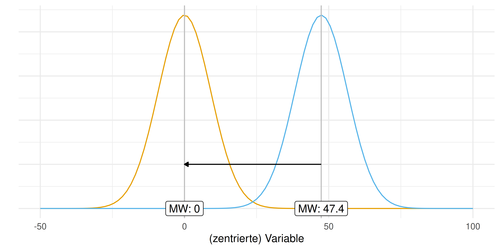
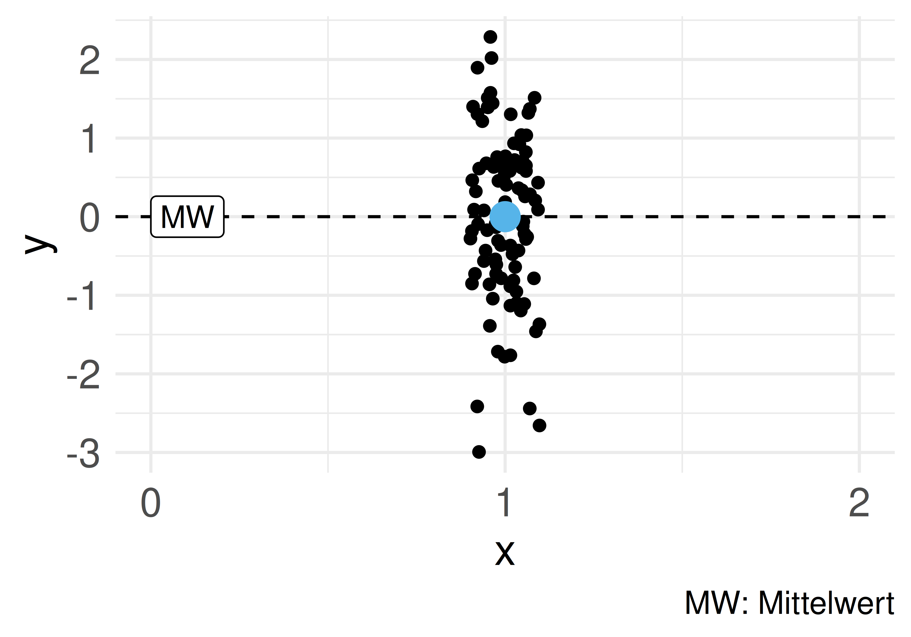
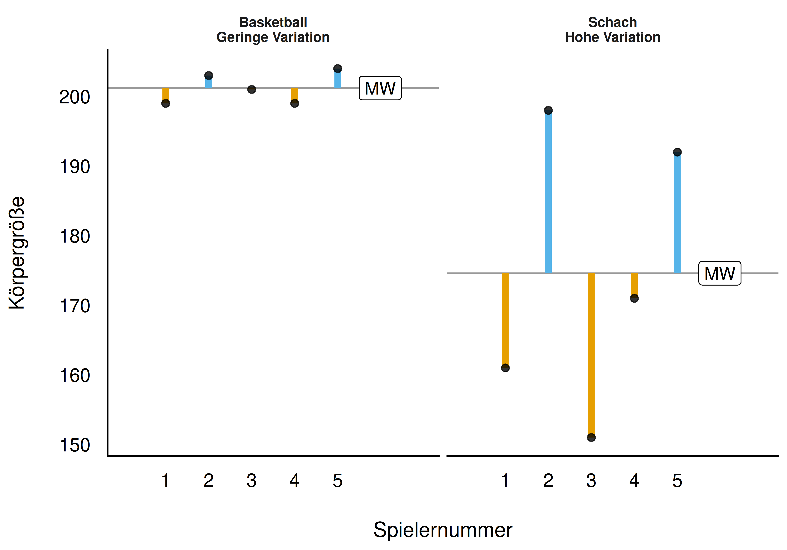
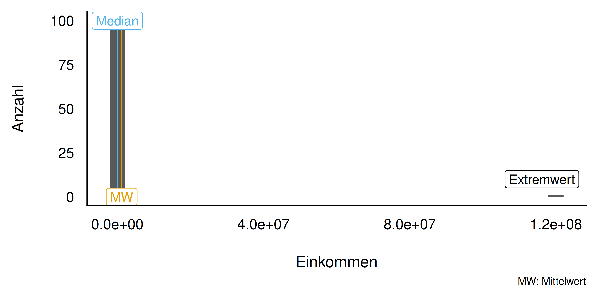
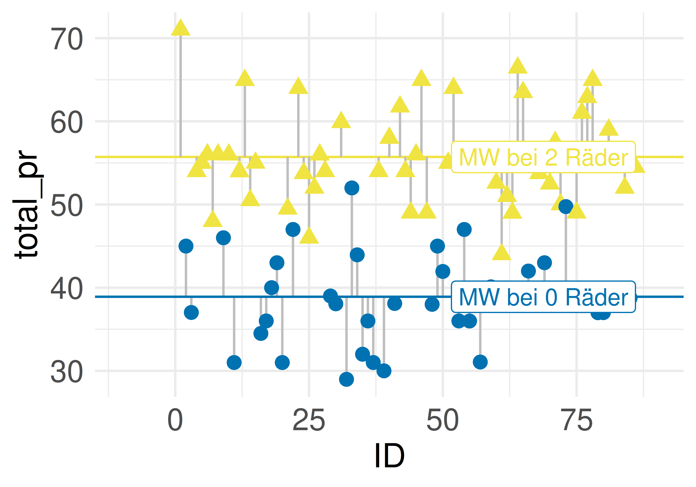
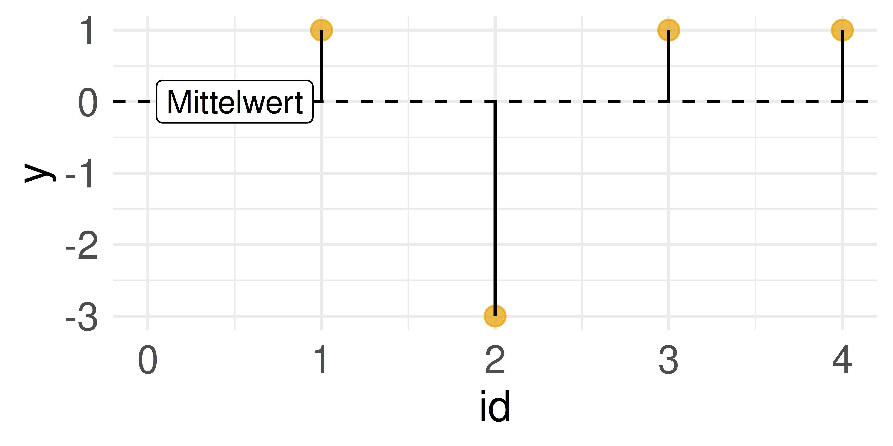

Question
========
Welches Bild zeigt Bestimmungsstücke der Definition von Statistik?


```{r echo=FALSE}
imgs <- 
  c("fig-norm-dev-1.png",
    "fig-zsmnfassen-1.png",
    "fig-groesse-1.png",
    "Bausteine_dplyr_crop.png",
    "fig-mbappe-1.png",
    "fig-fehler-red-2.png",
    "fig-mae-1.png",
    "fig-norm-dev-1.png")
```


```{r, echo = FALSE, results = "hide"}
exams::include_supplement(imgs, recursive = TRUE)
```


Answerlist
----------

* {width=25%}
* {width=25%}
* {width=25%}
* {width=25%}
* {width=25%}
* {width=25%}
* {width=25%}


Solution
========


Answerlist
----------
* Falsch
* Richtig
* Falsch
* Falsch
* Falsch
* Falsch
* Falsch


Meta-information
================
exname: Aufgaben_Statistik
extype: schoice
exsolution: 0100000
exshuffle: 5

