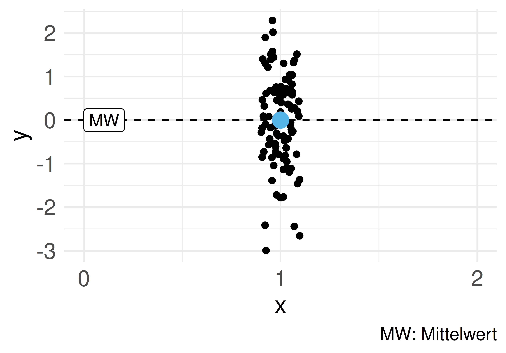
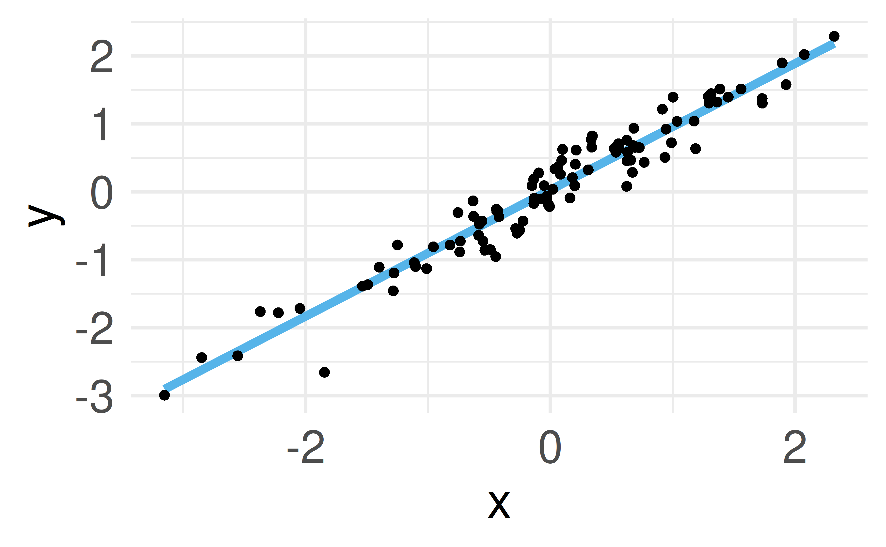
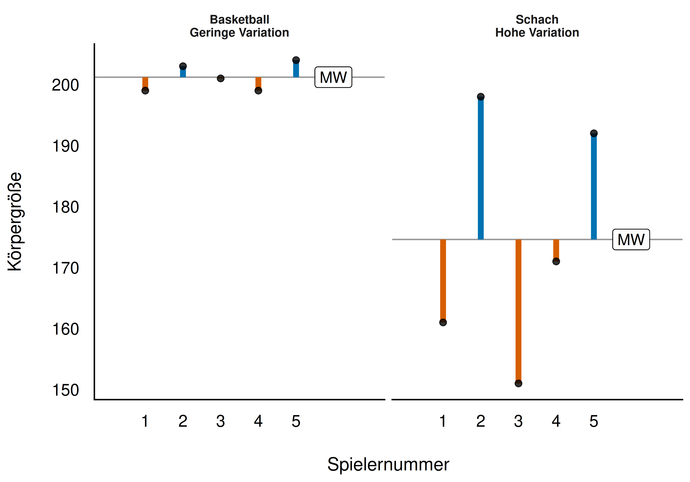
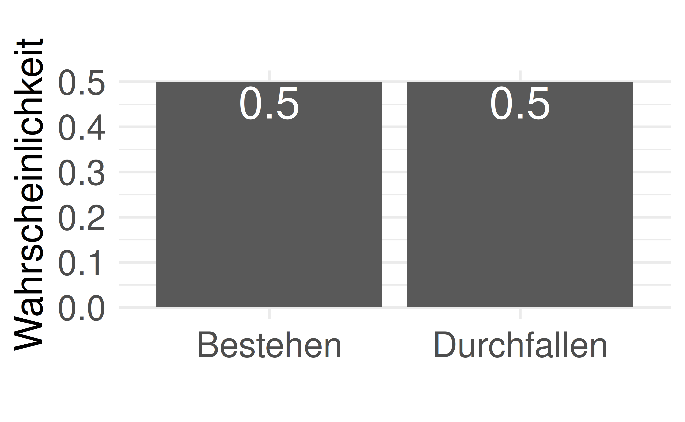
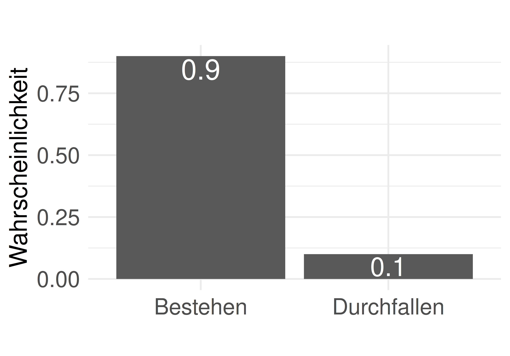
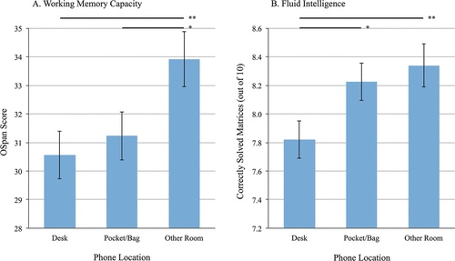
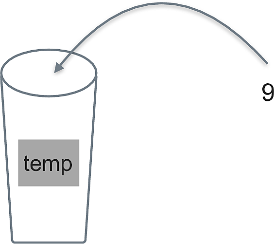
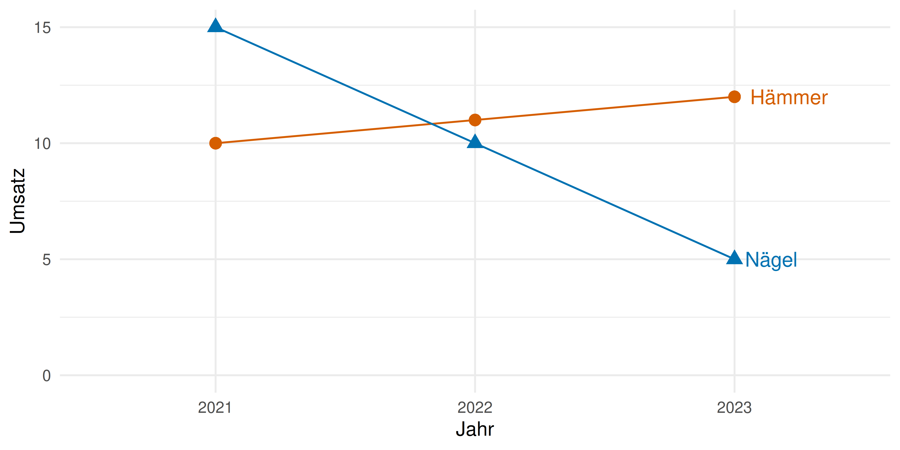
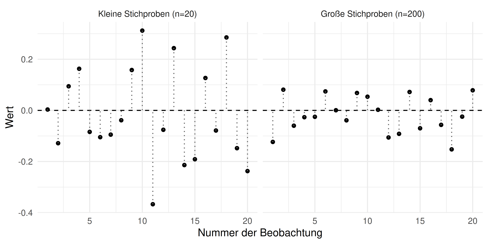
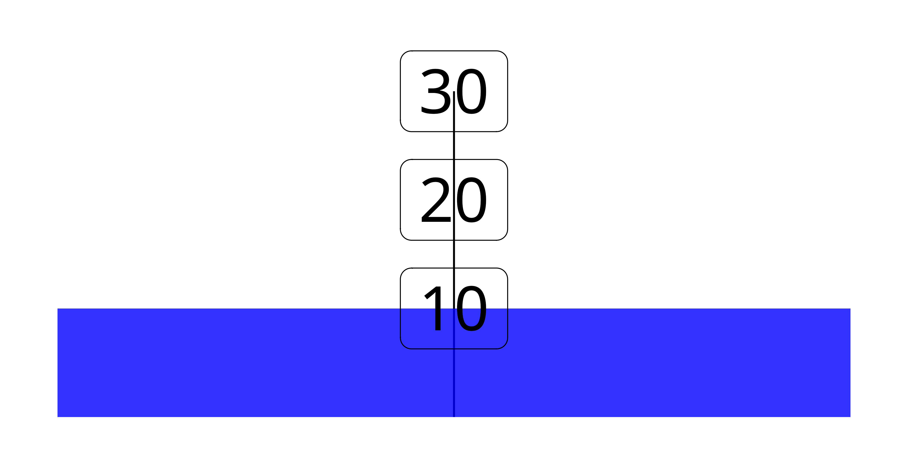

# Einstieg {.center footer=false}

## Lernziele {.smaller}

- Sie können eine Definition von Statistik wiedergeben.
- Sie können eine Definition von Daten wiedergeben.
- Sie können den Begriff Tidy-Daten erläutern.
- Sie können Beispiele für verschiedene Skalenniveaus nennen.

::: footer
Einstieg
:::

## Datenanalyse als Fließband

![Datenanalyse als eine Abfolge am Fließband [@horst_statistics_2024]](../img/tidydata_5.jpg){width="70%"}

Schritt für Schritt, in der richtigen Reihenfolge, vom Anfang bis Ende, erarbeiten wir unser "Datenprodukt".

::: footer
Einstieg
:::

## Ihr Erfolgsrezept

```{mermaid}
flowchart TD
  subgraph Lehrkraft
    F["🔥"]
  end
  subgraph A[Mitarbeit]
    C["🪵"]
  end
  subgraph E[Eigenstudium]
    D["🌳"]
  end
```

Eine gute Lehrkraft ist der Funke. Ihre Mitarbeit im Unterricht ist das Brennmaterial. Ihr Eigenstudium hält das Feuer am Leben.

::: footer
Einstieg
:::

# Was ist Statistik und wozu ist sie gut? {.center footer=false}

## Definition: Statistik

:::{.callout-note title="Definition: Statistik"}
Statistik fasst Werte zusammen, quantifiziert deren Unterschiedlichkeit und beschreibt die Ungewissheit unserer Schlüsse [@poldrack_statistical_2023; @kaplan_statistical_2009].
:::

In diesem Buch werden *Statistik*, *Datenanalyse* und *Data Science* synonym verwendet.

Drei Bestimmungsstücke:

1. Daten zusammenfassen
2. Unterschiedlichkeit quantifizieren
3. Ungewissheit beschreiben

::: footer
Was ist Statistik und wozu ist sie gut?
:::

## Daten zusammenfassen

{width="45%"} {width="45%"}

Eine Menge von Zahlen wird zu einer einzelnen Zahl "zusammengedampft" — leichter zu verstehen als viele Einzelwerte.

::: footer
Was ist Statistik und wozu ist sie gut?
:::

## Unterschiedlichkeit quantifizieren

{width="65%"}

Zentrale Idee: die *Variation der Dinge* präzise beschreiben.

::: footer
Was ist Statistik und wozu ist sie gut?
:::

## Definition: Residuum

:::{.callout-note title="Definition: Residuum"}
Das Residuum des Merkmals $X$ der $i$-ten Beobachtung ist die Differenz vom Wert $x_i$ und einem Referenzwert, etwa dem Mittelwert ($\bar{x}$): $r_i = x_i - \bar{x}$.
:::

::: footer
Was ist Statistik und wozu ist sie gut?
:::

## Ungewissheit beschreiben: Anna & Berta

{width="45%"} {width="45%"}

Anna hat keine Ahnung, ob sie die Klausur bestanden hat. Berta ist sich sehr sicher. Beide unterscheiden sich in ihrer Ungewissheit.

::: footer
Was ist Statistik und wozu ist sie gut?
:::

## Ungewissheit beschreiben: Der zwielichtige Statistiker

Ein Statistiker wirft eine Münze 10 Mal; bei Kopf gewinnt er. Er gewinnt 8 von 10 Mal.

- *Sie* sind sich *ziemlich* sicher, dass er Sie über den Tisch gezogen hat — aber nicht ganz sicher.
- *Der Statistiker* ist sich *ganz sicher*: Er weiß, dass seine Münze gezinkt ist.

::: footer
Was ist Statistik und wozu ist sie gut?
:::

# Was ist das Ziel Ihrer Analyse? {.center footer=false}

## Arten von Zielen

```{mermaid}
graph TD
  subgraph Ziele
    A[beschreiben]
    B[vorhersagen]
    C[erklären]
  end
```

::: footer
Was ist das Ziel Ihrer Analyse?
:::

## Beispiele für Zielarten

- *Beschreiben*: Wie groß ist der Gender-Paygap in der Branche X im Zeitraum Y?
- *Vorhersagen*: Wenn ich 100 Stunden lerne, welche Note kann ich erwarten?
- *Erklären*: Wie viel bringt mir das Lernen für die Klausur?

::: footer
Was ist das Ziel Ihrer Analyse?
:::

## Forschungsfrage

Die Leitfrage Ihrer Analyse: Was wollen Sie herausfinden? Häufig: "Hat X einen (kausalen) Einfluss auf Y?"

```{mermaid}
graph LR
    I[Input bzw. X] --> O[Output bzw. Y]
```

::: footer
Was ist das Ziel Ihrer Analyse?
:::

## Beispiele für Forschungsfragen

> Hat Lernen (X) einen Einfluss auf den Prüfungserfolg (Y)?

> Verringert Joggen (X) die Menge des Hüftgolds (Y)?

> Um welchen Betrag erhöht sich der Umsatz (Y), wenn wir 1000 Euro mehr für Werbung ausgeben (X)?

> Verringert intensive Handynutzung (X) die Konzentrationsfähigkeit (Y)?

::: footer
Was ist das Ziel Ihrer Analyse?
:::

## Aus der Forschung: Smartphone-Brain-Drain

{width="45%"}

@ward_brain_2017: Die bloße Gegenwart eines Handys reduziert die verfügbare kognitive Kapazität — selbst wenn es nur auf dem Tisch liegt.

::: footer
Was ist das Ziel Ihrer Analyse?
:::

## Der Prozess der Datenanalyse: PPDAC

```{mermaid}
graph LR
    Problem --> Plan --> Data --> Analysis --> Conclusions --> Problem
```

- **P**roblem: Problem, Ziel und Sachgegenstand verstehen
- **P**lan: Vorgehen planen
- **D**ata: Daten erheben und aufbereiten
- **A**nalysis: Daten analysieren
- **C**onclusions: Schlussfolgerungen ziehen [@mackay_scientific_2000]

::: footer
Was ist das Ziel Ihrer Analyse?
:::

## Die sieben Schritte der Datenanalyse

::: {style="zoom: 0.75;"}
```{mermaid}
flowchart LR
  subgraph R[Rahmen]
    direction LR
    subgraph V[Vorbereiten]
      direction TB
      E[Einlesen] --> Um[Umformen]
    end
    subgraph M[Grundlagen des Modellieren]
      direction TB
      M1[Punktmodelle] --> Vis[Verbildlichen]
      Vis --> U[Ungewissheit]
    end
    subgraph N[Modellieren]
      direction TB
      G1[Modelle] --> G2[Ungewissheit]
    end
  V --> M
  M --> N
  end
```
:::

::: footer
Was ist das Ziel Ihrer Analyse?
:::

# Was sind Daten? {.center footer=false}

## Definition: Daten

:::{.callout-note title="Definition: Daten"}
Daten sind eine geordnete Folge von Zeichen.
:::

::: footer
Was sind Daten?
:::

## Daten als Tabelle

| id | name  | note |
|----|-------|------|
| 1  | Anna  | 1.3  |
| 2  | Berta | 2.3  |
| 3  | Carla | 3    |

Die erste Spalte `id` ist nur eine laufende Nummer zur Identifikation der Beobachtungen — sie birgt sonst keine Information (vgl. Matrikelnummer, Personalausweisnummer, Bestellnummer).

::: footer
Was sind Daten?
:::

## Beispiel: Der Datensatz `mariokart`

Forschungsfrage: Welche Produktmerkmale stehen mit einem hohen Verkaufserlös in Zusammenhang?

Ausschnitt der Variablen: `n_bids`, `start_pr`, `total_pr`, `wheels` — Auktionsdaten zur Spielekonsole Wii / dem Spiel Mariokart.

::: footer
Was sind Daten?
:::

## Variable & Beobachtungseinheit

:::{.callout-note title="Definition: Variable"}
Eine Variable ist ein Platzhalter für ein Merkmal, das verschiedene Ausprägungen annehmen kann.
:::

:::{.callout-note title="Definition: Beobachtungseinheit"}
Beobachtungseinheiten sind die Dinge, die wir untersuchen (beobachten). Sie sind die Träger von Variablen.
:::

{width="20%"}

::: footer
Was sind Daten?
:::

## Wert & Ausprägung {.smaller}

:::{.callout-note title="Definition: Wert"}
Ein *Wert* ist der Inhalt einer Variablen.
:::

:::{.callout-note title="Definition: Ausprägung"}
Als *Ausprägungen* bezeichnet man die *verschiedenen* Werte einer Variablen.
:::

Beispiel: Die Variable `geschlecht` bei zehn Probanden enthält die Ausprägungen: divers, Frau, Mann.

::: footer
Was sind Daten?
:::

## Tidy Data

:::{.callout-note title="Definition: Tidy Data"}
Eine Tabelle, in der jede Zeile eine Beobachtungseinheit darstellt, jede Spalte eine Variable und jede Zelle einen Wert.
:::

![Tidy-Data-Sinnbild [@wickham_tidy-data-sinnbild_2023]](../img/tidy-1.png){width="55%"}

::: footer
Was sind Daten?
:::

## Warum Tidy Data?

![Immer schön Ordnung halten … [@horst_tidy_2023]](../img/tidydata_3.jpg){width="55%"}

Man weiß, wie die Daten aufgebaut sind — und Statistikprogramme kommen mit diesem Format am besten zurecht.

::: footer
Was sind Daten?
:::

## Beispiel: Breit- vs. Langformat

:::: {.columns}
::: {.column width="50%"}
**Breitformat (nicht tidy)**

| Produkt | 2021 | 2022 | 2023 |
|---------|------|------|------|
| Hämmer  | 10   | 11   | 12   |
| Nägel   | 15   | 10   | 5    |
:::
::: {.column width="50%"}
**Langformat (tidy)**

| Produkt | Jahr | Umsatz |
|---------|------|--------|
| Hämmer  | 2021 | 10     |
| Hämmer  | 2022 | 11     |
| …       | …    | …      |
:::
::::

::: footer
Was sind Daten?
:::

## Visualisierung dank Tidy Data

{width="55%"}

Ohne Tidy-Daten wäre dieses Diagramm nicht so einfach zu erstellen.

::: footer
Was sind Daten?
:::

## Je mehr, desto besser (?)

"Viel hilft viel" — aber nur unter sonst gleichen Umständen. Viel Datenmüll ist nicht besser als ein paar knappe, wasserdichte Fakten!

:::{.callout-important}
Mehr Daten = genauere Ergebnisse (unter sonst gleichen Umständen)
:::

::: footer
Was sind Daten?
:::

## Stichprobengröße und Genauigkeit

{width="65%"}

Kleine Stichproben ($n=20$) streuen stärker um den wahren Mittelwert als große Stichproben ($n=200$).

::: footer
Was sind Daten?
:::

# Arten von Variablen {.center footer=false}

## Nach Position in der Forschungsfrage

> Hat Lernen einen Einfluss auf den Prüfungserfolg?

```{mermaid}
graph LR
    X["Lernen<br>(UV, X, Prädiktor)"] --> Y["gute Note<br>(AV, Y, Kriterium)"]
```

*Lernen* ist die Input-Variable (X, Ursache, UV). *Prüfungserfolg* ist die Output-Variable (Y, Wirkung, AV).

::: footer
Arten von Variablen
:::

## Definition: Skalenniveau

:::{.callout-note title="Definition: Skalenniveau"}
Der Begriff bezeichnet Art und Menge der Information in Variablen — basierend auf den Eigenschaften der Daten und den mathematischen Operationen, die sinnvoll darauf angewendet werden können.
:::

```{mermaid}
graph TD
    Variablen --> qualitativ
    Variablen --> quantitativ
    qualitativ --> nominal
    qualitativ --> ordinal
    quantitativ --> Intervallniveau
    quantitativ --> Verhältnisniveau
```

::: footer
Arten von Variablen
:::

## Beispiele für Skalenniveaus {.smaller}

| Variable | Skalenniveau |
|---|---|
| Haarfarbe, Augenfarbe, Geschlecht, Automarke, Partei | Nominalskala |
| Lieblingsessen, Medaillen, Uniranking | Ordinalskala |
| IQ, Extraversion, Temperatur (°C/°F) | Intervallskala |
| Temperatur (Kelvin), Körpergröße, Geschwindigkeit, Länge | Verhältnisskala |

::: footer
Arten von Variablen
:::

## Erlaubte Rechenoperationen {.smaller}

| Skalenniveau | Quantitativ | $=$ | $\preceq$ | $+$ | $\times$ |
|---|---|---|---|---|---|
| Nominalniveau | nein | ✅ | ❌ | ❌ | ❌ |
| Ordinalniveau | nein | ✅ | ✅ | ❌ | ❌ |
| Intervallniveau | ja | ✅ | ✅ | ✅ | ❌ |
| Verhältnisniveau | ja | ✅ | ✅ | ✅ | ✅ |

::: footer
Arten von Variablen
:::

## Nominal- & Ordinalskala

**Nominalskala** (z. B. Geschlecht): Nur *Gleichheit* prüfbar. 👩 ≠ 👨, 👩 = 👩. Codierung (1 = Frau, 2 = Mann) darf nicht verrechnet werden!

**Ordinalskala** (z. B. Leibgerichte): Objekte lassen sich *ordnen* (🍕 ≻ 🍝 ≻ 🥩), aber die Abstände zwischen den Rängen sind nicht quantifizierbar.

::: footer
Arten von Variablen
:::

## Intervall- & Verhältnisskala

**Intervallskala** (z. B. Celsius): Der Nullpunkt ist willkürlich (nicht physikalisch). Addieren/Subtrahieren ist erlaubt, aber *nicht* "doppelt so warm".

{width="30%"}

**Verhältnisskala** (z. B. Länge, Kelvin): Alle Rechenoperationen erlaubt, inklusive Verhältnisbildung.

::: footer
Arten von Variablen
:::

# Modelle {.center footer=false}

## Definition: Modelle

:::{.callout-note title="Definition: Modelle"}
Modelle sind ein vereinfachtes Abbild der Realität, eine *Repräsentation* [@kaplan_statistical_2009].
:::

![Matchbox-Autos sind Modelle für Autos, [@spurzem2017]](../img/matchbox.jpg){width="20%"}

::: footer
Modelle
:::

## Beispiele für Modelle

Puppen sind Modelle für Babys, Landkarten für Landstriche, das Bohrsche Atommodell für Atome.

Prof. Weiss-Ois hat 29 Lernzeiten vor sich und blickt nicht durch — bis man ihm ein Modell gibt: den *Mittelwert*, 9,6 Stunden. Jetzt weiß er, wie viel seine Studierenden typischerweise lernen.

::: footer
Modelle
:::

## Wozu Modelle?

Modelle vereinfachen komplexe Sachverhalte und machen sie dem Verständnis zugänglich. In der Statistik fassen Modelle oft viele Daten prägnant zusammen, z. B. zu einer einzelnen Kennzahl.

Das Verrückte: Man wirft Informationen weg, um eine (hoffentlich nützlichere) Information zu bekommen [@stigler_seven_2016]. Weniger ist mehr?!

::: footer
Modelle
:::

# Praxisbezug {.center footer=false}

## Daten im Berufsleben

Wir leben im Datenzeitalter — Daten durchdringen alle Bereiche des beruflichen, gesellschaftlichen und privaten Lebens.

Egal ob man Daten als Segen oder Fluch betrachtet: Mit Daten umgehen zu können, wird immer wichtiger. Datenanalyse gehört zu den stark nachgefragten Jobs.

::: footer
Praxisbezug
:::

# Wie man mit Statistik lügt {.center footer=false}

## Das File-Drawer-Problem

Von 20 untersuchten Variablen zeigt nur 1 einen interessanten Effekt. Die Versuchung: die anderen 19 in der Schublade verschwinden lassen und nur den einen schönen Befund präsentieren.

Wer missliebige Ergebnisse verschweigt, erzeugt ein verzerrtes Bild der Ergebnislage — man spricht von *Publikationsbias* [@marksanglin_historical_2020; @rothstein_publication_2014]. Ein Fall von wissenschaftlichem Fehlverhalten.

::: footer
Wie man mit Statistik lügt
:::

## Zusammenfassung

- **Statistik**: Daten zusammenfassen, Unterschiedlichkeit quantifizieren, Ungewissheit beschreiben
- Drei Ziele der Analyse: beschreiben, vorhersagen, erklären
- **Daten**: geordnete Folge von Zeichen — im *Tidy*-Format am besten nutzbar
- **Variablen**: Position (UV/AV) und Skalenniveau (nominal, ordinal, Intervall, Verhältnis)
- **Modelle**: vereinfachte Repräsentationen der Realität

## Literaturhinweise

- @stigler_seven_2016 — Fundamente statistischer Analyse
- @cetinkaya-rundel_introduction_2021 — Kapitel 1, "Hello data"
- @downey_probably_2023 — statistische Überraschungsmomente, unterhaltsam

## Referenzen {.smaller}
