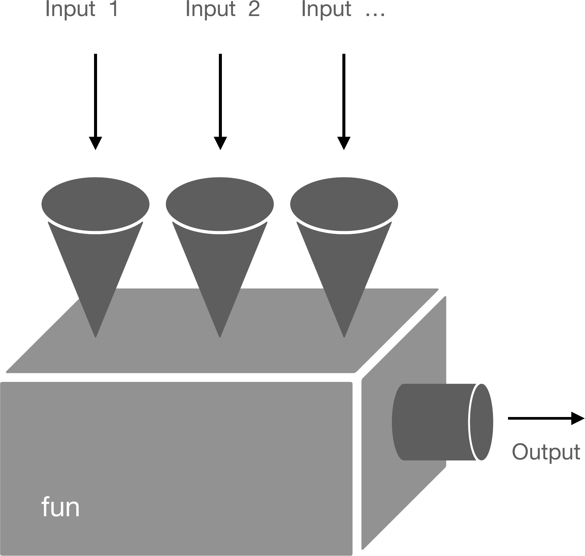
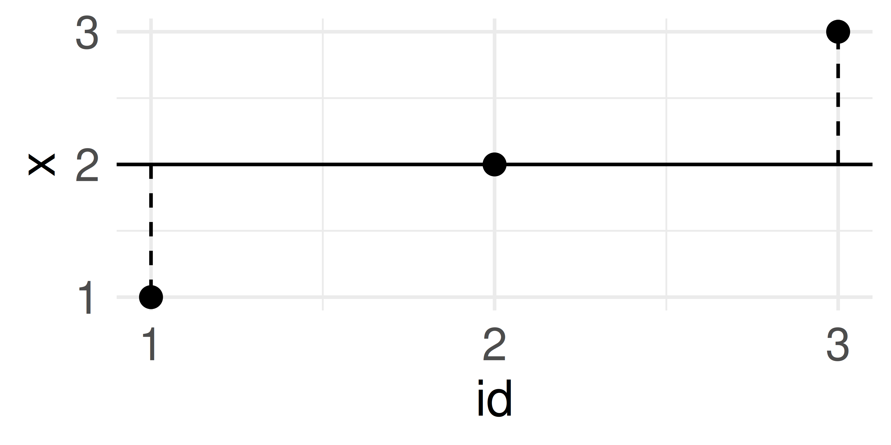
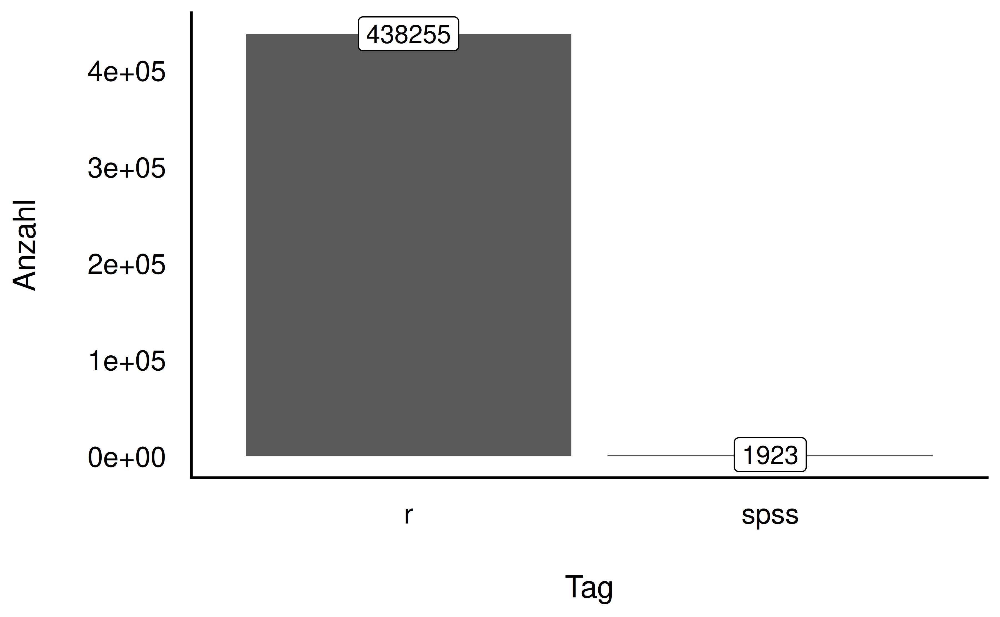

# Einstieg {.center footer=false}

## Lernziele {.smaller}

- Sie können R und eine IDE (RStudio oder Positron) starten.
- Sie können R-Pakete installieren und starten.
- Sie können Variablen in R zuweisen und auslesen.
- Sie können Daten in R importieren.
- Sie können den Begriff *Reproduzierbarkeit* definieren.

::: footer
Einstieg
:::

## Lernverlauf: Höhen und Tiefen

![Life is a roller-coaster. You just have to ride it [@horst_statistics_2024]](../img/r_rollercoaster.png){width="70%"}

Höhen und Tiefen beim Lernen von R sind normal — mit etwas Übung geht bald alles leichter von der Hand.

::: footer
Einstieg
:::

# Errrstkontakt {.center footer=false}

## Warum R?

1. R ist *kostenlos* — andere Softwarepakete für Datenanalyse sind teuer.
2. R ist *quelloffen* — jeder kann die Befehle einsehen und beitragen.
3. R hat die *neuesten* statistischen Methoden.
4. R hat eine große *Community*.
5. R ist *maßgeschneidert* für Datenanalyse.

::: footer
Errrstkontakt
:::

## Definition: Reproduzierbarkeit

:::{.callout-note title="Definition: Reproduzierbarkeit"}
Ein (wissenschaftlicher) Befund ist reproduzierbar, wenn andere Personen mit der Analysemethodik zum gleichen Ergebnis kommen wie in der ursprünglichen Analyse [@plesser_reproducibility_2018].
:::

**Daten** + **Syntax** + **genaue Messbeschreibung** = **reproduzierbar**

::: footer
Errrstkontakt
:::

## Aus der Forschung: Reproduzierbarkeit in der Psychologie {.smaller}

@obels_analysis_2020 untersuchten die Reproduzierbarkeit von Registered Reports (2014–2018):

> Von 62 Artikeln hatten 41 Daten verfügbar, 37 Analyseskripte. Für 36 Artikel waren beides verfügbar. Reproduziert werden konnten die Hauptergebnisse von 21 Artikeln.

Insgesamt war also etwa **jede dritte Studie** reproduzierbar — da gibt es noch viel Luft nach oben.

::: footer
Errrstkontakt
:::

## R & IDE: Arbeitsteilung {.smaller}

![R macht die Arbeit, die IDE sorgt für Komfort und Übersicht [@ismay_statistical_2020]](../img/r_vs_rstudio_1.png){width="42%"}

- R erledigt die eigentliche Rechenarbeit.
- Eine **IDE** (integrierte Entwicklungsumgebung) sorgt für Komfort.
- Zwei gleichwertige, kostenlose IDEs stehen zur Wahl: **RStudio** und **Positron** (beide von Posit) — mehr dazu im Buch.

::: footer
Errrstkontakt
:::

# Installation {.center footer=false}

## R und eine IDE installieren {.smaller}

1. **R installieren**: <https://cloud.r-project.org> (Windows/MacOS/Linux)
2. **Eine IDE installieren** — Ihre Wahl:
   - RStudio: <https://posit.co/download/rstudio-desktop/>
   - Positron: <https://positron.posit.co/download.html>

Beide IDEs finden R selbständig — gestartet wird immer nur die IDE, nicht R direkt.

::: {.callout-note}
Alle Inhalte dieses Buchs funktionieren identisch mit RStudio und Positron.
:::

::: {.callout-tip}
**Master-Shortcut** `Strg+Shift+P` öffnet die Befehlspalette — damit finden und starten Sie *jeden* Befehl der IDE, ohne den Klickpfad im Menü suchen zu müssen (funktioniert in RStudio und Positron).
:::

::: footer
Installation
:::

# R-Pakete {.center footer=false}

## Was sind R-Pakete? {.smaller}

- R hat einen *modularen Aufbau*: Erweiterungen ("Pakete") bringen zusätzliche Befehle und Daten mit.
- Stellen Sie sich ein Paket wie ein Buch vor: Erst installieren ("kaufen"), dann laden ("lesen").
- Auf CRAN, dem offiziellen "Web-Store", gibt es ca. 20.000 Pakete [@RJ-2023-4-cran].

::: footer
R-Pakete
:::

## Pakete installieren & starten

- Installieren (einmalig): per Klick (RStudio) oder Code:
  ```r
  install.packages("tidyverse")
  ```
- Starten (bei jedem Neustart neu):
  ```r
  library(tidyverse)
  ```
- Für dieses Buch benötigt: `tidyverse` [@wickham2019a] und `easystats` [@ludecke2022] — beides "Sammelpakete", die mehrere Pakete auf einmal bereitstellen.

::: footer
R-Pakete
:::

# Mit R arbeiten {.center footer=false}

## Projekte

- Ein *Projekt* ist letztlich ein Ordner, der als Basis für zusammengehörige Dateien dient.
- Vorteil: Dateien lassen sich ohne vollständigen Pfad ansprechen, z. B. `"daten.csv"` statt eines langen Pfads.
- Nutzen Sie Projekte — das erspart Ärger mit Pfaden.

::: footer
Mit R arbeiten
:::

## Skriptdateien & Quarto-Dokumente

- Eine *Skriptdatei* sammelt R-Befehle ("Syntax") in einer Textdatei.
- Speichern: `Strg+S` · Öffnen: `Strg+O`
- [Quarto](https://quarto.org/) erlaubt es, R-Syntax direkt in Dokumente (HTML, PDF, …) einzubetten — Ausgaben landen automatisch im fertigen Dokument.
- Sie sind nicht verpflichtet, Quarto zu nutzen — Skriptdateien reichen auch.

::: footer
Mit R arbeiten
:::

# Errisch für Einsteiger {.center footer=false}

## Variablen {.smaller}

```r
richtige_antwort <- 42
falsche_antwort <- 43
typ <- "Antwort"
ist_korrekt <- TRUE
```

- Zuweisungspfeil `<-` (bevorzugt) oder `=` — beides funktioniert.
- Eine Variable ist wie ein Becher mit Wert und Beschriftung.

{width="25%"}

::: footer
Errisch für Einsteiger
:::

## Definition: Funktion {.smaller}

:::{.callout-note title="Definition: Funktion"}
Eine Funktion ist eine Regel, die jedem Eingabewert (Argument) einen Ausgabewert zuordnet — eine "Maschine", die Eingabedaten in Ausgabedaten umwandelt.
:::

{width="32%"}

::: footer
Errisch für Einsteiger
:::

## Definition: Vektor

:::{.callout-note title="Definition: Vektor"}
Ein *Vektor* ist eine geordnete Folge von Werten ("Elementen"), erstellt mit der Funktion `c()`.
:::

```r
x <- c(1, 2, 3)
namen <- c("Anni", "Bert", "Charlie")  # Text-Vektor
```

::: footer
Errisch für Einsteiger
:::

## Unsere erste statistische Funktion

```r
Antworten <- c(42, 43)
mean(Antworten)
```

R arbeitet verschachtelte Befehle *von innen nach außen* ab:

`mean(Antworten)` → `mean(c(42, 43))` → `42.5`

::: footer
Errisch für Einsteiger
:::

## Funktionsargumente {.smaller}

```r
mean(x, trim = 0, na.rm = FALSE, ...)
```

- `x`: der Vektor, für den der Mittelwert berechnet wird
- `trim`: sollen Extremwerte "abgeschnitten" werden?
- `na.rm`: sollen fehlende Werte (`NA`) entfernt werden?
- Argumente mit *Voreinstellung* (default) müssen nicht befüllt werden.
- Ohne benannte Argumente zählt die Reihenfolge: `mean(Antworten, 0, FALSE)`.

::: footer
Errisch für Einsteiger
:::

## Vorsicht bei fehlenden Werten

```r
Antworten <- c(42, 43, NA)
mean(Antworten)          # ergibt NA
mean(Antworten, na.rm = TRUE)  # entfernt NA, rechnet trotzdem
```

`NA` steht für *not available* — R macht damit auf fehlende Werte aufmerksam, statt sie stillschweigend zu ignorieren.

::: footer
Errisch für Einsteiger
:::

## Vektorielles Rechnen

{width="55%"}

```r
x <- c(1, 2, 3)
x - mean(x)
```

Eine Operation wird automatisch auf *jedes* Element angewandt — kein Loop nötig.

::: footer
Errisch für Einsteiger
:::

## Ich brauche R-Hilfe! {.smaller}

- Hilfe zu einer Funktion: `help(fun)` oder Help-Panel der IDE
- In welchem Paket wohnt eine Funktion? *RDocumentation* durchsuchen
- Fehler nicht klar? Meist hat schon jemand das Problem gelöst — stackoverflow.com
- R hängt oder spinnt? Konsole/Session neu starten (AEG-Prinzip: Aus-Ein-Gut)
- `WARNING` ist meist harmlos, `Error` bedeutet: Syntax läuft nicht durch

::: footer
Errisch für Einsteiger
:::

# Mit Daten arbeiten {.center footer=false}

## Wo sind meine Daten?

Eine Datei liegt entweder

1. irgendwo im Internet, oder
2. irgendwo auf Ihrem Computer (z. B. im Projektordner).

In beiden Fällen definieren *Pfad* und *Dateiname* den Aufenthaltsort.

Gebräuchlichste Tabellenformate: **CSV** (einfache Textdatei) und **XLSX** (Excel).

::: footer
Mit Daten arbeiten
:::

## Daten importieren

```r
# aus einem R-Paket:
data("mariokart", package = "openintro")

# von einer Webseite:
mariokart <- read.csv("https://.../mariokart.csv")

# vom eigenen Computer:
d <- read.csv("mariokart.csv")
```

RStudio bietet zusätzlich einen Klick-Import-Assistenten ohne R-Code.

::: footer
Mit Daten arbeiten
:::

## Definition: Dataframe

:::{.callout-note title="Definition: Dataframe"}
Ein Dataframe (auch "Tibble") ist ein Datenobjekt zur Darstellung von Tabellen: eine oder mehrere gleich lange, benannte Spalten. Jede Spalte ist selbst ein Vektor.
:::

Tabellen ansehen: Namen eingeben, oder `View(mariokart)`.

::: footer
Mit Daten arbeiten
:::

# Logikprüfung {.center footer=false}

## Logische Prüfungen in R {.smaller}

```r
x <- 42
x == 42   # Gleichheit prüfen (doppeltes Gleichheitszeichen!)
```

| Prüfung auf | R-Syntax |
|---|---|
| Gleichheit | `x == Wert` |
| Ungleichheit | `x != Wert` |
| Größer / kleiner | `x > Wert` / `x < Wert` |
| Logisches UND / ODER | `&` / `|` |

:::{.callout-caution}
`x = 73` prüft **nicht** auf Gleichheit, sondern weist zu!
:::

::: footer
Logikprüfung
:::

# Praxisbezug {.center footer=false}

## Wird R wirklich genutzt? {.smaller}

{width="35%"}

Faktor ~200 zwischen R und SPSS — ein Indiz, dass R in der Praxis stark gefragt ist.
Berufe mit Datenbezug zählen zu den stark wachsenden Berufsfeldern [@berger_jobs_2019.].

::: footer
Praxisbezug
:::

## Zusammenfassung

- R ist kostenlos, quelloffen, aktuell und community-getragen
- R + IDE (RStudio oder Positron) arbeiten Hand in Hand
- R-Pakete: einmalig installieren, bei jeder Sitzung neu starten
- Variablen (`<-`), Funktionen (`fun(x)`) und Vektoren (`c()`) sind die Grundbausteine
- Daten importieren: aus Paketen, per URL oder vom eigenen Computer
- Logikprüfungen: `==` prüft, `=` weist zu

## Literaturhinweise {.smaller}

- "Warum R? Warum, R?" in @sauer_moderne_2019 — Pro und Contra, Starten, Grundlagen von "Errisch"
- @ismay_statistical_2020, [Kapitel 1](https://moderndive.com/1-getting-started.html) — anwenderfreundlich, frei online
- @cetinkaya-rundel_introduction_2021 — etwas formaler, passendes Niveau für angewandte Bachelor-Statistik

## Referenzen {.smaller}
