# Einstieg {.center footer=false}

## Lernziele {.smaller}

- Sie können erläutern, wann und wozu das Visualisieren statistischer Inhalte sinnvoll ist.
- Sie kennen typische Arten von Datendiagrammen.
- Sie können typische Datendiagramme mit R visualisieren.
- Sie können zentrale Ergebnisse aus Datendiagrammen herauslesen.

::: footer
Einstieg
:::

## Benötigte R-Pakete und Daten {.smaller}

Neben `tidyverse` und `easystats` benötigen wir in diesem Kapitel:

```r
library(ggpubr)        # Datenvisualisierung
library(ggstatsplot)   # optional, Datenvisualisierung
```

Wir arbeiten wieder mit dem Datensatz `mariokart`.

::: footer
Einstieg
:::

## Wozu das alles?

Ein Bild sagt mehr als 1000 Worte — Datendiagramme helfen, Erkenntnisse aus Daten zu ziehen, ohne mühsam einzelne Zahlen zu vergleichen.

::: footer
Einstieg
:::

# Ein Dino sagt mehr als 1000 Worte {.center footer=false}

## Gleiche Kennwerte, ganz andere Bilder {.smaller}

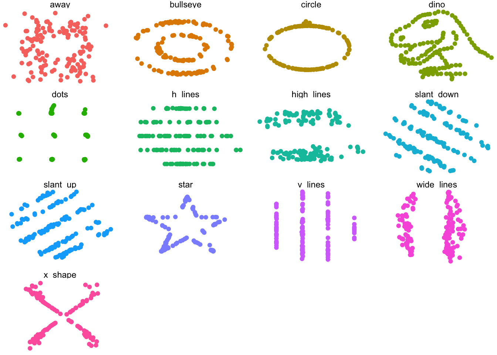{width="32%"}

- Verschiedene Datensätze können (nahezu) identische Kennwerte (Mittelwert, Streuung, Korrelation) haben — und trotzdem völlig verschieden aussehen.
- Dasselbe zeigt "Anscombes Quartett": vier grundverschiedene Streudiagramme mit fast identischen Statistiken.
- Fazit: Eine Visualisierung enthüllt oft, was eine Kennzahl verhüllt.

::: footer
Ein Dino sagt mehr als 1000 Worte
:::

## Definition: Datendiagramm

:::{.callout-note title="Definition: Datendiagramm"}
Ein *Datendiagramm* (kurz: Diagramm) ist ein Diagramm, das Daten und Statistiken zeigt, mit dem Zweck, Erkenntnisse daraus zu ziehen.
:::

::: footer
Ein Dino sagt mehr als 1000 Worte
:::

## Grenzen der Dimensionalität {.smaller}

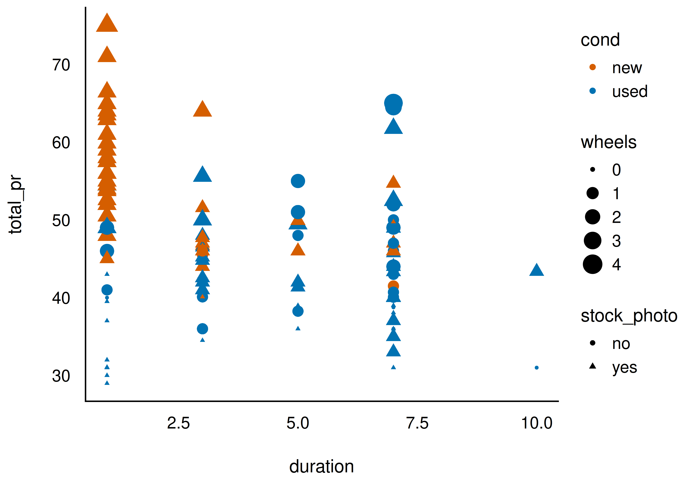{width="45%"}

Ein Bild kann nur eine begrenzte Anzahl an Variablen sinnvoll zeigen — vielleicht vier bis sechs. Bei mehr Variablen brauchen wir Statistik statt (nur) Bilder.

::: footer
Ein Dino sagt mehr als 1000 Worte
:::

# Nomenklatur von Datendiagrammen {.center footer=false}

## Eine kleine Nomenklatur

| Erkenntnisziel | qualitativ | quantitativ |
|---|---|---|
| Verteilung | Balkendiagramm | Histogramm / Dichtediagramm |
| Zusammenhang | gefülltes Balkendiagramm | Streudiagramm |
| Unterschied | gefülltes Balkendiagramm | Boxplot |

::: footer
Nomenklatur von Datendiagrammen
:::

# Verteilungen verbildlichen {.center footer=false}

## Definition: Verteilung

:::{.callout-note title="Definition: Verteilung"}
Eine (Häufigkeits-)Verteilung einer Variablen $X$ schlüsselt auf, wie häufig jede Ausprägung von $X$ ist.
:::

::: footer
Verteilungen verbildlichen
:::

## Verteilung einer nominalen Variable: Balkendiagramm {.smaller}

{width="50%"}

Ein Balkendiagramm zeigt Häufigkeiten von Kategorien als Balken — die Länge ist proportional zur Häufigkeit. Die Ausrichtung (horizontal/vertikal) ist Geschmackssache.

::: footer
Verteilungen verbildlichen
:::

## Syntax: Balkendiagramm mit `ggpubr`

```r
mariokart %>%
  count(cond) %>%
  ggbarplot(x = "cond", y = "n")
```

{width="35%"}

::: footer
Verteilungen verbildlichen
:::

## Verteilung einer quantitativen Variable {.smaller}

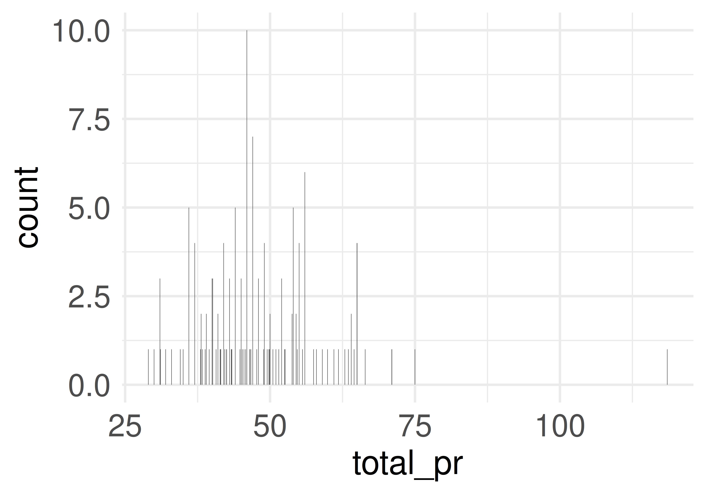{width="45%"} 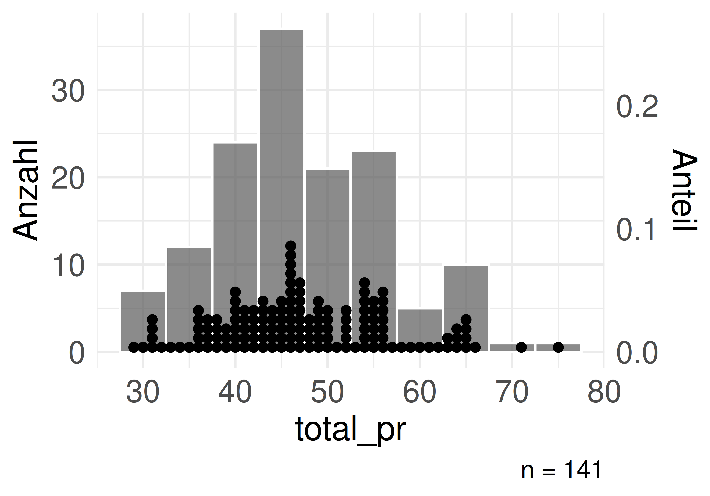{width="45%"}

Bei vielen Ausprägungen ist ein Balkendiagramm unübersichtlich. Lösung: Werte in Gruppen (Klassen) zusammenfassen — das ergibt ein **Histogramm**.

::: footer
Verteilungen verbildlichen
:::

## Definition: Histogramm

:::{.callout-note title="Definition: Histogramm"}
Ein Histogramm ist ein Diagramm zur Darstellung der Häufigkeitsverteilung einer quantitativen Variablen. Die Daten werden in Klassen eingeteilt, die durch Balken dargestellt werden; die Balkenhöhe zeigt die Häufigkeit pro Klasse.
:::

::: footer
Verteilungen verbildlichen
:::

## Wie viele Balken? Nicht zu viele, nicht zu wenige {.smaller}

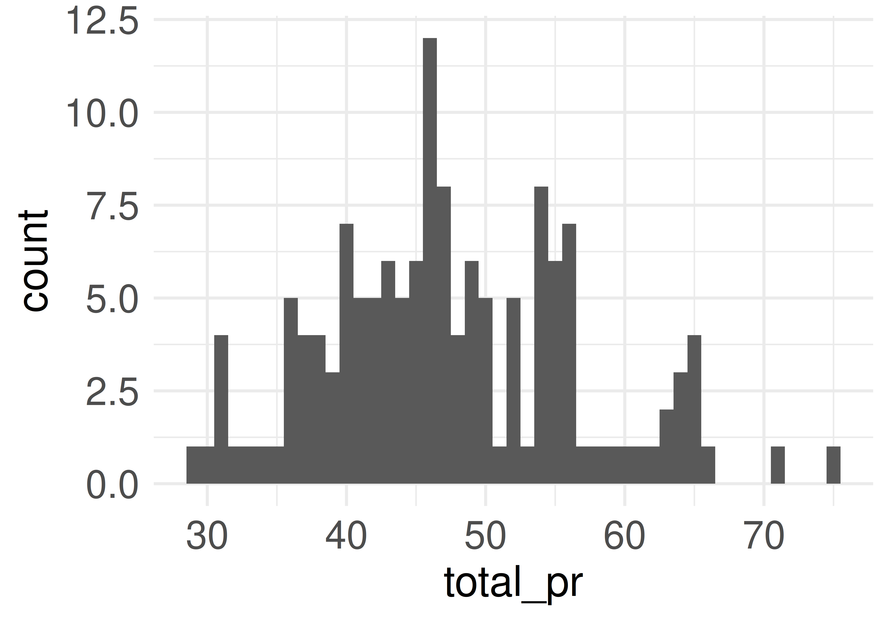{width="45%"} 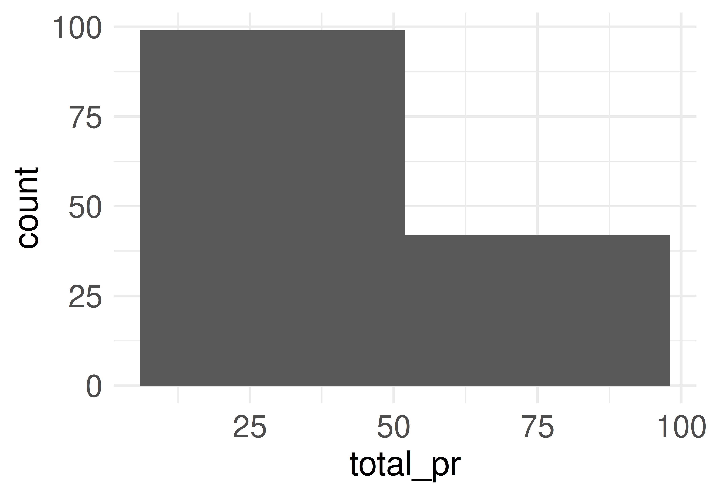{width="45%"}

Es gibt keine feste Regel für die Balkenanzahl — nur: nicht zu grob, nicht zu fein.

::: footer
Verteilungen verbildlichen
:::

## Histogramm vs. Dichtediagramm {.smaller}

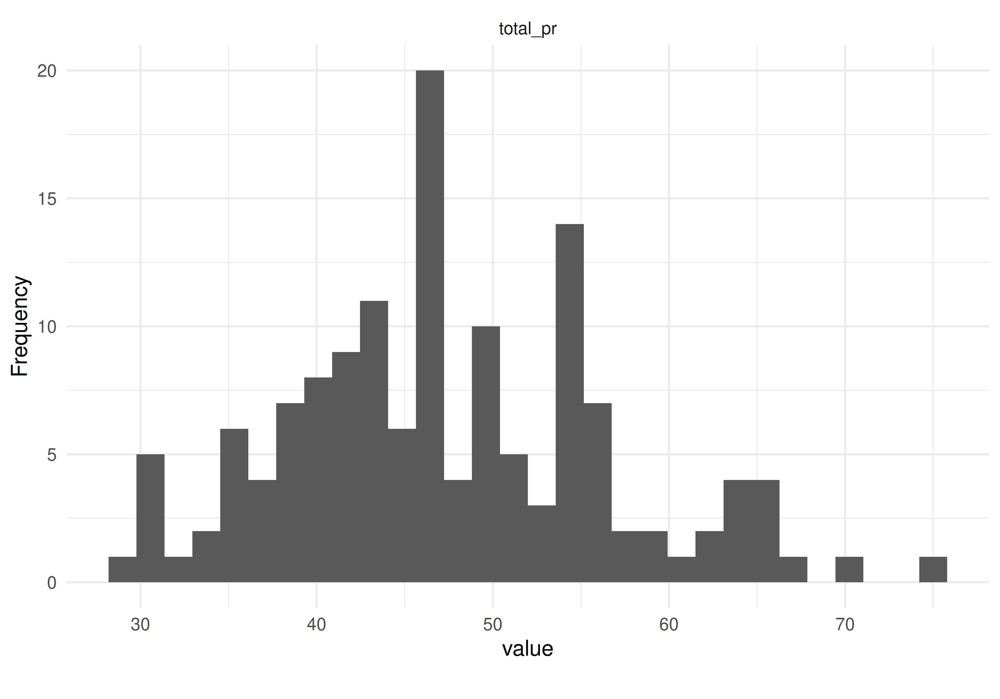{width="45%"} 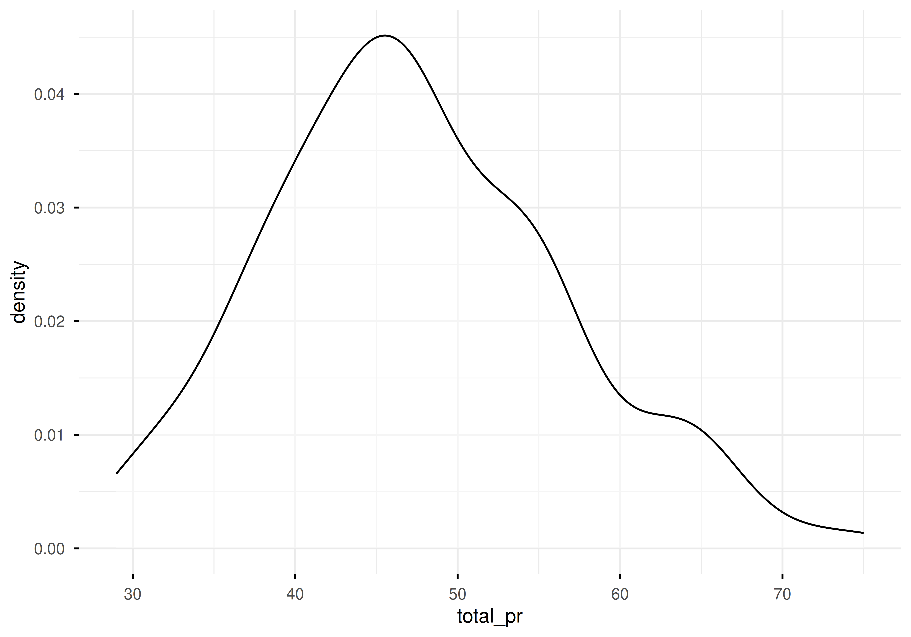{width="45%"}

:::{.callout-note title="Definition: Dichtediagramm"}
Ein Dichtediagramm visualisiert die Verteilung einer stetigen Variablen — geglättet, sodass Rauschen weniger stört als beim Histogramm.
:::

::: footer
Verteilungen verbildlichen
:::

## Histogramm + Dichtelinie kombiniert

{width="55%"}

::: footer
Verteilungen verbildlichen
:::

## Verteilungsformen {.smaller}

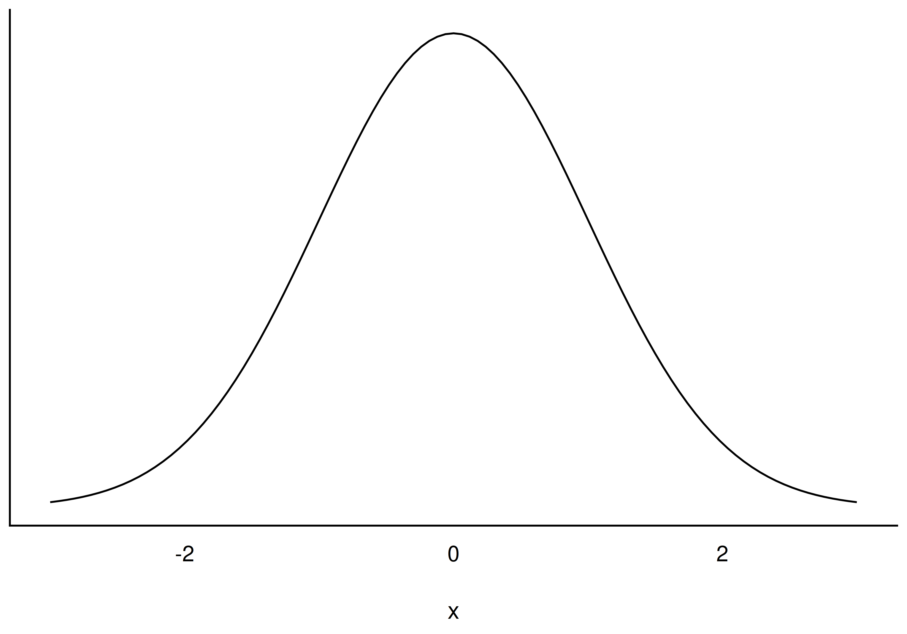{width="26%"} 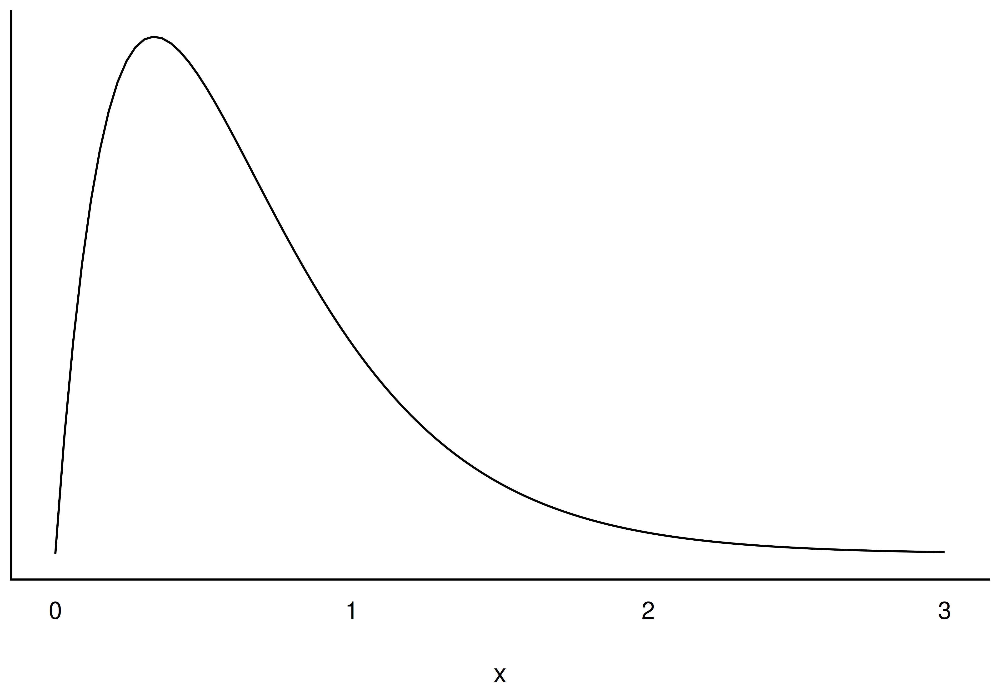{width="26%"}

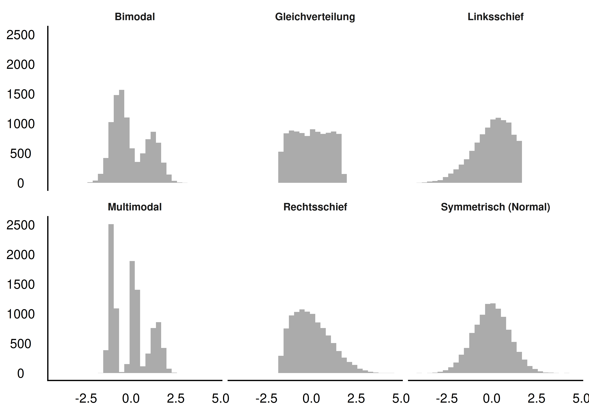{width="40%"}

::: footer
Verteilungen verbildlichen
:::

# Spezialfall Normalverteilung {.center footer=false}

## Definition: Normalverteilung {.smaller}

:::{.callout-note title="Definition: Normalverteilung"}
Normalverteilungen haben eine charakteristische, symmetrische Glockenform. Sie unterscheiden sich in Mittelwert $\mu$ und Streuung $\sigma$ — diese beiden Parameter bestimmen den gesamten Kurvenverlauf.
:::

Kurzschreibweise: $X \sim \mathcal{N}(\mu, \sigma)$

![Normalverteilungen mit verschiedenen Mittelwerten und Streuungen [@inductiveload2008]](../img/normals.png){width="40%"}

::: footer
Spezialfall Normalverteilung
:::

## Beispiele normalverteilter Variablen

Körpergröße, IQ-Werte, Prüfungsergebnisse, Messfehler, Lebensdauer von Glühbirnen, Gewicht von Brotlaiben, Milchproduktion von Kühen …

::: footer
Spezialfall Normalverteilung
:::

## Fläche unter der Kurve {.smaller}

![Flächeninhalte (Wahrscheinlichkeitsmasse) einer Normalverteilung [@ainali_standard_2007]](../img/Standard_deviation_diagram_micro.svg.png){width="45%"}

Die **68-95-99,7-Prozentregel**:

- $68\,\%$ im Bereich $\mu\pm 1 \cdot \sigma$
- $95\,\%$ im Bereich $\mu\pm 2 \cdot \sigma$
- $99{.}7\,\%$ im Bereich $\mu\pm 3 \cdot \sigma$

::: footer
Spezialfall Normalverteilung
:::

## Beispiel: IQ-Verteilung

$IQ \sim \mathcal{N}(100,15)$

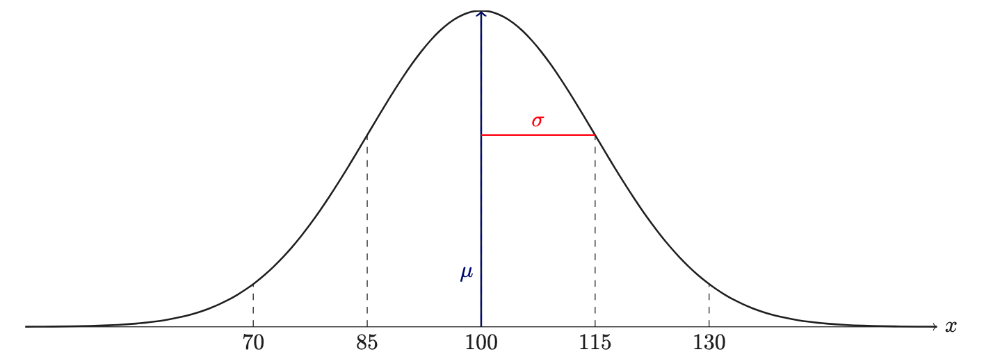{width="45%"}

::: footer
Spezialfall Normalverteilung
:::

## Entstehung einer Normalverteilung {.smaller}

:::{.callout-note title="Definition: Entstehung einer Normalverteilung"}
Wenn sich eine Variable $X$ als Summe mehrerer, unabhängiger, etwa gleich starker Summanden ergibt, tendiert $X$ dazu, normalverteilt zu sein.
:::

Anschaulich zeigt das Galton-Brett, wie aus vielen kleinen Zufallsereignissen eine Glockenkurve entsteht.

::: footer
Spezialfall Normalverteilung
:::

# Zusammenhänge verbildlichen {.center footer=false}

## Zusammenhang nominaler Variablen {.smaller}

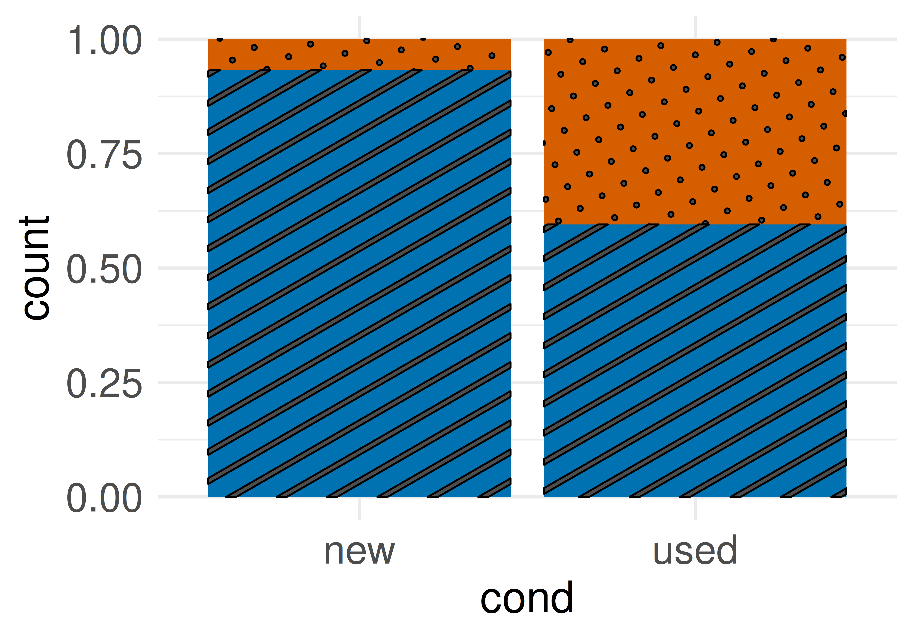{width="55%"}

Bei neuen Spielen war fast immer ein Foto dabei; bei gebrauchten nur bei gut der Hälfte — ein Zusammenhang zwischen `cond` und `stock_photo`.

::: footer
Zusammenhänge verbildlichen
:::

## Gefüllte Balkendiagramme {.smaller}

```r
mariokart %>%
  count(stock_photo, cond) %>%
  ggbarplot(x = "stock_photo", y = "n", fill = "cond",
            position = position_fill())  # aus dem Paket ggpubr
```

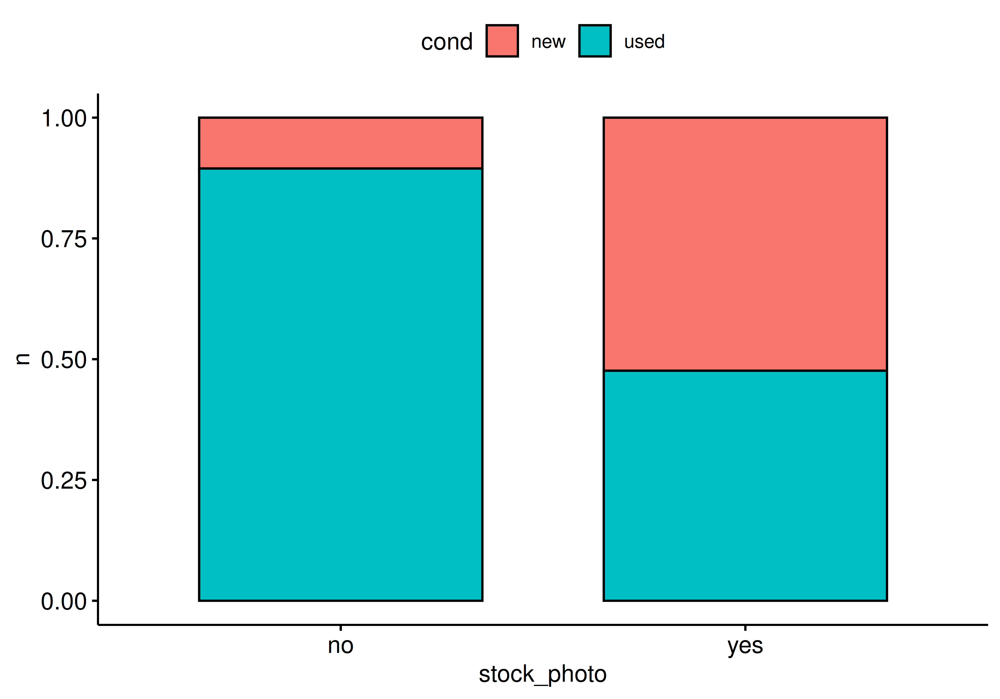{width="35%"}

Geeignet, wenn (mindestens) eine der beiden Variablen nur zwei Ausprägungen hat.

::: footer
Zusammenhänge verbildlichen
:::

## Zusammenhang bei metrischen Variablen: Streudiagramm {.smaller}

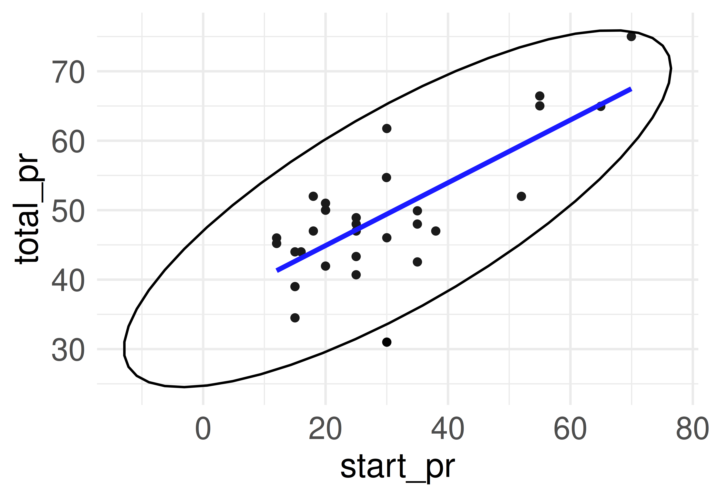{width="55%"}

Die Trendgerade (Regressionsgerade) zeigt Richtung des Zusammenhangs; die Ellipse zeigt, wie eng die Daten um sie streuen.

::: footer
Zusammenhänge verbildlichen
:::

## Definition: Linearer Zusammenhang

:::{.callout-note title="Definition: Linearer Zusammenhang"}
Lässt sich die Beziehung zweier Variablen gut mit einer Geraden beschreiben, spricht man von einem linearen Zusammenhang. *Gleichsinnige* (positive) Zusammenhänge zeigen aufsteigende Trendgeraden $\nearrow$; *gegensinnige* (negative) zeigen absteigende Trendgeraden $\searrow$.
:::

::: footer
Zusammenhänge verbildlichen
:::

## Auch nicht-lineare Zusammenhänge gibt es

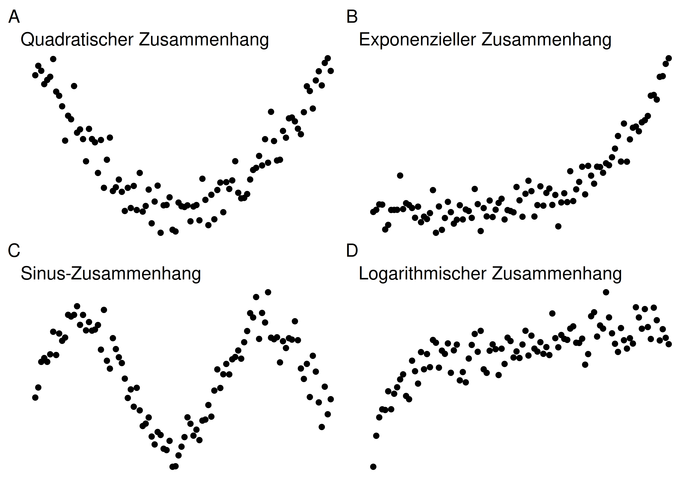{width="55%"}

::: footer
Zusammenhänge verbildlichen
:::

## Stärke und Richtung von Zusammenhängen {.smaller}

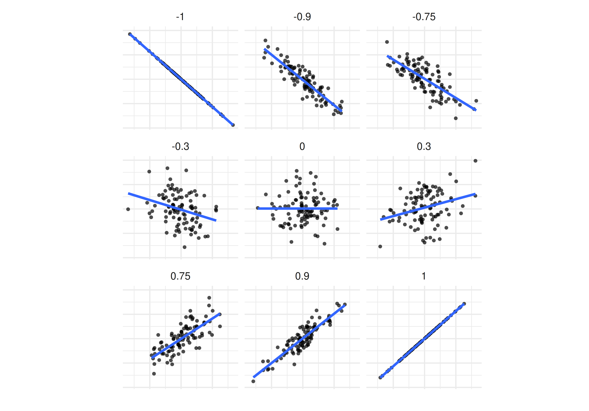{width="55%"}

Schmale Ellipsen ("Baguette") = starker Zusammenhang; breite Ellipsen ("Torte") = schwacher Zusammenhang.

::: footer
Zusammenhänge verbildlichen
:::

## Faustregeln für den Korrelationskoeffizienten {.smaller}

:::: {.columns}
::: {.column width="40%"}
- $r\approx 0$: kein Zusammenhang
- $r \pm .1$: schwacher Zusammenhang
- $r \pm .3$: mittlerer Zusammenhang
- $r \pm .5$: starker Zusammenhang
- $r = 1$: perfekter Zusammenhang
:::
::: {.column width="60%"}
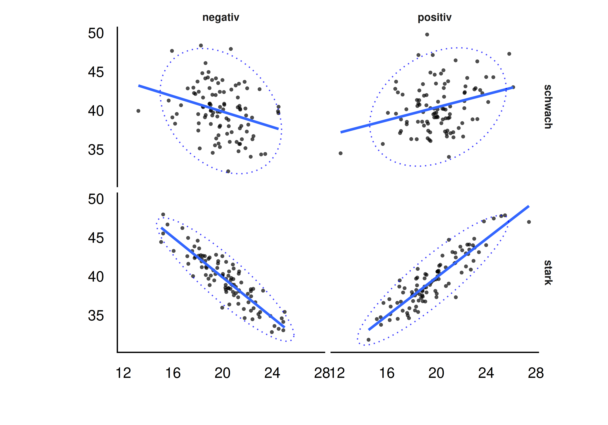{width="80%"}
:::
::::

::: footer
Zusammenhänge verbildlichen
:::

## Mehrere Zusammenhänge auf einen Blick {.smaller}

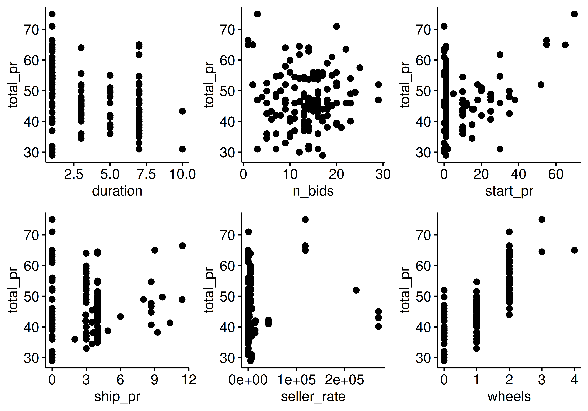{width="48%"}

Mit `map()` bauen wir für jede Variable ein `ggscatter()`-Diagramm gegen die Zielvariable `total_pr` und fügen alle mit `ggarrange()` zu einem Panel zusammen — `start_pr` und `wheels` hängen am stärksten mit `total_pr` zusammen.

::: footer
Zusammenhänge verbildlichen
:::

# Unterschiede verbildlichen {.center footer=false}

## Unterschiede bei nominalen Variablen

Für nominale Variablen eignen sich Balkendiagramme sowohl für Zusammenhänge als auch für Unterschiede — beides ist letztlich dieselbe Fragestellung, nur anders formuliert.

Tortendiagramme sind dagegen ungeeignet: Flächenvergleiche sind für das Auge schwer.

::: footer
Unterschiede verbildlichen
:::

## Unterschiede bei quantitativen Variablen: Boxplot {.smaller}

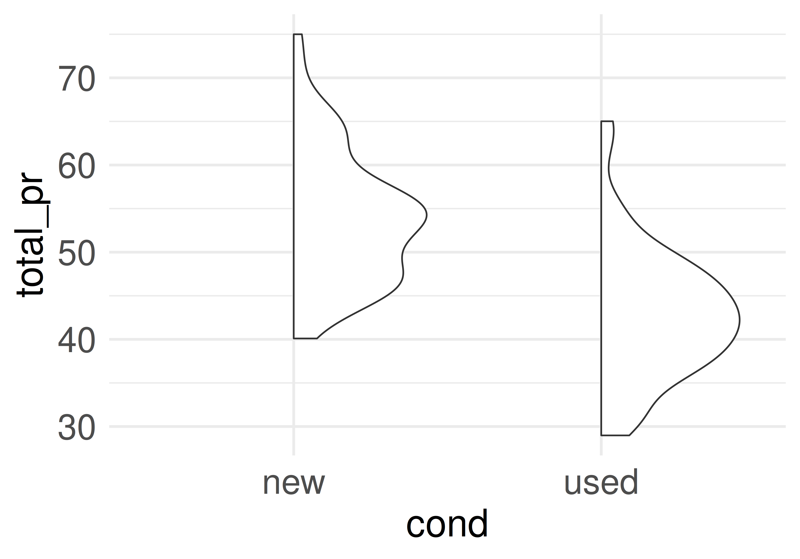{width="50%"}

Der Boxplot vereinfacht die Verteilungsdarstellung — kompakter als ein Histogramm, aber mit weniger Detail.

::: footer
Unterschiede verbildlichen
:::

## Definition: Boxplot

:::{.callout-note title="Definition: Boxplot"}
Der Boxplot ist eine Vereinfachung bzw. Zusammenfassung eines Histogramms. Damit stellt er ebenfalls eine Verteilung (einer metrischen Variablen) dar.
:::

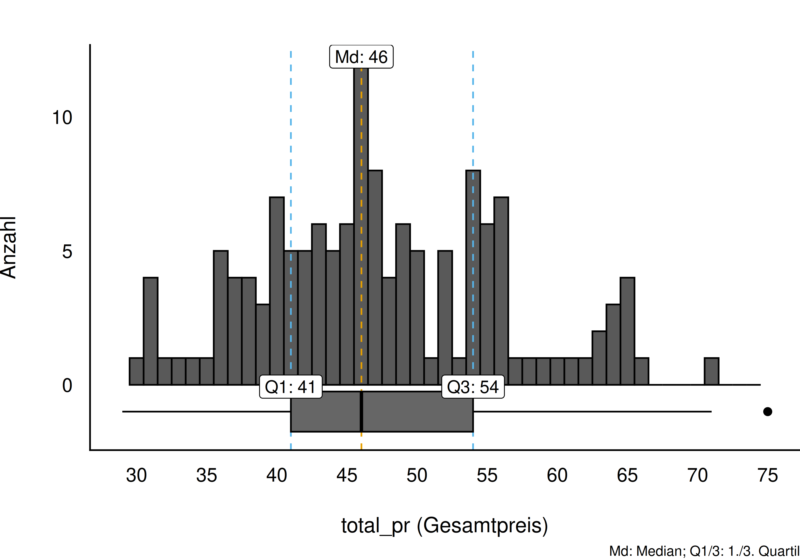{width="45%"}

::: footer
Unterschiede verbildlichen
:::

## Anatomie des Boxplots {.smaller}

1. **Dicker Strich**: Median der Verteilung.
2. **Enden der Box**: 1. und 3. Quartil — die Breite ist der *Interquartilsabstand* (IQR).
3. **Antennen**: Streuung der äußeren 25 % (links/rechts), begrenzt auf das 1,5-fache der Boxlänge.
4. **Einzelne Punkte**: Extremwerte außerhalb der Antennen.
5. Median mittig in der Box + gleich lange Antennen → Verteilung symmetrisch; sonst schief.

::: footer
Unterschiede verbildlichen
:::

## Boxplot: metrisch vs. nominal gruppiert {.smaller}

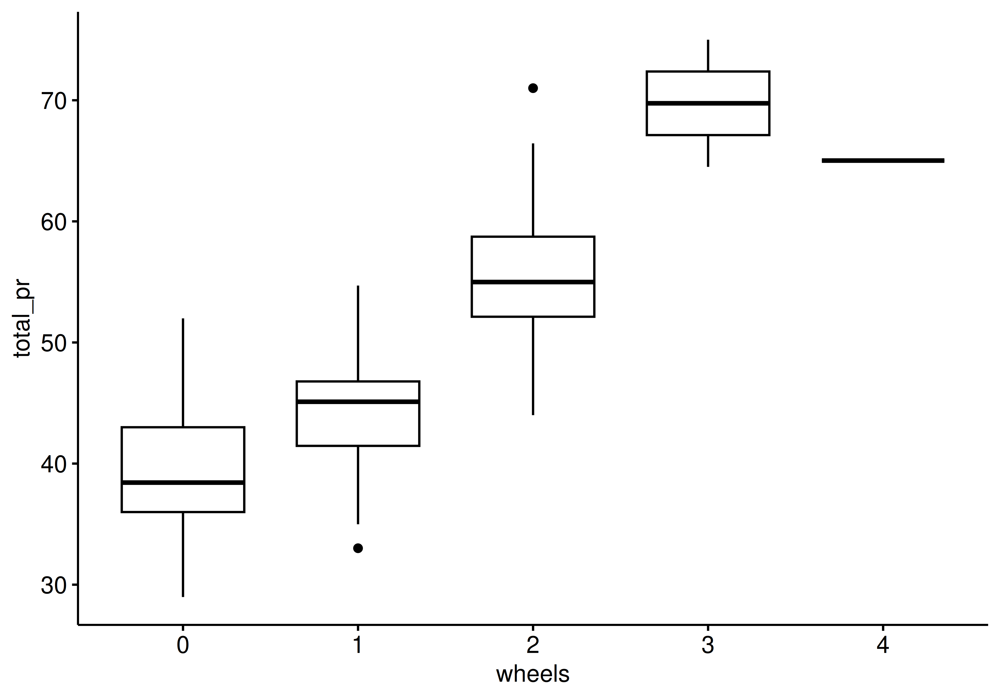{width="50%"}

`factor(wheels)` erzwingt, dass jeder Wert (0, 1, 2, 3, 4) als eigene Gruppe behandelt wird — sonst gruppiert R metrische Variablen automatisch (und nicht immer sinnvoll).

::: footer
Unterschiede verbildlichen
:::

# So lügt man mit Statistik {.center footer=false}

## Achsen stauchen und strecken {.smaller}

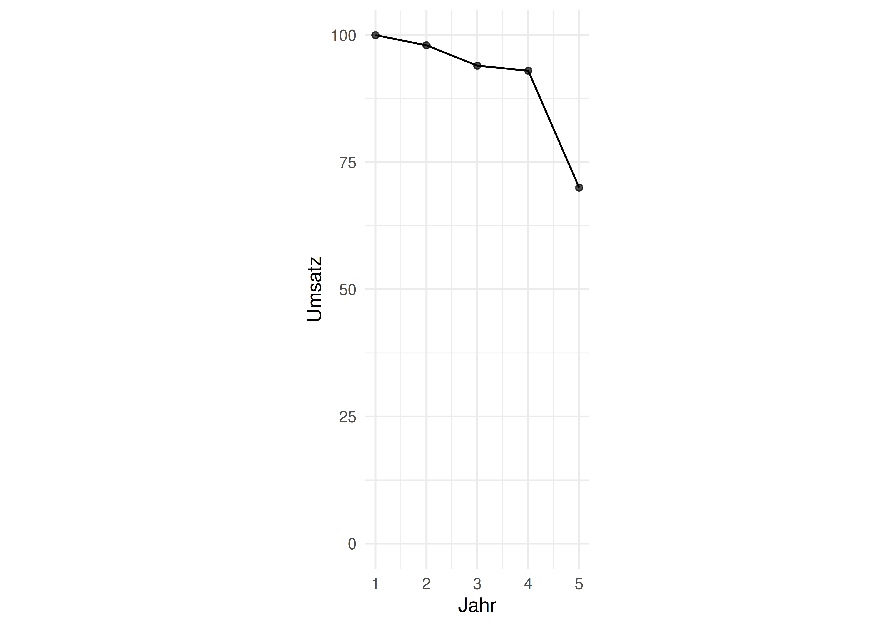{width="70%"}

::: footer
So lügt man mit Statistik
:::

## Die Y-Achse abschneiden {.smaller}

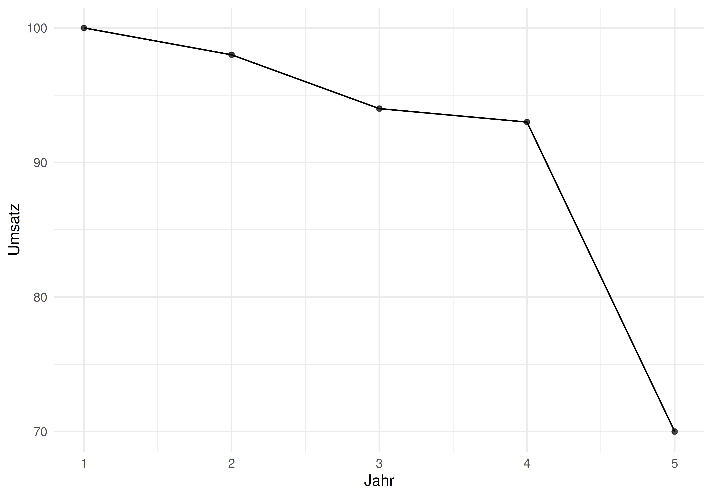{width="70%"}

::: footer
So lügt man mit Statistik
:::

## Scheinkorrelationen als Kausalität verkaufen {.smaller}

![Schokoladenkonsum und Nobelpreise [@messerli_chocolate_2012]](../img/choc.jpeg){width="40%"}

Schokoladenkonsum hängt mit der Anzahl der Nobelpreise (pro Land) zusammen — aber nicht ursächlich. Eine Drittvariable (z. B. allgemeiner Entwicklungsstand) erklärt vermutlich beides gleichzeitig.

::: footer
So lügt man mit Statistik
:::

# Praxisbezug {.center footer=false}

## Die Stärke von Datendiagrammen {.smaller}

![Häufigkeit von Masern vor und nach Einführung der Impfung [@moore_recreating_2015]](../img/vaccine.jpg){width="45%"}

Ein Diagramm kann eine Botschaft (hier: Wirksamkeit der Impfung) auf einen Blick vermitteln — deutlich eindrücklicher als eine Tabelle mit Zahlen.

Tortendiagramme bleiben aber meist eine schlechte Wahl.

::: footer
Praxisbezug
:::

## Zusammenfassung {.smaller}

- Datendiagramme decken auf, was reine Kennzahlen verbergen (Dino-Datensatz, Anscombes Quartett)
- **Verteilung**: Balkendiagramm (nominal), Histogramm/Dichtediagramm (quantitativ) — bei Normalverteilung: $\mu$ und $\sigma$ bestimmen alles
- **Zusammenhang**: gefülltes Balkendiagramm (nominal), Streudiagramm (metrisch) — Stärke via Ellipsenform/Korrelation
- **Unterschied**: Boxplot fasst eine Verteilung kompakt zusammen (Median, Quartile, Antennen, Extremwerte)
- Vorsicht: Diagramme lassen sich manipulieren (gestauchte Achsen, abgeschnittene Y-Achse, Scheinkorrelationen)

## Literaturhinweise {.smaller}

- @wickham2016d — das Standardwerk zu `ggplot2`, kostenfrei online
- @wilke_fundamentals_2019 — hervorragender, praxisnaher Überblick über Datenvisualisierung mit R
- @fisher_making_2018 — verwandte Perspektive auf gutes Visualisieren

## Referenzen {.smaller}
