# Einstieg {.center footer=false}

## Lernziele {.smaller}

- Sie können gängige Arten von Lagemaßen definieren.
- Sie können erläutern, inwiefern man ein Lagemaß als ein Modell verstehen kann.
- Sie können Lagemaße mit R berechnen.

::: footer
Einstieg
:::

# Mittelwert als Modell {.center footer=false}

## Beispiel: Notendurchschnitt

Ein Statistikkurs besteht aus drei Studentinnen: Anna, Berta und Carla. Anna hat eine 1, Berta eine 2, Carla eine 3.

Die Rechenregel zum Mittelwert lautet:

1. Addiere alle Werte.
2. Teile durch die Anzahl der Werte.
3. Fertig!

Der Durchschnitt (das arithmetische Mittel) beträgt: **2**.

::: footer
Mittelwert als Modell
:::

## Definition: Mittelwert

:::{.callout-note title="Definition: Mittelwert"}
Der Mittelwert (MW, mean) von $X$ ist definiert als die Summe der Elemente von $X$ geteilt durch deren Anzahl $n$. Man bezeichnet ihn auch mit $\bar{x}$.
:::

$$\bar{x} := \frac{1}{n} \sum_{i=1}^{n}{x_{i}} = \frac{x_{1}+x_{2}+\dotsb +x_{n}}{n}$$

::: footer
Mittelwert als Modell
:::

## Mittelwert und Residuum

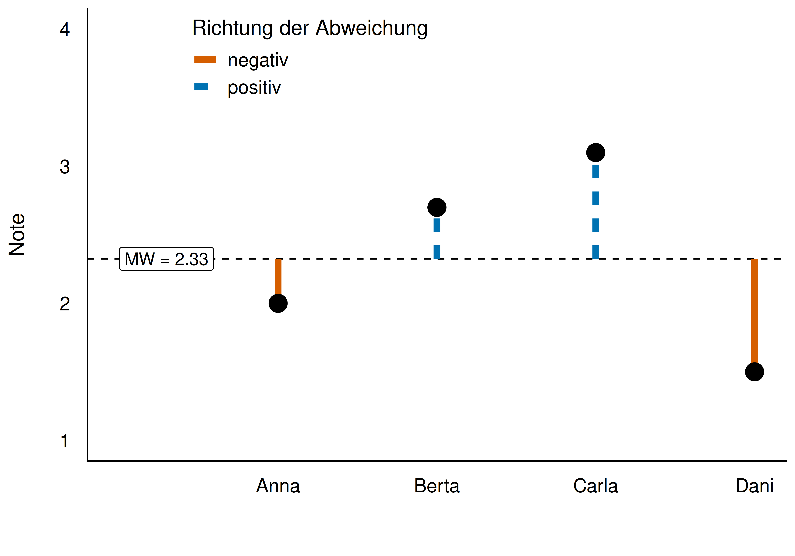{width="55%"}

Die Abweichung ("Fehler", "Rest", "Residuum") $e_i$ einer Beobachtung zum Mittelwert:

**Daten = Modell + Rest**, formal: $y_i = \bar{x} + e_i$

::: footer
Mittelwert als Modell
:::

## Summe der Abweichungen ist Null

$$\begin{aligned}
\sum_{i=1}^n (x_i-\bar{x}) &= \sum_{i=1}^n x_i - \sum_{i=1}^n \bar{x} \\
&= n\cdot \bar{x} - n\cdot \bar{x} = 0
\end{aligned}$$

Die nach oben ragenden Abweichungen gleichen die nach unten ragenden exakt aus.

::: footer
Mittelwert als Modell
:::

## Mittelwert als lineares Modell

:::{.callout-note title="Definition: Lineares Modell"}
Ein lineares Modell beschreibt die Daten durch eine Gerade.
:::

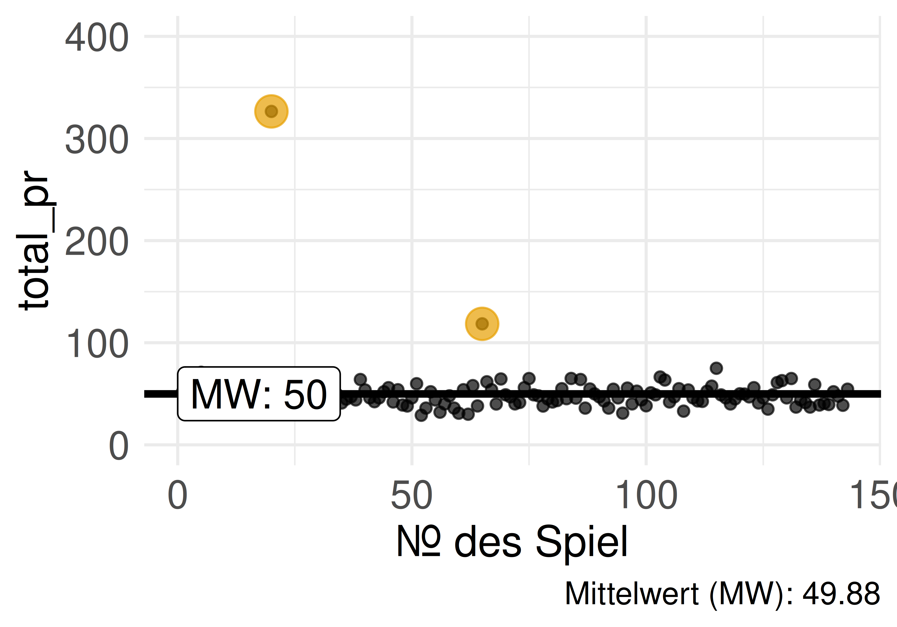{width="45%"} 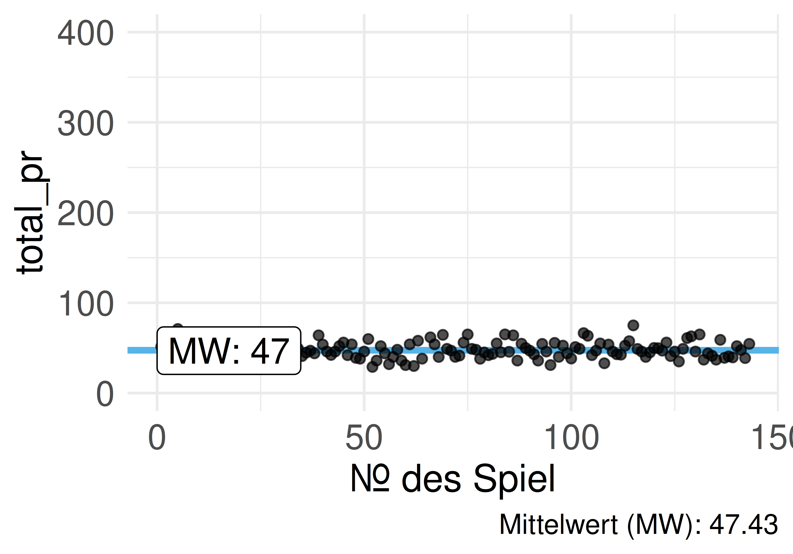{width="45%"}

::: footer
Mittelwert als Modell
:::

## In R: der Befehl `lm()` {.smaller}

```r
lm(einkommen ~ 1)  # lm wie "lineares Modell"
```

- `lm()` gibt als `Coefficient` (Koeffizient) den Mittelwert zurück — den Achsenabschnitt (*intercept*).
- Die Gerade des Mittelwerts schneidet die Y-Achse genau an diesem Punkt.
- Mehr zur `lm()`-Syntax folgt in einem späteren Kapitel.

::: footer
Mittelwert als Modell
:::

## Der wertvollste Fußballer im Hörsaal {.smaller}

Kommt Kylian Mbappé (Jahreseinkommen ca. 120 Mio. Euro) in einen Hörsaal mit 100 Studis, die je 1000 Euro/Jahr verdienen:

```r
einkommen_studis <- rep(x = 1000, times = 100)
einkommen <- c(einkommen_studis, 120*1e6)
mean(einkommen)
```

Der Mittelwert liegt bei über einer Million Euro — kein gutes Modell für das typische Vermögen im Hörsaal!

::: footer
Mittelwert als Modell
:::

# Der Median als Modell {.center footer=false}

## Einkommensverteilung im Hörsaal

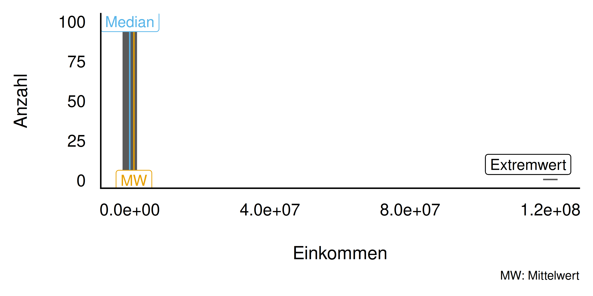{width="65%"}

Der Mittelwert ist anfällig für Extremwerte — man sagt, er ist nicht *robust*.

::: footer
Der Median als Modell
:::

## Definition: Median

:::{.callout-note title="Definition: Median"}
Die Merkmalsausprägung, die bei aufsteigend sortierten Beobachtungen in der Mitte liegt, nennt man Median.
:::

Bei geradem $n$ wird das arithmetische Mittel der beiden mittleren Werte gebildet.

::: footer
Der Median als Modell
:::

## Median: der mittlere Wert einer sortierten Reihe

::: {layout-ncol="3" fig-align="bottom"}
{width="15%"}

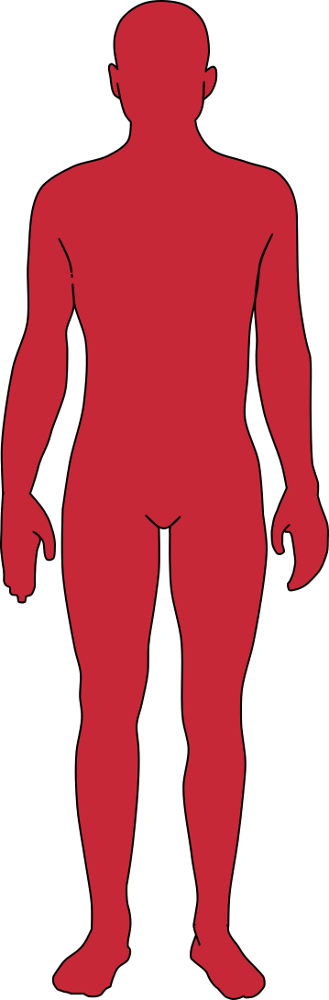{width="21%"}

{width="27%"}
:::

Der Median (1,79 m, rot) als Wert des "mittleren" Objekts bei aufsteigend sortierten Objekten: gleich viele Personen sind kleiner wie größer.

::: footer
Der Median als Modell
:::

## Der Median ist robust {.smaller}

Erhöht sich das Einkommen einer Person im Hörsaal um das Hundertfache (z. B. durch ein Patent), bleibt der Median nahezu unverändert.

:::{.callout-important}
Bei (sehr) schiefen Verteilungen ist der Mittelwert wenig aussagekräftig, da er nicht mehr den "typischen" Wert widerspiegelt.
:::

::: footer
Der Median als Modell
:::

## Beispiel: Mariokart — Median vs. Mittelwert

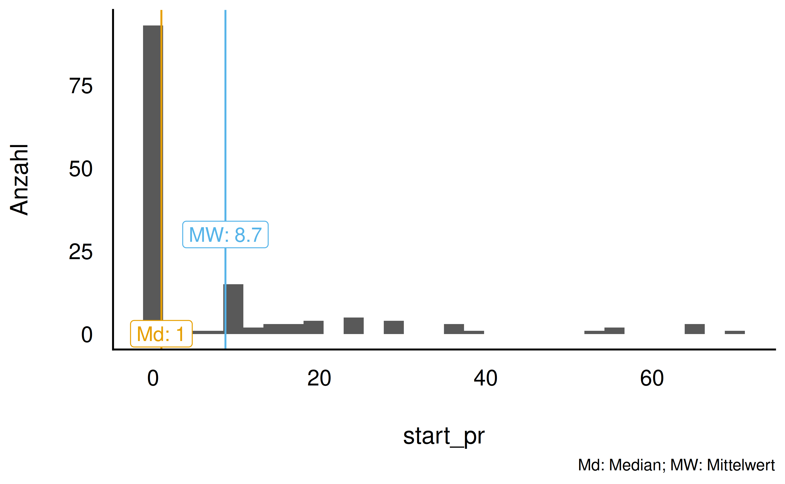{width="60%"}

Ist der Mittelwert größer als der Median, nennt man die Verteilung **rechtsschief**.

::: footer
Der Median als Modell
:::

# Quantile {.center footer=false}

## Quantile als Verallgemeinerung des Medians {.smaller}

Der Median teilt eine Verteilung in eine untere und eine obere Hälfte — eine "50-Prozent-Marke".

- Median der billigeren Hälfte → trennt das billigste Viertel vom Rest ab.
- Median der teureren Hälfte → trennt das teuerste Viertel vom Rest ab.

Warum nur in 25-%-Schritten aufteilen? Man kann genauso gut in 10-%- oder 1-%-Schritten aufteilen.

::: footer
Quantile
:::

## Definition: Quartile

:::{.callout-note title="Definition: Quartile"}
Sortiert man die Daten aufsteigend, trennt das *erste Quartil* (Q1, 25 %) das Viertel der kleinsten Werte vom Rest ab. Den Median nennt man das *zweite Quartil* (Q2, 50 %). Das *dritte Quartil* (Q3, 75 %) trennt die drei Viertel kleinsten Werte vom obersten Viertel ab.
:::

::: footer
Quantile
:::

## Definition: Dezile & Quantile {.smaller}

:::{.callout-note title="Definition: Dezile"}
Die neun Quantile $p = 0.1, 0.2, \ldots, 1$, die eine Verteilung in 10 gleich große Teile unterteilen, nennt man Dezile.
:::

:::{.callout-note title="Definition: Quantile"}
Ein $p$-Quantil ist der Wert, der von $p$ Prozent der Werte nicht überschritten wird. Quantil ist der Oberbegriff für Quartile, Dezile etc.
:::

::: footer
Quantile
:::

## Quartile für Mariokart-Verkaufsgebote

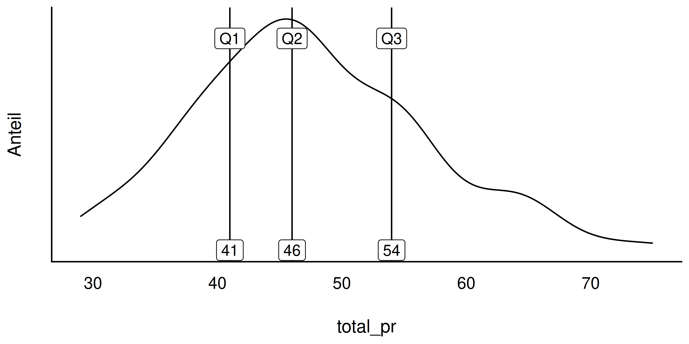{width="60%"}

::: footer
Quantile
:::

## Quantile visualisiert

::: {.show-caption layout-ncol="2"}
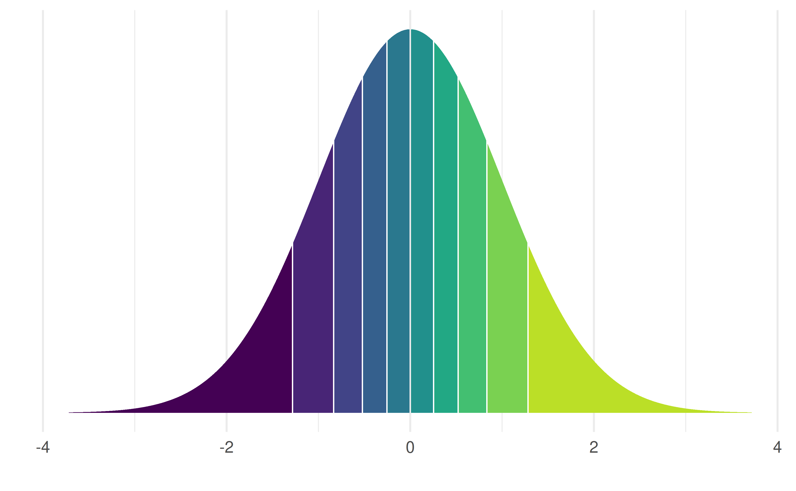{width="90%"}

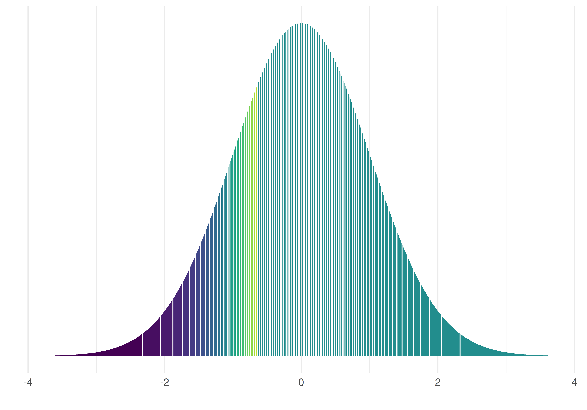{width="90%"}
:::

Alle Flächen sind gleich groß.

::: footer
Quantile
:::

## Quantile berechnen mit R

```r
mariokart %>%
  filter(total_pr < 100) %>%
  summarise(
    q25 = quantile(total_pr, .25),  # 1. Quartil
    q50 = quantile(total_pr, .50),  # 2. Quartil
    q75 = quantile(total_pr, .75))  # 3. Quartil
```

::: footer
Quantile
:::

## Beispiel: Körpergröße von Studierenden

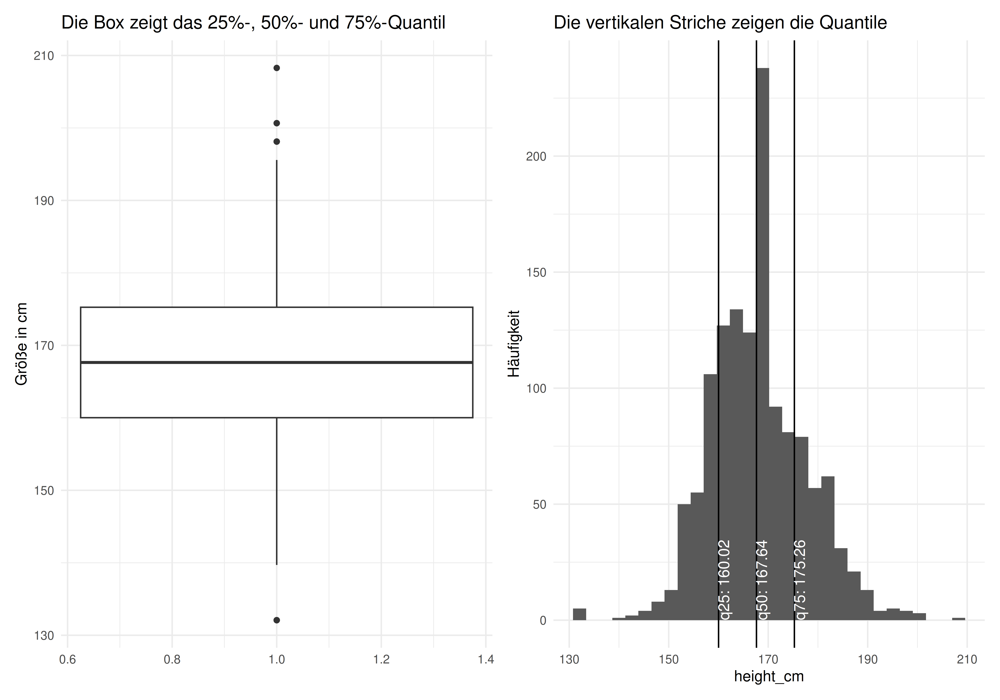{width="70%"}

::: footer
Quantile
:::

## Beispiel: Quantile der IQ-Verteilung {.smaller}

Der IQ wird üblicherweise als normalverteilt mit Mittelwert 100 und Streuung 15 angenommen.

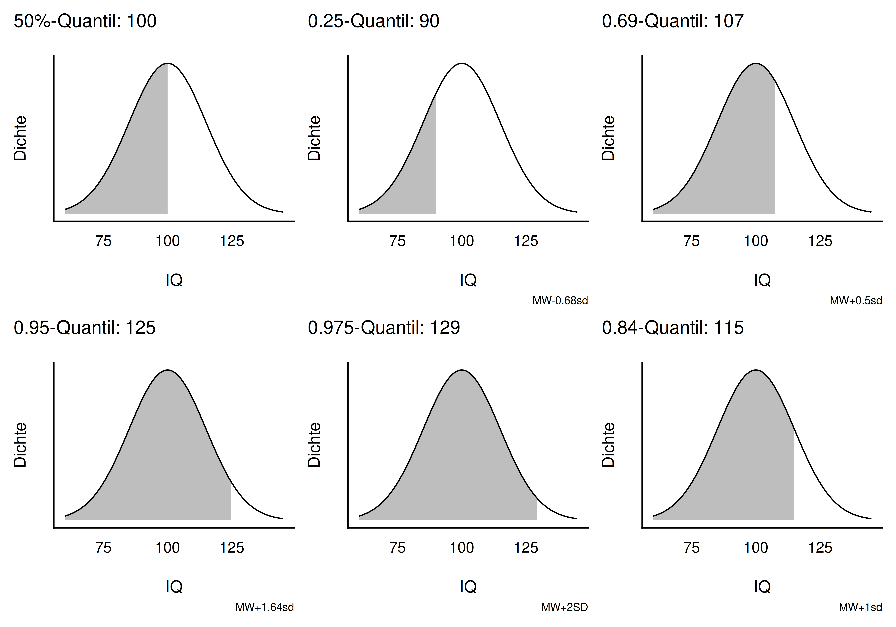{width="65%"}

::: footer
Quantile
:::

# Lagemaße {.center footer=false}

## Definition: Lagemaß

:::{.callout-note title="Definition: Lagemaß"}
Ein *Lagemaß* (synonym: Maß der zentralen Tendenz) gibt einen Vorschlag, welchen Wert einer Verteilung wir als typisch, normal, erwartbar oder "mittel" ansehen sollten.
:::

Gebräuchliche Lagemaße: Mittelwert, Median, Quantile (z. B. Quartile), Minimum, Maximum, Modus.

::: footer
Lagemaße
:::

## Definition: Punktmodell

:::{.callout-note title="Definition: Punktmodell"}
Ein Modell, das für alle Beobachtungen ein und denselben Wert vorhersagt, heißt *Punktmodell*.
:::

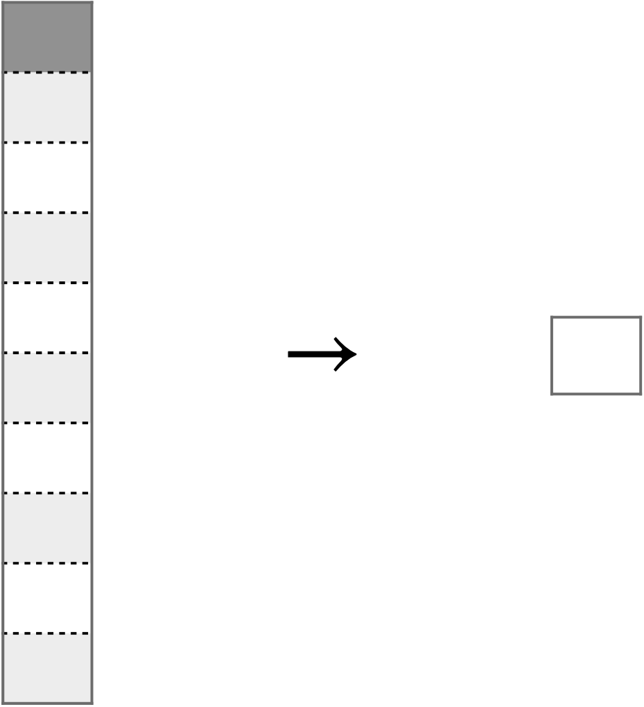{width="20%"}

Mittelwert, Median und Quartile sind Beispiele für Punktmodelle.

::: footer
Lagemaße
:::

## Gruppierte Lagemaße

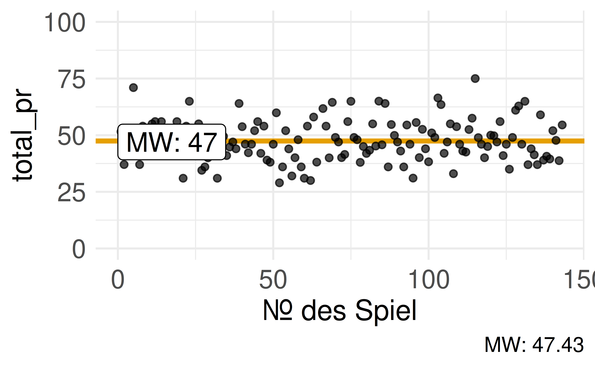{width="45%"} 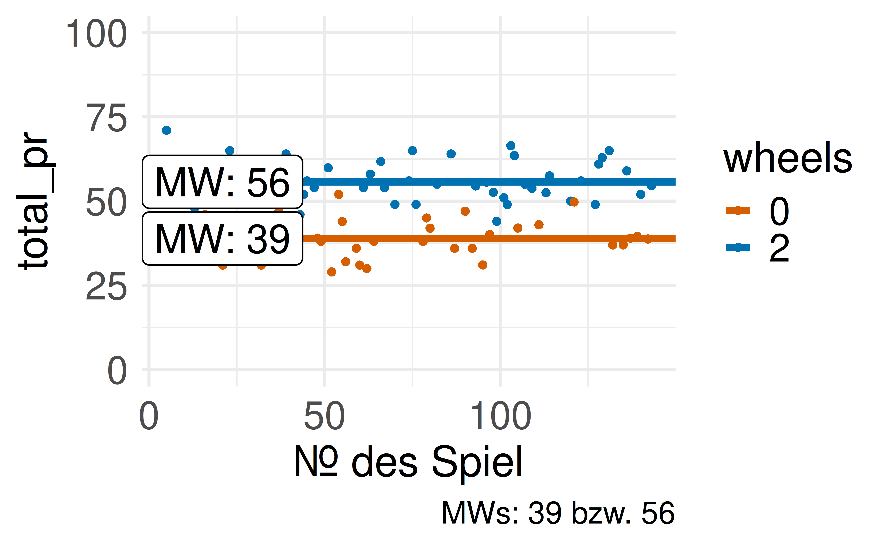{width="45%"}

Innerhalb der Gruppen sind die Abweichungen zum Gruppen-Mittelwert oft geringer als zum ungruppierten Mittelwert — das Residuum wird kleiner.

::: footer
Lagemaße
:::

# Wie man mit Statistik lügt {.center footer=false}

## Checkliste: Transparenz einer Analyse {.smaller}

1. Wurde die Art und Zeitdauer der Datenerhebung vorab festgelegt und berichtet?
2. Wurden ausreichend Daten gesammelt (z. B. mind. 20 Beobachtungen pro Gruppe)?
3. Wurden alle untersuchten Variablen berichtet?
4. Wurden alle durchgeführten Interventionen berichtet?
5. Wurden Daten aus der Analyse entfernt? Wenn ja, gibt es eine stichhaltige Begründung?

:::{.callout-important}
Stellen Sie hohe Anforderungen an die Transparenz einer statistischen Analyse.
:::

::: footer
Wie man mit Statistik lügt
:::

## Zusammenfassung {.smaller}

- **Mittelwert**: Summe der Werte geteilt durch deren Anzahl — nicht robust gegenüber Extremwerten
- **Median**: mittlerer Wert bei sortierten Daten — robust gegenüber Extremwerten
- **Quantile**: verallgemeinern den Median (Quartile, Dezile, Perzentile)
- **Lagemaße** sind Punktmodelle: Sie fassen eine Verteilung zu einem "typischen" Wert zusammen
- Gruppierte Lagemaße können Residuen verkleinern
- Transparenz ist der Schlüssel gegen Manipulation statistischer Analysen

## Literaturhinweise

- @mittag_statistik_2020 und @oestreich_keine_2014 — Einführungen in die Statistik
- @bortz_statistik_2010 — ein Klassiker
- @sauer_moderne_2019 — mit Fokus auf R
- @cetinkaya-rundel_introduction_2021, @poldrack_statistical_2023 — englischsprachig, online verfügbar

## Referenzen {.smaller}
