# Einstieg {.center footer=false}

## Lernziele {.smaller}

- Sie kennen gängige Maße der Streuung einer Stichprobe und können diese definieren und anhand von Beispielen erläutern.
- Sie können gängige Maße der Streuung einer Stichprobe mit R berechnen.
- Sie können die Bedeutung von Streuung für die Güte eines Modells erläutern.

::: footer
Einstieg
:::

## Die Schlankheitspille von Prof. Weiss-Ois {.smaller}

{width="22%"}

**Was er sagt:** "Meine Pille reduziert das Gewicht im Schnitt um 1 kg!"

**Was er NICHT sagt:** Die Werte streuten um 10 kg um den Mittelwert.

Wie sehr die Werte eines Modells streuen, ist eine wichtige Information — bei der Pille kann es sein, dass Sie 10 kg *zunehmen*.

::: footer
Einstieg
:::

## Wie man seine Kuh über den Fluss bringt {.smaller}

Fritz will mit seiner Kuh einen Fluss überqueren. Er fragt Karla, ob der Fluss tief ist.

> Karla: Nö, im Schnitt nur einen Meter.

Fritz führt seine Kuh durch den Fluss — die Kuh ertrinkt.

:::{.callout-important}
Die Streuung der Daten zu kennen, ist eine wesentliche Information — ein Lagemaß (wie der Mittelwert) allein reicht nicht.
:::

::: footer
Einstieg
:::

# Woran erkennt man ein gutes Modell? {.center footer=false}

## Wenig vs. viel Streuung {.smaller}

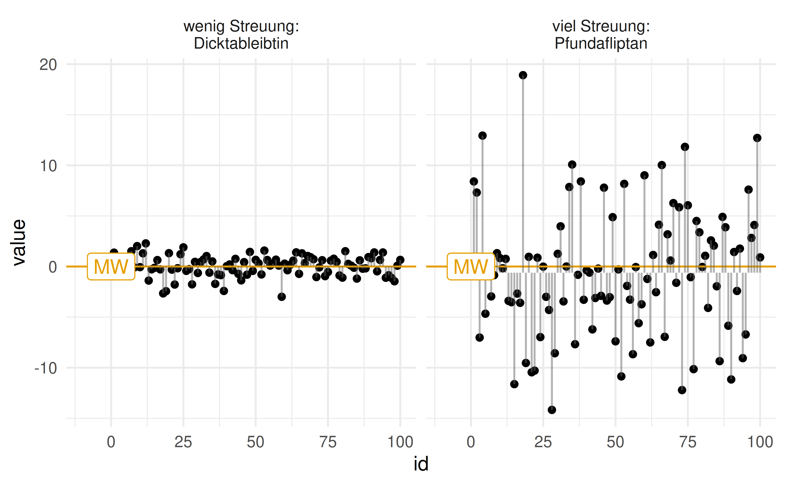{width="65%"}

Bei wenig Streuung liegen beobachtete Werte ($y$) nah an den Modellwerten ($\hat{y}$) — die Abweichungen $e = y - \hat{y}$ sind gering.

::: footer
Woran erkennt man ein gutes Modell?
:::

## Modellgüte = Präzision des Modells

Wir wollen ein präzises Modell, also kurze Fehlerbalken: Das Modell soll die Daten gut erklären, also wenig vom tatsächlichen Wert abweichen.

:::{.callout-important}
Ein Modell ohne Angabe der Modellgüte (Präzision der Schätzung) ist wenig nütze.
:::

::: footer
Woran erkennt man ein gutes Modell?
:::

## Ein komplexeres Modell reduziert die Streuung

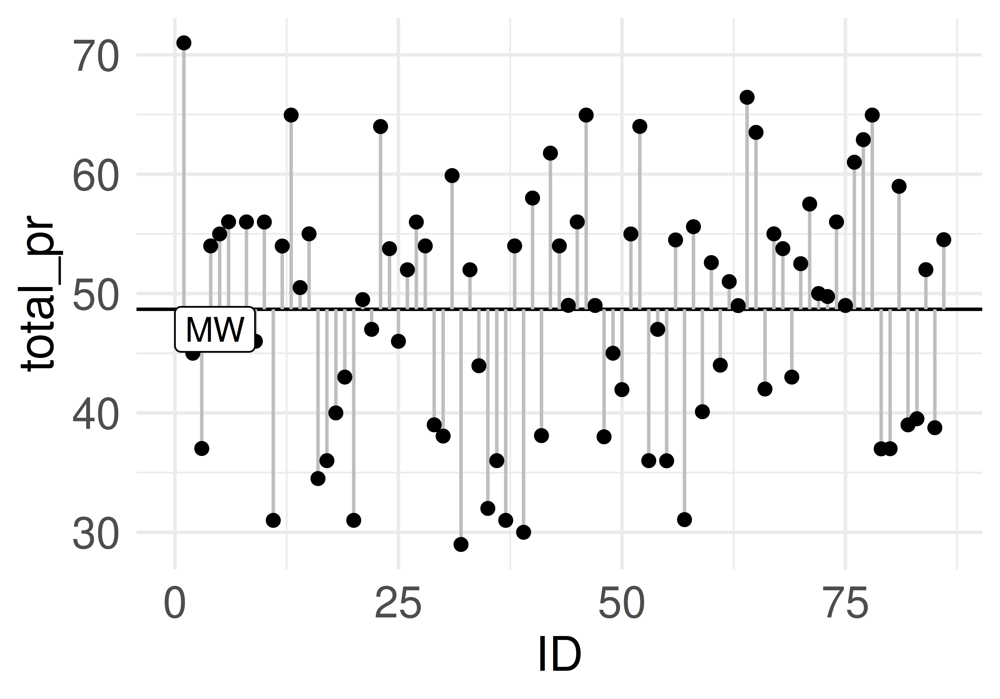{width="45%"} 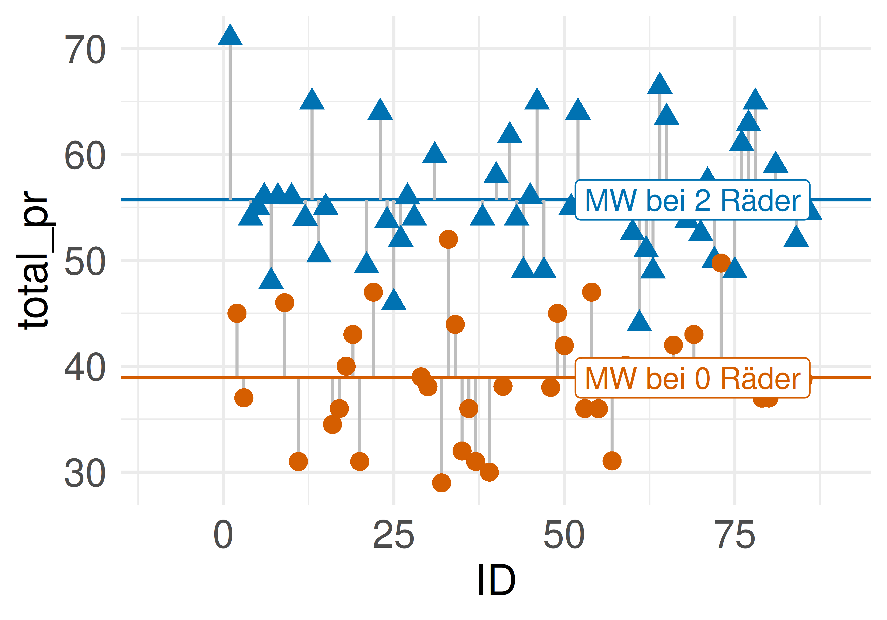{width="45%"}

Innerhalb der Gruppen (0 vs. 2 Lenkräder) sind die Fehlerbalken im Schnitt kürzer als im ungruppierten Modell.

::: footer
Woran erkennt man ein gutes Modell?
:::

# Streuungsmaße {.center footer=false}

## Definition: Streuungsmaß

:::{.callout-note title="Definition: Streuungsmaß"}
Ein Streuungsmaß quantifiziert die Variabilität (Unterschiedlichkeit, Streuung) eines Merkmals.
:::

::: footer
Streuungsmaße
:::

## Definition: Spannweite

:::{.callout-note title="Definition: Spannweite"}
Die Spannweite (Range) $R$ ist die Differenz von größtem und kleinstem Wert eines Merkmals $X$: $R := X_{max} - X_{min}$.
:::

Beispiel: Werte 1, 23, 42, 100 → $R = 100 - 1 = 99$.

Die Spannweite ist nicht robust gegenüber Extremwerten und sollte nur eingeschränkt verwendet werden.

::: footer
Streuungsmaße
:::

## Der mittlere Abweichungsbalken (MAE)

Legt man alle Abweichungsbalken $e$ aneinander und teilt durch die Anzahl $n$, erhält man den "mittleren Abweichungsbalken" $\bar{e}$ — die *Mittlere Absolutabweichung* (MAE, MAA).

:::{.callout-note title="Definition: Mittlere Absolutabweichung"}
::: {style="font-size: 0.75em;"}
$$\mathrm{MAE} := \frac{\sum_{i=1}^n |y_i - \bar{y}|}{n} = \frac{\sum_{i=1}^n |e_i|}{n} = \bar{e}$$
:::
:::

::: footer
Streuungsmaße
:::

## MAE: Beispiel & R-Berechnung {.smaller}

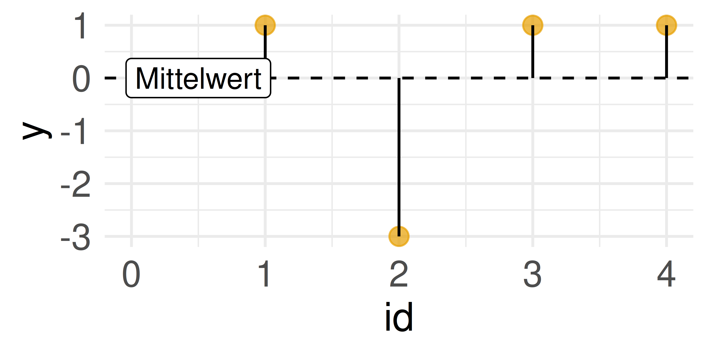{width="45%"}

$MAE = \frac{1 + |-3| + 1 + 1}{4} = 6/4 = 1.5$

Den Mittelwert kann man als lineares Modell (Gerade) auffassen: `lm(y ~ 1, data = d)`.

```r
lm_ohne_x_var <- lm(y ~ 1, data = d)
mae(lm_ohne_x_var)  # aus dem Paket easystats
```

::: footer
Streuungsmaße
:::

## Der Interquartilsabstand (IQR)

:::{.callout-note title="Definition: Interquartilsabstand"}
$IQR := Q_3 - Q_1$
:::

Der IQR ist robuster als MAA, Varianz und Standardabweichung — er baut nicht auf dem Mittelwert auf.

Beispiel: Q1 = 1.65 m, Q3 = 1.75 m → $IQR = 1.75\,m - 1.65\,m = 0.10\,m$ (10 cm).

::: footer
Streuungsmaße
:::

## IQR am Beispiel Mariokart

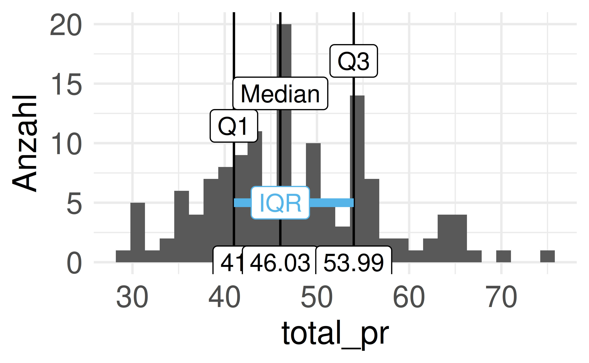{width="45%"} 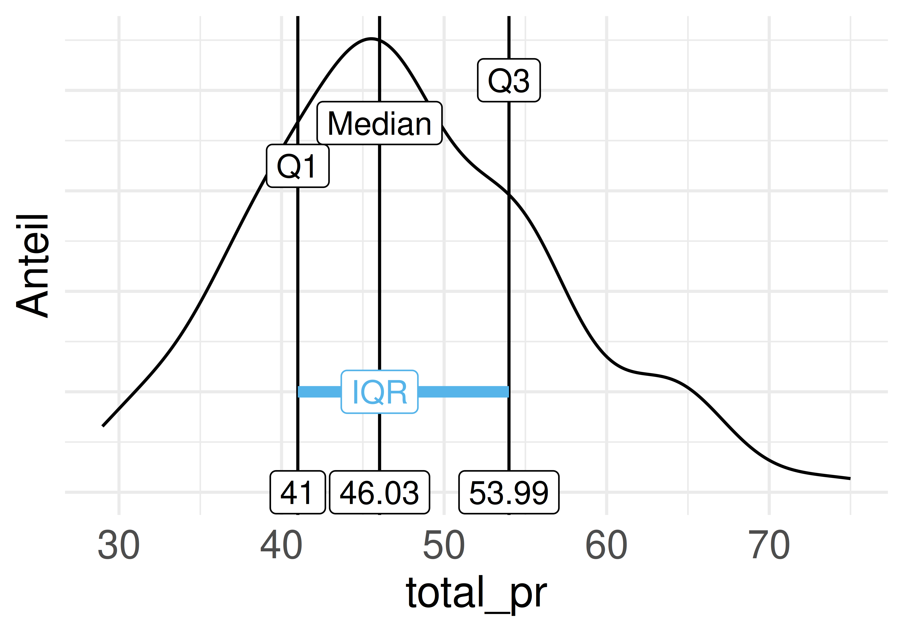{width="45%"}

::: footer
Streuungsmaße
:::

## Streuungsmaße für Normalverteilungen {.smaller}

Eine Normalverteilung lässt sich komplett über *Mittelwert* und *Standardabweichung* beschreiben.

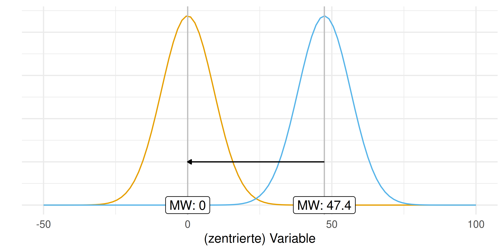{width="55%"}

Eine Konstante addieren "verschiebt den Berg", ohne die Form zu verändern.

::: footer
Streuungsmaße
:::

## Definition: Varianz

Die Varianz ist der mittlere quadrierte Abstand jedes Werts vom Mittelwert.

:::{.callout-note title="Definition: Varianz"}
::: {style="font-size: 0.8em;"}
$$s^2 := \frac{1}{n}\sum_{i=1}^n (y_i - \bar{y})^2 = \frac{1}{n}\sum_{i=1}^n e_i^2$$
:::
:::

Sie entspricht dem *Mean Squared Error* (MSE) eines Modells:

$$MSE := \frac{1}{n}\sum_{i=1}^N (y_i - \hat{y})^2$$

::: footer
Streuungsmaße
:::

## Varianz als "mittlerer Quadratfehler"

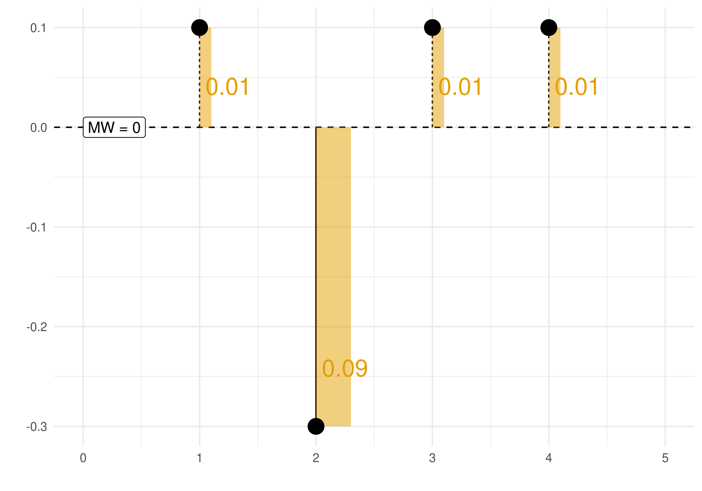{width="45%"} 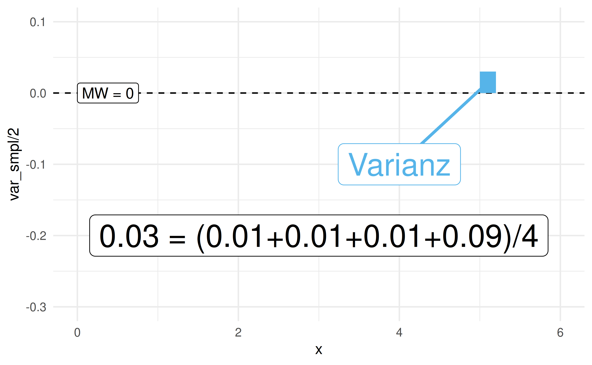{width="45%"}

Die Varianz fasst die typische *quadrierte* Abweichung der Beobachtungen vom Mittelwert in eine Zahl.

::: footer
Streuungsmaße
:::

## Varianz geometrisch {.smaller}

![Varianz als Fläche eines Rechtecks aus umgeformten Abweichungsquadraten [@cmglee_english_2015]](../img/Variance_visualisation.svg.png){width="28%"}

Man ordnet die Abweichungsquadrate zu einem Rechteck mit Seitenlängen $n$ und $\sigma^2$.

::: footer
Streuungsmaße
:::

## Die Standardabweichung

:::{.callout-note title="Definition: Standardabweichung"}
Die Standardabweichung (SD, $s, \sigma$) ist die Quadratwurzel der Varianz: $s := \sqrt{s^2}$
:::

Aus Modellierungssicht ist die SD die Wurzel des MSE — man nennt sie *Root Mean Squared Error*: $RMSE := \sqrt{MSE}$

:::{.callout-note}
Die SD ist i. d. R. *un*gleich zur MAE, aber (fast) gleich zur RMSE.
:::

::: footer
Streuungsmaße
:::

## Streuungsmaße im Vergleich: Mariokart {.smaller}

Modellgüte des Mittelwerts anhand der Streuung im Verkaufspreis (`mariokart`, Extremwerte entfernt):

```r
m_summ <- mariokart_no_extreme %>%
  summarise(
    pr_mw = mean(total_pr), pr_iqr = IQR(total_pr),
    pr_maa = mean(abs(total_pr - mean(total_pr))),
    pr_var = var(total_pr), pr_sd = sd(total_pr))
```

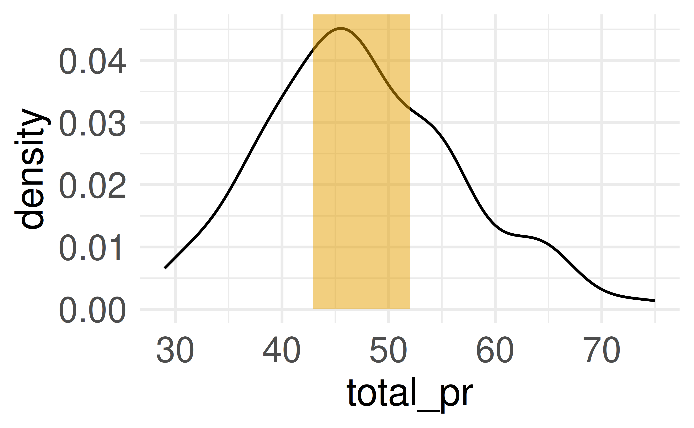{width="42%"} 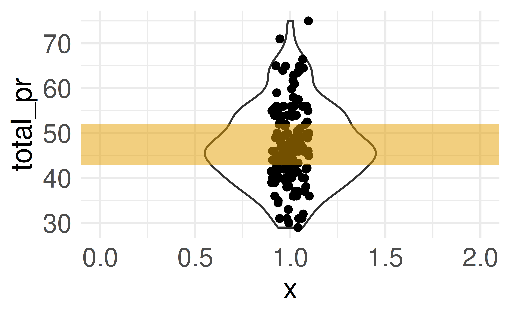{width="42%"}

::: footer
Streuungsmaße
:::

# Streuung als Modellfehler {.center footer=false}

## Nullmodell und Modellgüte in R

Fassen wir den Mittelwert als Punktmodell des Verkaufspreises auf, sind die Streuungskennwerte zugleich Kennwerte der Modellgüte. Ein Modell ohne UV heißt *Nullmodell*.

```r
lm_mario_ohne_x_var <- lm(total_pr ~ 1, data = mariokart)

mae(lm_mario_ohne_x_var)   # Mean absolute error
mse(lm_mario_ohne_x_var)   # Mean squared error
rmse(lm_mario_ohne_x_var)  # Root mean squared error
```

Ein komplexeres Modell (z. B. `total_pr ~ wheels`) senkt i. d. R. den MAE gegenüber dem Nullmodell.

::: footer
Streuung als Modellfehler
:::

# Die z-Transformation {.center footer=false}

## Wozu die z-Transformation?

Bei einem Datensatz ist oft schwer zu sagen, welche Ausprägungen "groß" oder "klein" sind. Die *z*-Transformation transformiert Werte in bekannte, verständliche Bereiche:

- Mittelwert wird auf Null transformiert
- Streuung (SD) wird auf 1 transformiert

Sie besteht aus zwei Schritten: **Zentrieren** und **Streuung standardisieren**.

::: footer
Die z-Transformation
:::

## Zentrieren

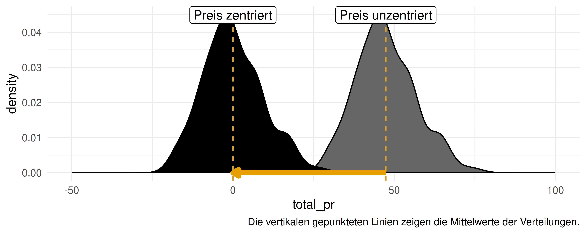{width="75%"}

:::{.callout-note title="Definition: Zentrieren"}
Von jedem Wert einer Verteilung $X$ wird der Mittelwert subtrahiert: $X_c = X - \bar{X}$. Der neue Mittelwert ist Null.
:::

::: footer
Die z-Transformation
:::

## Streuung standardisieren {.smaller}

Wie viel Abweichung vom Mittelwert ist "viel"? Man setzt die Abweichung in Bezug zur typischen Abweichung (SD): weicht ein Spiel 10 € vom Mittelwert ab und beträgt die SD 10 €, ist die standardisierte Abweichung 1 (10/10 = 1).

```r
mariokart_no_extreme <- mariokart_no_extreme %>%
  mutate(abw_std = abw / sd(abw))
```

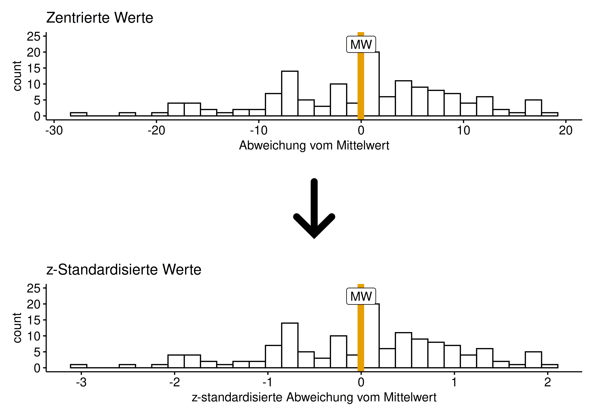{width="42%"}

::: footer
Die z-Transformation
:::

## Definition: z-Werte

Kochrezept: (1) Abweichung vom Mittelwert berechnen, (2) durch die SD teilen.

:::{.callout-note title="Definition: z-Werte"}
Für die Variable $X$ berechnet sich der *z*-Wert der $i$-ten Beobachtung: $z_i := \frac{x_i - \bar{x}}{sd_x}$
:::

Faustregel: Extremwerte (Ausreißer), wenn $z_i \ge 2.5$ [@shimizu2022].

::: footer
Die z-Transformation
:::

## Definition: Standardnormalverteilung

:::{.callout-note title="Definition: Standardnormalverteilung"}
Eine *Standard*normalverteilung ist eine Normalverteilung mit Mittelwert 0 und Standardabweichung 1: $X \sim \mathcal{N}(0, 1)$
:::

Jede Normalverteilung lässt sich mit der *z*-Transformation in eine Standardnormalverteilung überführen.

```r
mariokart_no_extreme_z <- mariokart_no_extreme |>
  mutate(total_pr_zentriert = as.numeric(center(total_pr)),
         total_pr_z = as.numeric(standardise(total_pr)))
```

::: footer
Die z-Transformation
:::

## Zusammenfassung {.smaller}

- **Streuungsmaße**: Spannweite, MAE, IQR, Varianz, SD — quantifizieren die Modellgüte eines Punktmodells
- **MAE**: mittlerer absoluter Fehler; **Varianz/MSE**: mittlerer quadrierter Fehler; **SD/RMSE**: Wurzel davon
- Der IQR ist robuster gegenüber Extremwerten als MAE, Varianz und SD
- Ein komplexeres (sinnvolles) Modell reduziert die Streuung/den Modellfehler
- Die **z-Transformation** (zentrieren + standardisieren) macht Abweichungen vergleichbar: $z_i = \frac{x_i - \bar{x}}{sd_x}$

## Literaturhinweise

- @downey_probably_2023 — kurzweilige Einführung in die Statistik, auch zu Streuungsmaßen
- @cetinkaya-rundel_introduction_2021 — mehr "Lehrbuch-Feeling", frei online verfügbar

## Referenzen {.smaller}
