# Einstieg {.center footer=false}

## Lernziele {.smaller}

- Sie können die Begriffe Kovarianz und Korrelation definieren und ihren Zusammenhang erläutern.
- Sie können die Stärke einer Korrelation einschätzen.

::: footer
Einstieg
:::

# Zusammenfassen zum Zusammenhang {.center footer=false}

## Von einer zu zwei Spalten {.smaller}

Bisher haben wir *eine* Spalte (einen Vektor) zu einer einzelnen Zahl zusammengefasst — einem "Punkt".

Jetzt fassen wir *zwei* Spalten zusammen, wieder zu *einer* Zahl.

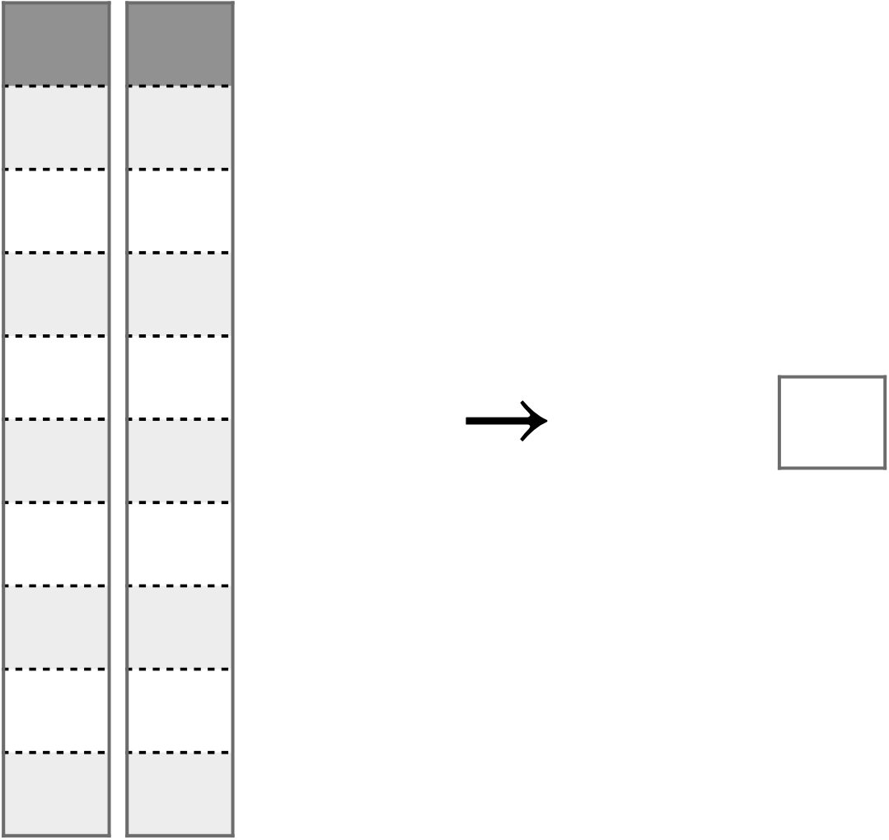{width="30%"}

Es geht um die Frage: Wie hängen zwei (metrische) Variablen zusammen?

::: footer
Zusammenfassen zum Zusammenhang
:::

## Beispiel: `wheels` und `total_pr`

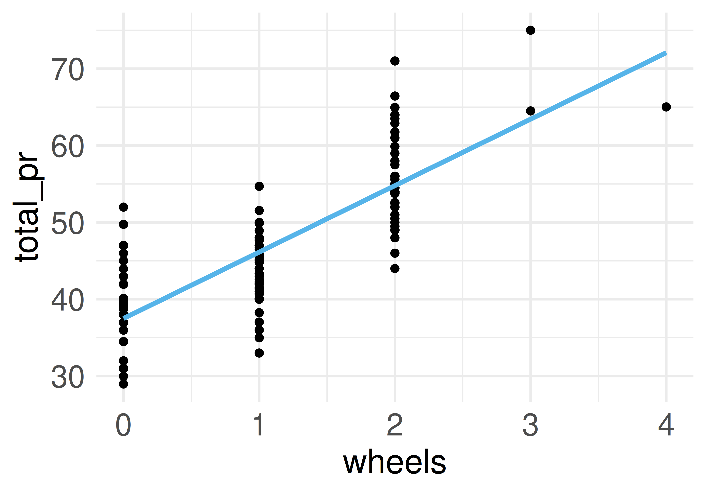{width="45%"} 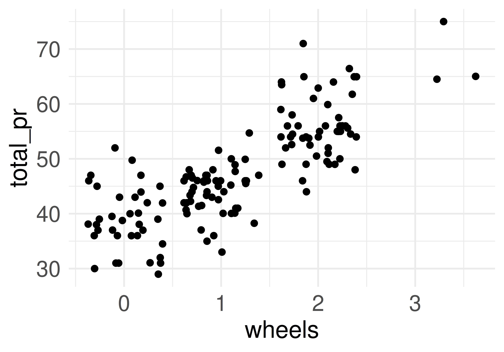{width="45%"}

::: footer
Zusammenfassen zum Zusammenhang
:::

# Abweichungsrechtecke {.center footer=false}

## Beispiel: Noten und Lernzeit

Anton, Bert, Carl und Daniel haben ihre Statistikklausur zurückbekommen. Die Lernzeit $X$ scheint mit der erreichten Punktzahl $Y$ (0–100) zusammenzuhängen.

| id | y (Punkte) | x (Lernzeit) |
|---|---|---|
| 1 | 72 | 70 |
| 2 | 44 | 40 |
| 3 | 39 | 35 |
| 4 | 50 | 67 |

::: footer
Abweichungsrechtecke
:::

## Definition: Abweichungsrechteck

:::{.callout-note title="Definition: Abweichungsrechteck"}
Im zweidimensionalen Fall spannt sich ein Abweichungsrechteck vom Mittelwert $\bar{x}$ bis zum Messwert $x_i$ und genauso für $Y$. Mit $dx_i = x_i - \bar{x}$ (analog $dy_i$) ist die Fläche des Abweichungsrechtecks das Produkt der Abweichungen: $dx_i \cdot dy_i$.
:::

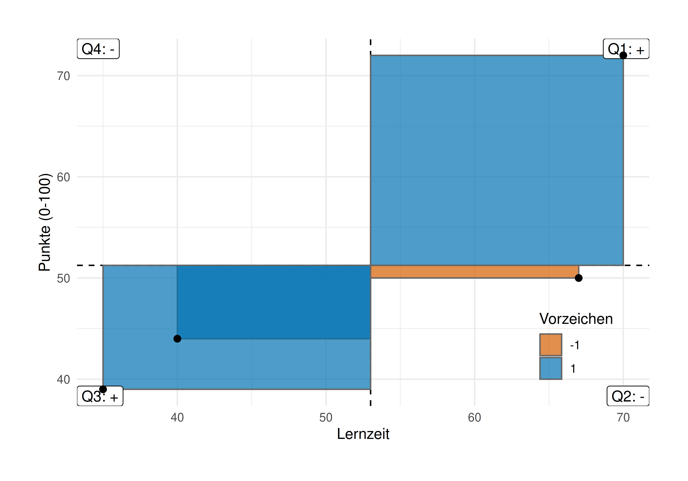{width="45%"}

::: footer
Abweichungsrechtecke
:::

## Vom Rechteck zur Summe

Legt man alle Abweichungsrechtecke zusammen, ergibt sich ein "Summenrechteck". Je größer seine Fläche, desto stärker der (lineare) Zusammenhang.

Das *Vorzeichen* der Summe zeigt an, ob der Zusammenhang positiv (gleichsinnig) oder negativ (gegensinnig) ist.

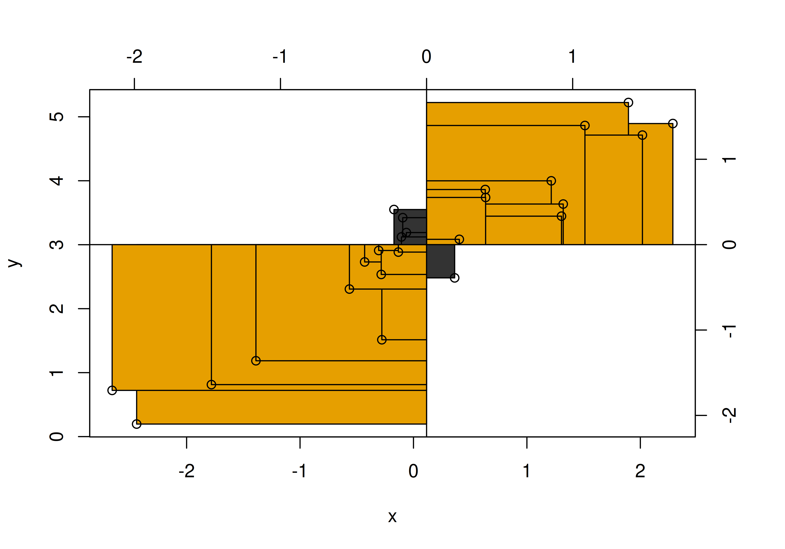{width="45%"} 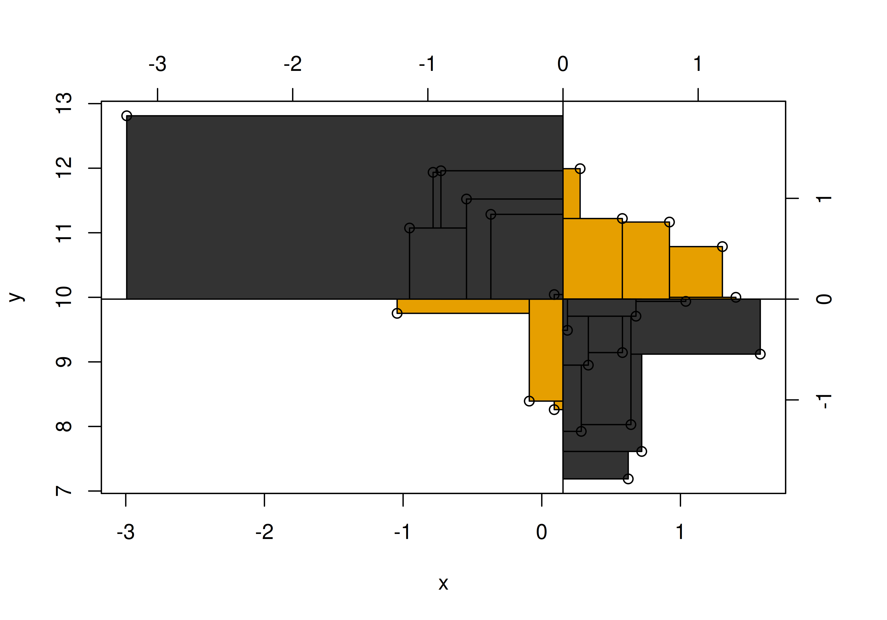{width="45%"}

::: footer
Abweichungsrechtecke
:::

## Definition: Kovarianz {.smaller}

:::{.callout-note title="Definition: Kovarianz"}
Die Kovarianz ist definiert als die Fläche des *mittleren* Abweichungsrechtecks. Sie ist ein Maß für Stärke und Richtung des linearen Zusammenhangs zweier metrischer Variablen.
:::

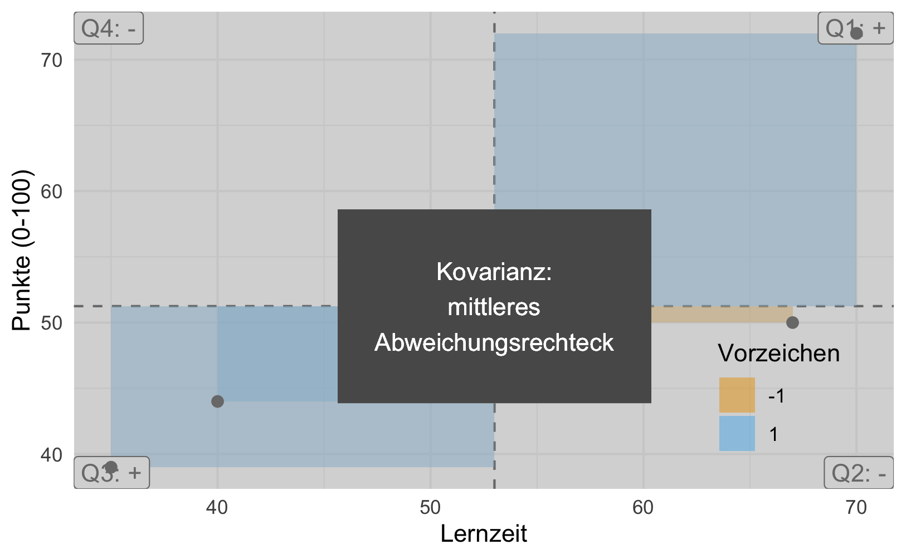{width="45%"}

Für die Noten und Lernzeit der vier Studierenden beträgt die Kovarianz **162**.

::: footer
Abweichungsrechtecke
:::

## Formel der Kovarianz {.smaller}

$$\text{cov}(x,y) = s_{xy} := \frac{1}{n}\sum_{i=1}^n (x_i-\bar{x})(y_i-\bar{y}) = \frac{1}{n}\sum_{i=1}^n dx_i\cdot dy_i$$

In Worten:

1. Abweichung jedes $x_i$ vom Mittelwert $\bar{x}$ berechnen: $dx_i$.
2. Abweichung jedes $y_i$ vom Mittelwert $\bar{y}$ berechnen: $dy_i$.
3. Für alle $i$ die Abweichungsrechtecke $dx_i \cdot dy_i$ bilden.
4. Flächen der Abweichungsrechtecke addieren.
5. Durch die Anzahl der Beobachtungen $n$ teilen.

::: footer
Abweichungsrechtecke
:::

## Positive und negative Kovarianz

**Positive Kovarianz** (Beispiele): Größe & Gewicht, Lernzeit & Klausurerfolg, Distanz zum Ziel & Reisezeit, Temperatur & Eisverkauf.

**Negative Kovarianz** (Beispiele): Lernzeit & Freizeit, Alter & Restlebenszeit, Temperatur & Schneemenge, Lebenszufriedenheit & Depressivität.

::: footer
Abweichungsrechtecke
:::

## Extremwerte der Kovarianz

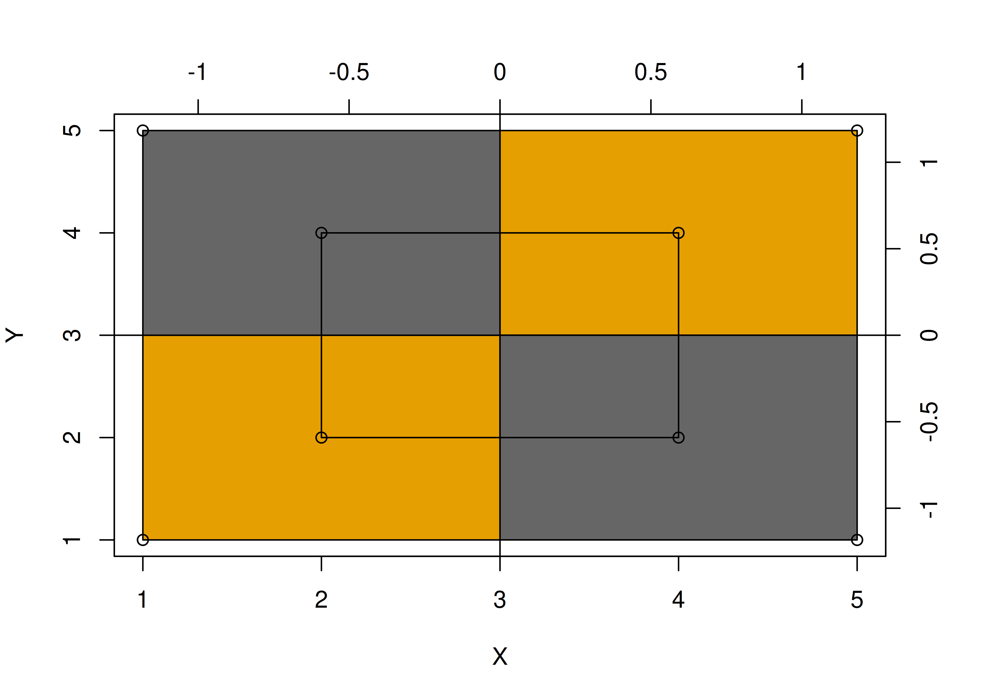{width="45%"} 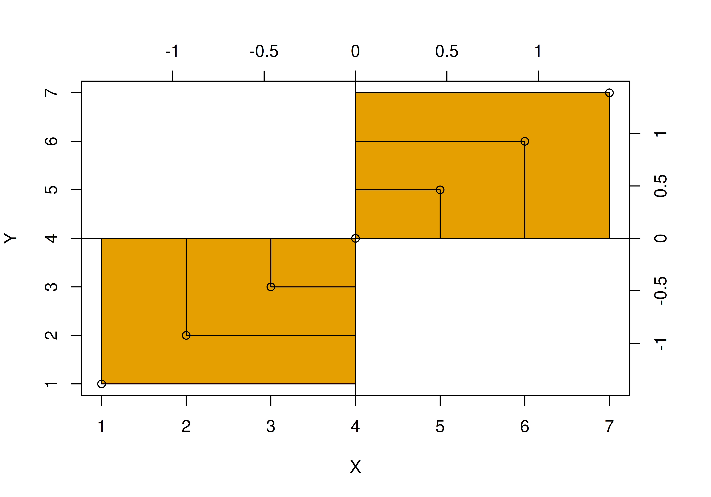{width="45%"}

::: footer
Abweichungsrechtecke
:::

## Wann ist die Kovarianz Null? {.smaller}

Bei einer Kovarianz von (ungefähr) Null ist die Summe der Abweichungsrechtecke pro Quadrant (ungefähr) gleich groß.

$$\begin{aligned}
\sum \left(dX \cdot dY \right) &= 0\\
\Leftrightarrow \text{MW} \left(dX \cdot dY \right) &= 0\\
\Leftrightarrow \text{cov}(X, Y) &= 0
\end{aligned}$$

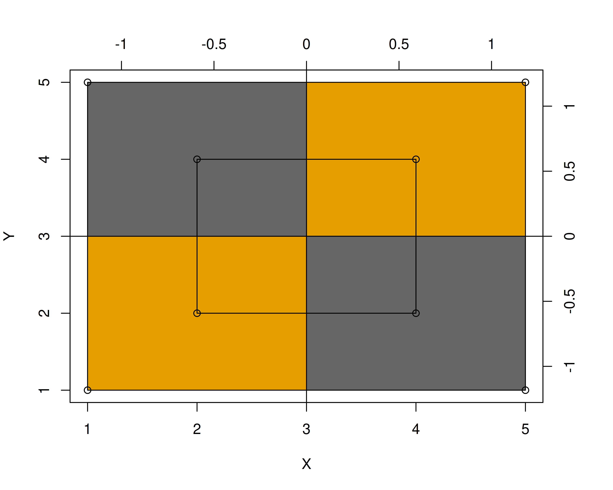{width="32%"} 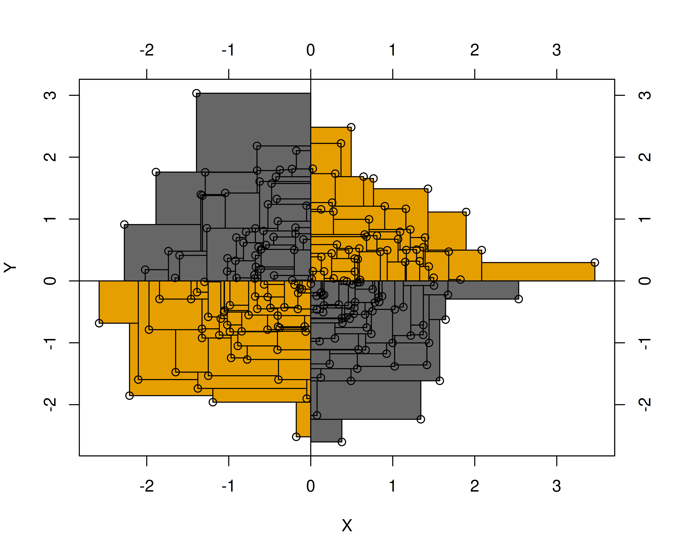{width="32%"}

::: footer
Abweichungsrechtecke
:::

## Die Kovarianz ist schwer zu interpretieren {.smaller}

- Sie hängt von der Skalierung ab: Rechnet man z. B. Einkommen von Euro in Cent um, steigt die Kovarianz um den Faktor 100.
- Der Zusammenhang zwischen z. B. Einkommen und Lebenszufriedenheit sollte aber unabhängig von der Maßeinheit sein.
- Sie hat keinen Maximalwert, der einen perfekten Zusammenhang anzeigt.

**Fazit**: Die Kovarianz ist schwer zu interpretieren und wird in der Praxis wenig verwendet.

::: footer
Abweichungsrechtecke
:::

# Korrelation {.center footer=false}

## Korrelation als mittleres z-Produkt {.smaller}

Der Korrelationskoeffizient $r$ nach Karl Pearson [-@pearson1896] löst das Problem der schweren Interpretierbarkeit der Kovarianz.

Wertebereich: $-1$ (perfekte negative Korrelation) bis $+1$ (perfekte positive Korrelation). $r=0$ bedeutet *kein linearer* Zusammenhang.

So wird $r$ berechnet:

1. Alle $x_i$ durch ihre Standardabweichung $s_x$ teilen.
2. Alle $y_i$ durch ihre Standardabweichung $s_y$ teilen.
3. Mit diesen (z-transformierten) Werten die Kovarianz berechnen.

::: footer
Korrelation
:::

## Definition: Korrelationskoeffizient $r$

:::{.callout-note title="Definition: Korrelationskoeffizient r"}
Der Korrelationskoeffizient $r$ (nach Pearson) ist definiert als das mittlere Produkt der *z*-Wert-Paare [vgl. @cohen_applied_2003]. Er misst den linearen Zusammenhang zweier metrischer Variablen; Wertebereich $[-1;1]$, wobei $0$ keinen linearen Zusammenhang anzeigt und $|r|=1$ perfekten linearen Zusammenhang.
:::

$$r_{xy}=\frac{1}{n}\sum_{i=1}^n z_{x_i} z_{y_i}$$

::: footer
Korrelation
:::

## Was sagt $r$ aus?

1. **Vorzeichen**: positiv → gleichsinniger Zusammenhang; negativ → gegensinniger Zusammenhang.
2. **Absolutwert**: gibt die Stärke des linearen Zusammenhangs an — je näher an 1, desto stärker.

Korrelation ist (wie die Kovarianz) nur für metrische Variablen definiert.

::: footer
Korrelation
:::

## Streudiagramme und Korrelationskoeffizient

![Verschiedene Streudiagramme und ihr Korrelationskoeffizient [@denisboigelot2011]](../img/Correlation_examples2.svg){width="55%"}

Untere Zeile: nicht-lineare Zusammenhänge — hier ist $r=0$, obwohl ein starker *nicht*-linearer Zusammenhang besteht.

::: footer
Korrelation
:::

## Interpretation der Stärke {.smaller}

Grobe (!) Richtlinien nach @cohen_statistical_1988:

| $|r|$ | Grobe Interpretation |
|---|---|
| 0.01 – 0.09 | sehr schwach |
| 0.10 – 0.29 | schwach |
| 0.30 – 0.49 | mittel |
| ≥ 0.50 | stark |

::: footer
Korrelation
:::

## Korrelation mit R berechnen {.smaller}

```r
mariokart |>
  select(total_pr, duration, n_bids) |>
  correlation() |>  # aus `easystats`
  summary()
```

| Parameter | n_bids | duration |
|---|---:|---:|
| total_pr | 0.13 | -0.04 |
| duration | -0.12 | |

::: footer
Korrelation
:::

## Korrelation ist nicht Kausation {.smaller}

Eine Studie fand eine starke Korrelation zwischen Schokoladenkonsum und Anzahl der Nobelpreise eines Landes [@messerli_chocolate_2012].

![Schoki futtern macht schlau? [@messerli_chocolate_2012]](../img/correlation_550.png){width="35%"}

Korrelation ≠ Kausation! Liegt Korrelation ohne Kausation vor, spricht man von *Scheinkorrelation*.

::: footer
Korrelation
:::

## Scheinkorrelation: Störche und Babys

Ein Mythos besagt: Die Anzahl der Störche pro Landkreis korreliert mit der Anzahl der Babys [vgl. @matthews_storks_2000].

Mögliche Erklärung: Die "Naturbelassenheit" des Landkreises ist gemeinsame Ursache von Storchenzahl *und* Geburtenzahl — eine Scheinkorrelation ohne direkte Kausalität.

::: footer
Korrelation
:::

## Glatze macht Corona?

Männer mit Glatze bekommen häufiger einen schweren Corona-Verlauf [@goren_preliminary_2020].

Alternative Erklärung: *Alter* wirkt sowohl auf Glatze (ältere Männer häufiger kahl) als auch auf die Schwere des Corona-Verlaufs (ältere Menschen häufiger schwerer betroffen).

::: footer
Korrelation
:::

# Wie man mit Statistik lügt {.center footer=false}

## Einschränkung der Spannweite

Schränkt man den Wertebereich (die Spannweite) einer oder beider Variablen (nicht-randomisiert) ein, sinkt die Stärke (der Absolutwert) einer Korrelation [vgl. @cohen_applied_2003].

```r
n <- 1e2
d <- tibble(x = rnorm(n = n, mean = 0, sd = 1),
            e = rnorm(n = n, mean = 0, sd = .5),
            y = x + e)

d_filtered <- d |> filter(between(x, -0.5, 0.5))
```

::: footer
Wie man mit Statistik lügt
:::

## Effekt der Spannweiten-Einschränkung

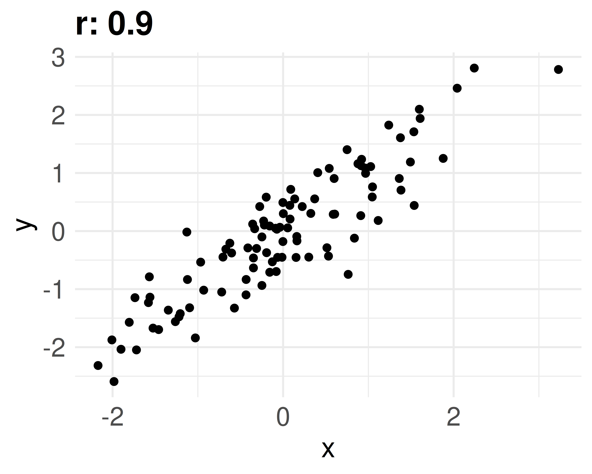{width="45%"} 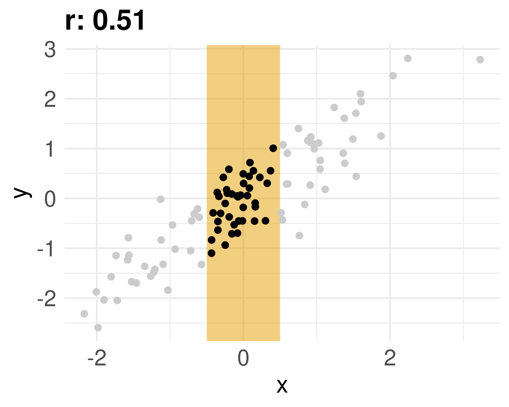{width="45%"}

::: footer
Wie man mit Statistik lügt
:::

# Fallbeispiel {.center footer=false}

## Verkaufspreis im Mariokart-Datensatz

In Ihrer Arbeit beim Online-Auktionshaus analysieren Sie, welche Variablen mit dem Verkaufspreis von Computerspielen zusammenhängen.

```r
mariokart %>%
  dplyr::select(duration, n_bids, start_pr, ship_pr,
                total_pr, seller_rate, wheels) %>%
  cor() %>%
  round(2)
```

::: footer
Fallbeispiel
:::

## Namensverwechslung: `select`

Sind mehrere Pakete geladen, die je eine Funktion `select` enthalten, verwendet R die Funktion aus dem zuletzt geladenen Paket — das kann zu verwirrenden Fehlermeldungen führen.

Abhilfe: Paket explizit angeben, z. B. `dplyr::select(...)`.

::: footer
Fallbeispiel
:::

## Korrelationstabelle (tidy) {.smaller}

```r
mariokart %>%
  dplyr::select(duration, n_bids, start_pr, ship_pr,
                total_pr, seller_rate, wheels) |>
  correlation() |>
  summary()
```

| Parameter | wheels | seller_rate | total_pr | ship_pr | start_pr | n_bids |
|---|---:|---:|---:|---:|---:|---:|
| duration | -0.30\*\* | -0.15 | -0.04 | 0.27\* | 0.13 | -0.12 |
| n_bids | -0.08 | -0.11 | 0.13 | 0.03 | -0.63\*\*\* | |
| total_pr | 0.33\*\* | 0.01 | | | | |

Sternchen zeigen die statistische Signifikanz der Korrelation an — ein Thema, das wir hier ignorieren.

::: footer
Fallbeispiel
:::

## Einzelne Korrelation & fehlende Werte

Einen einzelnen Korrelationskoeffizienten erhält man z. B. mit:

```r
mariokart %>% summarise(korrelation = cor(total_pr, wheels))
```

Bei fehlenden Werten muss `cor` ausdrücklich dazu ermutigt werden, trotzdem zu rechnen:

```r
mariokart %>%
  summarise(cor_super_wichtig = cor(total_pr, wheels,
                                     use = "complete.obs"))
```

::: footer
Fallbeispiel
:::

## Korrelationen als Heatmap

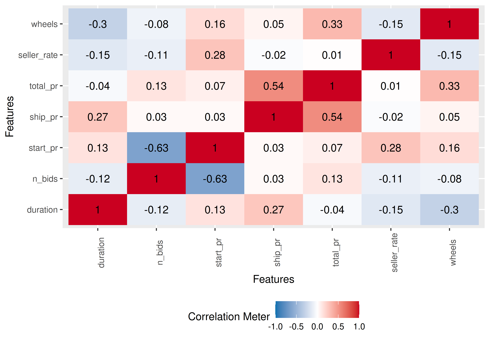{width="55%"}

::: footer
Fallbeispiel
:::

## Zusammenfassung {.smaller}

- **Abweichungsrechteck**: Fläche $dx_i \cdot dy_i$ vom Mittelwert bis zum Messwert
- **Kovarianz**: mittleres Abweichungsrechteck — misst Stärke & Richtung des linearen Zusammenhangs, aber schwer interpretierbar (skalenabhängig)
- **Korrelation $r$**: standardisierte Kovarianz (mittleres z-Produkt), Wertebereich $[-1;1]$
- Vorzeichen zeigt Richtung, Absolutwert zeigt Stärke des (linearen) Zusammenhangs
- Korrelation ≠ Kausation — Vorsicht vor Scheinkorrelationen
- Einschränkung der Spannweite kann Korrelationen künstlich abschwächen

## Literaturhinweise

- @kaplan_statistical_2009 — unorthodoxe, geometrische Herangehensweise an Korrelation und Regression
- @poldrack_statistical_2023 — modernes, frei online verfügbares Statistikbuch
- @cohen_applied_2003 — Klassiker, etwas höheren Anspruchs
- @pearl_book_2018 — Scheinkorrelation vs. "echte" Korrelation, mit Wissenschaftsgeschichte

## Referenzen {.smaller}
