# Einstieg {.center footer=false}

## Lernziele {.smaller}

- Sie können ein Punktmodell von einem Geradenmodell begrifflich unterscheiden.
- Sie können die Bestandteile eines Geradenmodells aufzählen und erläutern.
- Sie können die Güte eines Geradenmodells anhand von Kennzahlen bestimmen.
- Sie können Geradenmodelle sowie ihre Modellgüte in R berechnen.

::: footer
Einstieg
:::

# Vorhersagen {.center footer=false}

## Was macht eine gute Vorhersage aus?

Vorhersagen sind nützlich, unter (mindestens) folgenden Voraussetzungen:

1. Sie sind präzise.
2. Wir wissen, wie präzise.
3. Jemand interessiert sich für die Vorhersage.

Die Methode des Vorhersagens, die wir hier betrachten, nennt man auch *lineare Regression*.

::: footer
Vorhersagen
:::

## Vorhersage ohne Prädiktor: Tonis Frage {.smaller}

Toni fragt: "Welche Statistiknote kann ich in der Klausur erwarten?" — ohne weitere Angaben.

Beste Antwort: der Notenschnitt (Mittelwert) der letzten Klausur — wir nutzen den Mittelwert als *Punktmodell*.

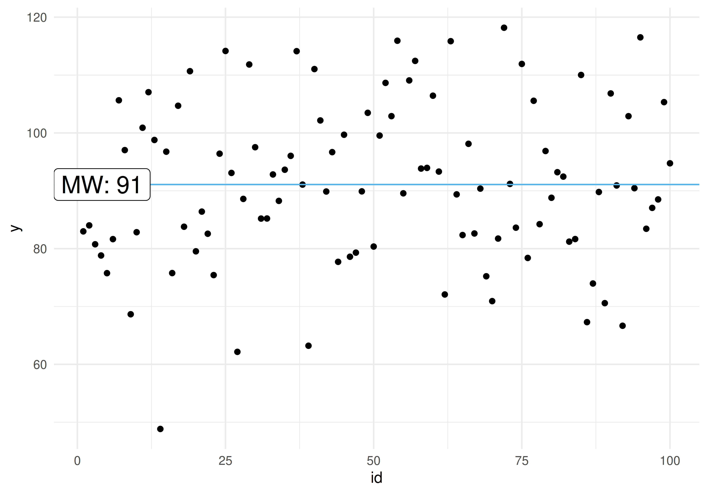{width="45%"}

::: footer
Vorhersagen
:::

## Definition: Nullmodell (Punktmodell)

:::{.callout-note title="Definition: Nullmodell (Punktmodell)"}
Modelle ohne UV, Punktmodelle also, kann man so bezeichnen: `y ~ 1`. Da das Modell null UV hat, nennt man es auch manchmal *Nullmodell*.
:::

Auf Errisch: `lm(y ~ 1, data = noten2)` — der zurückgemeldete Koeffizient `(Intercept)` ist in diesem Fall der Mittelwert.

::: footer
Vorhersagen
:::

## Toni verrät die Lernzeit

Toni: "Ich hab insgesamt 42 Stunden gelernt." Der Trend im Streudiagramm ist deutlich zu erkennen: Je mehr Lernzeit, desto mehr Klausurpunkte.

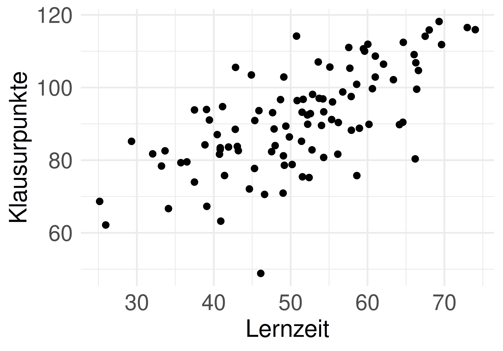{width="45%"} 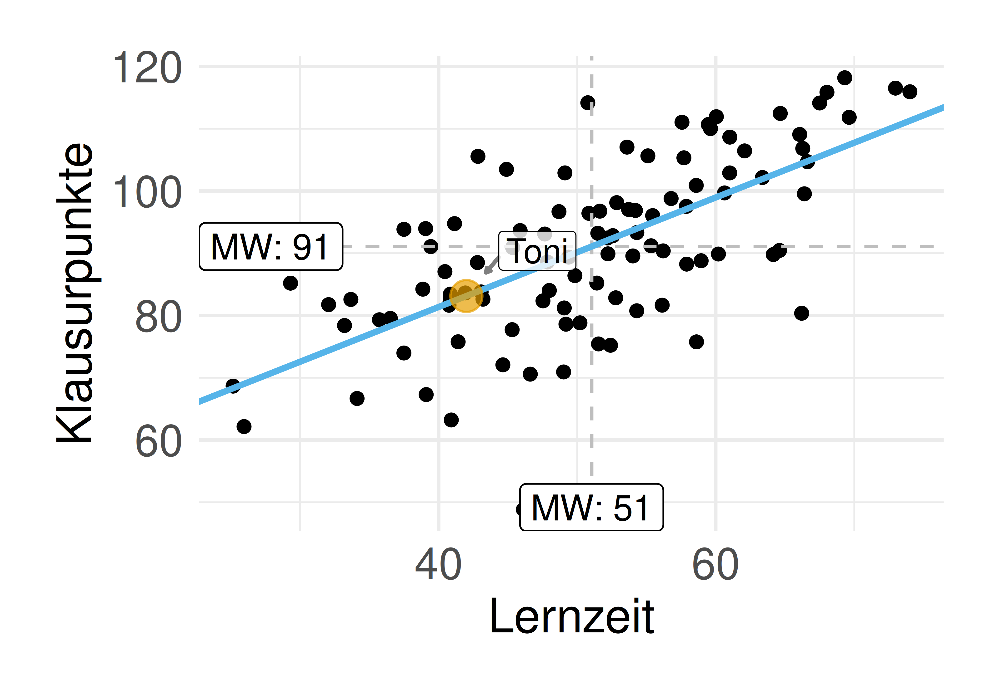{width="45%"}

::: footer
Vorhersagen
:::

# Geradenmodelle {.center footer=false}

## Von Punktmodell zu Geradenmodell

Ein *Geradenmodell* ist eine Verallgemeinerung des Punktmodells: Ein Punktmodell sagt für alle Beobachtungen den gleichen Wert vorher.

In einem Geradenmodell wird nicht mehr (notwendig) für jede Beobachtung die gleiche Vorhersage $\hat{y}$ gemacht.

::: footer
Geradenmodelle
:::

## Definition: Gerade

:::{.callout-note title="Definition: Gerade"}
Eine Gerade ist das, was man bekommt, wenn man eine lineare Funktion in ein Koordinatensystem einzeichnet. Man kann sie durch zwei *Koeffizienten* festlegen: Achsenabschnitt (engl. *intercept*) und Steigung (engl. *slope*).
:::

::: footer
Geradenmodelle
:::

## Die Geradengleichung

::: {style="position:absolute; width:0; height:0; overflow:hidden;"}
$$
\definecolor{ycol}{RGB}{230,159,0}
\definecolor{modelcol}{RGB}{86,180,233}
\definecolor{errorcol}{RGB}{0,158,115}
\definecolor{beta0col}{RGB}{213,94,0}
\definecolor{beta1col}{RGB}{0,114,178}
\definecolor{xcol}{RGB}{204,121,167}
$$
:::

In der Statistik wird folgende Nomenklatur bevorzugt: $f(\color{xcol}{x})=\color{ycol}{\hat{y}}=\color{beta0col}{\beta_0} + \color{beta1col}{\beta_1} \color{xcol}{x}$

Die Nomenklatur mit $b_0, b_1$ hat den Vorteil, dass man das Modell einfach erweitern kann: $b_2, b_3, \ldots$. Anstelle von $b$ liest man auch oft $\beta$.

Das "Dach" über y, $\color{modelcol}{\hat{y}}$, drückt aus, dass es sich um den vom Modell vorhergesagten Wert handelt — nicht den tatsächlich beobachteten Wert von $\color{ycol}{y}$.

::: footer
Geradenmodelle
:::

## Elemente einer Regressionsgeraden

![Achsenabschnitt ($\beta_0$) und Steigung ($\beta_1$) einer Regressionsgeraden [@menk_linear_2014]](../img/regr.png){width="55%"}

::: footer
Geradenmodelle
:::

## Definition: Das einfache lineare Modell {.smaller}

:::{.callout-note title="Definition: Das einfache lineare Modell"}
Beschreibt den Wert einer abhängigen metrischen Variablen, $\color{ycol}{y}$, als lineare Funktion von einer unabhängigen Variablen, $\color{xcol}{x}$, plus einem Fehlerterm, $\color{errorcol}{\epsilon}$.
:::

$$\begin{aligned}
\color{ycol}{y} &= f(\color{xcol}{x}) + \color{errorcol}{\epsilon} \\
\color{ycol}{y_i} &= \color{beta0col}{\beta_0} + \color{beta1col}{\beta_1} \cdot \color{modelcol}{x_i} + \color{errorcol}{\epsilon_i}
\end{aligned}$$

- $\color{beta0col}{\beta_0}$: geschätzter y-Achsenabschnitt laut Modell (*intercept*)
- $\color{beta1col}{\beta_1}$: geschätzte Steigung laut Modell (*slope*)
- $\color{errorcol}{\epsilon}$: Fehler des Modells

::: footer
Geradenmodelle
:::

## Verschiedene Daten, verschiedene Geraden

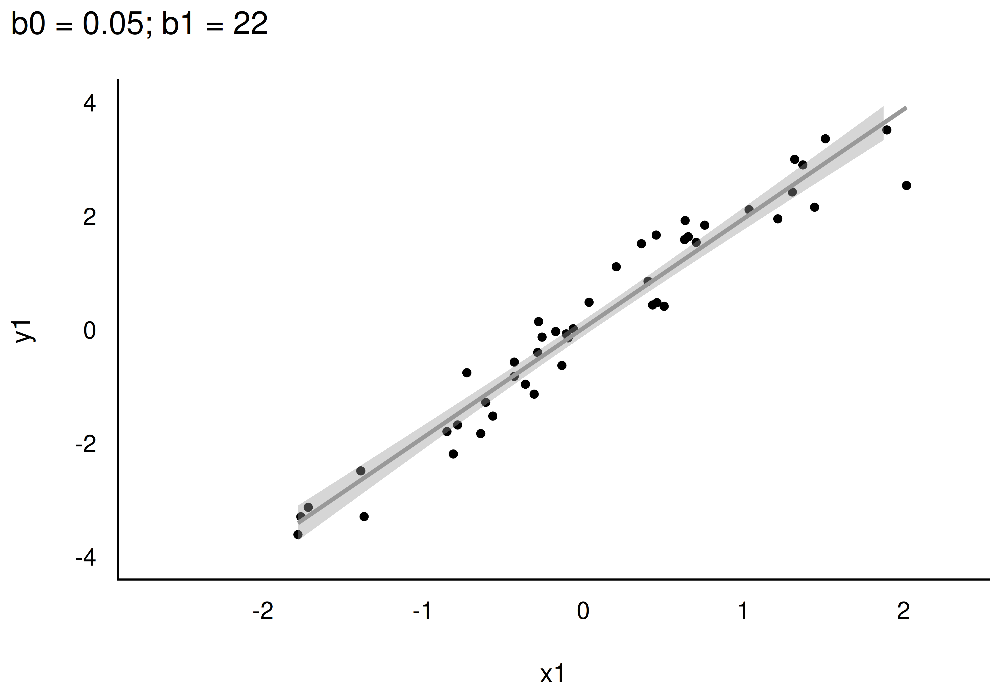{width="45%"} 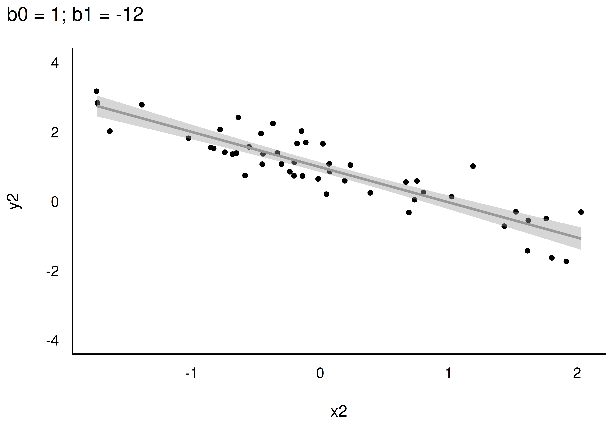{width="45%"}

Je nach Datenlage können sich Regressionsgeraden in Steigung oder Achsenabschnitt unterscheiden.

::: footer
Geradenmodelle
:::

## Spezifikation eines Geradenmodells

$$\color{ycol}{\hat{y}} \sim \color{xcol}{\text{x}}$$

Lies: "Laut meinem Modell ist mein vorhergesagtes $\color{ycol}{\hat{y}}$ irgendeine Funktion von $\color{xcol}{x}$." Wir erinnern uns: $\color{ycol}{AV} \sim \color{xcol}{UV}$.

In Errisch: `lm(y ~ x, data = meine_daten)`. `lm` steht für "lineares Modell" — die Gerade nennt man auch *Regressionsgerade*.

::: footer
Geradenmodelle
:::

## Koeffizienten in R berechnen

```r
lm_toni <- lm(y ~ x, data = noten2)
lm_toni
```

Die Regressionsgleichung lautet demnach: `y_pred = 8.6 + 0.88*x`.

`8.6` ist der Achsenabschnitt (Wert von $y$ bei $x=0$). `0.88` ist die Steigung: Für jede Stunde Lernzeit steigt der vorhergesagte Klausurerfolg um `0.88` Punkte.

::: footer
Geradenmodelle
:::

## Der Achsenabschnitt

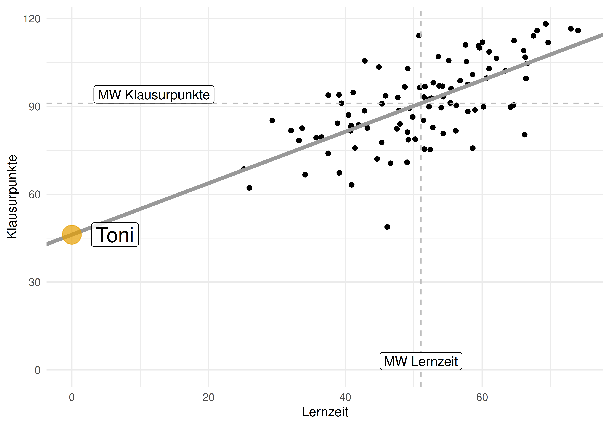{width="48%"}

::: footer
Geradenmodelle
:::

## Vorhersagefehler (Residuum)

Die Differenz zwischen vorhergesagtem Wert und tatsächlichem Wert nennt man Vorhersagefehler (*error*) oder *Residuum*:

$$\color{errorcol}{e_i} = \color{ycol}{y_i} - \color{modelcol}{\hat{y}_i}$$

::: footer
Geradenmodelle
:::

## Vorhersagefehler im Vergleich {.smaller}

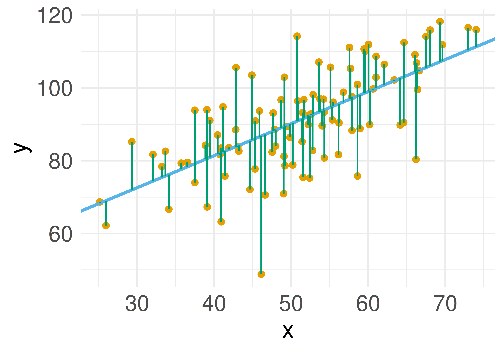{width="45%"} 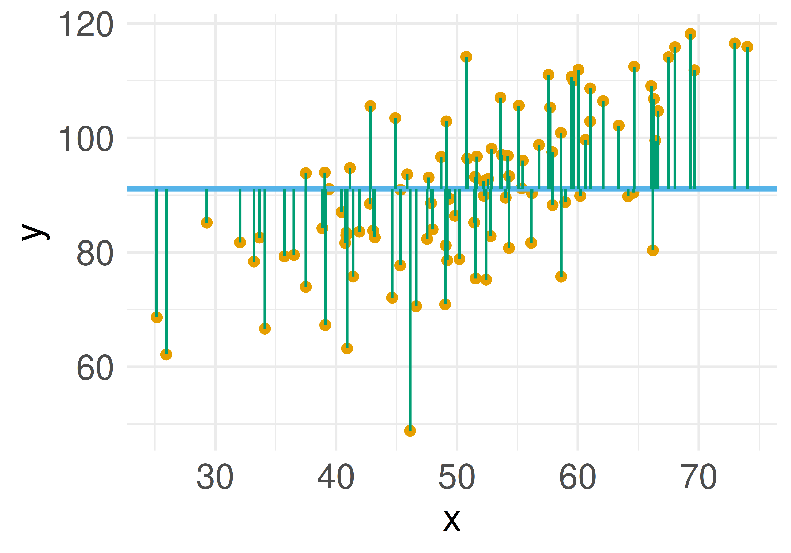{width="45%"}

Beim Geradenmodell (`lm_toni`) ist die mittlere Absolutabweichung (MAE) deutlich kleiner als beim Nullmodell (`lm0`) — das Geradenmodell ist viel besser.

::: footer
Geradenmodelle
:::

## Definition: Fehlerstreuung

:::{.callout-note title="Definition: Fehlerstreuung"}
Als Fehlerstreuung bezeichnen wir die Verteilung der Abweichungen der beobachteten Werte ($y_i$) vom vorhergesagten Wert ($\hat{y}_i$).
:::

Kenngrößen dafür: MAE oder MSE. Ein Geradenmodell ist immer besser als ein Punktmodell, solange X mit Y korreliert ist.

::: footer
Geradenmodelle
:::

## Berechnung der Modellkoeffizienten

Wie legt man die Regressionsgerade in das Streudiagramm? Die Koeffizienten $\beta_0$ und $\beta_1$ wählt man so, dass die Residuen *minimal* sind — genauer: die Summe der quadrierten Residuen wird minimiert.

$$\text{min}\sum_i \color{errorcol}{e_i}^2$$

::: footer
Geradenmodelle
:::

# $R^2$ als Maß der Modellgüte {.center footer=false}

## R² als Verringerung der Fehlerstreuung

Wir vergleichen die Fehlerstreuung (MSE) des Modells mit der Fehlerstreuung (MSE) des Nullmodells:

$$R^2 = 1 - \frac{\text{MSE}_{m}}{\text{MSE}_{m0}}$$

```r
r2(lm_toni)
```

::: footer
R² als Maß der Modellgüte
:::

## Definition: R-Quadrat {.smaller}

:::{.callout-note title="Definition: R-Quadrat"}
Der Anteil der Verringerung der Fehlerstreuung zwischen `lm0` und dem gerade untersuchten Modell nennt man *R-Quadrat* ($R^2$). $R^2$ ist ein Maß der Modellgüte: Je größer $R^2$, desto besser die Vorhersage. Wertebereich: 0 bis 1. Im Nullmodell beträgt $R^2$ per Definition Null. Für Modelle des Typs $y \sim x$ gilt: $R^2 = r_{xy}^2$.
:::

::: footer
R² als Maß der Modellgüte
:::

## Extremfälle von R²

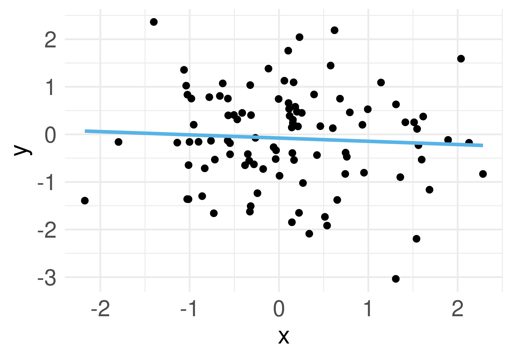{width="40%"} 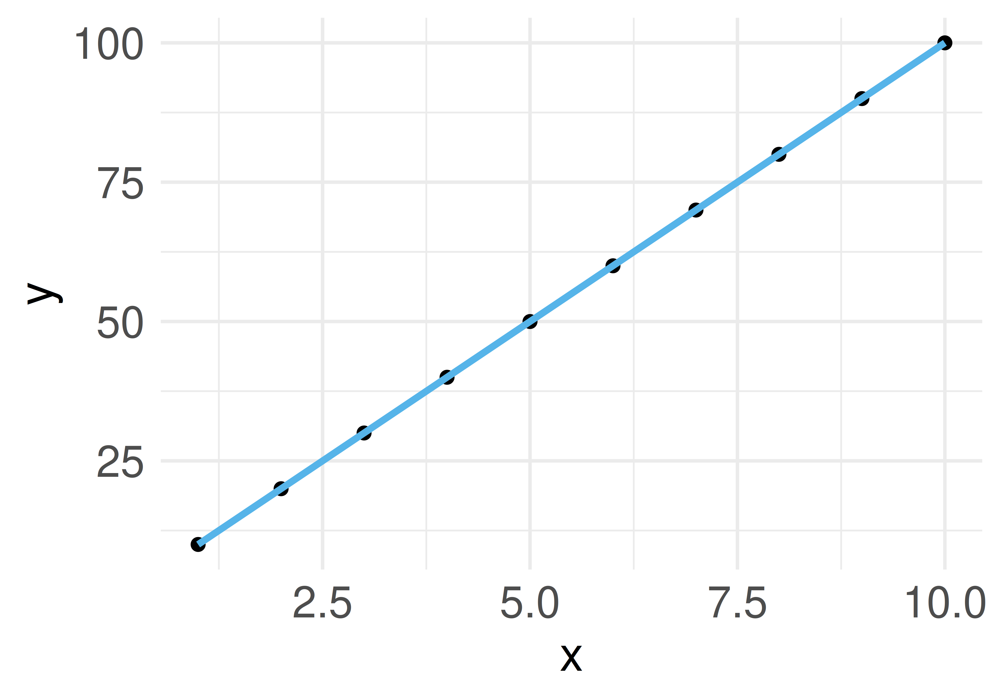{width="40%"}

Je größer R-Quadrat, desto besser passt das Modell zu den Daten.

::: footer
R² als Maß der Modellgüte
:::

# Interpretation eines Regressionsmodells {.center footer=false}

## Modellgüte

Die Residuen (Vorhersagefehler) bestimmen die Modellgüte: Sind die Residuen im Schnitt groß, ist die Modellgüte gering, und umgekehrt.

Verschiedene Koeffizienten stehen zur Verfügung: $R^2$, $r$ (Korrelation von tatsächlichem $y$ und vorhergesagtem $\hat{y}$), MSE, RMSE, MAE, …

::: footer
Interpretation eines Regressionsmodells
:::

## Koeffizienten interpretieren

- Achsenabschnitt ($\beta_0$) und Steigung ($\beta_1$) sind nur eingeschränkt zu interpretieren, wenn man die zugrundeliegenden kausalen Abhängigkeiten nicht kennt.
- Allein aufgrund eines statistischen Zusammenhangs darf man keine kausalen Abhängigkeiten annehmen.
- Beispiel: Bei einer Regression von Gewicht auf Körpergröße ist der Achsenabschnitt wenig nützlich — es gibt keine Menschen der Größe 0.

::: footer
Interpretation eines Regressionsmodells
:::

## Die Steigung interpretieren

"Im Modell `lm_toni` beträgt der Regressionskoeffizient $\beta_1 = 0{,}88$. Zwei Studentinnen, deren Lernzeit sich um eine Stunde unterscheidet, unterscheiden sich *laut Modell* um den Wert von $\beta_1$."

:::{.callout-caution}
"Effekt" klingt kausal. Ohne weitere Absicherung darf man Regressionskoeffizienten *nicht* kausal verstehen — besser: *statistischer* Effekt.
:::

::: footer
Interpretation eines Regressionsmodells
:::

# Wie man mit Statistik lügt {.center footer=false}

## r vs. R²: eine nichtlineare Beziehung {.smaller}

Der Unterschied in Modellgüte zwischen $r=.1$ und $r=.2$ ist *viel kleiner* als zwischen $r=.7$ und $r=.8$ — da $r = \sqrt{R^2}$, dürfen Unterschiede in $r$ nicht wie Unterschiede in $R^2$ interpretiert werden.

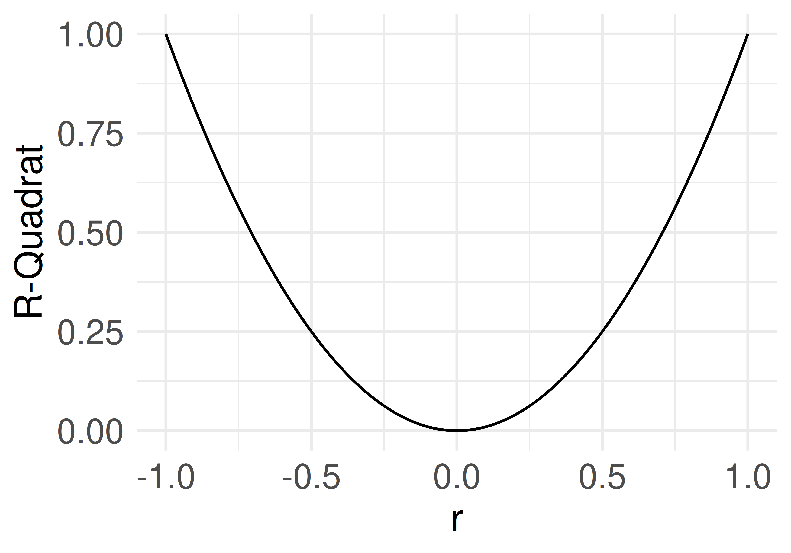{width="42%"}

:::{.callout-caution}
Unterschiede zwischen Korrelationsdifferenzen dürfen nicht linear interpretiert werden.
:::

::: footer
Wie man mit Statistik lügt
:::

# Fallbeispiel Mariokart {.center footer=false}

## Vorhersage des Verkaufspreises

Ziel: eine genaue Vorhersage der Verkaufspreise (`total_pr`) von Mariokart-Auktionen.

```r
lm2 <- lm(total_pr ~ start_pr, data = mariokart)
r2(lm2)
```

Oh nein! Unterirdisch schlecht. Anstelle von bloßem Rumprobieren: Welche Variable korreliert am stärksten mit `total_pr`?

::: footer
Fallbeispiel Mariokart
:::

## Ein besseres Modell: `ship_pr`

```r
lm3 <- lm(total_pr ~ ship_pr, data = mariokart)
parameters(lm3)
```

- Achsenabschnitt: erwarteter Verkaufspreis bei 0 Dollar Versandkosten ("Sockelbetrag").
- Steigung: Anstieg des erwarteten Verkaufspreises *pro Dollar* Versandkosten.
- Regressionsgleichung: `total_pr_pred = b0 + b1 * ship_pr`

::: footer
Fallbeispiel Mariokart
:::

# Fallstudie Immobilienpreise {.center footer=false}

## Ziel: Häuserpreise vorhersagen

In dieser Fallstudie geht es darum, Immobilienpreise vorherzusagen — Datenbasis ist ein Kaggle-Wettbewerb ("House Prices").

- `d_train`: Trainingsdaten zum Modellbau (enthält `SalePrice`)
- `d_test`: Testdaten, für die der Preis vorhergesagt werden soll

::: footer
Fallstudie Immobilienpreise
:::

## Mehrere Prädiktoren in einem Modell

```r
mein_modell <- lm(av ~ uv1 + uv2 + ... + uv_n, data = meine_daten)
```

Das Pluszeichen ist hier kein arithmetischer Operator, sondern bedeutet: "nimm UV1 *und* UV2 *und* … als Prädiktoren."

```r
lm_immo2 <- lm(SalePrice ~ OverallQual + GrLivArea + GarageCars, data = d_train)
```

::: footer
Fallstudie Immobilienpreise
:::

## Modellvergleich per RMSE

- `lm_immo1`: nur `OverallQual` als Prädiktor
- `lm_immo2`: `OverallQual + GrLivArea + GarageCars`
- `m0`: Nullmodell (nur der Mittelwert)

```r
rmse(lm_immo1)
rmse(lm_immo2)
rmse(m0)
```

Ob die Modellgüte "gut" ist, beurteilt man am besten *relativ* — im Vergleich zu anderen Modellen.

::: footer
Fallstudie Immobilienpreise
:::

## Vom Modell zur eingereichten Prognose

```r
lm_immo2_pred <- predict(lm_immo2, newdata = d_test)
```

Die Vorhersagen werden mit den Spalten `Id` und `SalePrice` als CSV-Datei eingereicht — das allgemeine Muster jeder Prognose auf neuen (unbeobachteten) Daten.

::: footer
Fallstudie Immobilienpreise
:::

## Zusammenfassung {.smaller}

- Ein **Geradenmodell** verallgemeinert das Punktmodell: $\hat{y} = \beta_0 + \beta_1 x$
- Achsenabschnitt ($\beta_0$) und Steigung ($\beta_1$) legen die Regressionsgerade fest
- Die Koeffizienten werden per *Methode der kleinsten Quadrate* geschätzt — die Summe der quadrierten Residuen wird minimiert
- **R²** misst die Verringerung der Fehlerstreuung gegenüber dem Nullmodell (Wertebereich 0–1)
- Regressionskoeffizienten sind ohne zugrundeliegende Theorie *nicht* kausal interpretierbar
- Mehrere Prädiktoren lassen sich mit `+` kombinieren; Modellgüte ist über RMSE/MAE/R² vergleichbar

## Literaturhinweise

- @gelman_regression_2021 — eine deutlich umfassendere Einführung in die Regressionsanalyse
- @cetinkaya-rundel_introduction_2021 — moderne, R-orientierte Einführung inklusive Regressionsanalyse
- @cohen_applied_2003 — ein Klassiker mit viel Aha-Potenzial

## Referenzen {.smaller}
