# Einstieg {.center footer=false}

## Lernziele {.smaller}

- Sie können Regressionsmodelle für Forschungsfragen mit binärer, nominaler und metrischer UV erläutern und in R anwenden.
- Sie können Interaktionseffekte in Regressionsmodellen erläutern und in R anwenden.
- Sie können den Anwendungszweck von Zentrieren und *z*-Transformationen zur besseren Interpretation von Regressionsmodellen erläutern und in R anwenden.

::: footer
Einstieg
:::

## Benötigte R-Pakete & Daten {.smaller}

- Pakete: `tidyverse` [@wickham2019a], `easystats` [@ludecke2022], `yardstick` [@kuhn2024], optional `ggpubr` [@kassambara2023]
- Daten: die bekannten Mariokart-Daten *und* neu die **Wetterdaten** des [Deutschen Wetterdienstes (DWD)](https://www.dwd.de/) [-@dwd2023; -@dwd2023a]
- Temperatur in Grad Celsius, Niederschlag (`precip`) in mm pro Quadratmeter

::: footer
Einstieg
:::

# Forschungsbezug: Gläserne Kunden {.center footer=false}

## Wie gut kann man Ihre Persönlichkeit vorhersagen? {.smaller}

@kosinski2013 zeigten, wie gut Persönlichkeitszüge anhand von Facebook-Likes vorhergesagt werden können — sexuelle Orientierung, Ethnie, Alter, Geschlecht, uvm.

Das eingesetzte Modell: ein *lineares Modell*, wie in diesem Kapitel behandelt.

![Vorhersagegüte für numerische Merkmale, gemessen als Korrelation zwischen Vorhersage und tatsächlichem Wert [@kosinski2013]](../img/pnas.kosinski.1218772110fig03.jpeg){width="22%"}

::: footer
Forschungsbezug: Gläserne Kunden
:::

# Wetter in Deutschland {.center footer=false}

## Metrische UV: Temperatur im Zeitverlauf

Forschungsfrage: Um wie viel ist die Temperatur in Deutschland pro Jahr gestiegen (letzte ca. 100 Jahre)?

```r
lm_wetter1 <- lm(temp ~ year, data = wetter)
```

Laut Modell wurde es pro Jahr im Schnitt um 0.01 °C wärmer — pro Jahrzehnt 0.1 °C, pro Jahrhundert 1 °C.

::: footer
Wetter in Deutschland
:::

## Punkt- und Bereichsschätzung

1. **Punktschätzung**: der "Best-Guess" für einen Koeffizienten in der Population (Spalte `Coefficient`)
2. **Bereichsschätzung** (Konfidenzintervall, CI): ein Bereich plausibler Werte, z. B. mit 95 % Sicherheit

:::{.callout-note title="Definition: Konfidenzintervall"}
Ein Konfidenzintervall gibt einen Schätzbereich plausibler Werte für einen Populationswert an, auf Basis der Schätzung, die uns die Stichprobe liefert.
:::

Je schmaler das CI, desto genauer wird der Effekt geschätzt.

::: footer
Wetter in Deutschland
:::

## Temperaturverlauf visualisiert

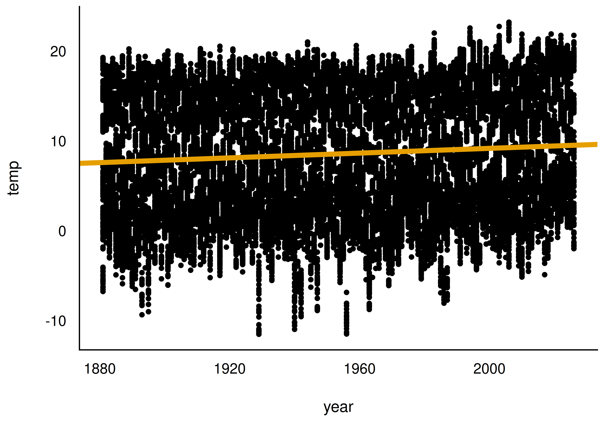{width="45%"} 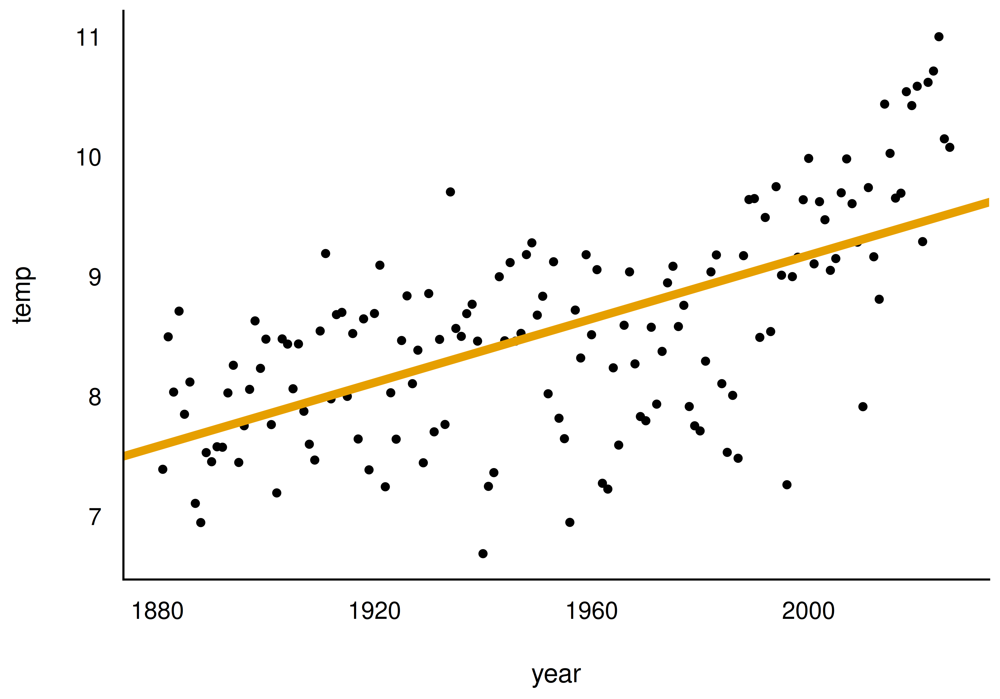{width="45%"}

::: footer
Wetter in Deutschland
:::

## UV zentrieren: Warum? {.smaller}

Der Achsenabschnitt ($\beta_0$) ist der $Y$-Wert an der Stelle $x=0$. In den Wetterdaten wäre `year = 0` Christi Geburt — sinnlos zu extrapolieren!

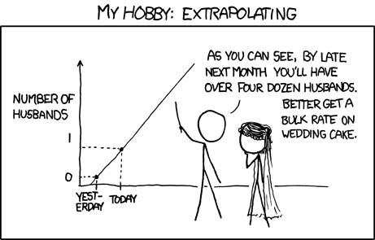{width="40%"}

Sinnvoller: einen Referenzwert festlegen, z. B. 1950 — oder gleich den Mittelwert der UV abziehen (*Zentrierung*).

::: footer
Wetter in Deutschland
:::

## Zentrierte Variable im Modell {.smaller}

```r
wetter <- wetter |> mutate(year_c = year - mean(year))  # "c" wie centered
lm_wetter1_zentriert <- lm(temp ~ year_c, data = wetter)
```

- Die Steigung bleibt durch das Zentrieren **unverändert** — nur der Achsenabschnitt ändert sich.
- Das mittlere Jahr der Messreihe ist 1951: Im Jahr 1951 lag die mittlere Temperatur bei ca. 8.5 °C.
- Regressionsgleichung: `temp_pred = 8.49 + 0.01*year_c`

Das Modell erklärt aber nur wenig Varianz — die Jahreszeit spielt z. B. eine viel größere Rolle als die Jahreszahl.

::: footer
Wetter in Deutschland
:::

## Definition: Binäre Variable

:::{.callout-note title="Definition: Binäre Variable"}
Eine *binäre* UV, auch *Indikatorvariable* oder *Dummyvariable* genannt, hat nur zwei Ausprägungen: 0 und 1.
:::

Beispiele: *weiblich* (0/1), oder *after\_1950* (1 für Jahre nach 1950, sonst 0).

Forschungsfrage: War es in der zweiten Hälfte des 20. Jahrhunderts im Schnitt wärmer als davor?

::: footer
Wetter in Deutschland
:::

## Binäre UV in R erzeugen {.smaller}

```r
year <- c(1940, 1950, 1960)
after_1950 <- year > 1950  # prüfe, ob das Jahr größer als 1950 ist
after_1950
```

```r
wetter <- wetter |> mutate(after_1950 = year > 1950)
lm_wetter_bin_uv <- lm(temp ~ after_1950, data = wetter)
```

`TRUE`/`FALSE` werden von R automatisch als `1`/`0` verstanden — eine logische Variable ist bereits binär.

::: footer
Wetter in Deutschland
:::

## Modell mit binärer UV

{width="45%"} 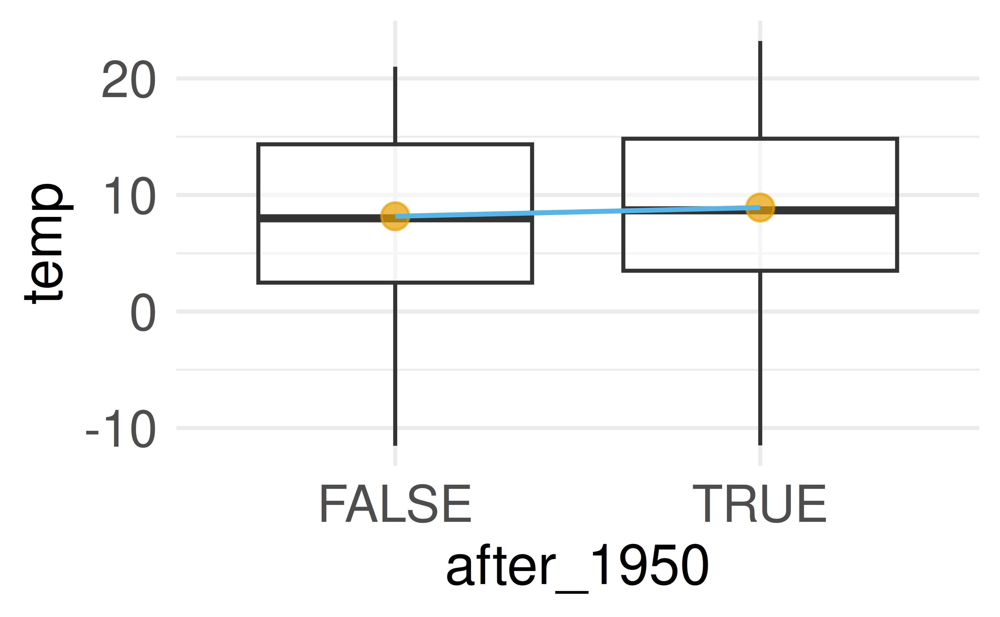{width="45%"}

Es wurde ein gutes halbes Grad wärmer nach 1950 — die Modellgüte ist aber gering.

::: footer
Wetter in Deutschland
:::

## Interpretation: binäre UV

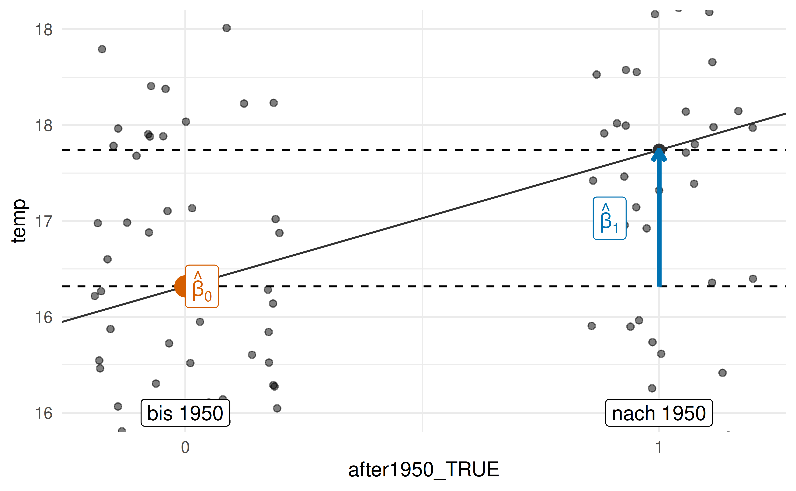{width="55%"}

1. Mittelwert der 1. Gruppe (bis 1950): Achsenabschnitt ($\beta_0$)
2. Mittelwert der 2. Gruppe (nach 1950): Achsenabschnitt ($\beta_0$) + Steigung ($\beta_1$)

::: footer
Wetter in Deutschland
:::

## Modellwerte konkret

Für die Modellwerte $\color{#56B4E9}{\hat{y}}$ gilt:

- Bis 1950: $\color{#56B4E9}{\hat{y}} = \color{#D55E00}{\beta_0} = 17.7$
- Nach 1950: $\color{#56B4E9}{\hat{y}} = \color{#D55E00}{\beta_0} + \color{#0072B2}{\beta_1} = \color{#D55E00}{17.7} + \color{#0072B2}{0.6} = 18.3$

$\beta_1$ lässt sich bei nominalen/binären UV als *Schalter* verstehen, bei metrischen UV als *Dimmer*.

::: footer
Wetter in Deutschland
:::

## Nominale UV: mehrstufig {.smaller}

Forschungsfrage: Gibt es substanzielle Temperaturunterschiede zwischen den Bundesländern?

```r
lm_wetter_region <- lm(temp ~ region, data = wetter)
```

Eine nominale UV mit $k$ Stufen wird von `lm` in $k-1$ binäre Variablen umgewandelt. Bei `character`-Variablen wählt R den alphabetisch ersten Wert als Referenzgruppe.

1. Mittelwert 1. Gruppe: Achsenabschnitt ($\beta_0$)
2. Mittelwert 2. Gruppe: $\beta_0$ + Steigung der 1. Gerade ($\beta_1$)
3. Mittelwert 3. Gruppe: $\beta_0$ + Steigung der 2. Gerade ($\beta_2$), usw.

::: footer
Wetter in Deutschland
:::

## Interpretation: nominale UV

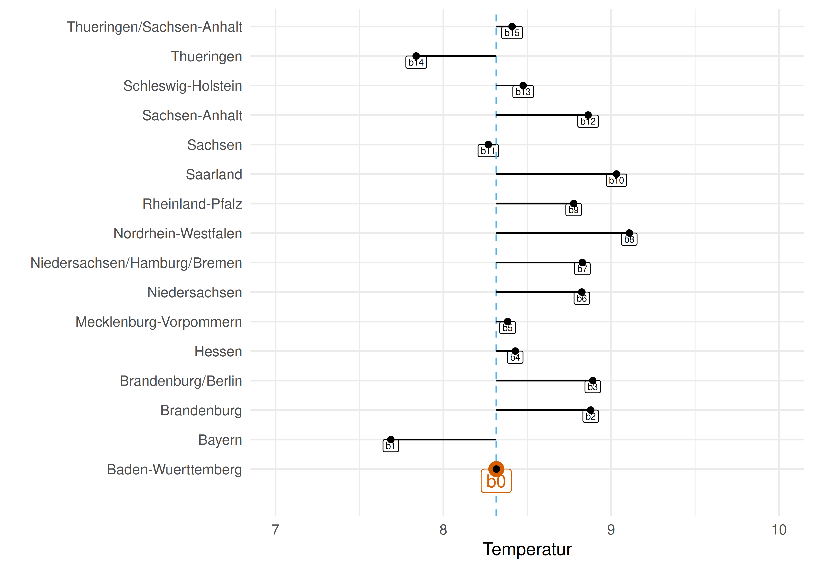{width="55%"}

Da Baden-Württemberg alphabetisch das erste Bundesland ist, wird es als Referenzgruppe gewählt — ihr Mittelwert entspricht dem Achsenabschnitt.

::: footer
Wetter in Deutschland
:::

## Faktorvariablen

```r
wetter <- wetter |> mutate(month_factor = factor(month))
lm_wetter_month_factor <- lm(precip ~ month_factor, data = wetter)
```

- `factor()` wandelt eine numerische Variable in eine nominalskalierte Variable um.
- Faktorstufen werden bei `factor`-Variablen mitgespeichert (bei `character` nicht) — auch nach dem Filtern.
- Referenzgruppe ändern: `relevel(month_factor, ref = "7")`

::: footer
Wetter in Deutschland
:::

## Niederschlag nach Monat

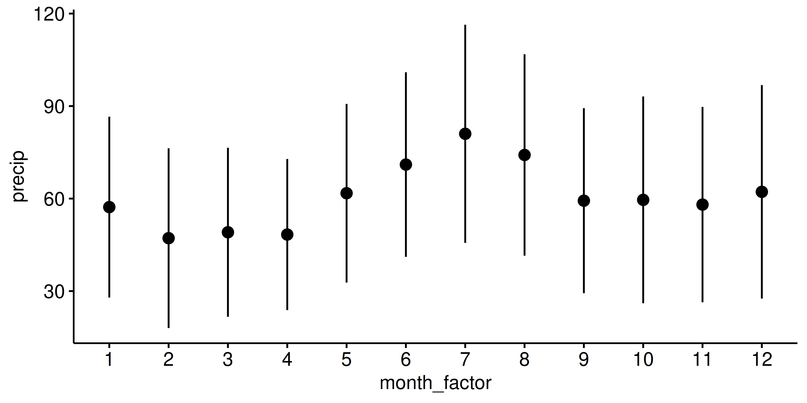{width="60%"}

Referenzgruppe Januar; die 11 übrigen Monate werden im Modell als Unterschied zu Januar ausgegeben.

::: footer
Wetter in Deutschland
:::

## Definition: Multiple Regression

:::{.callout-note title="Definition: Multiple Regression"}
Eine multiple Regression beinhaltet mehr als eine X-Variable. Die Modellformel spezifiziert man so:

$y \sim x_1 + x_2 + \ldots + x_n$
:::

Hat man mehrere UV, trennt man sie mit einem Plus-Zeichen — dieses hat *keine* arithmetische Funktion, sondern bedeutet "und noch folgende UV".

::: footer
Wetter in Deutschland
:::

## Multiple Regression: Beispiel {.smaller}

```r
lm_year_month <- lm(precip ~ year_c + month_factor,
                    data = wetter_month_1_7)
```

Interpretation der Koeffizienten:

1. Achsenabschnitt ($\beta_0$): Niederschlag im Referenzjahr 1951, Referenzmonat Januar — 57 mm
2. $\beta_1$ (`year_c`): +0.03 mm Niederschlag pro Jahr (im Referenzmonat)
3. $\beta_2$ (`month_factor7`): im Juli knapp 25 mm mehr als im Referenzmonat Januar

Regressionsgleichung: `precip_pred = 56.94 + 0.03*year_c + 24.37*month_factor_7`

::: footer
Wetter in Deutschland
:::

## Vorhersage mit `predict`

Statt die Regressionsgleichung von Hand auszurechnen, lässt man R rechnen:

```r
neue_daten <- tibble(year_c = 2020 - 1951,
                     month_factor = factor("7"))
predict(lm_year_month, newdata = neue_daten)
```

Alle Koeffizienten beziehen sich auf die AV *unter der Annahme, dass alle übrigen UV den Wert Null (bzw. Referenzwert) haben*.

::: footer
Wetter in Deutschland
:::

## Parallele Regressionsgeraden

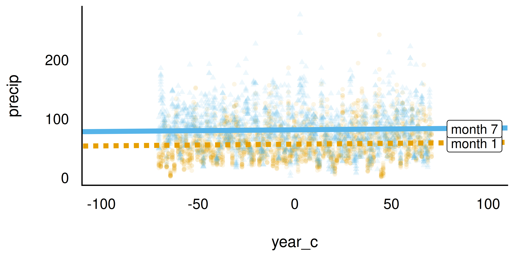{width="60%"}

Ein additives Modell (`y ~ x1 + x2`) zwingt die Regressionsgeraden der Gruppen zur Parallelität.

::: footer
Wetter in Deutschland
:::

## Definition: Interaktionseffekt

:::{.callout-note title="Definition: Interaktionseffekt"}
Einen Interaktionseffekt von x1 und x2 kennzeichnet man in R mit dem Doppelpunkt-Operator:

`y ~ x1 + x2 + x1:x2`
:::

In Worten: y wird modelliert als eine Funktion von x1 und x2 *und* dem Interaktionseffekt von x1 mit x2.

```r
lm_year_month_interaktion <- lm(
  precip ~ year_c + month_factor + year_c:month_factor,
  data = wetter_month_1_7)
```

::: footer
Wetter in Deutschland
:::

## Nicht-parallele Regressionsgeraden

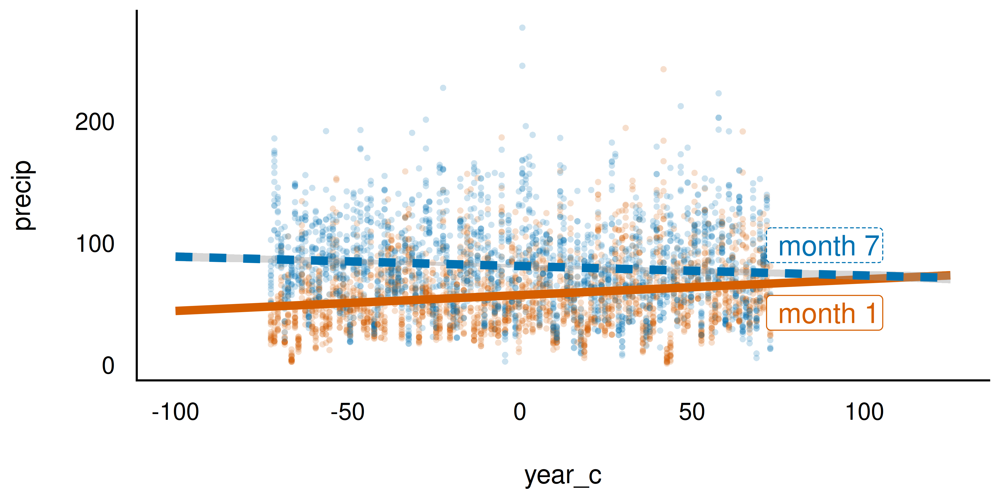{width="60%"}

Sind die Regressionsgeraden mehrerer Gruppen nicht parallel, liegt ein Interaktionseffekt vor.

::: footer
Wetter in Deutschland
:::

## Interaktion interpretieren {.smaller}

- Der Interaktionsterm (`year_c × month_factor[7]`) zeigt, wie *unterschiedlich* sich die Niederschlagsmenge zwischen den Monaten über die Jahre verändert.
- Pro Jahr ist die Zunahme im Juli um 0.20 mm geringer als im Referenzmonat Januar → für Juli insgesamt: `0.13 - (-0.20) = 0.07`
- Gleichung: `precip_pred = 56.91 + 0.13*year_c + 24.37*month_factor_7 - 0.20*year_c:month_factor_7`

:::{.callout-important}
Der Achsenabschnitt gibt den Wert der AV an unter der Annahme, dass alle UV den Wert Null aufweisen.
:::

Das $R^2$ steigt durch den Interaktionsterm hier nur geringfügig — im Zweifel gilt: so einfach wie möglich modellieren.

::: footer
Wetter in Deutschland
:::

# Modelle mit vielen UV {.center footer=false}

## Zwei metrische UV: die Regressionsebene {.smaller}

Ein Modell mit zwei metrischen UV lässt sich im 3D-Raum als *Regressionsebene* visualisieren.

{width="35%"} 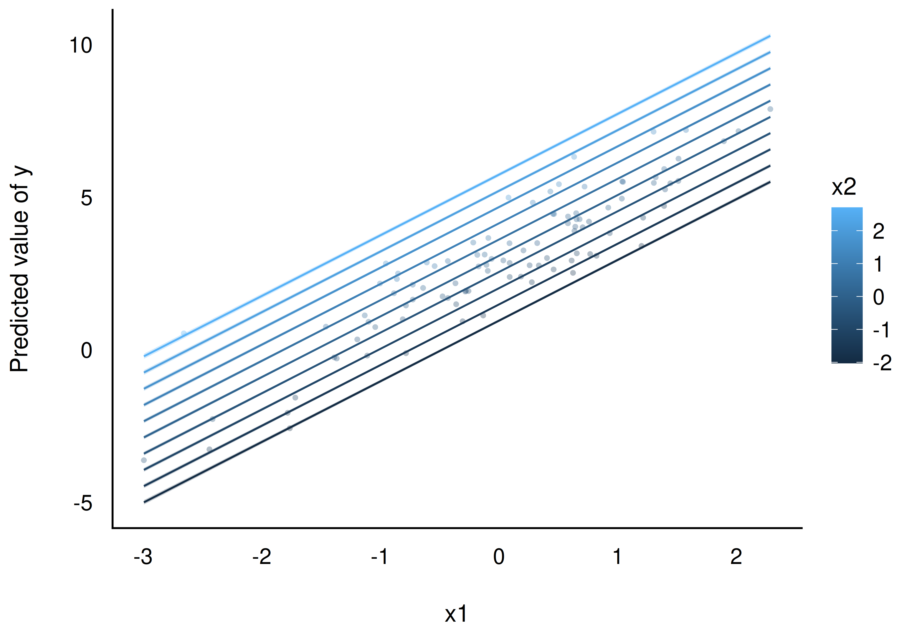{width="35%"}

::: footer
Modelle mit vielen UV
:::

## Viele UV ins Modell?

Grundsätzlich können viele UV in ein Modell aufgenommen werden — Richtlinien [@gelman_regression_2021]:

1. Variablen aufnehmen, die vermutlich Ursachen der Zielvariable sind.
2. Bei UV mit starken Effekten: auch deren Interaktionseffekte erwägen.
3. Präzise geschätzte UV (schmales CI) eher im Modell belassen.

Geht es um Theorieprüfung statt Modellgüte: nur die von der Theorie geforderten UV aufnehmen.

::: footer
Modelle mit vielen UV
:::

# Fallbeispiel zur Prognose {.center footer=false}

## Prognose des Verkaufspreises

Auftrag: den Verkaufspreis von Mariokart-Spielen möglichst exakt vorhersagen.

Vorgehen: Datensatz zufällig in **Train-Sample** (70 %, zum Modellieren) und **Test-Sample** (30 %, zur Güteprüfung) aufteilen.

::: footer
Fallbeispiel zur Prognose
:::

## Modell "all-in": alle Variablen rein? {.smaller}

```r
lm_allin <- lm(total_pr ~ ., data = mariokart_train)
r2(lm_allin)  # fast perfekte Modellgüte!
```

Der Punkt (`.`) steht für "alle Variablen außer `total_pr`".

:::{.callout-caution}
Zu gut, um wahr zu sein — und es *ist* zu gut, um wahr zu sein: Das Modell hat einfach den Auktionstitel `Title` auswendig gelernt.
:::

Idiografische Informationen wie Namen/Titel helfen nicht, allgemeine Muster zu erkennen.

::: footer
Fallbeispiel zur Prognose
:::

## Vorhersagefehler bei neuen Titeln

```r
predict(lm_allin, newdata = mariokart_test)
# Fehler!
```

Kommt im Test-Sample eine Ausprägung von `title` vor, die im Train-Sample nicht existierte, scheitert `predict`. Nominalskalierte UV mit vielen Ausprägungen sind problematisch und führen oft zu **Overfitting**.

::: footer
Fallbeispiel zur Prognose
:::

## Modell "all-in" ohne Titelspalte {.smaller}

```r
mariokart_train2 <- mariokart_train |> select(-c(title, id))
lm_allin_no_title_no_id <- lm(total_pr ~ ., data = mariokart_train2)
r2(lm_allin_no_title_no_id)  # ordentliches R²
```

Vorhersagegüte im Test-Sample (mit dem Paket `yardstick`):

```r
yardstick::mae(data = mariokart_test, truth = total_pr,
               estimate = lm_allin_predictions)
yardstick::rmse(data = mariokart_test, truth = total_pr,
               estimate = lm_allin_predictions)
```

Mittlerer Vorhersagefehler (RMSE): ca. 13 Euro. $R^2$ im Test-Sample: nur 17 %.

::: footer
Fallbeispiel zur Prognose
:::

## Overfitting

Die Modellgüte im Test-Sample ist (leider) oft *geringer* als im Train-Sample — die Trainings-Güte ist mitunter übermäßig optimistisch. Dieses Phänomen heißt **Overfitting** [@gelman_regression_2021].

Deshalb: vor dem Ausliefern von Vorhersagen die Modellgüte immer an einem *neuen* Datensatz (Test-Sample) prüfen.

`rsq()` (aus `yardstick`) berechnet die Modellgüte für beliebige Vorhersagen — im Gegensatz zu `r2()`, das nur im Train-Sample funktioniert.

::: footer
Fallbeispiel zur Prognose
:::

# Praxisbezug {.center footer=false}

## Kundenabwanderung vorhersagen

Ein Anwendungsbeispiel moderner Datenanalyse: die Vorhersage, welche Kunden "abwanderungsgefährdet" sind (*customer churn*).

@lalwani2022 nutzten u. a. lineare Regression zur Vorhersage abgewanderter Kunden und berichten eine Genauigkeit von über 80 % im besten Modell.

::: footer
Praxisbezug
:::

# Wie man mit Statistik lügt {.center footer=false}

## Pinguine drehen auf

Ein Forscherteam untersucht Schnabellänge und Schnabeltiefe bei $n = 344$ Pinguinen der Palmer Station, Antarktis.

![Schnabellänge und Schnabeltiefe [@horst_statistics_2024]](https://allisonhorst.github.io/palmerpenguins/reference/figures/culmen_depth.png){width="42%"}

::: footer
Wie man mit Statistik lügt
:::

## Analyse 1: Gesamtdaten

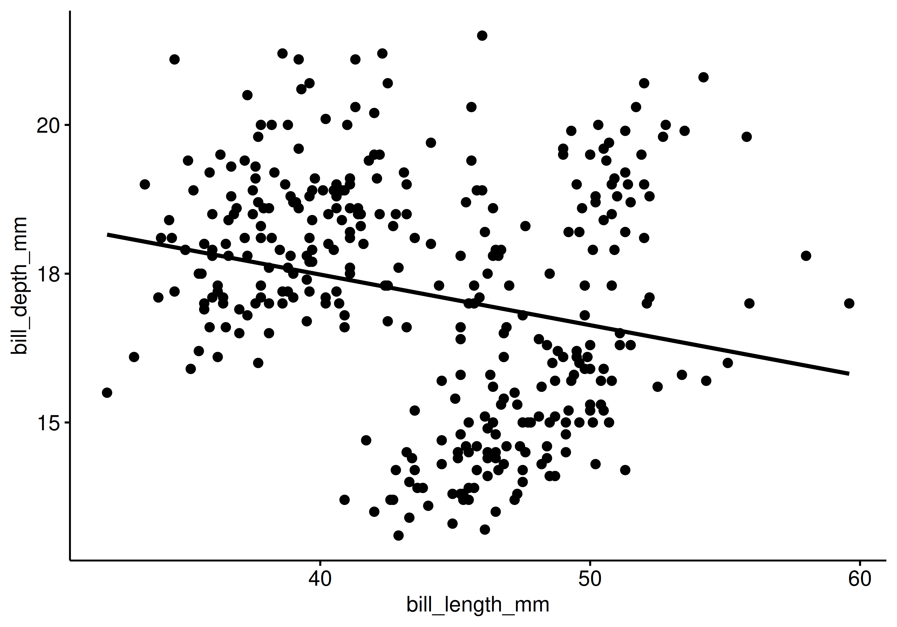{width="55%"}

Klarer Fall: ein *negativer* Zusammenhang. Nobelpreis-verdächtig — oder?

::: footer
Wie man mit Statistik lügt
:::

## Analyse 2: Aufteilung in Arten

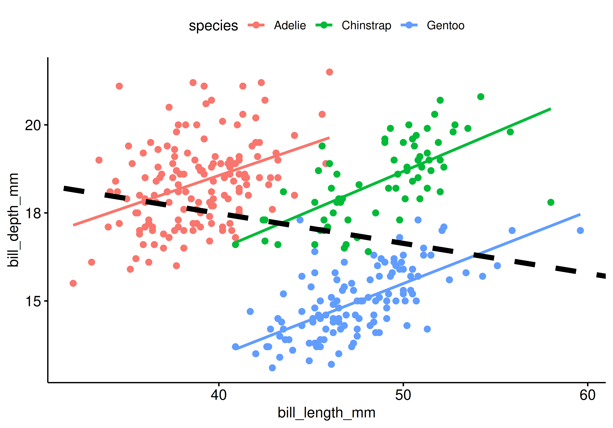{width="55%"}

Gleiche Daten, gegenteiliges Ergebnis! Ohne Hintergrundwissen ist nicht entscheidbar, welche Analyse "richtig" ist.

::: footer
Wie man mit Statistik lügt
:::

## Kausale Interpretation: Vorsicht {.smaller}

:::{.callout-important}
Interpretiere Modellkoeffizienten nur kausal, wenn du ein Kausalmodell hast.
:::

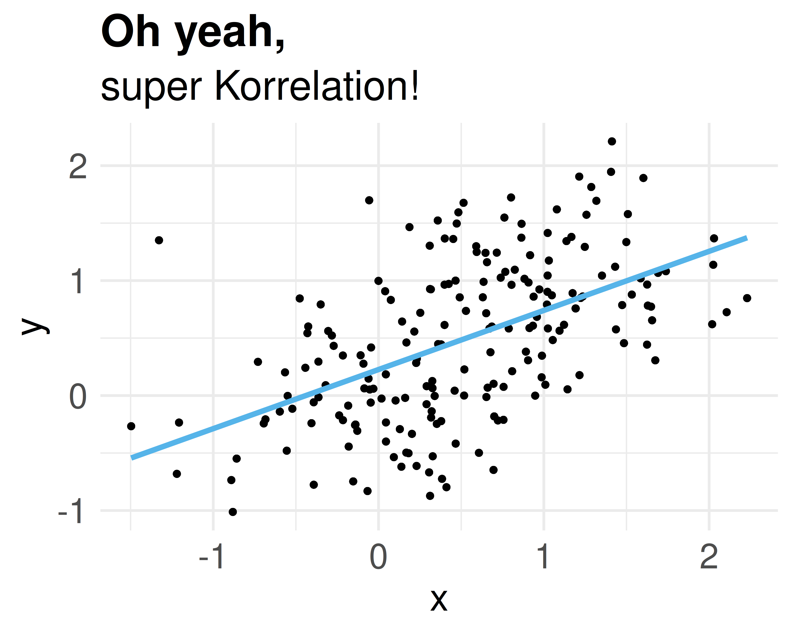{width="45%"} 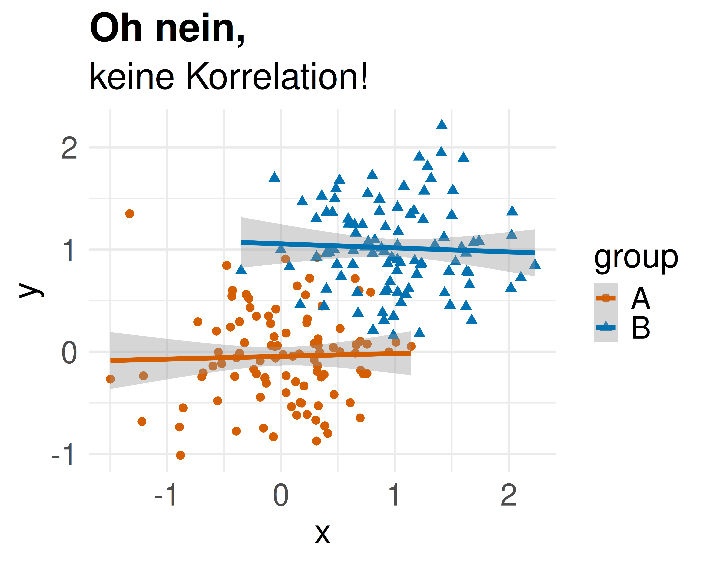{width="45%"}

Kippt das Vorzeichen eines Effekts durchs Hinzufügen einer Variable, spricht man von **Simpsons Paradox** [@gelman_regression_2021].

::: footer
Wie man mit Statistik lügt
:::

## Deskriptiv statt kausal

Kennt man die kausale Struktur nicht, sollte man Modellkoeffizienten nur *deskriptiv* interpretieren — z. B. "Wo es viele Störche gibt, gibt es auch viele Babys" [@matthews_storks_2000].

Unser Gehirn ist auf kausales Denken geprägt: Deskriptive Befunde werden daher immer wieder unzulässig kausal interpretiert.

::: footer
Wie man mit Statistik lügt
:::

# Was war noch mal das Erfolgsgeheimnis? {.center footer=false}

## Dranbleiben zahlt sich aus

![Statistik, Sie und Party: gestern und (vielleicht) morgen [@imgflip2024]](../img/meme-stat1.jpg){width="35%"} {width="35%"}

Wenn Sie an der Statistik dranbleiben, wird sich der Erfolg einstellen.

::: footer
Was war noch mal das Erfolgsgeheimnis?
:::

## Zusammenfassung {.smaller}

- **Metrische UV**: Achsenabschnitt oft sinnlos ohne *Zentrierung* der UV
- **Binäre/nominale UV**: $\beta_0$ = Mittelwert der Referenzgruppe, $\beta_1, \beta_2, \ldots$ = Differenz zu weiteren Gruppen
- **Multiple Regression**: mehrere UV, additiv verbunden mit `+`
- **Interaktion** (`x1:x2`): Effekt einer UV hängt vom Wert einer anderen UV ab — Regressionsgeraden nicht mehr parallel
- **Train-/Test-Sample**: Modellgüte immer an neuen Daten prüfen — Vorsicht vor **Overfitting**
- **Kausale Interpretation** von Koeffizienten nur mit einem Kausalmodell — sonst droht **Simpsons Paradox**

## Literaturhinweise

- @gelman_regression_2021 — "Regression und andere Geschichten", anspruchsvoll, aber sehr empfehlenswert
- @sauer_moderne_2019 — einsteigerfreundliche Alternative
- @mcelreath_statistical_2020 — sehr empfehlenswerte Lektüre

## Referenzen {.smaller}
